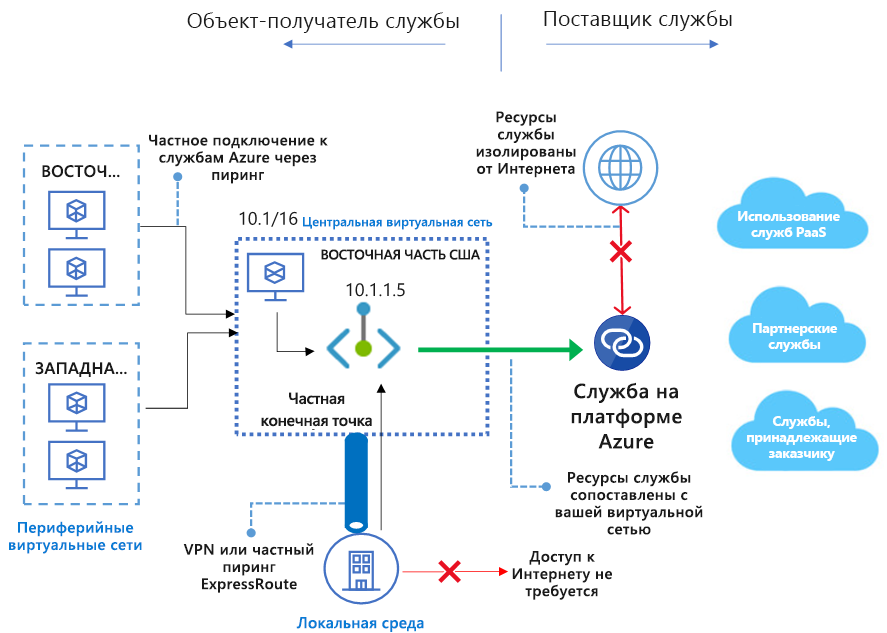

# Что собой представляет Приватный канал Azure? (предварительная версия)
Приватный канал Azure обеспечивает доступ к службам Azure PaaS (например, к службе хранилища Azure, Azure Cosmos DB и Базе данных SQL), а также размещенным в Azure службам клиентов или партнеров через [частную конечную точку](private-endpoint-overview.md) виртуальной сети. Трафик между виртуальной сетью и службой проходит через магистральную сеть Майкрософт, что позволяет избежать рисков общедоступного Интернета. Кроме того, вы можете создать в своей виртуальной сети (VNet) собственную службу [Приватный канал](private-link-service-overview.md) и предоставлять ее клиентам в частном порядке. Настройка и потребление с использованием Приватного канала Azure согласованы между службами Azure PaaS, владельцами и общими партнерскими службами.

> [!IMPORTANT]
> Эта общедоступная предварительная версия предоставляется без соглашения об уровне обслуживания и не должна использоваться для производственных рабочих нагрузок. Некоторые функции могут не поддерживаться, иметь ограничения и быть доступными не во всех расположениях Azure. См. [дополнительные условия использования для предварительных версий Microsoft Azure](https://azure.microsoft.com/support/legal/preview-supplemental-terms/). Сведения об известных ограничениях см. в разделах о [частной конечной точке](private-endpoint-overview.md#limitations) и [службе "Приватный канал"](private-link-service-overview.md#limitations).

## Основные преимущества
Приватный канал Azure обеспечивает следующие преимущества:  
- **Закрытый доступ к службам на платформе Azure**: Подключайте виртуальную сеть к службам, работающим в Azure конфиденциально, не используя публичный IP-адрес источника или пункта назначения. Поставщики услуг могут самостоятельно преобразовать свои службы для частного просмотра в собственной виртуальной сети, а потребители могут получить доступ к этим службам в своей локальной виртуальной сети. Платформа Приватного канала будет поддерживать подключение между потребителем и службами через магистральную сеть Azure. 
 
- **Локальные и одноранговые сети**: Доступ к службам, выполняемым в Azure, из локальной сети через частные одноранговые или VPN-туннели ExpressRoute (из локальной среды) и одноранговые виртуальные сети с помощью закрытых конечных точек. Вам не нужно настраивать общедоступный пиринг или пересекать Интернет для доступа к службе. Эта возможность обеспечивает безопасный способ переносить рабочие нагрузки в Azure.
 
- **Защита от извлечения данных**:  С помощью Приватного канала Azure закрытая конечная точка в виртуальной сети сопоставляется с конкретным экземпляром пользовательского ресурса PaaS, а не со всей службой. С помощью закрытой конечной точки потребители могут подключаться только к определенному ресурсу, а не к другому ресурсу в службе. Этот встроенный механизм обеспечивает защиту от извлечения данных. 
 
- **Глобальный доступ**: Устанавливайте частное подключение к службам, работающим в других регионах. Это означает, что виртуальная сеть потребителя может находиться в регионе А и подключаться к службам за Приватным каналом в регионе В.  
 
- **Расширьте свои собственные службы**: Воспользуйтесь теми же возможностями и функциональностью, чтобы преобразовать для просмотра потребителям свои собственные услуги в Azure. Разместив свой сервис за Load Balancer уровня "Стандартный", вы можете включить его для Приватного канала. Затем потребитель может подключиться непосредственно к службе с помощью закрытой конечной точки в собственной виртуальной сети. Вы можете управлять этими запросами на подключение, используя простой поток вызова утверждения. Приватный канал Azure работает для потребителей и служб, принадлежащих к разным клиентам Active Directory. 

## Доступность 
 В следующей таблице перечислены службы Приватного канала и регионы, в которых они доступны. 

|Сценарий  |Поддерживаемые службы   |Доступные регионы | Status   |
|---------|---------|---------|---------|
|Приватный канал для служб, принадлежащих потребителю|Службы Приватный канал за Load Balancer (цен. категория "Стандартный") | Все общедоступные регионы  |  Предварительный просмотр  |
|Приватный канал для служб PaaS Azure   | Хранилище Azure        |  Все общедоступные регионы      | Предварительный просмотр         |
|  | Azure Data Lake Storage 2-го поколения        |  Все общедоступные регионы      | Предварительный просмотр         |
|  |  База данных SQL Azure         | Все общедоступные регионы      |   Предварительный просмотр      |
||Хранилище данных SQL Azure| Все общедоступные регионы |Предварительный просмотр|
||Azure Cosmos DB| Центрально-западная часть США, западная часть США, центрально-северная часть США |Предварительный просмотр|

Самые актуальные уведомления доступны на странице [обновлений виртуальной сети Azure](https://azure.microsoft.com/updates/?product=virtual-network).

## Ведение журналов и мониторинг

Приватный канал Azure интегрируется с Azure Monitor, который позволяет архивировать журналы в учетную запись хранения, передавать события в концентратор событий или отправлять их в журналы Azure Monitor. В Azure Monitor можно получить доступ к следующей информации: 
- **Закрытая конечная точка**: Данные, обработанные закрытой конечной точкой (в/с)
 
- **Служба "Приватный канал"** :
    - Данные, обработанные Приватным каналом (в/с)
    - Доступность порта NAT  
 
## Цены   
Дополнительные сведения о ценах см. на [странице цен на службу "Приватный канал" Azure](https://azure.microsoft.com/pricing/details/private-link/).
 
## Часто задаваемые вопросы  
Часто задаваемые вопросы см. в разделе [Часто задаваемые вопросы о Приватном канале Azure](private-link-faq.md).
 
## Ограничения  
Сведения об ограничениях см. в разделе об [ограничениях службы "Приватный канал" Azure](../azure-subscription-service-limits.md#private-link-limits).

## Дополнительная информация
- [Create a Private Endpoint using Azure portal ](create-private-endpoint-portal.md) (Создание частной конечной точки для сервера базы данных SQL с помощью портала)
- [Создание частной конечной точки для сервера базы данных SQL с помощью портала PowerShell ](create-private-endpoint-powershell.md)
- [Создание частной конечной точки для сервера базы данных SQL с помощью портала CLI ](create-private-endpoint-cli.md)
- [Создание частной конечной точки для учетной записи хранения, используя портал ](create-private-endpoint-storage-portal.md)
- [Создание частной конечной точки для учетной записи Azure Cosmos с помощью портала](../cosmos-db/how-to-configure-private-endpoints.md)
- [Create your own Private Link service using Azure PowerShel](create-private-link-service-powershell.md) (Создание собственного Приватного канала с помощью Azure PowerShell)

 
