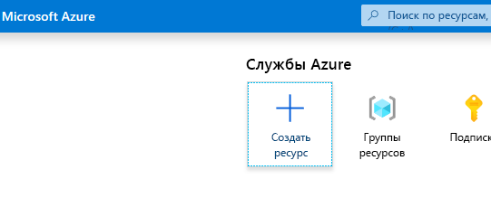
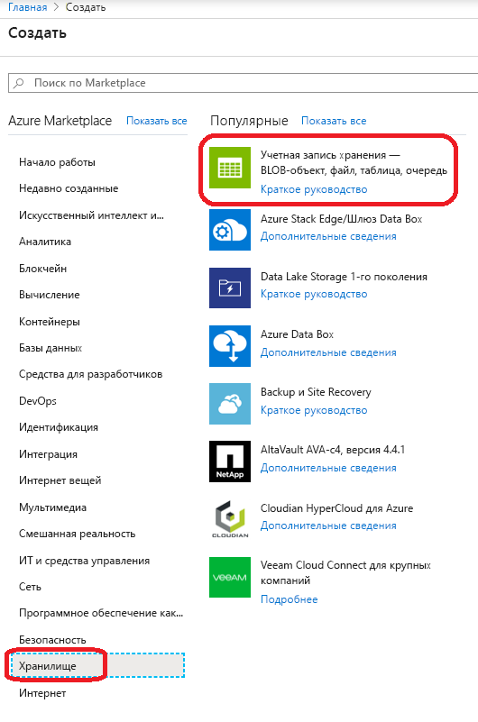
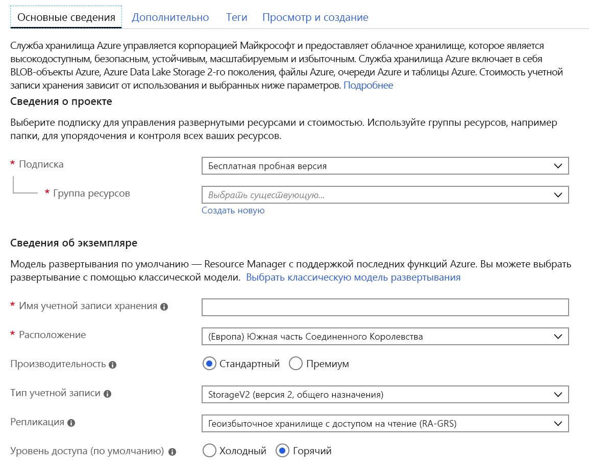
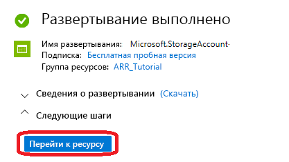
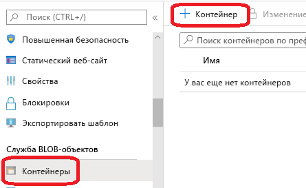
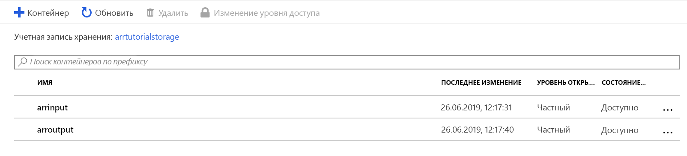
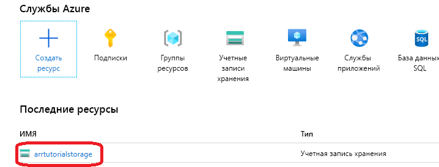
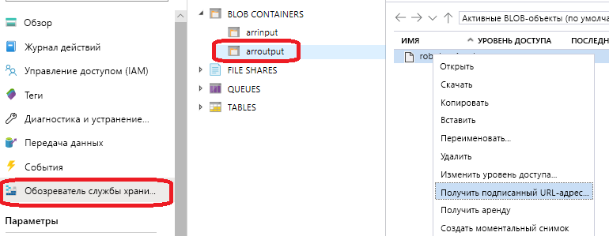

# <a name="quickstart-convert-a-model-for-rendering"></a>Краткое руководство. Преобразование модели для отрисовки

В статье [Краткое руководство. Отрисовка модели с помощью Unity](render-model.md) описано, как использовать пример проекта Unity для отрисовки встроенной модели. В этом руководстве показано, как преобразовывать собственные модели.

Вы узнаете, как:

> [!div class="checklist"]
>
> * настроить учетную запись хранения больших двоичных объектов Azure для входных и выходных данных;
> * отправить и преобразовать трехмерную модель для использования в Удаленной отрисовки Azure;
> * включить преобразованную трехмерную модель в приложение для отрисовки.

## <a name="prerequisites"></a>Предварительные требования

* См. подробнее об [использовании Отрисовка модели с помощью Unity](render-model.md)
* [Установите Azure PowerShell](https://docs.microsoft.com/powershell/azure/).
  * Откройте консоль PowerShell с правами администратора.
  * Выполните `Install-Module -Name Az -AllowClobber`.

## <a name="overview"></a>Обзор

Отрисовщик на сервере не может работать непосредственно с исходными форматами модели, такими как FBX или GLTF. Он ожидает модель в собственном двоичном формате.
Служба преобразования использует модели из хранилища BLOB-объектов Azure и записывает преобразованные модели обратно в предоставленный контейнер хранилища BLOB-объектов Azure.

Вам необходимы:

* Подписка Azure
* учетная запись StorageV2 в этой подписке;
* контейнер хранилища BLOB-объектов для входной модели;
* контейнер хранилища BLOB-объектов для выходных данных;
* модель для преобразования (см. [примеры моделей](../samples/sample-model.md)).
  * См. также [список поддерживаемых исходных форматов](../how-tos/conversion/model-conversion.md#supported-source-formats).
  * Чтобы использовать пример скрипта преобразования, подготовьте входную папку с моделью и всеми внешними зависимостями, включая внешние текстуры и геометрические объекты.

## <a name="azure-setup"></a>Настройка Azure

Если у вас еще нет учетной записи, откройте [https://azure.microsoft.com/get-started/](https://azure.microsoft.com/get-started/), выберите вариант бесплатной учетной записи и следуйте инструкциям.

Создав учетную запись Azure, перейдите к [https://ms.portal.azure.com/#home](https://ms.portal.azure.com/#home).

### <a name="storage-account-creation"></a>создание учетной записи хранения;

Чтобы создать хранилище BLOB-объектов, вам нужна учетная запись хранения.
Чтобы создать ее, нажмите кнопку "Создать ресурс".



На новом экране слева выберите **Хранилище**, а затем **Учетная запись хранения — BLOB-объект, файл, таблица, очередь** из следующего столбца:



После нажатия этой кнопки отобразится следующий экран, где нужно заполнить свойства хранилища:



Заполните форму, как показано ниже.

* Создайте новую группу ресурсов по ссылке с помощью ссылки под раскрывающимся списком и присвойте ей имя **ARR_Tutorial**.
* Введите уникальное имя в поле **Имя учетной записи хранения**. **Это имя должно быть глобально уникальным**, иначе появится предупреждение о том, что указанное имя уже используется. В этом кратком руководстве мы используем имя **arrtutorialstorage**. Вам нужно будет заменить его собственным именем во всех соответствующих местах.
* Выберите близкое к вам **расположение**. Желательно использовать то же расположение, что и для настройки отрисовки в другом кратком руководстве.
* **Производительность**. Выберите значение "Стандартная".
* **Тип учетной записи**. Выберите StorageV2 (общего назначения версии 2).
* **Репликация**. Выберите "Геоизбыточное хранилище с доступом на чтение (RA-GRS)".
* **Уровень доступа**. Выберите значение "Горячий".

Вам не нужно изменять свойства на других вкладках, поэтому щелкните **Просмотр и создание**, чтобы выполнить действия для завершения установки.

Теперь веб-сайт будет информировать вас о ходе развертывания, по завершении которого отобразится сообщение "Развертывание выполнено". Нажмите кнопку **Перейти к ресурсу**, чтобы выполнить следующие шаги.



### <a name="blob-storage-creation"></a>Создание хранилища BLOB-объектов

Теперь нам нужны два контейнера BLOB-объектов: один для входных и один для выходных данных.

Нажав кнопку **Перейти к ресурсу**, вы перейдете на страницу, где слева есть панель со списком меню. В этом списке в категории **Служба BLOB-объектов** нажмите кнопку **Контейнеры**:



Нажмите кнопку **+ Контейнер**, чтобы создать контейнер хранилища BLOB-объектов для **входных данных**.
При создании укажите следующие параметры:
  
* Имя — arrinput.
* Уровень общего доступа — частный.

После создания контейнера снова щелкните **+ Контейнер** и повторите процедуру для контейнера для **выходных данных** со следующими параметрами:

* Имя — arroutput.
* Уровень общего доступа — частный.

Теперь у вас есть два контейнера хранилища BLOB-объектов.



## <a name="run-the-conversion"></a>Выполнение преобразования

Чтобы упростить вызов службы преобразования ресурсов, мы предоставили служебный скрипт. Он размещен в папке *Scripts* под именем **Conversion.ps1**.

Этот скрипт выполняет следующее:

1. передает все файлы в заданном каталоге с локального диска во входной контейнер хранилища;
1. вызывает [REST API преобразования ресурсов](../how-tos/conversion/conversion-rest-api.md), чтобы извлечь данные из входного контейнера хранилища и запустить преобразование, которое возвращает идентификатор преобразования;
1. опрашивает API состояния преобразования, предоставляя полученный идентификатор преобразования, пока процесс преобразования не завершится (в том числе со сбоем);
1. извлекает ссылку на преобразованный ресурс в хранилище выходных данных.

Скрипт считывает конфигурацию из файла *Scripts\arrconfig.json*. Откройте JSON-файл в текстовом редакторе.

```json
{
    "accountSettings": {
        "arrAccountId": "8*******-****-****-****-*********d7e",
        "arrAccountKey": "R***************************************l04=",
        "region": "<your-region>"
    },
    "renderingSessionSettings": {
        "vmSize": "standard",
        "maxLeaseTime": "1:00:00"
    },
    "assetConversionSettings": {
        "localAssetDirectoryPath": "D:\\tmp\\robot",
        "resourceGroup": "ARR_Tutorial",
        "storageAccountName": "arrexamplestorage",
        "blobInputContainerName": "arrinput",
        "inputFolderPath": "robotConversion",
        "inputAssetPath": "robot.fbx",
        "blobOutputContainerName": "arroutput",
        "outputFolderPath":"converted/robot",
        "outputAssetFileName": "robot.arrAsset"
    }
}
```

В группе **accountSettings** нужно указать ту же конфигурацию (идентификатор учетной записи и ключ), что и для учетных данных в кратком руководстве по [отрисовке модели с помощью Unity](render-model.md).

В группе **assetConversionSettings** обязательно измените значения **resourceGroup**, **blobInputContainerName** и **blobOutputContainerName**, как показано выше.
Обратите внимание, что значение **arrtutorialstorage** необходимо заменить уникальным именем, которое вы выбрали при создании учетной записи хранения.

Измените значение **localAssetDirectoryPath** так, чтобы оно указывало на каталог на диске с моделью для преобразования. Не забудьте правильно экранировать символы обратной косой черты (\\) в пути, заменяя их двумя символами косой черты (\\\\).

Все данные из пути, который задан в значении **localAssetDirectoryPath**, будут переданы в контейнер BLOB-объектов **blobInputContainerName** по подпути, заданному в значении **inputFolderPath**. Следовательно, в приведенном выше примере конфигурации содержимое каталога D:\\tmp\\robot будет отправлено в контейнер BLOB-объектов arrinput в учетной записи хранения arrtutorialstorage по пути robotConversion. Все существующие файлы в этом каталоге будут перезаписаны.

В **inputAssetPath** укажите путь к преобразуемой модели относительно пути localAssetDirectoryPath. В качестве разделителя пути используйте / вместо \\. Например, для файла robot.fbx в папке D:\\tmp\\robot, укажите просто robot.fbx.

Преобразованная модель будет записана обратно в контейнер хранилища, заданный в параметре **blobOutputContainerName**. Необязательный параметр **outputFolderPath** позволяет задать подпуть. В приведенном выше примере robot.arrAsset копируется в папку converted/robot выходного контейнера BLOB-объектов.

Параметр конфигурации **outputAssetFileName** определяет имя преобразованного ресурса. Он является необязательным — при его отсутствии имя выходного файла будет получено из имени входного файла.

Откройте PowerShell и убедитесь, что вы уже установили *Azure PowerShell*, как описано в разделе [Необходимые компоненты](#prerequisites). Войдите в подписку с помощью указанной ниже команды и следуйте инструкциям на экране.

```PowerShell
Connect-AzAccount
```

> [!NOTE]
> Если в организации есть несколько подписок, может потребоваться указать аргументы SubscriptionId и Tenant. См. документацию по [Connect-AzAccount](https://docs.microsoft.com/powershell/module/az.accounts/connect-azaccount).

Перейдите в каталог `azure-remote-rendering\Scripts` и запустите скрипт преобразования:

```PowerShell
.\Conversion.ps1 -UseContainerSas
```

Вы увидите нечто вроде этого: 

## <a name="insert-new-model-into-quickstart-sample-app"></a>Вставка новой модели в пример приложения быстрого запуска

Этот скрипт преобразования создает URI *подписанного URL-адреса (SAS)* для преобразованной модели. Этот URI можно скопировать и вставить как **имя модели** в примере приложения для быстрого начала работы (см. [Краткое руководство. Отрисовка модели с помощью Unity](render-model.md)).


 Теперь этот пример будет загружать и отображать предоставленную вами модель.

## <a name="optional-re-creating-a-sas-uri"></a>Необязательное действие: Повторное создание URI SAS

URI SAS, созданный скриптом преобразования, действует только в течение 24 часов. Но после истечения срока действия вам не нужно снова преобразовывать модель. Достаточно создать на портале новый SAS, как описано ниже.

1. Перейдите на [портал Azure](https://www.portal.azure.com).
1. Щелкните ресурс **учетной записи хранения**: 
1. На следующем экране щелкните **Обозреватель хранилища** на панели слева и найдите выходной файл модели ( *.arrAsset*) в контейнере BLOB-объектов *arroutput*. Щелкните этот файл правой кнопкой мыши и выберите в контекстном меню действие **Получить подписанный URL-адрес**. 
1. Откроется новый экран, где вы можете указать дату окончания срока действия. Щелкните **Создать** и скопируйте URI, который отобразится в следующем диалоговом окне. Этот новый URI заменяет собой временный адрес, созданный скриптом.

## <a name="next-steps"></a>Дальнейшие действия

Итак, вы изучили основы и можете переходить к следующим руководствам с более подробной информацией.

Если вам нужно больше сведений о преобразовании моделей, см. документацию по [REST API преобразования моделей](../how-tos/conversion/conversion-rest-api.md).

> [!div class="nextstepaction"]
> [Руководство. Просмотр модели удаленной отрисовки](../tutorials/unity/view-remote-models/view-remote-models.md)
