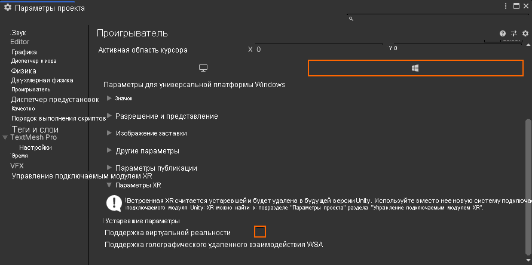
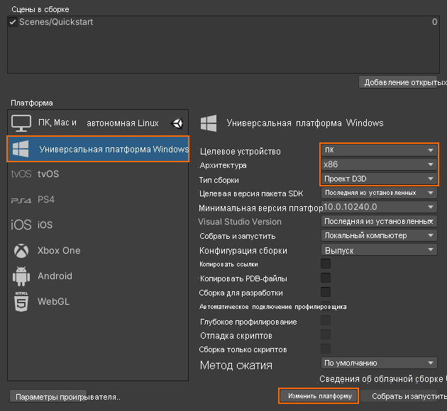
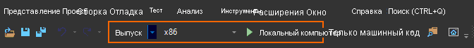

# Краткое руководство. Развертывание примера Unity на рабочем столе

В этом кратком руководстве показано, как развернуть и запустить пример приложения для Unity на настольном ПК.

Из этого руководства вы узнаете, как выполнить следующие задачи:

> [!div class="checklist"]
>
>* создать приложение для компьютера;
>* развернуть приложение на компьютере;
>* запустить приложение на компьютере.

## Предварительные требования

Далее показано, как развернуть пример проекта из краткого руководства по [ отрисовке модели с помощью Unity](render-model.md).

Убедитесь, что учетные данные правильно сохранены, и вы можете подключиться к сеансу из редактора Unity.

## Отключение поддержки виртуальной реальности

На компьютерах сейчас поддерживаются только неструктурированные приложения, поэтому поддержку виртуальной реальности нужно отключить.

1. Выберите *Edit > Project Settings* (Изменить > Параметры проекта).
1. Слева выберите **Player** (Проигрыватель).
1. Перейдите на вкладку с **параметрами универсальной платформы Windows**.
1. Разверните меню **XR Settings** (Параметры XR).
1. Отключите параметр **Virtual Reality Supported** (Поддержка виртуальной реальности).
    
1. Над меню *XR Settings* (Параметры XR) разверните меню **Publishing Settings** (Параметры публикации).
1. В разделе **Supported Device Families** (Поддерживаемые семейства устройств) должен быть установлен флажок **Desktop** (Компьютер).

## Сборка примера проекта

1. Откройте *File > Build Settings* (Файл > Параметры сборки).
1. Для параметра *Platform* (Платформа) выберите **Universal Windows Platform** (Универсальная платформа Windows).
1. Для параметра *Target Device* (Целевое устройство) выберите **PC** (ПК).
1. Для параметра *Architecture* (Архитектура) выберите **x86**.
1. Для параметра *Build Type* (Тип сборки) выберите **D3D Project** (Проект D3D).
  
1. Выберите **Switch to Platform** (Переключиться на платформу).
1. При нажатии **Build** (Сборка) или Build And Run (Сборка и запуск) вам будет предложено выбрать папку, в которой будет храниться решение.
1. Откройте созданный файл **QuickStart.sln** в Visual Studio.
1. Измените конфигурацию на **Выпуск** и **x86**.
1. Для отладчика выберите режим **Локальный компьютер**.
  
1. Выполните сборку решения (клавиша F7).

## Запуск примера проекта

Запустите отладчик в Visual Studio (клавиша F5). Приложение будет автоматически развернуто на компьютере.

Приложение должно запуститься, после чего начаться новый сеанс. Через некоторое время сеанс будет подготовлен и появится модель удаленной отрисовки.
Если вам понадобится запустить пример позже, это можно будет сделать из меню "Пуск".

## Дальнейшие действия

В следующем кратком руководстве мы покажем, как преобразовать пользовательскую модель.

> [!div class="nextstepaction"]
> [Краткое руководство. Преобразование модели для отрисовки](convert-model.md)
