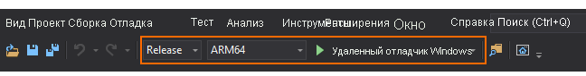

# Краткое руководство. Развертывание примера Unity в HoloLens

В этом кратком руководстве показано, как развернуть и запустить пример приложения для Unity на HoloLens 2.

Из этого руководства вы узнаете, как выполнить следующие задачи:

> [!div class="checklist"]
>
>* Создание приложения для HoloLens
>* Развертывание примера на устройстве
>* Запуск примера на устройстве

## Предварительные требования

В этом кратком руководстве мы будем развертывать пример проекта из [Краткого руководства по отрисовке модели с помощью Unity](render-model.md).

Убедитесь, что учетные данные правильно сохранены и вы можете подключиться к сеансу из редактора Unity.

## Сборка примера проекта

1. Откройте *File > Build Settings* (Файл > Параметры сборки).
1. Для параметра *Платформа* выберите **Универсальная платформа Windows**
1. Задайте *целевое устройство* на **HoloLens**
1. Для параметра *Архитектура* выберите **ARM64**
1. Для параметра *Build Type* (Тип сборки) выберите **D3D Project**\ (Проект D3D).
    
1. Выберите **Switch to Platform** (Переключиться на платформу)
1. При нажатии **Сборка** (или "Сборка и запуск") вам будет предложено выбрать папку, в которой будет храниться решение
1. Откройте созданный файл **Quickstart.sln** в Visual Studio
1. Измените конфигурацию на **Выпуск** и **ARM64**
1. Для отладчика выберите режим **Remote Machine**\ (Удаленный компьютер).
    
1. Выполните сборку решения.
1. Для проекта "Быстрый запуск" перейдите в раздел *Свойства > Отладка*
    1. Убедитесь, что конфигурация *Выпуска* активна
    1. Установите для пункта *Отладчик для запуска* значение **Удаленный компьютер**
    1. Измените *имя компьютера* на **IP-адрес вашего устройства HoloLens**

## Запуск примера проекта

1. Подключите HoloLens к компьютеру по USB-кабелю.
1. Запустите отладчик в Visual Studio (клавиша F5). Приложение будет автоматически развернуто на устройстве.

Приложение должно запуститься, после чего начнется новый сеанс. Через некоторое время сеанс будет подготовлен и появится модель удаленной отрисовки.
Если вам понадобится запустить пример позже, это можно будет сделать из меню "Пуск" HoloLens.

## Дальнейшие действия

В следующем кратком руководстве мы покажем, как преобразовать пользовательскую модель.

> [!div class="nextstepaction"]
> [Краткое руководство. Преобразование модели для отрисовки](convert-model.md)
