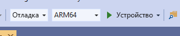

# <a name="quickstart-deploy-native-c-sample-to-hololens"></a>Краткое руководство. Развертывание примера в машинном коде C++ в HoloLens

В этом кратком руководстве описывается развертывание и запуск нативного учебного приложения на C++ на устройстве HoloLens 2.

Из этого руководства вы узнаете, как выполнить следующие задачи:

> [!div class="checklist"]
>
>* создание учебного приложения для HoloLens;
>* изменение учетных данных ARR в исходном коде;
>* развертывание и запуск примера на устройстве.

## <a name="prerequisites"></a>Предварительные требования

Чтобы получить доступ к службе "Удаленная отрисовка Azure", сначала необходимо [создать учетную запись](../../../how-tos/create-an-account.md).

Необходимо установить следующее программное обеспечение:

* Windows SDK 10.0.18362.0 [(скачать)](https://developer.microsoft.com/windows/downloads/windows-10-sdk).
* Последняя версия Visual Studio 2019 [(скачать)](https://visualstudio.microsoft.com/vs/older-downloads/).
* [Средства Visual Studio для службы "Смешанная реальность"](/windows/mixed-reality/install-the-tools). В частности, обязательно установить следующие *рабочие нагрузки*:
  * **Разработка классических приложений на C++** .
  * **Разработка приложений для универсальной платформы Windows (UWP)** .
* GIT [(скачать)](https://git-scm.com/downloads).

## <a name="clone-the-arr-samples-repository"></a>Клонирование репозитория примеров ARR

В качестве первого шага мы клонируем репозиторий Git, который содержит общедоступные примеры для службы "Удаленная отрисовка Azure". Откройте командную строку (введите `cmd` в меню "Пуск" в Windows) и перейдите в каталог, в котором вы хотите сохранить пример проекта ARR.

Выполните следующие команды:

```cmd
mkdir ARR
cd ARR
git clone https://github.com/Azure/azure-remote-rendering
```

Последняя команда создает подкаталог в каталоге ARR, который содержит различные примеры проектов для Удаленной отрисовки Azure.

Учебное приложение на C++ для HoloLens можно найти в подкаталоге *NativeCpp/HoloLens*.

## <a name="build-the-project"></a>Сборка проекта

Откройте файл решения *HolographicApp.sln* из подкаталога *NativeCpp/HoloLens* в Visual Studio 2019.

Включите конфигурацию сборки *Debug* (Отладка) или *Release* (Выпуск) и укажите платформу *ARM64*. Также убедитесь, что для режима отладчика задано значение *Устройство*, а не *Удаленный компьютер*.



Так как учетные данные учетной записи жестко задаются в исходном коде учебника, укажите вместо них действительные учетные данные. Для этого откройте файл `HolographicAppMain.cpp` в Visual Studio и измените часть, в которой конструктор класса `HolographicAppMain` создает внешний интерфейс:

```cpp
// 2. Create front end
{
    // Users need to fill out the following with their account data and model
    RR::AzureFrontendAccountInfo init;
    init.AccountId = "00000000-0000-0000-0000-000000000000";
    init.AccountKey = "<account key>";
    init.AccountDomain = "westus2.mixedreality.azure.com"; // <change to your region>
    m_modelURI = "builtin://Engine";
    m_sessionOverride = ""; // If there is a valid session ID to re-use, put it here. Otherwise a new one is created
    m_frontEnd = RR::ApiHandle(RR::AzureFrontend(init));
}
```

В частности, измените следующие значения:
* `init.AccountId` и `init.AccountKey` должны содержать данные для вашей учетной записи. См. раздел [Извлечение сведений об учетной записи](../../../how-tos/create-an-account.md#retrieve-the-account-information).
* Часть строки `init.AccountDomain`, которая содержит значение региона, с регионом, отличным от `westus2`, например `"westeurope.mixedreality.azure.com"`.
* Кроме того, вместо `m_sessionOverride` можно указать существующий идентификатор сеанса. Сеансы можно создавать за пределами этого примера, например с помощью [скрипта PowerShell](../../../samples/powershell-example-scripts.md#script-renderingsessionps1) или напрямую через [REST API сеанса](../../../how-tos/session-rest-api.md#create-a-session).
Мы рекомендуем создавать сеанс за пределами примера, если его нужно выполнять несколько раз. Если сеанс не передается, этот пример будет создавать новый сеанс при каждом запуске, что может занять несколько минут.

Теперь приложение можно компилировать.

## <a name="launch-the-application"></a>Запуск приложения

1. Подключите HoloLens к компьютеру по USB-кабелю.
1. Включите HoloLens и подождите, пока появится начальное меню.
1. Запустите отладчик в Visual Studio (клавиша F5). Приложение будет автоматически развернуто на устройстве.

Пример приложения должен запуститься и открыть текстовую панель с информацией о текущем состоянии приложения. Состояние во время запуска отображает создание нового сеанса или подключение к существующему сеансу. Когда завершится загрузка модели, появится встроенная модель двигателя в позиции на уровне головы пользователя. С точки зрения перекрытия модель двигателя правильно взаимодействует с вращающимся кубом, который отрисовывается локально.

 Если вы хотите еще раз запустить пример позже, его можно найти в стартовом меню HoloLens, но не забывайте, что может истечь срок действия сеанса, с идентификатором которого он скомпилирован.

## <a name="next-steps"></a>Дальнейшие действия

Это краткое руководство основано на результатах, полученных при работе с руководством по интеграции всех элементов службы "Удаленная отрисовка" с базовым примером *Holographic App*. Необходимые действия собраны в следующем руководстве:

> [!div class="nextstepaction"]
> [Руководство. Интеграция Удаленной отрисовки в голографическом приложении HoloLens](../../../tutorials/native-cpp/hololens/integrate-remote-rendering-into-holographic-app.md)