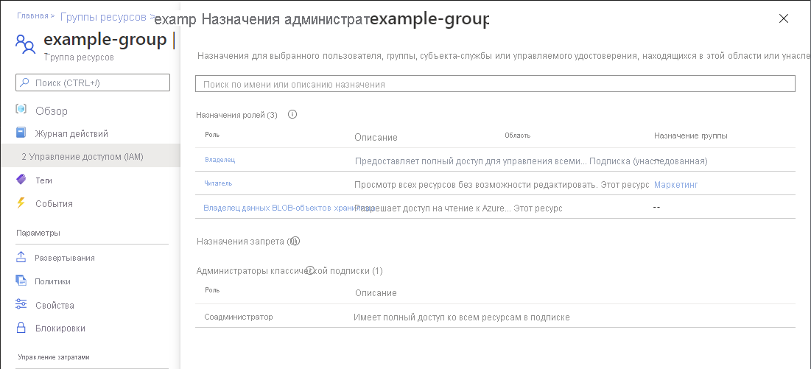

# Краткое руководство. Проверка прав доступа пользователя к ресурсам Azure

Иногда необходимо проверить, какие права доступа к набору ресурсов Azure имеются у пользователей. Вы можете проверить их, создав список заданий пользователей. Быстрый способ проверить доступ отдельного пользователя — использовать функцию **Проверить доступ** на странице **Управление доступом (IAM)** .

## Шаг 1. Открытие ресурсов Azure

Чтобы проверить права доступа пользователя, вам сначала нужно открыть ресурсы Azure, к которым необходимо проверить доступ. Ресурсы Azure упорядочены по уровням, которые обычно называют *областью*. В Azure область можно задать на четырех уровнях от широкого к узкому: на уровне группы управления, уровне подписки, группы ресурсов или ресурса.

Выполните приведенные ниже действия, чтобы открыть набор ресурсов Azure, доступ к которым необходимо проверить.

1. Откройте [портал Azure](https://portal.azure.com).

1. Откройте набор ресурсов Azure, например **группы управления**, **подписки**, **группы ресурсов** или конкретный ресурс.

1. Щелкните конкретный ресурс в этой области.

    Ниже показан пример группы ресурсов.

    

## Шаг 2. Проверка разрешений на доступ пользователя

Выполните приведенные ниже действия, чтобы проверить права доступа для одного пользователя, группы, субъекта-службы или управляемого удостоверения к ранее выбранным ресурсам Azure.

1. Выберите **Управление доступом (IAM)**.

    Ниже показан пример страницы "Управление доступом (IAM)" для группы ресурсов.

    

1. На вкладке **Проверить доступ** в списке **Поиск** выберите пользователя, группу, субъект-службу или управляемое удостоверение, для которого необходимо проверить права доступа.

1. В поле поиска введите строку для поиска в каталоге по отображаемым именам, адресам электронной почты или идентификаторам объектов.

    

1. Выберите субъект безопасности, чтобы открыть область **Назначения**.

    На этой панели вы можете просмотреть права доступа выбранного субъекта безопасности в этой области и унаследованные от этой области. Назначения в дочерних областях не указаны. Отобразятся следующие назначения:

    - Назначения ролей, добавленные с помощью Azure RBAC.
    - Назначения запрета, добавленные с помощью Azure Blueprints или управляемых приложений Azure.
    - Назначения классического администратора службы или соадминистратора для классических развертываний. 

    

## Шаг 3. Проверка собственных прав доступа

Выполните приведенные ниже действия, чтобы проверить свои права доступа к ранее выбранным ресурсам Azure.

1. Выберите **Управление доступом (IAM)**.

1. На вкладке **Проверить доступ** нажмите кнопку **View my access** (Проверить мои права доступа).

    Отобразится панель назначений, на которой перечислены ваши права доступа в этой области и унаследованные от нее. Назначения в дочерних областях не указаны.

    

## Дальнейшие действия

> [!div class="nextstepaction"]
> [Вывод списка назначений ролей Azure с помощью портала Azure](role-assignments-list-portal.md).
