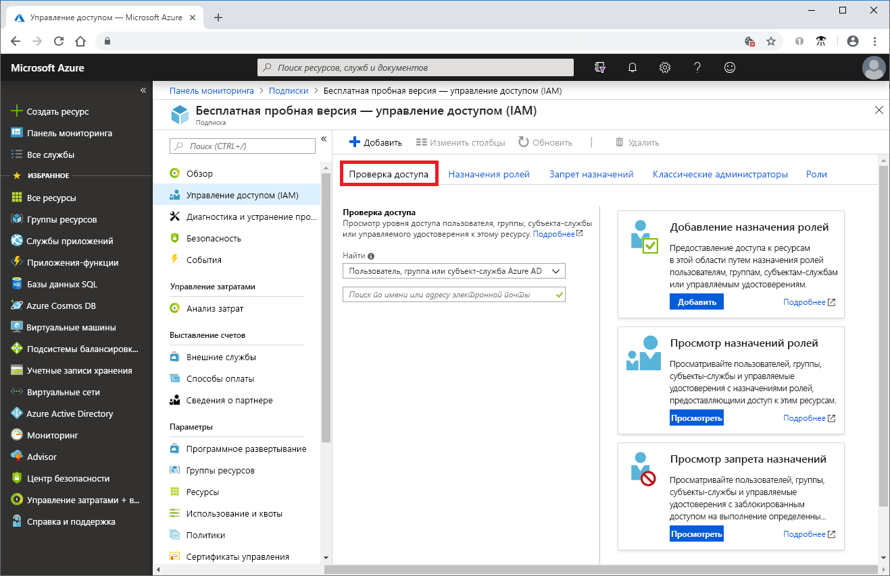
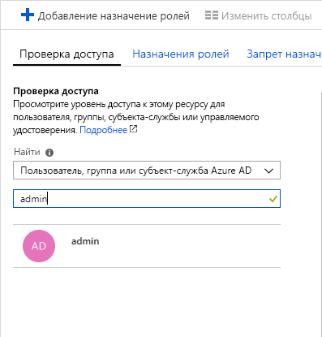
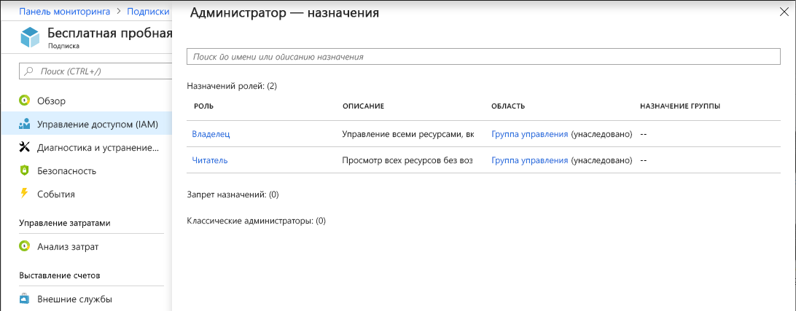

# Краткое руководство. Использование портала Azure для просмотра ролей, назначенных пользователю

Колонку **Управление доступом (IAM)** в [Управление доступом на основе ролей (RBAC)](overview.md) можно использовать для просмотра назначений ролей для нескольких пользователей, групп, субъектов-служб и управляемых удостоверений, но иногда нужно лишь быстро просмотреть назначения ролей для одного пользователя, группы, субъекта-службы или управляемого удостоверения. Для этого лучше всего использовать функцию **Проверка доступа** на портале Azure.

## Просмотр назначений ролей

Выполните следующие действия, чтобы просмотреть права доступа для одного пользователя, группы, субъекта-службы или управляемого удостоверения в области подписки.

1. На портале Azure щелкните **Все службы**, а затем **Подписки**.

1. Щелкните на подписку.

1. Щелкните **Управление доступом (IAM)**.

1. Щелкните вкладку **Проверить доступ**.

    

1. В списке **Найти** выберите тип субъекта безопасности, для которого нужно проверить доступ.

1. В поле поиска введите строку для поиска в каталоге по отображаемым именам, адресам электронной почты или идентификаторам объектов.

    

1. Выберите субъект безопасности, чтобы открыть область **Назначения**.

    

    В этой области можно увидеть роли, которые назначены выбранному субъекту безопасности для выбранной области. Здесь будут перечислены все запрещающие назначения, которые определены или наследуются в выбранной области.

## Дополнительная информация

> [!div class="nextstepaction"]
> [Руководство. Предоставление доступа пользователю с помощью RBAC и портала Azure](quickstart-assign-role-user-portal.md)
