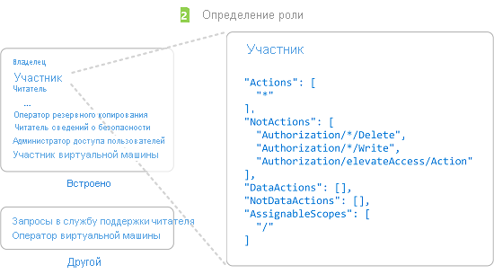
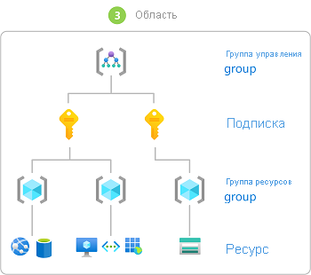

# Что такое управление доступом на основе ролей в Azure (RBAC)?

Управление доступом к облачным ресурсам является критически важной функцией в любой организации, использующей облако. Управление доступом на основе ролей Azure (RBAC Azure) позволяет управлять доступом пользователей к ресурсам Azure, включая настройку разрешений на выполнение операций с этими ресурсами и определение областей доступа.

RBAC Azure — это система авторизации на основе [Azure Resource Manager](../azure-resource-manager/management/overview.md), которая обеспечивает широкие возможности управления доступом к ресурсам Azure.

В этом видео представлен краткий обзор Azure RBAC.

>[!VIDEO https://www.youtube.com/embed/Dzhm-garKBM]

## Какие возможности обеспечивает RBAC Azure?

Вот примеры того, что можно выполнять с помощью RBAC Azure:

- предоставление одному пользователю разрешения на управление виртуальными машинами в подписке, а другому — на управление виртуальными сетями;
- предоставление группе DBA разрешения на управление базами данных SQL в подписке;
- предоставление пользователю разрешения на управление всеми ресурсами в группе ресурсов, включая виртуальные машины, веб-сайты и подсети;
- представление приложению доступа ко всем ресурсам в группе ресурсов.

## Принцип работы RBAC Azure

Для управления доступом к ресурсам с помощью RBAC Azure создаются назначения ролей. Это важнейшее понятие. Именно таким образом предоставляются разрешения. Назначение ролей состоит из трех элементов: субъект безопасности, определение роли и область действия.

### Субъект безопасности

*Субъект безопасности* — это объект, представляющий пользователя, группу, субъект-службу или управляемое удостоверение, которые запрашивают доступ к ресурсам Azure. Любому из этих субъектов безопасности можно назначить роль.

### Определение роли

*Определение роли* представляет собой коллекцию разрешений. Обычно это называется *ролью*. В определении роли перечисляются операции, которые можно выполнить, например чтение, запись и удаление. Роль может быть общей, например "Владелец", или более конкретной, например "Модуль чтения виртуальной машины".

В Azure есть несколько [встроенных ролей](built-in-roles.md). Например, роль [Участник виртуальных машин](built-in-roles.md#virtual-machine-contributor) позволяет пользователю создавать виртуальные машины и управлять ими. Если встроенные роли не соответствуют потребностям вашей организации, вы можете создать собственные [настраиваемые роли Azure](custom-roles.md).

В этом видео представлен краткий обзор встроенных и настраиваемых ролей.

>[!VIDEO https://www.youtube.com/embed/I1mefHptRgo]

Azure предоставляет операции с данными, которые позволяют предоставлять доступ к данным в объекте. Например, если у пользователя есть доступ на чтение данных в учетной записи хранения, это позволяет ему считывать большие двоичные объекты или сообщения в этой учетной записи.

Дополнительные сведения о ролях Azure см. в [этой статье](role-definitions.md).

### Область

*Область* — это набор ресурсов, к которым предоставляется доступ. При назначении роли можно точнее ограничить разрешенные действия, определив их область. Это удобно, если вы хотите привлечь какого-либо пользователя к [работе над веб-сайтом](built-in-roles.md#website-contributor), но только для одной группы ресурсов.

В Azure область действия можно задать на четырех уровнях: на [уровне группы управления](../governance/management-groups/overview.md), уровне подписки, [группы ресурсов](../azure-resource-manager/management/overview.md#resource-groups) или ресурса. Структура областей строится на отношениях "родитель-потомок". Вы можете назначать роли на любом из этих уровней области действия.

Дополнительные сведения об областях см. в статье [Общие сведения об областях для Azure RBAC](scope-overview.md).

### Назначения ролей

*Назначение ролей* — это процесс связывания определения роли с пользователем, группой, субъектом-службой или управляемым удостоверением в определенной области в целях предоставления доступа. Доступ предоставляется путем создания назначения ролей, а отзывается путем его удаления.

На приведенной ниже схеме показан пример назначения ролей. В этом примере группе "Маркетинг" назначена роль [Участник](built-in-roles.md#contributor) для группы ресурсов "Продажи медицинских препаратов". Это означает, что пользователи из группы "Маркетинг" могут создавать ресурсы Azure в группе ресурсов "Продажи медицинских препаратов" или управлять любыми такими ресурсами. Пользователи в группе "Маркетинг" не имеют доступа к ресурсам за пределами группы ресурсов "Продажи медицинских препаратов", если они не имеют других назначений ролей.

Создавать назначения ролей можно с помощью портала Azure, Azure CLI, Azure PowerShell, пакетов SDK Azure или интерфейсов REST API.

Подробные сведения см. в статье [Шаги для добавления назначения роли](role-assignments-steps.md).

## Несколько назначений ролей

Что произойдет, если у вас будет несколько перекрывающихся назначений ролей? RBAC Azure — это аддитивная модель, поэтому ваши действующие разрешения являются сочетанием назначений ролей. Рассмотрим следующий пример, где пользователю предоставляется роль участника на уровне подписки и роль читателя для группы ресурсов. Сочетание разрешения участника и разрешения читателя представляет собой роль участника для группы ресурсов. Следовательно, в этом примере назначение роли читателя не играет роли.

## Запрет назначений

Раньше RBAC Azure была разрешающей моделью без запретов, но теперь она ограниченно поддерживает запрет назначений. *Запрет назначений*, как и назначение ролей, связывает набор запрещающих действий с пользователем, группой или субъектом-службой в определенной области для отказа в доступе. Назначение роли определяет набор *допустимых* действий, а назначение запрета определяет набор *недопустимых* действий. Другими словами, запрет назначений блокирует выполнение определенных действий пользователями, даже если назначение роли предоставляет им доступ. Запрет назначений имеет приоритет над назначением ролей.

Дополнительные сведения о запретах назначений Azure см. в [этой статье](deny-assignments.md).

## Как RBAC Azure определяет право доступа пользователя к ресурсу

Ниже перечислены основные действия, выполняемые RBAC Azure для определения того, есть ли у вас доступ к ресурсу на уровне управления. Это полезно, если вы пытаетесь устранить проблему с доступом.

1. Пользователь A (или директор службы) приобретает токен для Azure Resource Manager.

    Токен включает членство в группе пользователей (включая переходные членства в группах).

1. Пользователь выполняет вызов REST API в Azure Resource Manager с помощью присоединенного токена.

1. Azure Resource Manager извлекает все назначения ролей и запрет назначений, которые применяются к ресурсу, на котором выполняется действие.

1. Azure Resource Manager сужает назначенные роли, которые применяются к этому пользователю или группе, и определяет, какие роли у пользователя есть для этого ресурса.

1. Azure Resource Manager определяет, включено ли действие в вызове API в роли, которые пользователь имеет для этого ресурса.

1. Если у пользователя нет роли с действием в запрашиваемой области, доступ не предоставляется. В противном случае Azure Resource Manager проверяет, применяется ли запрет назначения.

1. Если применяется запрет назначения, доступ блокируется. В противном случае доступ предоставляется.

## Требования лицензий

[!INCLUDE [Azure AD free license](../../includes/active-directory-free-license.md)]

## Дальнейшие действия

- [Добавление и удаление назначений ролей Azure с помощью портала Azure](role-assignments-portal.md)
- [Общие сведения о различных ролях](rbac-and-directory-admin-roles.md)
- [Role-based Управление доступом к ресурсам в Azure](/azure/cloud-adoption-framework/govern/resource-consistency/resource-access-management)
