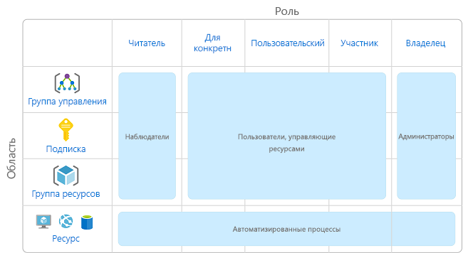
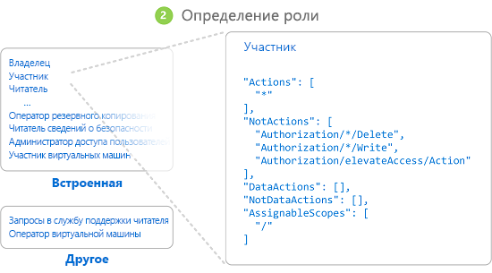
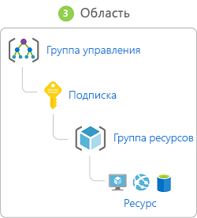
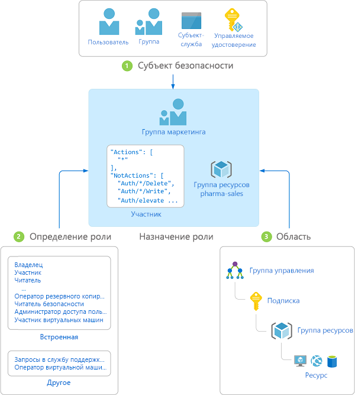
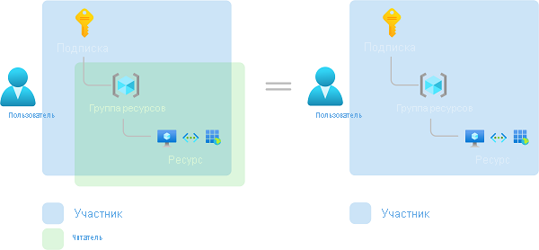

# Общие сведения об управлении доступом на основе ролей (RBAC) для ресурсов Azure

Управление доступом к облачным ресурсам является критически важной функцией в любой организации, использующей облако. Управление доступом на основе ролей (RBAC) позволяет управлять доступом пользователей к ресурсам Azure, включая настройку разрешений на выполнение операций с этими ресурсами и определением областей доступа.

RBAC — это система авторизации на основе [Azure Resource Manager](../azure-resource-manager/resource-group-overview.md), которая обеспечивает широкие возможности управления доступом к ресурсам Azure.

## Что можно сделать с помощью RBAC?

Вот некоторые примеры действий, которые можно выполнять с помощью RBAC:

- предоставление одному пользователю разрешения на управление виртуальными машинами в подписке, а другому — на управление виртуальными сетями;
- предоставление группе DBA разрешения на управление базами данных SQL в подписке;
- предоставление пользователю разрешения на управление всеми ресурсами в группе ресурсов, включая виртуальные машины, веб-сайты и подсети;
- представление приложению доступа ко всем ресурсам в группе ресурсов.

## Рекомендации по использованию ролей RBAC

С помощью RBAC вы можете распределить обязанности внутри команды и предоставить пользователям доступ на уровне, который им необходим для выполнения поставленных задач. Вместо того чтобы предоставить всем неограниченные разрешения для подписки Azure или ресурсов, можно разрешить только определенные действия в конкретной области.

Когда вы разрабатываете стратегию управления доступом, предоставьте пользователям минимальные разрешения, чтобы они могли выполнять свои задачи. На следующей схеме представлен рекомендуемый шаблон для использования ролей RBAC.

## Принцип работы RBAC

Для управления доступом к ресурсам с помощью RBAC создаются назначения ролей. Это важнейшее понятие. Именно таким образом предоставляются разрешения. Назначение ролей состоит из трех элементов: субъект безопасности, определение роли и область действия.

### Субъект безопасности

*Субъект безопасности* — это объект, представляющий пользователя, группу, субъект-службу или управляемое удостоверение, которые запрашивают доступ к ресурсам Azure.

- Пользователь — человек, имеющий профиль в Azure Active Directory. Роли можно также назначать пользователям в других клиентах. Сведения о пользователях в других организациях см. в статье [Что такое служба совместной работы Azure AD B2B](../active-directory/b2b/what-is-b2b.md).
- Группа — набор пользователей, созданный в Azure Active Directory. При назначении роли группе ее получают все пользователи в этой группе. 
- Субъект-служба — это идентификатор безопасности, который используется приложениями или службами для доступа к определенным ресурсам Azure. Это что-то вроде *удостоверения пользователя* (имя пользователя и пароль или сертификат) для приложения.
- Управляемое удостоверение — это удостоверение, управление которым осуществляется автоматически в Azure Active Directory. Как правило, [управляемые удостоверения](../active-directory/managed-identities-azure-resources/overview.md) используются при разработке облачных приложений. Эти удостоверения нужны для управления учетными данными, которые используются при проверке подлинности в службах Azure.

### Определение роли

*Определение роли* представляет собой коллекцию разрешений. Иногда оно называется просто *ролью*. В определении роли перечисляются операции, которые можно выполнить, например чтение, запись и удаление. Роль может быть общей, например "Владелец", или более конкретной, например "Модуль чтения виртуальной машины".

В Azure есть несколько [встроенных ролей](built-in-roles.md). Ниже перечислены четыре основные встроенные роли. Первые три роли охватывают все типы ресурсов.

- [Владелец](built-in-roles.md#owner) — имеет полный доступ ко всем ресурсам, включая право делегировать доступ другим пользователям.
- [Участник](built-in-roles.md#contributor) — может создавать все типы ресурсов Azure и управлять ими, но не может предоставлять доступ другим пользователям.
- [Читатель](built-in-roles.md#reader) — может просматривать существующие ресурсы Azure.
- [Администратор доступа пользователей](built-in-roles.md#user-access-administrator) — может управлять доступом пользователей к ресурсам Azure.

Остальные встроенные роли разрешают управление определенными ресурсами Azure. Например, роль [Участник виртуальных машин](built-in-roles.md#virtual-machine-contributor) позволяет пользователю создавать виртуальные машины и управлять ими. Если встроенные роли не соответствуют потребностям вашей организации, вы можете создать собственные [настраиваемые роли для ресурсов Azure](custom-roles.md).

Azure предоставляет операции с данными, которые позволяют предоставлять доступ к данным в объекте. Например, если у пользователя есть доступ на чтение данных в учетной записи хранения, это позволяет ему считывать большие двоичные объекты или сообщения в этой учетной записи. Дополнительные сведения см. в статье [Определения ролей](role-definitions.md).

### Область

*Область* — это набор ресурсов, к которым предоставляется доступ. При назначении роли можно точнее ограничить разрешенные действия, определив их область. Это удобно, если вы хотите привлечь какого-либо пользователя к [работе над веб-сайтом](built-in-roles.md#website-contributor), но только для одной группы ресурсов.

В Azure область действия можно задать на нескольких уровнях: на [уровне группы управления](../governance/management-groups/index.md), уровне подписки, группы ресурсов или ресурса. Структура областей строится на отношениях "родитель-потомок".

При предоставлении доступа к родительской области дочерние области наследуют эти разрешения. Например:

- Если назначить роль [Владелец](built-in-roles.md#owner) пользователю в области действия группы управления, такой пользователь может управлять всеми ресурсами во всех подписках в группе управления.
- Если вы назначаете роль [Читатель](built-in-roles.md#reader) группе в области подписки, участники этой группы могут просматривать все группы ресурсов и ресурсы в подписке.
- Если вы назначаете роль [Участник](built-in-roles.md#contributor) приложению в области группы ресурсов, оно может управлять ресурсами всех типов в этой группе ресурсов, но не в других группах ресурсов в подписке.

### Назначения ролей

*Назначение ролей* — это процесс связывания определения роли с пользователем, группой, субъектом-службой или управляемым удостоверением в определенной области в целях предоставления доступа. Доступ предоставляется путем создания назначения ролей, а отзывается путем его удаления.

На приведенной ниже схеме показан пример назначения ролей. В этом примере группе "Маркетинг" назначена роль [Участник](built-in-roles.md#contributor) для группы ресурсов "Продажи медицинских препаратов". Это означает, что пользователи из группы "Маркетинг" могут создавать ресурсы Azure в группе ресурсов "Продажи медицинских препаратов" или управлять любыми такими ресурсами. Пользователи в группе "Маркетинг" не имеют доступа к ресурсам за пределами группы ресурсов "Продажи медицинских препаратов", если они не имеют других назначений ролей.

Создавать назначения ролей можно с помощью портала Azure, Azure CLI, Azure PowerShell, пакетов SDK Azure или интерфейсов REST API. В каждой подписке вы можете назначить до 2000 ролей. Для создания и удаления назначений ролей требуется разрешение `Microsoft.Authorization/roleAssignments/*`. Оно предоставляется с помощью ролей [владельца](built-in-roles.md#owner) или [администратора доступа пользователей](built-in-roles.md#user-access-administrator).

## Несколько назначений ролей

Что произойдет, если у вас будет несколько перекрывающихся назначений ролей? RBAC — это аддитивная модель, поэтому ваши действующие разрешения являются добавлениями назначений ролей. Рассмотрим следующий пример, где пользователю предоставляется роль участника на уровне подписки и роль читателя для группы ресурсов. Добавление разрешения участника и разрешения читателя представляет по сути роль участника для группы ресурсов. Следовательно, в этом примере назначение роли читателя не играет роли.

## Запрет назначений

Раньше RBAC был разрешающей моделью без запретов, но теперь RBAC ограниченно поддерживает запрет назначений. *Запрет назначений*, как и назначение ролей, связывает набор запрещающих действий с пользователем, группой или субъектом-службой в определенной области для отказа в доступе. Назначение роли определяет набор *допустимых* действий, а назначение запрета определяет набор *недопустимых* действий. Другими словами, запрет назначений блокирует выполнение определенных действий пользователями, даже если назначение роли предоставляет им доступ. Запрет назначений имеет приоритет над назначением ролей. Дополнительные сведения см. в статье [Understand deny assignments for Azure resources](deny-assignments.md) (Описание запретов назначений для ресурсов Azure).

## Механизм определения RBAC доступа пользователя к ресурсу

Ниже перечислены основные действия, которые использует RBAC, чтобы определить, есть ли у вас доступ к ресурсу на уровне управления. Это полезно, если вы пытаетесь устранить проблему с доступом.

1. Пользователь A (или директор службы) приобретает токен для Azure Resource Manager.

    Токен включает членство в группе пользователей (включая переходные членства в группах).

1. Пользователь выполняет вызов REST API в Azure Resource Manager с помощью присоединенного токена.

1. Azure Resource Manager извлекает все назначения ролей и запрет назначений, которые применяются к ресурсу, на котором выполняется действие.

1. Azure Resource Manager сужает назначенные роли, которые применяются к этому пользователю или группе, и определяет, какие роли у пользователя есть для этого ресурса.

1. Azure Resource Manager определяет, включено ли действие в вызове API в роли, которые пользователь имеет для этого ресурса.

1. Если у пользователя нет роли с действием в запрашиваемой области, доступ не предоставляется. В противном случае Azure Resource Manager проверяет, применяется ли запрет назначения.

1. Если применяется запрет назначения, доступ блокируется. В противном случае доступ предоставляется.

## Требования лицензий

[!INCLUDE [Azure AD free license](../../includes/active-directory-free-license.md)]

## Дополнительная информация

- [Краткое руководство Использование портала Azure для просмотра ролей, назначенных пользователю](check-access.md)
- [Управление доступом с помощью RBAC и портала Azure](role-assignments-portal.md)
- [Сведения о различных ролях в Azure](rbac-and-directory-admin-roles.md)
- [Внедрение облачных решений в организации. Управление доступом к ресурсам в Azure](/azure/architecture/cloud-adoption/governance/resource-consistency/azure-resource-access)
