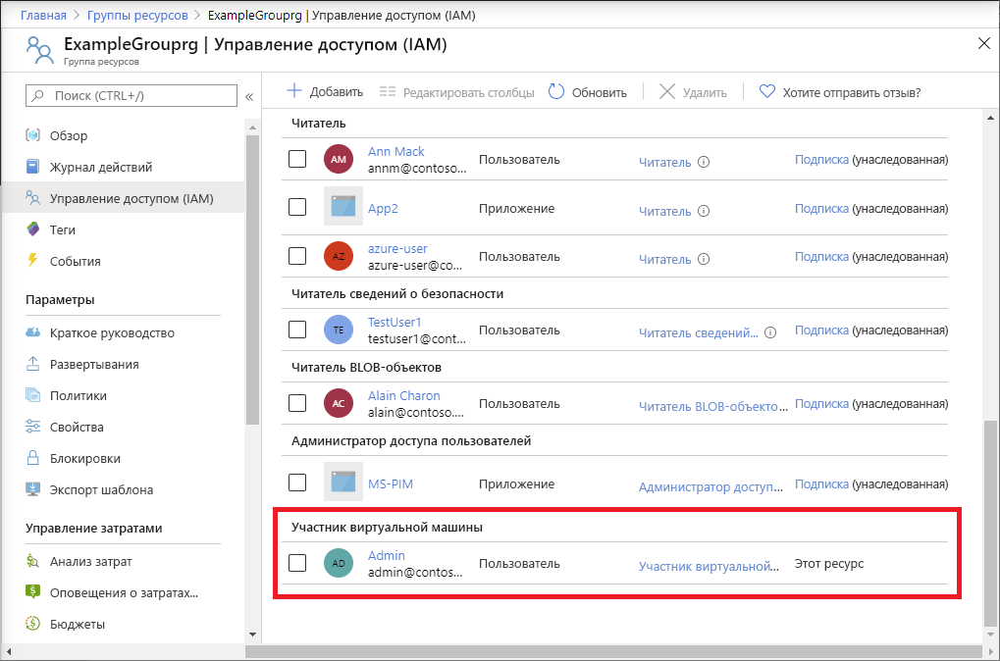

# <a name="quickstart-add-an-azure-role-assignment-using-an-azure-resource-manager-template"></a>Краткое руководство. Добавление назначения роли Azure с помощью шаблона Azure Resource Manager

[Управление доступом на основе ролей Azure (Azure RBAC)](overview.md) — это способ управления доступом к ресурсам в Azure. В этом кратком руководстве показано, как создать группу ресурсов и предоставить пользователю доступ для создания и администрирования виртуальных машин в группе ресурсов. В этом кратком руководстве для предоставления доступа используется шаблон Resource Manager.

[!INCLUDE [About Azure Resource Manager](../../includes/resource-manager-quickstart-introduction.md)]

Если у вас еще нет подписки Azure, [создайте бесплатную учетную запись](https://azure.microsoft.com/free/?WT.mc_id=A261C142F), прежде чем начинать работу.

## <a name="prerequisites"></a>Предварительные требования

Для добавления назначений ролей требуются следующие разрешения:

* `Microsoft.Authorization/roleAssignments/write` и `Microsoft.Authorization/roleAssignments/delete`, такие как [Администратор доступа пользователей](built-in-roles.md#user-access-administrator) или [Владелец](built-in-roles.md#owner).

## <a name="create-a-role-assignment"></a>Создание назначения роли

Чтобы назначить роль, необходимо указать три элемента: субъект безопасности, определение роли и область действия. В этом кратком руководстве субъектом безопасности являетесь вы или другой пользователь в каталоге, определением роли — роль [Участник виртуальных машин](built-in-roles.md#virtual-machine-contributor), а областью действия — указанная группа ресурсов.

### <a name="review-the-template"></a>Изучение шаблона

Шаблон, используемый в этом кратком руководстве, взят из [шаблонов быстрого запуска Azure](https://azure.microsoft.com/resources/templates/101-rbac-builtinrole-resourcegroup/). Шаблон содержит три параметра и раздел resources. Обратите внимание, что в разделе resources есть три элемента назначения роли: субъект безопасности, определение роли и область действия. 

:::code language="json" source="~/quickstart-templates/101-rbac-builtinrole-resourcegroup/azuredeploy.json" highlight="30-32":::

В шаблоне определен следующий ресурс:

- [Microsoft.Authorization/roleAssignments](/azure/templates/Microsoft.Authorization/roleAssignments)

### <a name="deploy-the-template"></a>Развертывание шаблона

1. Войдите на [портал Azure](https://portal.azure.com).

1. Определите адрес электронной почты, связанный с вашей подпиской Azure. Или определите адрес электронной почты другого пользователя в каталоге.

1. Откройте Azure Cloud Shell для PowerShell.

1. Скопируйте и вставьте следующий скрипт в Cloud Shell.

    ```azurepowershell
    $resourceGroupName = Read-Host -Prompt "Enter a resource group name (i.e. ExampleGrouprg)"
    $emailAddress = Read-Host -Prompt "Enter an email address for a user in your directory"
    $location = Read-Host -Prompt "Enter a location (i.e. centralus)"
    
    $roleAssignmentName = New-Guid
    $principalId = (Get-AzAdUser -Mail $emailAddress).id
    $roleDefinitionId = (Get-AzRoleDefinition -name "Virtual Machine Contributor").id
    $templateUri = "https://raw.githubusercontent.com/Azure/azure-quickstart-templates/master/101-rbac-builtinrole-resourcegroup/azuredeploy.json"
    
    New-AzResourceGroup -Name $resourceGroupName -Location $location
    New-AzResourceGroupDeployment -ResourceGroupName $resourceGroupName -TemplateUri $templateUri -roleAssignmentName $roleAssignmentName -roleDefinitionID $roleDefinitionId -principalId $principalId
    ```

1. Введите имя группы ресурсов, например ExampleGrouprg.

1. Введите адрес электронной почты для пользователя в каталоге.

1. Введите расположение группы ресурсов, например centralus.

1. При необходимости нажмите клавишу ВВОД, чтобы выполнить команду New-AzResourceGroupDeployment.

    Команда [New-AzResourceGroup](/powershell/module/az.resources/new-azresourcegroup) создает новую группу ресурсов, а команда [New-AzResourceGroupDeployment](/powershell/module/az.resources/new-azresourcegroupdeployment) развертывает шаблон для добавления назначения роли.

    Выходные данные должны иметь следующий вид.

    ```azurepowershell
    PS> New-AzResourceGroupDeployment -ResourceGroupName $resourceGroupName -TemplateUri $templateUri -roleAssignmentName $roleAssignmentName -roleDefinitionID $roleDefinitionId -principalId $principalId
    
    DeploymentName          : azuredeploy
    ResourceGroupName       : ExampleGrouprg
    ProvisioningState       : Succeeded
    Timestamp               : 5/22/2020 9:01:30 PM
    Mode                    : Incremental
    TemplateLink            :
                              Uri            : https://raw.githubusercontent.com/Azure/azure-quickstart-templates/master/101-rbac-builtinrole-resourcegroup/azuredeploy.json
                              ContentVersion : 1.0.0.0
    
    Parameters              :
                              Name                  Type                       Value
                              ====================  =========================  ==========
                              roleAssignmentName    String                     {roleAssignmentName}
                              roleDefinitionID      String                     9980e02c-c2be-4d73-94e8-173b1dc7cf3c
                              principalId           String                     {principalId}
    
    Outputs                 :
    DeploymentDebugLogLevel :
    ```

## <a name="review-deployed-resources"></a>Просмотр развернутых ресурсов

1. На портале Azure откройте созданную группу ресурсов.

1. В меню слева щелкните **Управление доступом (IAM)** .

1. Перейдите на вкладку **Назначения ролей**.

1. Убедитесь, что роль **Участник виртуальных машин** назначена указанному пользователю.

   

## <a name="clean-up-resources"></a>Очистка ресурсов

Чтобы удалить назначение ролей и созданную группу ресурсов, сделайте следующее.

1. Скопируйте и вставьте следующий скрипт в Cloud Shell.

    ```azurepowershell
    $emailAddress = Read-Host -Prompt "Enter the email address of the user with the role assignment to remove"
    $resourceGroupName = Read-Host -Prompt "Enter the resource group name to remove (i.e. ExampleGrouprg)"
    
    $principalId = (Get-AzAdUser -Mail $emailAddress).id
    
    Remove-AzRoleAssignment -ObjectId $principalId -RoleDefinitionName "Virtual Machine Contributor" -ResourceGroupName $resourceGroupName
    Remove-AzResourceGroup -Name $resourceGroupName
    ```
    
1. Введите адрес электронной почты пользователя с назначением роли для удаления.

1. Введите имя группы ресурсов для удаления, например ExampleGrouprg.

1. При необходимости нажмите клавишу ВВОД, чтобы выполнить команду Remove-AzResourceGroup.

1. Введите **Y**, чтобы подтвердить удаление указанной группы ресурсов.

## <a name="next-steps"></a>Дальнейшие действия

> [!div class="nextstepaction"]
> [Руководство. Предоставление доступа пользователям к ресурсам Azure с помощью Azure PowerShell](tutorial-role-assignments-user-powershell.md)