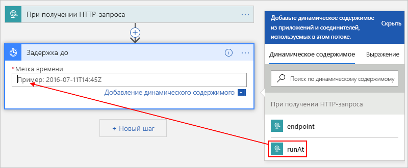
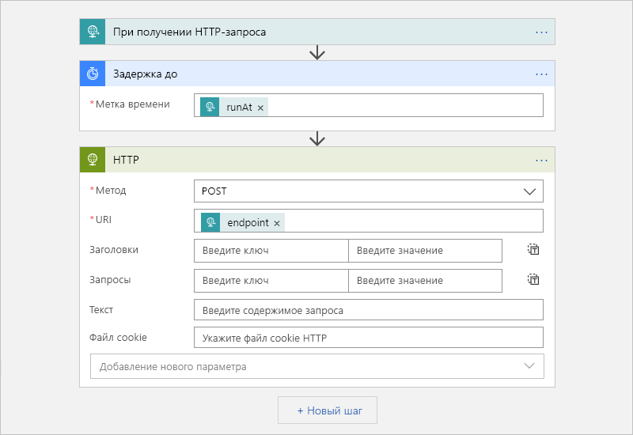

# <a name="migrate-azure-scheduler-jobs-to-azure-logic-apps"></a>Перемещение заданий из планировщика Azure в Azure Logic Apps

> [!IMPORTANT]
> Поддержка планировщика Azure [прекращается](../logic-apps/logic-apps-overview.md). Вместо него будет использоваться [Azure Logic Apps](#retire-date). Чтобы продолжить работу с настроенными в планировщике задачами, как можно скорее перейдите на Azure Logic Apps, последовав инструкциям в данной статье. 
>
> Планировщик больше не доступен на портале Azure, но [REST API](/rest/api/scheduler) и [командлеты PowerShell Планировщика Azure](scheduler-powershell-reference.md) можно использовать и дальше для управления заданиями и коллекциями заданий.

В этой статье показано, как можно планировать одноразовые и повторяющиеся задания, создавая автоматические рабочие процессы в Azure Logic Apps вместо планировщика Azure. Когда вы создаете запланированные задания в Logic Apps, вы получаете следующие преимущества:

* Создавайте свои задания с помощью визуального конструктора и [готовых соединителей](../connectors/apis-list.md) из сотен служб, таких как хранилище BLOB-объектов Azure, служебная шина Azure, Office 365 Outlook и SAP.

* Управляйте каждым запланированным рабочим процессом как ресурсом Azure первого класса. Вам не нужно беспокоиться о концепции *коллекции заданий*, потому что каждое приложение логики представляет собой отдельный ресурс Azure.

* Несколько одноразовых заданий можно запускать с помощью единого приложения логики.

* Установите расписания, поддерживающие часовые пояса и автоматически переходящие на летнее время (DST).

Расширяйте свои знания, прочитав статью [Что такое Azure Logic Apps?](../logic-apps/logic-apps-overview.md) или попробовав создать свое первое приложение логики с помощью этого краткого руководства: [Создание приложения логики](../logic-apps/quickstart-create-first-logic-app-workflow.md).

## <a name="prerequisites"></a>Предварительные требования

* Подписка Azure. Если у вас еще нет подписки Azure, [зарегистрируйтесь для получения бесплатной учетной записи Azure](https://azure.microsoft.com/free/).

* Чтобы активировать приложение логики с помощью HTTP-запросов, используйте средство, такое как [классическое приложение Postman](https://www.getpostman.com/apps).

## <a name="migrate-by-using-a-script"></a>Миграция с помощью скрипта

Каждое задание планировщика является уникальным, поэтому универсального средства для переноса заданий планировщика в Azure Logic Apps не существует. Но можно [изменить этот сценарий](https://github.com/Azure/logicapps/tree/master/scripts/scheduler-migration) в соответствии с конкретными потребностями.

## <a name="schedule-one-time-jobs"></a>Планирование одноразовых заданий

Вы можете запускать несколько одноразовых заданий с помощью единого приложения логики.

1. На [портале Azure](https://portal.azure.com) создайте пустое приложение логики в конструкторе приложений логики.

   Основные шаги приведены в [Кратком руководстве. Создание первого автоматизированного рабочего процесса с помощью Azure Logic Apps на портале Azure](../logic-apps/quickstart-create-first-logic-app-workflow.md).

1. В поле поиска введите `when a http request`, чтобы найти триггер запросов. В списке триггеров выберите триггер: **При получении HTTP-запроса**

   

1. Для триггера запросов можно дополнительно предоставить схему JSON, которая помогает конструктору приложений логики понять структуру входных данных входящего запроса к триггеру запросов и облегчить выбор выходных данных далее в рабочем процессе.

   Введите схему в поле **Схема JSON текста запроса**, например:

   

   Если у вас нет схемы, но у вас есть пример полезных данных в формате JSON, можно создать схему на основе полезных данных.

   1. В триггере запросов выберите **Использовать пример полезной нагрузки, чтобы создать схему**.

   1. В разделе **Введение или вставка примера полезных данных JSON** предоставьте пример полезных данных и выберите **Готово**, например:

      

      ```json
      {
         "runat": "2012-08-04T00:00Z",
         "endpoint": "https://www.bing.com"
      }
      ```

1. В разделе триггера щелкните **Следующий шаг**.

1. В поле поиска введите `delay until` в качестве фильтра. В списке действий выберите действие **Задержка до**

   Это действие приостанавливает рабочий процесс вашего приложения логики до указанной даты и времени.

   

1. Введите отметку времени, когда требуется запустить рабочий процесс приложения логики.

   Когда вы щелкаете внутри поля **Метка времени**, появляется список динамического содержимого, и при желании вы можете выбрать выходные данные из триггера.

   

1. Добавьте любые другие действия, которые вы хотите запустить, выбрав из [сотен готовых к использованию соединителей](../connectors/apis-list.md).

   Например, вы можете включить действие HTTP, которое отправляет запрос на URL-адрес, или действия, которые работают с очередями хранения, очередями или темами служебной шины:

   

1. Сохраните приложение логики, когда закончите.

   

   Когда вы впервые сохраняете свое приложение логики, URL-адрес конечной точки для триггера запросов вашего приложения появляется в поле **URL-адрес HTTP POST**. Если вы хотите вызвать приложение логики и отправить в него входные данные для обработки, используйте в качестве назначения вызова этот URL-адрес.

   

1. Скопируйте и сохраните этот URL-адрес конечной точки, чтобы впоследствии вы могли вручную отправить запрос, который запускает ваше приложение логики.

## <a name="start-a-one-time-job"></a>Запуск одноразового задания

Чтобы вручную запустить или активировать одноразовое задание, отправьте вызов на адрес конечной точки для триггера запроса приложения логики. В этом вызове укажите входные или полезные данные для отправки, которые вы могли описать ранее, указав схему.

Например, используя приложение Postman, вы можете создать запрос POST с параметрами, как в этом примере, а затем выбрать **Отправить**, чтобы выполнить запрос.

| Метод запроса | URL-адрес | Текст | Заголовки |
|----------------|-----|------|---------|
| **POST** | <*endpoint-URL*> | **raw** (Без форматирования) <p>**JSON (application/json)** <p>В поле **raw** (Без форматирования) введите полезные данные, которые нужно отправить в запросе. <p>**Примечание.** Этот параметр автоматически настраивает значения **Headers** (Заголовки). | **Ключ**: Content-Type <br>**Значение**: application/json |
|||||


После отправки вызова ответ из приложения логики появится в поле **raw** (Без форматирования) на вкладке **Body** (Текст). 

<a name="workflow-run-id"></a>

> [!IMPORTANT]
>
> Если вы хотите отменить задание позже, выберите вкладку **Headers** (Заголовки). Найдите и скопируйте значение заголовка **x-ms-workflow-run-id** в ответе. 
>
> 

## <a name="cancel-a-one-time-job"></a>Отмена одноразового задания

В Logic Apps каждое одноразовое задание выполняется как отдельный экземпляр запуска приложения логики. Чтобы отменить одноразовое задание, можно использовать команды [отмены выполнений рабочего процесса](https://docs.microsoft.com/rest/api/logic/workflowruns/cancel) в REST API Logic Apps. Когда вы отправляете вызов триггеру, укажите [идентификатор выполнения рабочего процесса](#workflow-run-id).

## <a name="schedule-recurring-jobs"></a>Планирование повторяющихся заданий

1. На [портале Azure](https://portal.azure.com) создайте пустое приложение логики в конструкторе приложений логики.

   Основные шаги приведены в [Кратком руководстве. Создание первого автоматизированного рабочего процесса с помощью Azure Logic Apps на портале Azure](../logic-apps/quickstart-create-first-logic-app-workflow.md).

1. В поле поиска введите слово "повторение" в качестве фильтра. В списке триггеров выберите триггер: **Периодичность**

   

1. При желании можно настроить более расширенное расписание.

   

   Дополнительные сведения о расширенных параметрах планирования см. в разделе [Создание и выполнение повторяющихся задач и рабочих процессов с помощью Azure Logic Apps](../connectors/connectors-native-recurrence.md).

1. Добавьте другие действия, которые вы хотите запустить, выбрав их из [сотен готовых к использованию](../connectors/apis-list.md). В разделе триггера щелкните **Следующий шаг**. Найдите и выберите нужные действия.

   Например, вы можете включить действие HTTP, которое отправляет запрос на URL-адрес, или действия, которые работают с очередями хранения, очередями или темами служебной шины:

   

1. Сохраните приложение логики, когда закончите.

   

## <a name="advanced-setup"></a>Расширенная настройка

Здесь вы можете настроить свои задания.

### <a name="retry-policy"></a>Политика повтора

Чтобы контролировать способ повторного запуска действия в вашем приложении логики, когда происходят прерывистые сбои, вы можете установить [политику повтора](../logic-apps/logic-apps-exception-handling.md#retry-policies) в параметрах каждого действия, например:

1. Откройте меню многоточия действия ( **...** ) и выберите пункт **Параметры**.

   

1. Выберите нужную политику повтора. Дополнительные сведения см. в разделе [Политики повтора](../logic-apps/logic-apps-exception-handling.md#retry-policies).

   

## <a name="handle-exceptions-and-errors"></a>Обработка ошибок и исключений

В планировщике Azure, если действие по умолчанию не выполняется, вы можете запустить альтернативное действие, которое учитывает условие ошибки. В Azure Logic Apps вы можете выполнить ту же задачу.

1. В конструкторе приложений логики над действием, которое вы хотите обработать, переместите указатель на стрелку между шагами и выберите **Добавить параллельную ветвь**.

   

1. Найдите и выберите действие, которое нужно использовать в качестве альтернативного действия.

   

1. В альтернативном действии откройте многоточие ( **...** ) и выберите пункт **Настроить последующий запуск**.

   

1. Снимите флажок свойства **выполнено**. Выберите эти свойства: **завершился сбоем**, **пропущен** и **прекращено по таймауту**.

   

1. По завершении нажмите кнопку **Готово**.

Дополнительные сведения об обработке исключений см. в разделе [Перехват и обработка ошибок с помощью свойства RunAfter](../logic-apps/logic-apps-exception-handling.md#control-run-after-behavior).

## <a name="faq"></a>ВОПРОСЫ И ОТВЕТЫ

<a name="retire-date"></a>

**Вопрос**. Когда прекращается поддержка планировщика Azure? <br>
**Ответ**. Прекращение поддержки планировщика Azure планируется 31 декабря 2019 г. Важные действия, которые необходимо выполнить до этой даты, и подробное расписание см. в статье [Дата прекращения поддержки планировщика отложена до 31 декабря 2019 г.](https://azure.microsoft.com/updates/extending-retirement-date-of-scheduler/). Общие сведения об обновлениях см. в статье [Обновления Azure — планировщик](https://azure.microsoft.com/updates/?product=scheduler).

**Вопрос**. Что произойдет с моими коллекциями заданий и заданиями планировщика после прекращения поддержки этой службы? <br>
**Ответ**. Все коллекции заданий и задания планировщика будут удалены из системы.

**Вопрос**. Нужно ли выполнить резервное копирование или какие-либо другие задачи перед переносом заданий планировщика в Logic Apps? <br>
**Ответ**. Рекомендуется всегда создавать резервную копию своей работы. Убедитесь, что созданные вами приложения логики работают, как ожидалось, прежде чем удалять или отключать задания планировщика.

**Вопрос**. Есть ли средство, которое поможет перенести задания из планировщика в Logic Apps? <br>
**Ответ**. Каждое задание планировщика уникально, поэтому универсального средства не существует. Однако, в зависимости от потребностей, возможно [модифицировать этот скрипт, чтобы перенести задания планировщика Azure в Azure Logic Apps](https://github.com/Azure/logicapps/tree/master/scripts/scheduler-migration).

**Вопрос**. Где я могу получить поддержку в переносе своих заданий планировщика? <br>
**Ответ**. Ниже приведены некоторые способы получения поддержки.

**Портал Azure**

Если ваша подписка Azure имеет платный план поддержки, вы можете создать запрос в службу технической поддержки на портале Azure. В противном случае вы можете выбрать другой вариант поддержки.

1. В главном меню на [портале Azure](https://portal.azure.com) выберите **Справка + поддержка**.

1. Выберите **Новый запрос в службу поддержки** в меню **Поддержка**. Укажите следующие сведения о своем запросе.

   | Свойство | Значение |
   |---------|-------|
   | **Тип проблемы** | **Технические требования** |
   | **Подписка** | <*ваша_подписка_Azure*> |
   | **Служба** | В разделе **Мониторинг и управление** выберите **Планировщик**. Если вы не можете найти **Планировщик**, сначала выберите **Все службы**. |
   ||| 

1. Выберите нужный вариант поддержки. Если у вас есть оплаченный план поддержки, выберите **Далее**.

**Сообщество**

* [Страница Майкрософт с вопросами и ответами об Azure Logic Apps](https://docs.microsoft.com/answers/topics/azure-logic-apps.html)
* [Stack Overflow](https://stackoverflow.com/questions/tagged/azure-scheduler)

## <a name="next-steps"></a>Дальнейшие действия

* [Создание регулярно выполняющихся рабочих процессов и задач с помощью Azure Logic Apps](../connectors/connectors-native-recurrence.md)