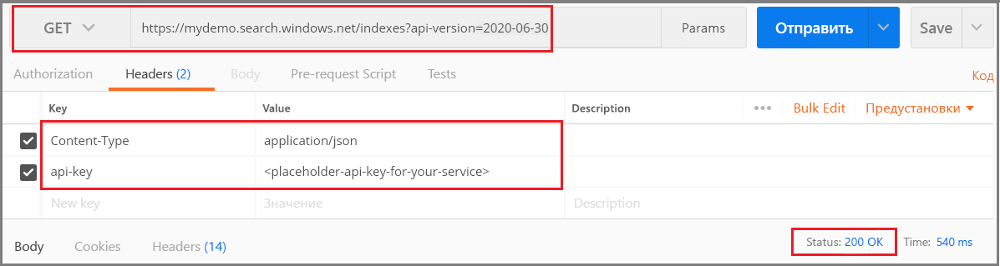

# <a name="tutorial-extract-text-and-structure-from-json-blobs-in-azure-using-rest-apis-azure-cognitive-search"></a>Руководство по Извлечение текста и структуры из больших двоичных объектов JSON в Azure с помощью интерфейсов REST API (Когнитивный поиск Azure)

Если у вас есть неструктурированное текстовое или визуальное содержимое в хранилище BLOB-объектов Azure, [конвейер обогащения с помощью ИИ](cognitive-search-concept-intro.md) поможет вам извлекать из него информацию и создавать содержимое, применимое для сценариев полнотекстового поиска и интеллектуального анализа. Хотя конвейер может обрабатывать файлы изображений (JPG, PNG, TIFF), в этом учебнике внимание уделяется только текстовому содержимому, созданию полей на основе распознавания языка и текстовой аналитики. Все это позволит вам использовать информацию в запросах, аспектах и фильтрах.

> [!div class="checklist"]
> * Начните работу с целых документов (неструктурированный текст), таких как PDF, MD, DOCX и PPTX, размещенных в хранилище BLOB-объектов Azure.
> * Определите конвейер, который извлекает текст, а также распознает язык, сущности и ключевые фразы.
> * Определите индекс для хранения выходных данных (необработанное содержимое и созданные конвейером пары "имя — значение").
> * Выполните конвейер, чтобы начать преобразования и анализ, а также создать и загрузить индекс.
> * Изучите результаты с помощью полнотекстового поиска и расширенного синтаксиса запросов.

Для выполнения этого пошагового руководства потребуется несколько служб, а также [классическое приложение Postman](https://www.getpostman.com/) или другое средство веб-тестирования для вызовов REST API. 

Если у вас еще нет подписки Azure, [создайте бесплатную учетную запись Azure](https://azure.microsoft.com/free/?WT.mc_id=A261C142F), прежде чем начинать работу.

## <a name="download-files"></a>Скачивание файлов

1. Откройте эту [папку OneDrive](https://1drv.ms/f/s!As7Oy81M_gVPa-LCb5lC_3hbS-4) и щелкните **Скачать** вверху слева, чтобы скопировать файлы на локальный компьютер. 

1. Щелкните ZIP-файл правой кнопкой мыши и выберите **Извлечь все**. Доступно 14 файлов разных типов. В этом примере вам потребуются семь из них.

## <a name="1---create-services"></a>1\. Создание служб

В этом пошаговом руководстве используются Когнитивный поиск Azure для индексирования и запросов, Cognitive Services для обогащения искусственного интеллекта и хранилище BLOB-объектов Azure для предоставления данных. Желательно создать все три службы в одном регионе и группе ресурсов, чтобы упростить взаимодействие и управляемость. В реальной системе учетная запись хранения Azure может находиться в любом регионе.

### <a name="start-with-azure-storage"></a>Служба хранилища Azure

1. [Войдите на портал Azure](https://portal.azure.com/) и щелкните **+ Создать ресурс**.

1. Выполните поиск по строке *учетная запись хранения* и выберите "Учетная запись хранения Microsoft".

   

1. На вкладке "Основные сведения" нужно ввести следующие сведения. Сохраните значения по умолчанию для остальных параметров.

   + **Группа ресурсов**. Вы можете выбрать существующую группу ресурсов или создать новую, но для всех служб это должна быть одна и та же группа для совместного управления.

   + **Имя учетной записи хранения.** Если вы ожидаете, что у вас будет несколько ресурсов одного типа, используйте имена, которые будут четко определять тип и регион, например *blobstoragewestus*. 

   + **Расположение.** Желательно выбрать то же расположение, которое использовалось для Когнитивного поиска Azure и Cognitive Services. При использовании одного расположения плата за трафик не взимается.

   + **Тип учетной записи.** Выберите значение по умолчанию *StorageV2 (общего назначения версии 2)* .

1. Щелкните **Просмотреть и создать**, чтобы создать службу.

1. По завершении процесса щелкните **Перейти к ресурсу** чтобы открыть страницу со сводкой.

1. Щелкните службу **Большие двоичные объекты**.

1. Щелкните **+ Контейнер**, чтобы создать контейнер, и присвойте ему имя *cog-search-demo*.

1. Выберите *cog-search-demo* и щелкните **Отправить**, чтобы открыть папку с сохраненными файлами для скачивания. Выберите все файлы, не являющиеся изображениями. Их должно быть семь. Щелкните **ОК**, чтобы начать отправку.

   

1. Прежде чем выйти из службы хранилища Azure, получите строку подключения для создания подключения в Когнитивном поиске Azure. 

   1. Вернитесь на страницу со сводкой об учетной записи хранения (в качестве примера мы использовали *blobstragewestus*). 
   
   1. В области навигации слева выберите **Ключи доступа** и скопируйте одну из строк подключения. 

   Строка подключения — это URL-адрес в следующем формате:

      ```http
      DefaultEndpointsProtocol=https;AccountName=cogsrchdemostorage;AccountKey=<your account key>;EndpointSuffix=core.windows.net
      ```

1. Сохраните эту строку подключения в Блокноте. Она понадобится позже при настройке подключения к источнику данных.

### <a name="cognitive-services"></a>Cognitive Services

Обогащение ИИ основано на платформе Cognitive Services, которая включает службы "Анализ текста" для обработки естественного языка и "Компьютерное зрение" для обработки изображений. Если бы вы создавали реальный прототип или проект, на этом этапе нужно было бы создать Cognitive Services (в том же регионе, что и Когнитивный поиск Azure) для связывания с операциями индексирования.

Но для нашего примера подготовку ресурсов можно пропустить, так как Когнитивный поиск Azure может подключаться к Cognitive Services в фоновом режиме и предоставляет 20 бесплатных транзакций для каждого выполнения индексатора. В примере из этого руководства используется всего семь транзакций. Это значит, что нам достаточно уровня "Бесплатный". Для крупных проектов вам, скорее всего, нужно будет подготовить Cognitive Services на уровне S0 с оплатой по мере использования. См. сведения о [подключении Cognitive Services](cognitive-search-attach-cognitive-services.md).

### <a name="azure-cognitive-search"></a>Когнитивный поиск Azure

Третий компонент — Когнитивный поиск Azure, который вы можете [создать на портале](search-create-service-portal.md). Для выполнения действий в этом пошаговом руководстве можно использовать уровень "Бесплатный". 

Как и с хранилищем BLOB-объектов Azure, не забудьте сохранить ключ доступа. Позже, когда вы начнете структурировать запросы, адрес конечной точки и административный ключ интерфейса нужно будет указывать в каждом запросе для проверки подлинности.

### <a name="get-an-admin-api-key-and-url-for-azure-cognitive-search"></a>Получение ключа API и URL-адреса конечной точки для администрирования Когнитивного поиска Azure

1. [Войдите на портал Azure](https://portal.azure.com/) и на странице **Обзор** для службы поиска получите ее имя. Имя службы можно проверить, просмотрев URL-адрес конечной точки. Если URL-адрес конечной точки имеет вид `https://mydemo.search.windows.net`, значит служба называется `mydemo`.

2. В разделе **Параметры** > **Ключи** получите ключ администратора, чтобы обрести полные права на службу. Существуют два взаимозаменяемых ключа администратора, предназначенных для обеспечения непрерывности бизнес-процессов на случай, если вам потребуется сменить один из них. Вы можете использовать первичный или вторичный ключ для выполнения запросов на добавление, изменение и удаление объектов.

    Получите также ключ запроса. Мы рекомендуем создавать запросы с доступом только для чтения.


Для выполнения любого запроса к службе нужно включить ключ API в заголовок. Действительный ключ устанавливает для каждого запроса отношения доверия между приложением, которое отправляет запрос, и службой, которая его обрабатывает.

## <a name="2---set-up-postman"></a>2\. Настройка Postman

Запустите Postman и настройте HTTP-запрос. Если вы не работали с этим инструментом, изучите статью о [работе с REST API службы "Когнитивный поиск Azure" с помощью Postman](search-get-started-postman.md).

Методы запроса, используемые в этом руководстве: **POST**, **PUT** и **GET**. Вы примените эти методы для четырех вызовов API к службе поиска, которые создадут источник данных, набор навыков, индекс и индексатор.

В разделе "Заголовки" присвойте параметру Content-type значение `application/json`, а в параметре `api-key` сохраните значение ключа администрирования для службы "Когнитивный поиск Azure". Единожды выполнив настройку заголовков, вы сможете применять их для всех запросов в этом руководстве.

  

## <a name="3---create-the-pipeline"></a>3\. Создание конвейера

В Когнитивном поиске Azure обработка ИИ выполняется во время индексирования (или приема данных). В этой части пошагового руководства описано, как создать четыре объекта: источник данных, определение индекса, набор навыков и индексатор. 

### <a name="step-1-create-a-data-source"></a>Шаг 1. Создание источника данных

[Объект источника данных](https://docs.microsoft.com/rest/api/searchservice/create-data-source) предоставляет строку подключения к контейнеру больших двоичных объектов, который содержит файлы.

1. Используйте запрос **POST** и следующий URL-адрес, заменив YOUR-SERVICE-NAME фактическим именем службы.

   ```http
   https://[YOUR-SERVICE-NAME].search.windows.net/datasources?api-version=2019-05-06
   ```

1. В **текст** запроса поместите следующее определение JSON, заменив в нем `connectionString` фактической строкой подключения к учетной записи хранения. 

   Не забудьте также изменить имя контейнера. На предыдущем шаге мы предложили назвать этот контейнер cog-search-demo.

    ```json
    {
      "name" : "cog-search-demo-ds",
      "description" : "Demo files to demonstrate cognitive search capabilities.",
      "type" : "azureblob",
      "credentials" :
      { "connectionString" :
        "DefaultEndpointsProtocol=https;AccountName=<YOUR-STORAGE-ACCOUNT>;AccountKey=<YOUR-ACCOUNT-KEY>;"
      },
      "container" : { "name" : "<YOUR-BLOB-CONTAINER-NAME>" }
    }
    ```
1. Отправьте запрос. Вы увидите код состояния 201, подтверждающий успешное выполнение. 

Если вы получили ошибку 403 или 404, проверьте структуру запроса: `api-version=2019-05-06` должен находиться в конечной точке, `api-key` должен находиться в заголовке после `Content-Type`, и его значение должно быть действительным для службы поиска. Вы можете применить к документу JSON средство проверки JSON в Интернете, чтобы проверить синтаксис. 

### <a name="step-2-create-a-skillset"></a>Шаг 2. Создание набора навыков

[Объект набора навыков](https://docs.microsoft.com/rest/api/searchservice/create-skillset) — это набор шагов обогащения, которые применяются к содержимому. 

1. Используйте запрос **PUT** и следующий URL-адрес, заменив YOUR-SERVICE-NAME фактическим именем службы.

    ```http
    https://[YOUR-SERVICE-NAME].search.windows.net/skillsets/cog-search-demo-ss?api-version=2019-05-06
    ```

1. В **текст** запроса скопируйте представленное ниже определение JSON. Набор навыков содержит перечисленные ниже встроенные навыки.

   | Навык                 | ОПИСАНИЕ    |
   |-----------------------|----------------|
   | [Распознавание сущностей](cognitive-search-skill-entity-recognition.md) | Извлекает имена людей, а также названия организаций и расположений из содержимого в контейнере больших двоичных объектов. |
   | [Распознавание языка](cognitive-search-skill-language-detection.md). | Определяет язык содержимого. |
   | [Разделение текста](cognitive-search-skill-textsplit.md)  | Разбивает содержимое большого объема на более мелкие фрагменты данных перед вызовом метода извлечения ключевых фраз. Этот метод принимает входные данные объемом 50 000 символов или меньше. Некоторые примеры файлов следует разделить, чтобы удовлетворить это ограничение. |
   | [Извлечение ключевых фраз](cognitive-search-skill-keyphrases.md). | Извлекает ключевые фразы, которые встречаются чаще всего. |

   Каждый навык выполняется в содержимом документа. Во время обработки служба "Когнитивный поиск Azure" разбивает каждый документ для чтения содержимого из разных форматов файлов. Найденный текст в исходном файле помещается в созданное поле ```content```, по одному для каждого документа. Входные данные принимают следующий вид: ```"/document/content"```.

   Мы используем навык разделения текста для разбиения больших файлов на страницы, поэтому контекстом для навыка извлечения ключевых фраз будет ```"document/pages/*"``` (для каждой страницы в документе), а не ```"/document/content"```.

    ```json
    {
      "description": "Extract entities, detect language and extract key-phrases",
      "skills":
      [
        {
          "@odata.type": "#Microsoft.Skills.Text.EntityRecognitionSkill",
          "categories": [ "Person", "Organization", "Location" ],
          "defaultLanguageCode": "en",
          "inputs": [
            { "name": "text", "source": "/document/content" }
          ],
          "outputs": [
            { "name": "persons", "targetName": "persons" },
            { "name": "organizations", "targetName": "organizations" },
            { "name": "locations", "targetName": "locations" }
          ]
        },
        {
          "@odata.type": "#Microsoft.Skills.Text.LanguageDetectionSkill",
          "inputs": [
            { "name": "text", "source": "/document/content" }
          ],
          "outputs": [
            { "name": "languageCode", "targetName": "languageCode" }
          ]
        },
        {
          "@odata.type": "#Microsoft.Skills.Text.SplitSkill",
          "textSplitMode" : "pages",
          "maximumPageLength": 4000,
          "inputs": [
            { "name": "text", "source": "/document/content" },
            { "name": "languageCode", "source": "/document/languageCode" }
          ],
          "outputs": [
            { "name": "textItems", "targetName": "pages" }
          ]
        },
        {
          "@odata.type": "#Microsoft.Skills.Text.KeyPhraseExtractionSkill",
          "context": "/document/pages/*",
          "inputs": [
            { "name": "text", "source": "/document/pages/*" },
            { "name":"languageCode", "source": "/document/languageCode" }
          ],
          "outputs": [
            { "name": "keyPhrases", "targetName": "keyPhrases" }
          ]
        }
      ]
    }
    ```
    Графическое представление набора навыков показано ниже. 

    

1. Отправьте запрос. Postman должен вернуть код состояния 201, подтверждающий успешное выполнение. 

> [!NOTE]
> Выходные данные могут быть сопоставлены с индексом, используемым в качестве входных данных для нисходящего навыка, или к обоим, как в случае с кодом языка. В индексе код языка полезен для фильтрации. В качестве входных данных код языка используется навыками анализа текста, чтобы указать лингвистические правила для разбивки слов. Общие сведения о наборах навыков см. в статье [How to create a skillset in an enrichment pipeline](cognitive-search-defining-skillset.md) (Способ создания набора навыков в конвейере обогащения).

### <a name="step-3-create-an-index"></a>Шаг 3. Создание индекса

[Индекс](https://docs.microsoft.com/rest/api/searchservice/create-index) предоставляет схему для создания физического выражения содержимого в инвертированных индексах и других конструкциях в Когнитивном поиске Azure. Самым крупным компонентом индекса является коллекция полей, где указаны тип данных и атрибуты для определения содержимого и поведения в Когнитивном поиске Azure.

1. Используйте запрос **POST** и следующий URL-адрес, заменив YOUR-SERVICE-NAME фактическим именем службы, чтобы присвоить индексу имя.

   ```http
   https://[YOUR-SERVICE-NAME].search.windows.net/indexes/cog-search-demo-idx?api-version=2019-05-06
   ```

1. В **текст** запроса скопируйте представленное ниже определение JSON. Поле `content` содержит сам документ. Дополнительные поля `languageCode`, `keyPhrases` и `organizations` представляют новые сведения (поля и значения), которые создаются набором навыков.

    ```json
    {
      "fields": [
        {
          "name": "id",
          "type": "Edm.String",
          "key": true,
          "searchable": true,
          "filterable": false,
          "facetable": false,
          "sortable": true
        },
        {
          "name": "metadata_storage_name",
          "type": "Edm.String",
          "searchable": false,
          "filterable": false,
          "facetable": false,
          "sortable": false
        },
        {
          "name": "content",
          "type": "Edm.String",
          "sortable": false,
          "searchable": true,
          "filterable": false,
          "facetable": false
        },
        {
          "name": "languageCode",
          "type": "Edm.String",
          "searchable": true,
          "filterable": false,
          "facetable": false
        },
        {
          "name": "keyPhrases",
          "type": "Collection(Edm.String)",
          "searchable": true,
          "filterable": false,
          "facetable": false
        },
        {
          "name": "persons",
          "type": "Collection(Edm.String)",
          "searchable": true,
          "sortable": false,
          "filterable": true,
          "facetable": true
        },
        {
          "name": "organizations",
          "type": "Collection(Edm.String)",
          "searchable": true,
          "sortable": false,
          "filterable": true,
          "facetable": true
        },
        {
          "name": "locations",
          "type": "Collection(Edm.String)",
          "searchable": true,
          "sortable": false,
          "filterable": true,
          "facetable": true
        }
      ]
    }
    ```

1. Отправьте запрос. Postman должен вернуть код состояния 201, подтверждающий успешное выполнение. 

### <a name="step-4-create-and-run-an-indexer"></a>Шаг 4. Создание и запуск индексатора

[Индексатор](https://docs.microsoft.com/rest/api/searchservice/create-indexer) управляет работой конвейера. Три компонента, которые вы создали ранее (источник данных, набор навыков и индекс) предоставляют входные данные для индексатора. Именно создание индексатора в Когнитивном поиске Azure является событием, которое запускает весь конвейер. 

1. Используйте запрос **POST** и следующий URL-адрес, заменив YOUR-SERVICE-NAME фактическим именем службы, чтобы присвоить индексатору имя.

   ```http
   https://[servicename].search.windows.net/indexers/cog-search-demo-idxr?api-version=2019-05-06
   ```

1. В **текст** запроса скопируйте представленное ниже определение JSON. Обратите внимание на элементы сопоставления полей. Они очень важны, так как определяют поток данных. 

   Обработка `fieldMappings` выполняется перед выполнением набора навыков. При этом содержимое отправляется из источника данных в целевые поля в индексе. Сопоставления полей используются для отправки неизмененного существующего содержимого в индекс. Если имена и типы полей одинаковы в исходном и целевом расположениях, сопоставление не требуется.

   `outputFieldMappings` используется для полей, создаваемых навыками, следовательно, обрабатывается после выполнения набора навыков. Ссылки на `sourceFieldNames` в `outputFieldMappings` не существуют до того момента, пока не будут созданы в процессе распознавания или обогащения документа. `targetFieldName` обозначает поле в индексе, определенное в схеме индекса.

    ```json
    {
      "name":"cog-search-demo-idxr",    
      "dataSourceName" : "cog-search-demo-ds",
      "targetIndexName" : "cog-search-demo-idx",
      "skillsetName" : "cog-search-demo-ss",
      "fieldMappings" : [
        {
          "sourceFieldName" : "metadata_storage_path",
          "targetFieldName" : "id",
          "mappingFunction" :
            { "name" : "base64Encode" }
        },
        {
          "sourceFieldName" : "metadata_storage_name",
          "targetFieldName" : "metadata_storage_name",
          "mappingFunction" :
            { "name" : "base64Encode" }
        },
        {
          "sourceFieldName" : "content",
          "targetFieldName" : "content"
        }
      ],
      "outputFieldMappings" :
      [
        {
          "sourceFieldName" : "/document/persons",
          "targetFieldName" : "persons"
        },
        {
          "sourceFieldName" : "/document/organizations",
          "targetFieldName" : "organizations"
        },
        {
          "sourceFieldName" : "/document/locations",
          "targetFieldName" : "locations"
        },
        {
          "sourceFieldName" : "/document/pages/*/keyPhrases/*",
          "targetFieldName" : "keyPhrases"
        },
        {
          "sourceFieldName": "/document/languageCode",
          "targetFieldName": "languageCode"
        }
      ],
      "parameters":
      {
        "maxFailedItems":-1,
        "maxFailedItemsPerBatch":-1,
        "configuration":
        {
          "dataToExtract": "contentAndMetadata",
          "parsingMode": "default",
          "firstLineContainsHeaders": false,
          "delimitedTextDelimiter": ","
        }
      }
    }
    ```

1. Отправьте запрос. Postman должен вернуть код состояния 201, подтверждающий успешную обработку. 

   Выполнение этого действия может занять несколько минут. Несмотря на то что набор данных невелик, аналитические навыки выполняют интенсивные вычисления. 

> [!NOTE]
> Создание индексатора вызывает конвейер. Если есть проблемы с получением данных, сопоставлением входных и выходных данных или порядком операций, они появятся на этом этапе. Чтобы повторно запустить конвейер с изменениями кода или скрипта, вам может потребоваться сначала удалить объекты. Дополнительные сведения см. в статье [Руководство по вызову API-интерфейсов когнитивного поиска (предварительная версия)](#reset).

#### <a name="about-indexer-parameters"></a>Сведения о параметрах индексатора

Скрипт устанавливает значение -1 для ```"maxFailedItems"```, которое инструктирует механизм индексирования игнорировать ошибки во время импорта данных. Это допустимо, так как в демонстрационном источнике данных мало документов. Для большего источника данных необходимо установить значение больше 0.

Инструкция ```"dataToExtract":"contentAndMetadata"``` указывает, что индексатор должен автоматически извлекать содержимое из файлов разных форматов вместе с метаданными, связанными с каждым файлом. 

Когда содержимое будет извлечено, вы можете установить ```imageAction``` для извлечения текста из изображений, найденных в источнике данных. Конфигурация ```"imageAction":"generateNormalizedImages"``` вместе с навыком распознавания текста и навыком объединения текста инструктирует индексатор извлекать текст из изображений (например слово "стоп" из знака остановки движения) и вставлять его как часть поля содержимого. Это относится как к изображениям, встроенным в документы (например, изображение внутри PDF-файлов), так и к изображениям, найденным в источнике данных, например к файлу JPG.

## <a name="4---monitor-indexing"></a>4\. Мониторинг индексирования

Индексирование и обогащение начинаются сразу же после отправки запроса на создание индексатора. В зависимости от того, какие когнитивные навыки вы определили, индексирование может занять некоторое время. Чтобы узнать, работает ли индексатор, отправьте следующий запрос для получения сведений о состоянии.

1. Используйте запрос **GET** и следующий URL-адрес, заменив YOUR-SERVICE-NAME фактическим именем службы, чтобы присвоить индексатору имя.

   ```http
   https://[YOUR-SERVICE-NAME].search.windows.net/indexers/cog-search-demo-idxr/status?api-version=2019-05-06
   ```

1. Проверьте ответ, чтобы узнать, работает ли индексатор, или просмотрите сведения об ошибках и предупреждениях.  

Если используется уровень "Бесплатный", вы получите следующее сообщение: Could not extract content or metadata from your document. Truncated extracted text to '32768' characters (Не удалось извлечь содержимое или метаданные из документа. Извлеченный текст усечен до 32 768 символов). Это связано с тем, что для индексирования больших двоичных объектов на уровне "Бесплатный" действует ограничение [на извлечение символов в 32 КБ](search-limits-quotas-capacity.md#indexer-limits). Это сообщение не будет отображаться для этого набора данных на более высоких уровнях. 

> [!NOTE]
> Предупреждения в некоторых сценариях считаются нормальным явлением, то есть не всегда обозначают проблему. Например, если контейнер больших двоичных объектов содержит файлы изображений, а конвейер не обрабатывает изображения, вы получите предупреждение о том, что изображения не были обработаны.

## <a name="5---search"></a>5\. Поиск

Итак, вы создали поля и сведения. Теперь давайте выполним запросы, чтобы оценить полезность Когнитивного поиска в типичном сценарии поиска.

Как вы помните, мы начали работу с содержимого большого двоичного объекта, где весь документ упакован в одно поле `content`. Вы можете выполнить поиск по этому полю и найти результаты, соответствующие вашим запросам.

1. Используйте запрос **GET** и указанный ниже URL-адрес, заменив в нем YOUR-SERVICE-NAME фактическим именем службы, чтобы найти вхождения термина или фразы. Этот запрос возвращает поле `content` и количество соответствующих документов.

   ```http
   https://[YOUR-SERVICE-NAME].search.windows.net/indexes/cog-search-demo-idx?search=*&$count=true&$select=content?api-version=2019-05-06
   ```
   
   Результаты этого запроса возвращают содержимое документа. Такой же результат вы получили бы при использовании индексатора больших двоичных объектов без конвейера Когнитивного поиска. Это поле доступно для поиска, но не подходит для использования аспектов, фильтров или автозаполнения.

   
   
1. Второй запрос вернет несколько новых полей, созданных конвейером (persons, organizations, locations, languageCode). Для краткости мы не используем поле keyPhrases, но если вам нужны эти значения, добавьте его.

   ```http
   https://mydemo.search.windows.net/indexes/cog-search-demo-idx/docs?search=*&$count=true&$select=metadata_storage_name,persons,organizations,locations,languageCode&api-version=2019-05-06
   ```
   Поля в инструкции $select содержат новые сведения, созданные на основе функций обработки естественного языка Cognitive Services. Вполне ожидаемо, что в этих результатах есть некоторые неточности и различия между документами. Но в большинстве случаев аналитические модели возвращают точные результаты.

   На следующем изображении показаны результаты поиска открытого письма Сатья Наделла (Satya Nadella) после получения должности генерального директора в корпорации Майкрософт.

   

1. Чтобы изучить возможности этих полей, добавьте параметр аспекта, который будет возвращать агрегированные соответствующие документы по расположению.

   ```http
   https://[YOUR-SERVICE-NAME].search.windows.net/indexes/cog-search-demo-idx/docs?search=*&facet=locations&api-version=2019-05-06
   ``` 

   В нашем примере для каждого расположения получено два или три совпадения.

   
   

1. В нашем последнем примере вы примените фильтр к коллекции организаций, которые вернет два совпадения по данным NASDAQ с учетом критериев фильтрации.

   ```http
   cog-search-demo-idx/docs?search=*&$filter=organizations/any(organizations: organizations eq 'NASDAQ')&$select=metadata_storage_name,organizations&$count=true&api-version=2019-05-06
   ```

Эти запросы демонстрируют несколько способов работы с синтаксисом запросов и фильтрами по новым полям, созданным в Когнитивном поиске. См. примеры [запросов REST API поиска документов](https://docs.microsoft.com/rest/api/searchservice/search-documents#bkmk_examples), [простых запросов синтаксиса](search-query-simple-examples.md) и [полных запросов Lucene](search-query-lucene-examples.md).

<a name="reset"></a>

## <a name="reset-and-rerun"></a>Сброс и повторный запуск

На ранних экспериментальных этапах разработки конвейера наиболее практичным подходом к итерации проектирования является удаление объектов из службы "Когнитивный поиск Azure" и их восстановление. Имена ресурсов являются уникальными. Удаление объекта позволяет воссоздать его с использованием того же имени.

Чтобы повторно проиндексировать документы с использованием новых определений:

1. Удалите индексатор, индекс и набор навыков.
2. Измените объекты.
3. Повторно создайте службу для запуска конвейера. 

Для удаления индексов, индексаторов и наборов навыков можно использовать портал или запрос **DELETE** с указанием URL-адреса каждого объекта. Следующая команда удаляет индексатор.

```http
DELETE https://[YOUR-SERVICE-NAME]].search.windows.net/indexers/cog-search-demo-idxr?api-version=2019-05-06
```

При успешном удалении возвращается код состояния 204.

По мере оптимизации кода вам может потребоваться уточнить стратегию восстановления. Дополнительные сведения см. в статье [How to rebuild an Azure Search index](search-howto-reindex.md) (Как восстановить индекс для службы "Поиск Azure").

## <a name="takeaways"></a>Общие выводы

В этом руководстве показаны основные шаги для построения обогащенного конвейера индексирования посредством создания компонентов: источника данных, набора навыков, индекса и индексатора.

Вы получили сведения о [встроенных навыках](cognitive-search-predefined-skills.md), а также об определении набора навыков и механизме построения цепочек навыков путем сопоставления входных и выходных данных. Вы также узнали, что `outputFieldMappings` в определении индексатора требуется для маршрутизации обогащенных значений из конвейера в индекс для поиска в службе "Когнитивный поиск Azure".

Наконец, вы узнали, как тестировать результаты и выполнять сброс системы для дальнейших итераций. Вы узнали, что отправка запросов к индексу возвращает результат, созданный обогащенным конвейером индексирования. 

## <a name="clean-up-resources"></a>Очистка ресурсов

Самый быстрый способ очистки после завершения работы с учебником — удалить группу ресурсов, содержащую службу "Когнитивный поиск Azure" и службу BLOB-объектов Azure. Предположим, обе службы находятся в одной группе, в этом случае удалите группу ресурсов, чтобы окончательно удалить все ее содержимое, включая службы и любое хранимое содержимое, созданное для этого руководства. На портале имя группы ресурсов находится на странице "Обзор" каждой службы.

## <a name="next-steps"></a>Дополнительная информация

Настройте или расширьте конвейер, добавив пользовательские навыки. Создание пользовательского навыка и добавление его в набор навыков позволяет вам внедрять анализ текста или изображения, который вы пишете сами. 

> [!div class="nextstepaction"]
> [Пример. Создание пользовательского навыка для обогащения ИИ](cognitive-search-create-custom-skill-example.md)