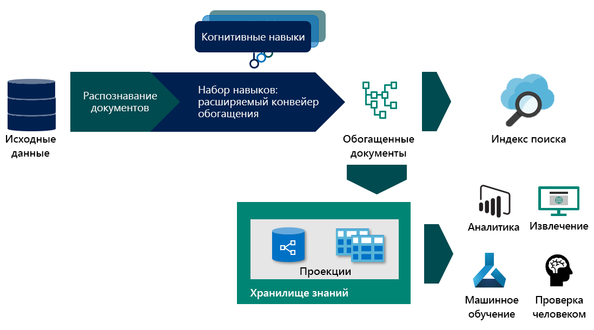

# <a name="skillset-concepts-and-composition-in-azure-cognitive-search"></a>Концепции и композиция набора навыков в Azure Когнитивный поиск

Эта статья предназначена для разработчиков, которым необходимо более глубокое понимание того, как работает конвейер обогащения и предполагается, что у вас есть концептуальное понимание процесса обогащения искусственного интеллекта. Если вы не знакомы с этой концепцией, начните с:
+ [Обогащение искусственного интеллекта в Azure Когнитивный поиск](cognitive-search-concept-intro.md)
+ [Что собой представляет хранилище знаний в службе "Поиск Azure"](knowledge-store-concept-intro.md)

## <a name="specify-the-skillset"></a>Укажите набор навыков
Набор навыков — это многократно используемый ресурс в Azure Когнитивный поиск, который указывает набор профессиональных навыков, используемых для анализа, преобразования и дополнения содержимого текста или изображения во время индексирования. Создание набора навыков позволяет прикреплять текст и изображения на этапе приема данных, извлекая и создавая новые сведения и структуры из необработанного содержимого.

Набор навыков имеет три свойства:

+   ```skills```, неупорядоченная коллекция навыков, для которой платформа определяет последовательность выполнения на основе входных данных, необходимых для каждого навыка.
+   ```cognitiveServices```, ключ «переставляемые службы» необходим для выставления счетов о вызываемых учених навыках
+   ```knowledgeStore```, учетная запись хранения, в которой будут проецированы ваши документы


Навыков созданы в формате JSON. Вы можете создавать сложные навыковы с циклами и [ветвлениеми](https://docs.microsoft.com/azure/search/cognitive-search-skill-conditional) с помощью [языка выражений](https://docs.microsoft.com/azure/search/cognitive-search-skill-conditional). Язык выражений использует нотацию пути к [указателю JSON](https://tools.ietf.org/html/rfc6901) с небольшими изменениями для обозначения узлов в дереве обогащения. ```"/"``` проходит по уровню ниже в дереве, а ```"*"``` выступает в качестве оператора for-each в контексте. Эти понятия лучше описать с помощью примера. Чтобы проиллюстрировать некоторые основные понятия и возможности, мы рассмотрим образец навыка " [Отзывы о гостинице](knowledge-store-connect-powerbi.md) ". Чтобы просмотреть набор навыков после выполнения рабочего процесса импорта данных, необходимо использовать клиент REST API для [получения набора навыков](https://docs.microsoft.com/rest/api/searchservice/get-skillset).

### <a name="enrichment-tree"></a>Дерево обогащения

Чтобы представить, как набор навыков постепенно дополняет ваш документ, давайте начнем с того, как выглядит документ до какого-либо обогащения. Результат взлома документа зависит от источника данных и выбранного режима анализа. Это также состояние документа, в котором [сопоставления полей](search-indexer-field-mappings.md) могут быть источником содержимого при добавлении данных в индекс поиска.


После того как документ находится в конвейере обогащения, он представляется в виде дерева содержимого и связанных дополнений. Это дерево создается как результат взлома документа. Формат дерева обогащения позволяет конвейеру обогащения прикреплять метаданные к четным простым типам данных, но не является допустимым объектом JSON, но может быть проецирован в допустимый формат JSON. В следующей таблице показано состояние документа, поступающего в конвейер обогащения:

|Режим Саурце\парсинг данных|значение по умолчанию|JSON, строки JSON & CSV|
|---|---|---|
|Хранилище BLOB-объектов|/документ/контент<br>/документ/normalized_images/*<br>…|/document/{key1}<br>/document/{key2}<br>…|
|SQL|/document/{column1}<br>/document/{column2}<br>…|Недоступно |
|База данных Cosmos|/document/{key1}<br>/document/{key2}<br>…|Недоступно|

 По мере выполнения навыков они добавляют новые узлы в дерево обогащения. Эти новые узлы затем можно использовать в качестве входных данных для подчиненных навыков, проецирования в хранилище знаний или сопоставления с полями индекса. Обогащения не изменяются: после создания узлы нельзя изменять. По мере того, как навыков становится более сложным, это позволит вашему дереву обогащения, но не всем узлам в дереве обогащения необходимо сделать его индексом или хранилищем знаний. Можно выборочно сохранить только подмножество обогащений в индексе или хранилище знаний.

Можно выборочно сохранить только подмножество обогащений в индексе или хранилище знаний.
В оставшейся части этого документа мы предполагаем, что мы работаем с [примером проверки отеля](https://docs.microsoft.com/azure/search/knowledge-store-connect-powerbi), но те же принципы применимы и к дополнению документов из всех других источников данных.

### <a name="context"></a>Context
Для каждого навыка требуется контекст. Контекст определяет:
+   Количество выполнений навыка на основе выбранных узлов. Для значений контекста типа Collection Добавление ```/*``` в конце приведет к тому, что навык будет вызываться один раз для каждого экземпляра в коллекции. 
+   Где в дереве обогащения добавляются выходные данные навыков. Выходные данные всегда добавляются в дерево как дочерние узлы контекстного узла. 
+   Форма входных данных. Для коллекций с несколькими уровнями Установка контекста для родительской коллекции повлияет на форму входных данных навыка. Например, если у вас есть дерево обогащения со списком стран, каждый из которых содержит список состояний, содержащих список ZipCodes.

|Context|Входные данные|Форма входных данных|Вызов навыков|
|---|---|---|---|
|```/document/countries/*``` |```/document/countries/*/states/*/zipcodes/*``` |Список всех ZipCodes в стране |Один раз в страну |
|```/document/countries/*/states/*``` |```/document/countries/*/states/*/zipcodes/*``` |Список ZipCodes в состоянии | Один раз для каждого сочетания страны и штата|

### <a name="sourcecontext"></a>саурцеконтекст

`sourceContext` используется только в [навыках](cognitive-search-skill-shaper.md) и [проекциях](knowledge-store-projection-overview.md)фигуры. Он используется для создания многоуровневого, вложенных объектов. `sourceContext` позволяет создать иерархический анонимный объект типа, который потребует нескольких навыков, если бы использовался только контекст. Использование `sourceContext` показано в следующем разделе.

### <a name="projections"></a>Проекции

Проекция — это процесс выбора узлов из дерева обогащения для сохранения в хранилище знаний. Проекции представляют собой пользовательские формы документа (содержимое и дополнения), которые могут выводиться как проекции таблиц или объектов. Дополнительные сведения о работе с проекциями см. в разделе [Работа с проекциями](knowledge-store-projection-overview.md).


На приведенной выше схеме показан селектор, с которым вы работаете в зависимости от того, где находится конвейер обогащения.

## <a name="generate-enriched-data"></a>Создание обогащенных данных 

Теперь давайте проверим набор навыков проверки отеля, вы можете следовать [руководству по созданию](knowledge-store-connect-powerbi.md) набора навыков или [просмотру](https://github.com/Azure-Samples/azure-search-postman-samples/blob/master/samples/skillset.json) набора навыков. Мы будем искать следующее:

* принцип развития дерева обогащения за счет выполнения каждого навыка 
* как работает контекст и входные данные, чтобы определить, сколько раз выполняется навык 
* что форма входных данных основана на контексте. 

Поскольку для индексатора используется режим синтаксического анализа текста с разделителями, документ в процессе обогащения представляет одну строку в CSV-файле.

### <a name="skill-1-split-skill"></a>#1 опыта: Разделите навык 


В контексте опыта ```"/document/reviews_text"```этот навык будет выполняться один раз для `reviews_text`. Выводимый навык — это список, в котором `reviews_text` побивается на сегменты 5000 символов. Выходные данные из навыка разбиения имеют имя `pages` и добавляются в дерево обогащения. Функция `targetName` позволяет переименовать выводимый навык перед добавлением в дерево обогащения.

Дерево обогащения теперь содержит новый узел, находящийся в контексте навыка. Этот узел доступен любому сопоставлению навыков, проекции или выходного поля.


Корневой узел для всех дополнений — `"/document"`. При работе с индексаторами больших двоичных объектов узел `"/document"` будет иметь дочерние узлы `"/document/content"` и `"/document/normalized_images"`. При работе с данными CSV, как показано в этом примере, имена столбцов будут сопоставляться с узлами, расположенными под `"/document"`. Чтобы получить доступ к любому из дополнений, добавленных в узел навыком, требуется полный путь для обогащения. Например, если вы хотите использовать текст из узла ```pages``` в качестве входных данных для другого навыка, необходимо указать его как ```"/document/reviews_text/pages/*"```.
 
 

### <a name="skill-2-language-detection"></a>Навык #2 определение языка
 Хотя навык определения языка является третьим навыком (навык #3), определенным в наборе навыков, он является следующим навыком для выполнения. Так как он не блокируется при вводе каких-либо входных данных, он будет выполняться параллельно с предыдущим навыком. Как и в случае с раздельным уровнем разбиения, навык определения языка также вызывается один раз для каждого документа. Дерево обогащения теперь имеет новый узел для языка.
 
 
 ### <a name="skill-3-key-phrases-skill"></a>Навык #3: навык ключевых фраз 

При наличии контекста ```/document/reviews_text/pages/*``` навык ключевых фраз будет вызываться один раз для каждого элемента в коллекции `pages`. Результатом навыка будет узел под связанным элементом Page. 

 Теперь вы можете взглянуть на остальные навыки в наборе навыков и визуализировать, как дерево дополнений будет продолжать расти с учетом выполнения каждого навыка. Некоторые навыки, такие как навык слияния и навык фигуры, также создают новые узлы, но используют данные только из существующих узлов и не создают новых дополнений.


Цвета соединителей в дереве выше указывают на то, что расширения были созданы различными навыками, и узлы должны быть адресованы по отдельности и не будут являться частью объекта, возвращаемого при выборе родительского узла.

## <a name="save-enrichments-in-a-knowledge-store"></a>Сохраняйте обогащения в хранилище знаний 

Навыков также определяет хранилище знаний, в котором можно прогнозировать документы в виде таблиц или объектов. Чтобы сохранить обогащенные данные в хранилище знаний, необходимо определить набор проекций расширенного документа. Дополнительные сведения о хранилище знаний см. в [статье обзор хранилища знаний](knowledge-store-concept-intro.md) .

### <a name="slicing-projections"></a>Проекции срезов

При определении группы проекций таблицы один узел в дереве обогащения может быть разбит на несколько связанных таблиц. При добавлении таблицы с исходным путем, который является дочерним для существующей проекции таблицы, полученный дочерний узел не будет дочерним элементом существующей проекции таблицы, а будет представлен в новой, связанной таблице. Этот метод создания срезов позволяет определить один узел в навыке, который может быть источником для всех проекций таблицы. 

### <a name="shaping-projections"></a>Формирование проекций

Существует два способа определения проекции. Для создания нового узла, который является корневым для всех проектов, для которых выполняется проецирование, можно использовать навык использования фигуры. Затем в проекциях вы должны ссылаться только на выходные данные навыка "Фигура". Можно также встроенную форму проекции в самом определении проекции.

Подход с использованием форм является более подробным, чем Встроенное, но гарантирует, что все изменения дерева обогащения содержатся в навыках и что выходные данные являются объектом, который можно использовать повторно. Встроенная форма позволяет создать необходимую форму, но является анонимным объектом и доступна только для проекции, для которой она определена. Подходы можно использовать вместе или отдельно. Набор навыков, созданный для вас в рабочем процессе портала, содержит оба. Он использует навык для проекций таблицы, но также использует встроенную форму для проецирования таблицы ключевых фраз.

Чтобы расширить этот пример, можно удалить встроенную форму и использовать навык для создания нового узла для ключевых фраз. Чтобы создать фигуру, проецируемую в три таблицы, а именно, `hotelReviewsDocument`, `hotelReviewsPages`и `hotelReviewsKeyPhrases`, в следующих разделах описаны два варианта.


#### <a name="shaper-skill-and-projection"></a>Навык и проекция фигуры 

> [!Note]
> Некоторые из столбцов таблицы документа были удалены из этого примера для краткости.
>
```json
{
    "@odata.type": "#Microsoft.Skills.Util.ShaperSkill",
    "name": "#5",
    "description": null,
    "context": "/document",
    "inputs": [        
        {
            "name": "reviews_text",
            "source": "/document/reviews_text",
            "sourceContext": null,
            "inputs": []
        },
        {
            "name": "reviews_title",
            "source": "/document/reviews_title",
            "sourceContext": null,
            "inputs": []
        },
        {
            "name": "AzureSearch_DocumentKey",
            "source": "/document/AzureSearch_DocumentKey",
            "sourceContext": null,
            "inputs": []
        },  
        {
            "name": "pages",
            "source": null,
            "sourceContext": "/document/reviews_text/pages/*",
            "inputs": [
                {
                    "name": "SentimentScore",
                    "source": "/document/reviews_text/pages/*/Sentiment",
                    "sourceContext": null,
                    "inputs": []
                },
                {
                    "name": "LanguageCode",
                    "source": "/document/Language",
                    "sourceContext": null,
                    "inputs": []
                },
                {
                    "name": "Page",
                    "source": "/document/reviews_text/pages/*",
                    "sourceContext": null,
                    "inputs": []
                },
                {
                    "name": "keyphrase",
                    "sourceContext": "/document/reviews_text/pages/*/Keyphrases/*",
                    "inputs": [
                        {
                            "source": "/document/reviews_text/pages/*/Keyphrases/*",
                            "name": "Keyphrases"
                        }
                    ]
                }
            ]
        }
    ],
    "outputs": [
        {
            "name": "output",
            "targetName": "tableprojection"
        }
    ]
}
```

Используя `tableprojection` узел, определенный в приведенном выше разделе `outputs`, можно использовать функцию среза для проецирования частей `tableprojection` узла в различные таблицы:

> [!Note]
> Это только фрагмент проекции в конфигурации хранилища знаний.
>
```json
"projections": [
    {
        "tables": [
            {
                "tableName": "hotelReviewsDocument",
                "generatedKeyName": "Documentid",
                "source": "/document/tableprojection"
            },
            {
                "tableName": "hotelReviewsPages",
                "generatedKeyName": "Pagesid",
                "source": "/document/tableprojection/pages/*"
            },
            {
                "tableName": "hotelReviewsKeyPhrases",
                "generatedKeyName": "KeyPhrasesid",
                "source": "/document/tableprojection/pages/*/keyphrase/*"
            }
        ]
    }
]
```

#### <a name="inline-shaping-projections"></a>Проекции встроенного формирования

Подход встроенной формы не требует навыков, так как все фигуры, необходимые для проекций, создаются в тот момент, когда они требуются. Для проецирования тех же данных, что и в предыдущем примере, параметр встроенной проекции будет выглядеть следующим образом:

```json
"projections": [
    {
        "tables": [
            {
                "tableName": "hotelReviewsInlineDocument",
                "generatedKeyName": "Documentid",
                "sourceContext": "/document",     
                "inputs": [
                    {
                        "name": "reviews_text",
                        "source": "/document/reviews_text"
                    },
                    {
                        "name": "reviews_title",
                        "source": "/document/reviews_title"
                    },
                    {
                        "name": "AzureSearch_DocumentKey",
                        "source": "/document/AzureSearch_DocumentKey"
                    }                             
                ]
            },
            {
                "tableName": "hotelReviewsInlinePages",
                "generatedKeyName": "Pagesid",
                "sourceContext": "/document/reviews_text/pages/*",
                "inputs": [
                        {
                    "name": "SentimentScore",
                    "source": "/document/reviews_text/pages/*/Sentiment"
                    },
                    {
                        "name": "LanguageCode",
                        "source": "/document/Language"
                    },
                    {
                        "name": "Page",
                        "source": "/document/reviews_text/pages/*"
                    }
                ]
            },
            {
                "tableName": "hotelReviewsInlineKeyPhrases",
                "generatedKeyName": "KeyPhraseId",
                "sourceContext": "/document/reviews_text/pages/*/Keyphrases/*",
                "inputs": [
                    {
                        "name": "Keyphrases",
                        "source": "/document/reviews_text/pages/*/Keyphrases/*"
                    }
                ]
            }
        ]
    }
]
```
  
Одним из этих подходов является то, как значения `"Keyphrases"` проецируются с помощью `"sourceContext"`. Узел `"Keyphrases"`, содержащий коллекцию строк, сам по себе является дочерним по отношению к тексту страницы. Однако, поскольку для проекций требуется объект JSON, а страница является примитивом (String), `"sourceContext"` используется для заключения ключевой фразы в объект с именованным свойством. Этот метод позволяет запланировать даже примитивы.

## <a name="next-steps"></a>Дополнительная информация

В качестве следующего шага Создайте свой первый набор навыков с помощью автонавыков.

> [!div class="nextstepaction"]
> [Создайте первый набор навыков](cognitive-search-defining-skillset.md).
