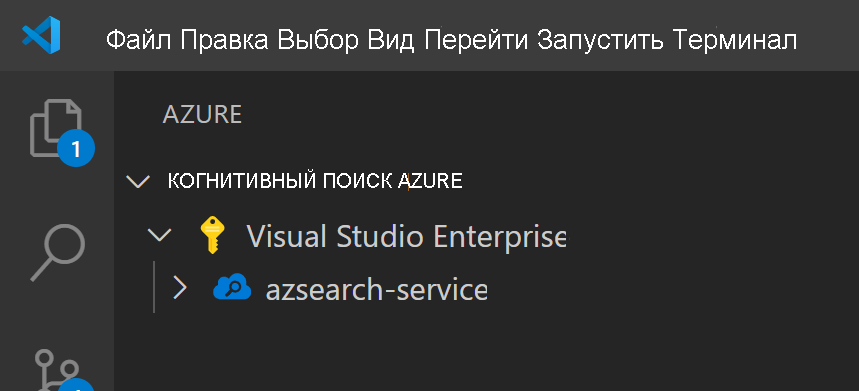
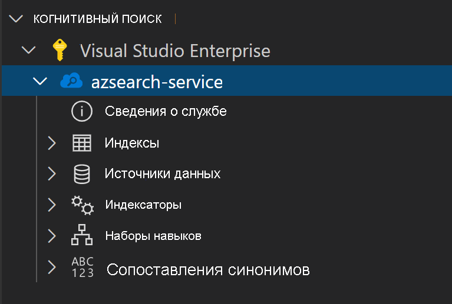
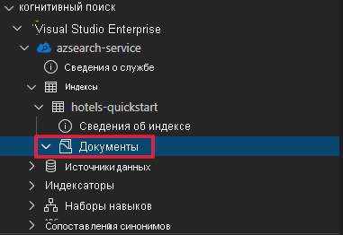
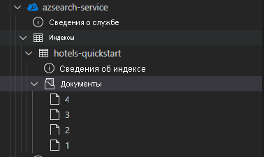
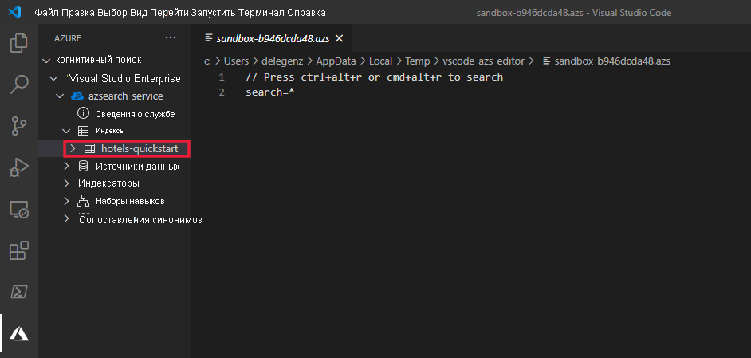

В этой статье расширение Visual Studio Code (предварительная версия) применяется для работы с REST API Когнитивного поиска Azure.

> [!IMPORTANT] 
> Эта функция сейчас доступна в виде общедоступной предварительной версии. Для предварительной версии функции соглашение об уровне обслуживания не предусмотрено. Мы не рекомендуем использовать ее в рабочей среде. Дополнительные сведения см. в статье [Дополнительные условия использования предварительных выпусков Microsoft Azure](https://azure.microsoft.com/support/legal/preview-supplemental-terms/). 

## <a name="prerequisites"></a>Предварительные требования

Для выполнения инструкций из этого краткого руководства необходимы перечисленные ниже службы и инструменты. 

+ [Visual Studio Code](https://code.visualstudio.com/download)

+ [Когнитивный поиск Azure для Visual Studio Code (предварительная версия)](https://marketplace.visualstudio.com/items?itemName=ms-azuretools.vscode-azurecognitivesearch)

+ [Создайте службу "Когнитивный поиск Azure"](../search-create-service-portal.md) или [найдите имеющуюся службу](https://ms.portal.azure.com/#blade/HubsExtension/BrowseResourceBlade/resourceType/Microsoft.Search%2FsearchServices) в рамках текущей подписки. Вы можете использовать бесплатную службу для выполнения инструкций, описанных в этом кратком руководстве. 

## <a name="copy-a-key-and-url"></a>Копирование ключа и URL-адреса

Вызовам REST требуется URL-адрес службы и ключ доступа при каждом запросе. Служба поиска создана с обоими элементами, поэтому если вы добавили службу "Когнитивный поиск Azure" в подписку, выполните следующие действия для получения необходимых сведений:

1. [Войдите на портал Azure](https://portal.azure.com/) и на странице **обзора** службы поиска получите URL-адрес. Пример конечной точки может выглядеть так: `https://mydemo.search.windows.net`.

1. В разделе **Параметры** > **Ключи** получите ключ администратора, чтобы обрести полные права на службу. Существуют два взаимозаменяемых ключа администратора, предназначенных для обеспечения непрерывности бизнес-процессов на случай, если вам потребуется сменить один из них. Вы можете использовать первичный или вторичный ключ для выполнения запросов на добавление, изменение и удаление объектов.


Для выполнения любого запроса к службе требуется использование ключа API. Если есть действительный ключ, для каждого запроса устанавливаются отношения доверия между приложением, которое отправляет запрос, и службой, которая его обрабатывает.

## <a name="install-the-extension"></a>Установка расширения

Для начала откройте [VS Code](https://code.visualstudio.com). Выберите вкладку **Расширения** на панели действий, а затем выполните поиск по строке *Когнитивный поиск Azure*. Найдите это расширение в результатах поиска и выберите действие **Установить**.


Кроме того, [расширение Когнитивного поиска Azure](https://aka.ms/vscode-search) можно установить из VS Code Marketplace с помощью веб-браузера.

На панели действий появится новая вкладка Azure, если ее еще нет.


## <a name="connect-to-your-subscription"></a>Подключение к подписке

Щелкните **Вход в Azure** и войдите в учетную запись Azure.

Должны отобразиться ваши подписки. Выберите подписку, чтобы просмотреть соответствующий список служб поиска.



Чтобы ограничить количество отображаемых подписок, откройте палитру команд (нажмите клавиши CTRL+SHIFT+P или CMD+SHIFT+P) и выполните поиск по строке *Azure* или *выбрать подписки*. Существуют также команды для входа в учетную запись Azure и выхода из нее.

Развернув службу поиска, вы увидите в представлении дерева элементы для каждого ресурса Когнитивного поиска: индексы, источники данных, индексаторы, навыки и сопоставления синонимов.



Эти элементы в представлении дерева можно развернуть, чтобы отобразить все ресурсы, доступные в службе поиска.

## <a name="1---create-an-index"></a>1\. Создание индекса

Чтобы начать работу с Когнитивным поиском Azure, прежде всего нужно создать индекс поиска. Это выполняется с помощью [REST API создания индекса](/rest/api/searchservice/create-index). 

При использовании расширения VS Code вам нужно только составить текст запроса. В этом кратком руководстве предоставлен пример определения индекса и все соответствующие документы.

### <a name="index-definition"></a>Определение индексов

Это определение содержит пример схемы для вымышленных гостиниц.

Коллекция `fields` определяет структуру документов в индексе поиска. Каждое поле имеет тип данных и ряд дополнительных атрибутов, которые определяют способ использования этого поля.

```json
{
    "name": "hotels-quickstart",
    "fields": [
        {
            "name": "HotelId",
            "type": "Edm.String",
            "key": true,
            "filterable": true
        },
        {
            "name": "HotelName",
            "type": "Edm.String",
            "searchable": true,
            "filterable": false,
            "sortable": true,
            "facetable": false
        },
        {
            "name": "Description",
            "type": "Edm.String",
            "searchable": true,
            "filterable": false,
            "sortable": false,
            "facetable": false,
            "analyzer": "en.lucene"
        },
        {
            "name": "Description_fr",
            "type": "Edm.String",
            "searchable": true,
            "filterable": false,
            "sortable": false,
            "facetable": false,
            "analyzer": "fr.lucene"
        },
        {
            "name": "Category",
            "type": "Edm.String",
            "searchable": true,
            "filterable": true,
            "sortable": true,
            "facetable": true
        },
        {
            "name": "Tags",
            "type": "Collection(Edm.String)",
            "searchable": true,
            "filterable": true,
            "sortable": false,
            "facetable": true
        },
        {
            "name": "ParkingIncluded",
            "type": "Edm.Boolean",
            "filterable": true,
            "sortable": true,
            "facetable": true
        },
        {
            "name": "LastRenovationDate",
            "type": "Edm.DateTimeOffset",
            "filterable": true,
            "sortable": true,
            "facetable": true
        },
        {
            "name": "Rating",
            "type": "Edm.Double",
            "filterable": true,
            "sortable": true,
            "facetable": true
        },
        {
            "name": "Address",
            "type": "Edm.ComplexType",
            "fields": [
                {
                    "name": "StreetAddress",
                    "type": "Edm.String",
                    "filterable": false,
                    "sortable": false,
                    "facetable": false,
                    "searchable": true
                },
                {
                    "name": "City",
                    "type": "Edm.String",
                    "searchable": true,
                    "filterable": true,
                    "sortable": true,
                    "facetable": true
                },
                {
                    "name": "StateProvince",
                    "type": "Edm.String",
                    "searchable": true,
                    "filterable": true,
                    "sortable": true,
                    "facetable": true
                },
                {
                    "name": "PostalCode",
                    "type": "Edm.String",
                    "searchable": true,
                    "filterable": true,
                    "sortable": true,
                    "facetable": true
                },
                {
                    "name": "Country",
                    "type": "Edm.String",
                    "searchable": true,
                    "filterable": true,
                    "sortable": true,
                    "facetable": true
                }
            ]
        }
    ],
    "suggesters": [
        {
            "name": "sg",
            "searchMode": "analyzingInfixMatching",
            "sourceFields": [
                "HotelName"
            ]
        }
    ]
}
```

Чтобы создать новый индекс, щелкните правой кнопкой мыши **Индексы** и выберите **Создать новый индекс**. Откроется редактор примерно с таким именем: `indexes-new-28c972f661.azsindex`. 

Вставьте в это окно приведенное выше определение индекса. Сохраните файл и выберите **Отправить**, когда появится запрос на обновление индекса. Это действие создает индекс, который тут же появится в представлении в виде дерева.


Если с определением индекса возникнет проблема, вы увидите сообщение об ошибке с объяснением ее причин.


В этом случае устраните проблему и сохраните файл повторно.

## <a name="2---load-documents"></a>2\. Загрузка документов

Создание и заполнение индекса выполняется по отдельности. В службе "Когнитивный поиск Azure" индекс содержит все данные с возможностью поиска. В этом сценарии данные предоставляются в виде документов JSON. Для этой задачи используется [REST API для добавления, обновления и удаления документов](/rest/api/searchservice/addupdate-or-delete-documents). 

Чтобы добавить новые элементы в VS Code, сделайте следующее.

1. Разверните созданный индекс `hotels-quickstart`. Щелкните правой кнопкой мыши **Документы** и выберите **Создать документ**.

    

2. Откроется редактор JSON с автоматически выведенной схемой индекса.

    

3. Вставьте следующий код JSON и сохраните файл. Появится запрос на подтверждение изменений. Выберите **Отправить**, чтобы сохранить изменения.

    ```json
    {
        "HotelId": "1",
        "HotelName": "Secret Point Motel",
        "Description": "The hotel is ideally located on the main commercial artery of the city in the heart of New York. A few minutes away is Time's Square and the historic centre of the city, as well as other places of interest that make New York one of America's most attractive and cosmopolitan cities.",
        "Category": "Boutique",
        "Tags": [ "pool", "air conditioning", "concierge" ],
        "ParkingIncluded": false,
        "LastRenovationDate": "1970-01-18T00:00:00Z",
        "Rating": 3.60,
        "Address": {
            "StreetAddress": "677 5th Ave",
            "City": "New York",
            "StateProvince": "NY",
            "PostalCode": "10022",
            "Country": "USA"
        } 
    }
    ```

4. Повторите эту процедуру для трех оставшихся документов

    Документ 2:
    ```json
    {
        "HotelId": "2",
        "HotelName": "Twin Dome Motel",
        "Description": "The hotel is situated in a  nineteenth century plaza, which has been expanded and renovated to the highest architectural standards to create a modern, functional and first-class hotel in which art and unique historical elements coexist with the most modern comforts.",
        "Category": "Boutique",
        "Tags": [ "pool", "free wifi", "concierge" ],
        "ParkingIncluded": false,
        "LastRenovationDate": "1979-02-18T00:00:00Z",
        "Rating": 3.60,
        "Address": {
            "StreetAddress": "140 University Town Center Dr",
            "City": "Sarasota",
            "StateProvince": "FL",
            "PostalCode": "34243",
            "Country": "USA"
        } 
    }
    ```

    Документ 3:
    ```json
    {
        "HotelId": "3",
        "HotelName": "Triple Landscape Hotel",
        "Description": "The Hotel stands out for its gastronomic excellence under the management of William Dough, who advises on and oversees all of the Hotel’s restaurant services.",
        "Category": "Resort and Spa",
        "Tags": [ "air conditioning", "bar", "continental breakfast" ],
        "ParkingIncluded": true,
        "LastRenovationDate": "2015-09-20T00:00:00Z",
        "Rating": 4.80,
        "Address": {
            "StreetAddress": "3393 Peachtree Rd",
            "City": "Atlanta",
            "StateProvince": "GA",
            "PostalCode": "30326",
            "Country": "USA"
        } 
    }
    ```

    Документ 4:
    ```json
    {
        "HotelId": "4",
        "HotelName": "Sublime Cliff Hotel",
        "Description": "Sublime Cliff Hotel is located in the heart of the historic center of Sublime in an extremely vibrant and lively area within short walking distance to the sites and landmarks of the city and is surrounded by the extraordinary beauty of churches, buildings, shops and monuments. Sublime Cliff is part of a lovingly restored 1800 palace.",
        "Category": "Boutique",
        "Tags": [ "concierge", "view", "24-hour front desk service" ],
        "ParkingIncluded": true,
        "LastRenovationDate": "1960-02-06T00:00:00Z",
        "Rating": 4.60,
        "Address": {
            "StreetAddress": "7400 San Pedro Ave",
            "City": "San Antonio",
            "StateProvince": "TX",
            "PostalCode": "78216",
            "Country": "USA"
        }
    }
    ```

Теперь все эти документы будут доступны в разделе с документами.



## <a name="3---search-an-index"></a>3\. Поиск в индексе

Теперь, когда индекс и документов загружены, вы можете отправлять к ним запросы с помощью [REST API поиска документов](/rest/api/searchservice/search-documents).

Для этого в VS Code сделайте следующее:

1. Щелкните правой кнопкой мыши индекс, по которому выполняется поиск, и выберите **Поиск по индексу**. Это действие открывает редактор примерно с таким именем: `sandbox-b946dcda48.azs`.

    

2. Простой запрос заполняется автоматически. Нажмите клавиши **CTRL+ALT+R** или **CMD+ALT+R**, чтобы отправить этот запрос. Результаты запроса отобразятся в окне слева.

    


### <a name="example-queries"></a>Примеры запросов

Выполните еще несколько примеров запросов, чтобы ознакомиться с синтаксисом. Ниже приведены четыре дополнительных запроса, которые вы можете попробовать выполнить. В одно окно редактора можно добавить несколько запросов. При нажатии клавиш **CTRL+ALT+R** или **CMD+ALT+R** выполняется тот запрос, в строке с которым в этот момент находится курсор.


В первом запросе мы будем искать `boutique` и с помощью `select` выберем только определенные поля. Рекомендуется использовать `select` только для нужных вам полей, так как извлечение ненужных данных приведет к задержкам в запросах. Этот запрос также задает `$count=true`, чтобы получить общее число результатов поиска.

```
// Query example 1 - Search `boutique` with select and return count
search=boutique&$count=true&$select=HotelId,HotelName,Rating,Category
```

В следующем запросе укажите условие поиска `wifi`, а также включите фильтр, который возвращает результаты только в том случае, если состояние равно `'FL'`. Результаты также упорядочиваются по данным отелей `Rating`.

```
// Query example 2 - Search with filter, orderBy, select, and count
search=wifi&$filter=Address/StateProvince eq 'FL'&$select=HotelId,HotelName,Rating&$orderby=Rating desc
```

Далее поиск ограничивается одним полем, поддерживающим поиск, с помощью параметра `searchFields`. Это отличный вариант, чтобы сделать запрос более эффективным, если вам требуются определенные поля.

```
// Query example 3 - Limit searchFields
search=submlime cliff&$select=HotelId,HotelName,Rating&searchFields=HotelName
```

Еще один распространенный параметр, включаемый в запрос, — `facets`. С помощью аспектов можно создавать фильтры в пользовательском интерфейсе, чтобы пользователям было проще узнать, какие значения они могут фильтровать.

```
// Query example 4 - Take the top two results, and show only HotelName and Category in the results
search=*&$select=HotelId,HotelName,Rating&searchFields=HotelName&facet=Category
```

## <a name="open-index-in-the-portal"></a>Открытие индекса на портале

Если вы хотите изучить индекс поиска на портале, щелкните имя службы поиска правой кнопкой мыши и выберите **Открыть на портале**. Выбранная служба поиска откроется на портале Azure.