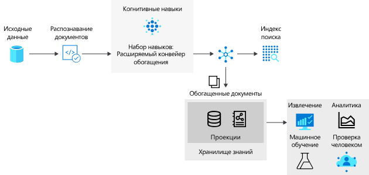

# <a name="introduction-to-knowledge-stores-in-azure-cognitive-search"></a>Общие сведения о хранилищах знаний в Azure Когнитивный поиск

> [!Note]
> Доступна предварительная версия хранилища знаний, не предназначенная для использования в рабочей среде. Эта функция предоставляется в [версии REST API 2019-05-06-Preview](search-api-preview.md). Поддержка пакета SDK для .NET пока не реализована.
>

Хранилище знаний — это функция Azure Когнитивный поиск, которая сохраняет выходные данные [конвейера обогащения искусственного интеллекта](cognitive-search-concept-intro.md) для последующего анализа или другой нисходящий обработки. *Обогащенный документ* — это выходные данные конвейера, созданные на основе содержимого, которое было извлечено, структурировано и проанализировано с помощью процессов искусственного интеллекта. В стандартном конвейере AI обогащенные документы являются транзитными, используются только во время индексирования, а затем удаляются. В магазине базы знаний сохраняются Расширенные документы. 

Если вы использовали новые навыки работы с Azure Когнитивный поиск в прошлом, вы уже знакомы с тем, что *навыков* перемещает документ с помощью последовательности обогащений. Результатом может быть индекс поиска или проекции (новые в этой предварительной версии) в хранилище знаний. Два выхода, индекс поиска и хранилище знаний, совместно используют одно и то же содержимое, но хранятся и используются совершенно разными способами.

Физически хранилище знаний — это хранилище [Azure](https://docs.microsoft.com/azure/storage/common/storage-account-overview), хранилище таблиц Azure, хранилище BLOB-объектов Azure или и то, и другое. Любой инструмент или процесс, который может подключиться к службе хранилища Azure, может использовать содержимое хранилища знаний.



Чтобы использовать хранилище знаний, в набор навыков нужно добавить элемент `knowledgeStore`,определяющий пошаговые операции в конвейере индексирования. Во время выполнения Azure Когнитивный поиск создает место в учетной записи хранения Azure и проецирует Расширенные документы как большие двоичные объекты или таблицы в зависимости от конфигурации.

## <a name="benefits-of-knowledge-store"></a>Преимущества хранилища знаний

Хранилище знаний позволяет получить структуру, контекст и фактическое содержимое из неструктурированных и частично структурированных данных, таких как большие двоичные объекты и проанализированные файлы изображений, и даже из структурированных данных, преобразованных в новые формы. В пошаговом [руководстве](knowledge-store-howto.md)можно увидеть, как сжатый документ JSON разбивается на разделы в виде вложенных структур, воссоздан в новых структурах и иным образом становится доступным для нисходящих процессов, таких как машинное обучение и обработка и анализ данных. рабочих нагрузок.

Хотя полезно понять, что может создать конвейер обогащения искусственного интеллекта, реальная мощь хранилища знаний — это возможность перерисовки данных. Вы можете начать с базового набора навыков, а затем перебрать его, чтобы добавить более увеличивающиеся уровни структуры, которые затем можно объединить в новые структуры, а также в других приложениях, кроме Azure Когнитивный поиск.

Хранилище знаний обеспечивает следующие преимущества:

+ Обогащенные документы может использовать не только служба поиска, но и [средства аналитики и создания отчетов](#tools-and-apps). Power BI c Power Query являются оптимальным решением. Но и любое приложение, способное подключаться к службе хранилища Azure, может получать данные из созданного хранилища знаний.

+ Улучшение конвейера индексирования на основе ИИ в ходе отладки и определений набора навыков. Хранилище знаний предоставляет результат определения набора навыков в конвейере индексирования на основе ИИ. Эти результаты можно использовать для создания усовершенствованного набора навыков, так как вы можете отслеживать воздействие процесса обогащения. Просматривать содержимое хранилища знаний можно с помощью [Обозревателя службы хранилища](https://docs.microsoft.com/azure/vs-azure-tools-storage-manage-with-storage-explorer?tabs=windows) Azure.

+ Преобразование данных в новые формы. Теперь доступна функция преобразования данных, реализованная в коде набора навыков. [Навык работы фигуры](cognitive-search-skill-shaper.md) в Azure когнитивный Поиск был расширен в соответствии с этой задачей. Преобразование формы позволяет определять проекцию, которая соответствует предполагаемому способу применения данных, сохраняя при этом взаимосвязи.

> [!Note]
> Не знакомы с совершенствованием и обучением искусственного интеллекта? Когнитивный поиск Azure интегрируется с Cognitive Services зрения и функциями языка для извлечения и расширения исходных данных с помощью оптического распознавания символов (OCR) над файлами изображений, распознавания сущностей и извлечения ключевых фраз из текстовых файлов и т. д. Дополнительные сведения см. [в разделе обогащение искусственного интеллекта в Azure когнитивный Поиск](cognitive-search-concept-intro.md).

## <a name="creating-a-knowledge-store"></a>Создание хранилища знаний

Хранилище знаний является частью набора [навыков](cognitive-search-working-with-skillsets.md), который, в свою очередь, является частью [индексатора](search-indexer-overview.md). 

В этой предварительной версии можно создать хранилище знаний с помощью REST API и `api-version=2019-05-06-Preview`или с помощью мастера **импорта данных** на портале.

### <a name="json-representation-of-a-knowledge-store"></a>Представление JSON хранилища знаний

Приведенный ниже код JSON определяет `knowledgeStore` — элемент набора навыков, вызываемый индексатором (не показано). Если вы уже знакомы с обогащением искусственного интеллекта, набор навыков определяет создание, организацию и вещество для каждого обогащенного документа. Набор навыков должен содержать по крайней мере один навык, который, скорее всего, является навыком для формы, если вы модулатинге структуры данных.

`knowledgeStore` состоит из соединения и проекций. 

+ Подключение к учетной записи хранения в том же регионе, что и Azure Когнитивный поиск. 

+ Проекции — это пары "таблицы — объекты". `Tables` определить физическое выражение для обогащенных документов в хранилище таблиц Azure. `Objects` определить физические объекты в хранилище BLOB-объектов Azure.

```json
{
  "name": "my-new-skillset",
  "description": "Example showing knowledgeStore placement in a skillset.",
  "skills":
  [
    {
    "@odata.type": "#Microsoft.Skills.Util.ShaperSkill",
    "context": "/document/content/phrases/*",
    "inputs": [
        {
        "name": "text",
        "source": "/document/content/phrases/*"
        },
        {
        "name": "sentiment",
        "source": "/document/content/phrases/*/sentiment"
        }
    ],
    "outputs": [
        {
        "name": "output",
        "targetName": "analyzedText"
        }
    ]
    },
  ],
  "cognitiveServices": 
    {
    "@odata.type": "#Microsoft.Azure.Search.CognitiveServicesByKey",
    "description": "mycogsvcs resource in West US 2",
    "key": "<your key goes here>"
    },
  "knowledgeStore": { 
    "storageConnectionString": "<your connection string goes here>", 
    "projections": [ 
        { 
            "tables": [  
            { "tableName": "Reviews", "generatedKeyName": "ReviewId", "source": "/document/Review" , "sourceContext": null, "inputs": []}, 
            { "tableName": "Sentences", "generatedKeyName": "SentenceId", "source": "/document/Review/Sentences/*", "sourceContext": null, "inputs": []}, 
            { "tableName": "KeyPhrases", "generatedKeyName": "KeyPhraseId", "source": "/document/Review/Sentences/*/KeyPhrases", "sourceContext": null, "inputs": []}, 
            { "tableName": "Entities", "generatedKeyName": "EntityId", "source": "/document/Review/Sentences/*/Entities/*" ,"sourceContext": null, "inputs": []} 

            ], 
            "objects": [ 
               
            ]      
        },
        { 
            "tables": [ 
            ], 
            "objects": [ 
                { 
                "storageContainer": "Reviews", 
                "format": "json", 
                "source": "/document/Review", 
                "key": "/document/Review/Id" 
                } 
            ]      
        }        
    ]     
    } 
}
```

### <a name="sources-of-data-for-a-knowledge-store"></a>Источники данных для хранилища знаний

Если хранилище знаний выводится из конвейера обогащения искусственного интеллекта, каковы эти входные данные? Исходные данные, которые необходимо извлечь, расширить и в конечном итоге сохранить в хранилище знаний, могут исходить из любого источника данных Azure, поддерживаемого индексаторами поиска: 

* [Azure Cosmos DB](search-howto-index-cosmosdb.md)

* [хранилище BLOB-объектов Azure](search-howto-indexing-azure-blob-storage.md)

* [Хранилище таблиц Azure](search-howto-indexing-azure-tables.md)

* [Azure SQL;](search-howto-connecting-azure-sql-database-to-azure-search-using-indexers.md)

Индексаторы и навыков вы создаете извлечение и расширение или преобразование этого содержимого в составе рабочей нагрузки индексирования, а затем сохраняете результаты в хранилище знаний.

### <a name="rest-apis-used-in-creation-of-a-knowledge-store"></a>API-интерфейсы RESTFUL, используемые при создании хранилища знаний

Только два API-интерфейса имеют расширения, необходимые для создания хранилища знаний (создание набора навыков и индексатора создания). Другие API-интерфейсы используются "как есть".

| Объект | REST API | Description (Описание) |
|--------|----------|-------------|
| Источник данных | [Создание источника данных](https://docs.microsoft.com/rest/api/searchservice/create-data-source)  | Ресурс, определяющий внешний источник данных с исходными данными, которые будут использоваться для создания обогащенных документов.  |
| Набор навыков | [Создание набора навыков (API-Version = 2019 – 05 -06-Preview)](https://docs.microsoft.com/rest/api/searchservice/create-skillset)  | Ресурс, в котором описано использование [встроенных навыков](cognitive-search-predefined-skills.md) и [пользовательских когнитивных навыков](cognitive-search-custom-skill-interface.md) в конвейере обогащения данных во время индексирования. Набор навыков имеет определение `knowledgeStore` как дочерний элемент. |
| index | [Создание индекса](https://docs.microsoft.com/rest/api/searchservice/create-index)  | Схема, которая выражает индекс поиска. Поля в этом индексе сопоставляются с полями в источнике данных или с полями, созданным на этапе обогащения (например, поле с названиями организаций, созданное навыком распознавания сущностей). |
| Индексатор | [Создание индексатора (api-version=2019-05-06)](https://docs.microsoft.com/rest/api/searchservice/create-skillset)  | Ресурс, определяющий компоненты для процесса индексирования, в том числе источник данных, набор навыков, сопоставлений полей источника и промежуточных структур с полями целевого индекса, определение индекса. При запуске индексатора активируется процесс приема и обогащения данных. На выходе формируется индекс поиска, который основан на схеме индекса и заполнен исходными данными, обогащенными с помощью наборов навыков.  |

### <a name="physical-composition-of-a-knowledge-store"></a>Физическая композиция хранилища знаний

 *Проекция*, которая является элементом определения `knowledgeStore`, выводит схему и структуру выходных данных таким образом, чтобы она соответствовала предполагаемому использованию. При наличии приложений, использующих данные в различных форматах и фигурах, можно определить несколько проекций. 

Проекции можно сформулировать как объекты или таблицы:

+ Если проекция является объектом, она сопоставляется с хранилищем BLOB-объектов, в котором проекция хранится в контейнере вместе с объектами или иерархическими представлениями в формате JSON для таких сценариев, как конвейер обработки и анализа данных.

+ Если проекция является таблицей, она сопоставляется с Хранилищем таблиц. Табличный формат позволяет сохранить связи для таких сценариев, как анализ данных или экспорт в виде кадров данных для машинного обучения. Обогащенные проекции затем можно легко импортировать в другие хранилища данных. 

В хранилище знаний можно создать множество проекций, соответствующих требованиям различных пользователей в вашей организации. Разработчикам может требоваться доступ к полным представлениям обогащенных документов в формате JSON, а специалистам по анализу и обработке данных — детализированные или модульные структуры, сформированные набором навыков.

Например, если одна из целей обогащения данных состоит в создании набора данных для обучения модели, создав проекцию данных в виде объекта, можно использовать их в конвейерах обработки и анализа данных. Если же вам необходимо быстро создать панель мониторинга Power BI на основе обогащенных документов, для этого лучше подойдет проекция в табличном формате.

<a name="tools-and-apps"></a>

## <a name="connecting-with-tools-and-apps"></a>Подключение с помощью средств и приложений

После помещения обогащенных документов в хранилище любое средство или технология, способные подключаться к хранилищу BLOB-объектов или таблиц Azure, можно использовать для изучения, анализа или использования их содержимого. Вот список основных таких средств:

+ [Обозреватель службы хранилища](knowledge-store-view-storage-explorer.md) позволяет просматривать структуру и содержимое обогащенных документов. Его можно считать базовым средством для просмотра содержимого хранилища знаний.

+ [Power BI](knowledge-store-connect-power-bi.md) для средств создания отчетов и анализа, если у вас есть числовые данные.

+ [Фабрика данных Azure](https://docs.microsoft.com/azure/data-factory/) позволяет выполнять дальнейшую обработку данных.

## <a name="next-steps"></a>Дальнейшие действия

Хранилище знаний предоставляет сохраняемость дополненных документов, полезна при проектировании набора навыков или создании новых структур и содержимого для использования любыми клиентскими приложениями, способными получить доступ к учетной записи хранения Azure.

Самый простой подход к созданию обогащенных документов — с помощью мастера **импорта данных** , но вы также можете использовать post и REST API, что более удобно, если нужно получить представление о создании объектов и ссылке на них.

> [!div class="nextstepaction"]
> [Создание хранилища знаний с помощью портала](knowledge-store-create-portal.md)
> [Создание хранилища знаний с помощью процедуры POST и API-интерфейса RESTful](knowledge-store-create-rest.md)
