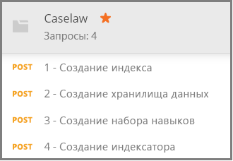

# <a name="how-to-get-started-with-knowledge-store-in-azure-search"></a>Узнайте, как начать работу с хранилищем знаний (предварительная версия) в Поиске Azure

> [!Note]
> Доступна предварительная версия хранилища знаний, не предназначенная для использования в рабочей среде. Эта функция предоставляется в [версии REST API 2019-05-06-Preview](search-api-preview.md). Поддержка пакета SDK для .NET пока не реализована.
>
[Хранилище знаний](knowledge-store-concept-intro.md) сохраняет обогащения ИИ, созданные при индексировании в учетную запись хранения Azure для последующего интеллектуального анализа данных в других приложениях. Кроме того, с помощью сохраненных обогащений можно составить представление о конвейере индексирования в службе "Поиск Azure" и усовершенствовать его. 

Хранилище знаний определяется *набором навыков* и создается *индексатором*. Физическое выражение хранилища знаний задается с помощью *проекций*, которые определяют структуры данных в хранилище. Выполнив инструкции данного пошагового руководства, вы создадите все эти объекты и узнаете, как они взаимодействуют друг с другом. 

В этом упражнении мы начнем с демонстрационных данных, служб и средств. Они помогут изучить базовый рабочий процесс для создания и использования вашего первого хранилища знаний с акцентом на определение набора навыков.

## <a name="prerequisites"></a>Предварительные требования

Хранилище знаний находится в центре таких служб как хранилище BLOB-объектов Azure и хранилище таблиц Azure, обеспечивающих физическое хранилище, а также Поиск Azure и Cognitive Services, используемых для создания и обновления объектов. Опыт работы с [базовой архитектурой](knowledge-store-concept-intro.md) является обязательным условием для выполнения инструкций, приведенных в этом руководстве.

В этом кратком руководстве используются перечисленные ниже службы и инструменты. 

+ Используйте [классическое приложение Postman](https://www.getpostman.com/) для отправки HTTP-запросов в службу "Поиск Azure".

+ [Создайте учетную запись хранения Azure](https://docs.microsoft.com/azure/storage/common/storage-quickstart-create-account) для хранения примера данных и хранилища знаний. Хранилище знаний будет размещено в службе хранилища Azure.

+ [Создайте ресурс Cognitive Services](https://docs.microsoft.com/azure/cognitive-services/cognitive-services-apis-create-account) на уровне S0 с оплатой по мере использования, чтобы получить широкий доступ ко всему набору навыков, используемых при обогащении данных с помощью ИИ. Cognitive Services и служба "Поиск Azure" должны находиться в одном регионе.

+ [Создайте службу "Поиск Azure"](search-create-service-portal.md) или [найдите имеющуюся службу](https://ms.portal.azure.com/#blade/HubsExtension/BrowseResourceBlade/resourceType/Microsoft.Search%2FsearchServices) в рамках текущей подписки. Вы можете использовать бесплатную службу для выполнения инструкций, описанных в этом учебнике. 

Примеры документов JSON и файл коллекции Postman также необходимы для работы с этим руководством. Инструкции по поиску и загрузке вспомогательных файлов приведены в разделе [Подготовка примера данных](#prepare-sample-data).

## <a name="get-a-key-and-url"></a>Получение ключа и URL-адреса

Вызовам REST требуется URL-адрес службы и ключ доступа при каждом запросе. Служба поиска создана с обоими элементами, поэтому если вы добавили службу "Поиск Azure" в подписку, выполните следующие действия для получения необходимых сведений:

1. [Войдите на портал Azure](https://portal.azure.com/) и на странице **обзора** службы поиска получите URL-адрес. Пример конечной точки может выглядеть так: `https://mydemo.search.windows.net`.

1. В разделе **Параметры** > **Ключи** получите ключ администратора, чтобы обрести полные права на службу. Существуют два взаимозаменяемых ключа администратора, предназначенных для обеспечения непрерывности бизнес-процессов на случай, если вам потребуется сменить один из них. Вы можете использовать первичный или вторичный ключ для выполнения запросов на добавление, изменение и удаление объектов.

    

Для выполнения любого запроса к службе требуется использование ключа API. При работе со следующими разделами вы будете указывать имя службы и ключ API в каждом HTTP-запросе.

<a name="prepare-sample-data"></a>

## <a name="prepare-sample-data"></a>Подготовка примера данных

Хранилище знаний содержит выходные данные конвейера обогащений. Входные данные состоят из "непригодных" данных, которые в будущем становятся "годными для использования" по мере продвижения по конвейеру. Примеры непригодных данных могут охватывать файлы изображений, которые необходимо проанализировать для определения характеристик текста или изображения, или плотные текстовые файлы, которые можно проанализировать для определения сущностей, ключевых фраз или тональности. 

В этом упражнении используются плотные текстовые файлы (сведения о судебных делах), полученные на странице загрузки общедоступного массива данных [Caselaw Access Project](https://case.law/bulk/download/). Для этого упражнения мы выложили в GitHub 10 демонстрационных документов. 

В рамках этой задачи вы создадите контейнер больших двоичных объектов Azure для этих документов, которые будут использоваться в качестве входных данных для конвейера. 

1. Скачайте и извлеките репозиторий [Azure Search Sample Data](https://github.com/Azure-Samples/azure-search-sample-data/tree/master/caselaw), чтобы получить [набор данных Caselaw](https://github.com/Azure-Samples/azure-search-sample-data/tree/master/caselaw). 

1. [Войдите на портал Azure](https://portal.azure.com), перейдите к учетной записи хранения Azure, выберите **Большие двоичные объекты**, а затем щелкните **Контейнер**.

1. [Создайте контейнер больших двоичных объектов](https://docs.microsoft.com/azure/storage/blobs/storage-quickstart-blobs-portal) для хранения примера данных. 

   1. Присвойте контейнеру имя `caselaw-test`. 
   
   1. Задайте любое из допустимых значений уровня общего доступа.

1. Откройте контейнер после создания и на панели команд выберите **Загрузить**.

   

1. Перейдите к папке с примером файла **caselaw-sample.json**. Выберите файл и нажмите **Отправить**.

1. Находясь в хранилище Azure, получите строку подключения и имя контейнера.  Эти данные понадобятся вам при [создании источника данных](#create-data-source):

   1. На странице обзора щелкните **Ключи доступа** и скопируйте *строку подключения*. Она начинается с `DefaultEndpointsProtocol=https;` и заканчивается `EndpointSuffix=core.windows.net`. Посередине указано имя и ключ вашей учетной записи. 

   1. В качестве имени контейнера должно быть указано `caselaw-test` или любое другое назначенное имя.


## <a name="set-up-postman"></a>Настройка Postman

Postman — это клиентское приложение, которое вы будете использовать для отправки запросов и документов JSON в службу "Поиск Azure". Несколько запросов можно сформулировать лишь с использованием сведений, приведенных в этой статье. Однако два самых больших запроса (создание индекса, создание набора навыков) требуют подробного документа JSON, который слишком велик для внедрения в статью. 

Чтобы сделать все запросы и документы JSON полностью доступными, мы создали файл коллекции Postman. Скачивание и последующий импорт этого файла — ваша первая задача при настройке клиента.

1. Скачайте и распакуйте репозиторий [Azure Search Postman samples](https://github.com/Azure-Samples/azure-search-postman-samples).

1. Запустите Postman и импортируйте коллекцию Postman Caselaw.

   1. Щелкните **Импорт** > **Импорт файлов** > **Выбор файлов**. 

   1. Перейдите в папку Caselaw (\azure-search-postman-samples-master\azure-search-postman-samples-master\Caselaw).

   1. Выберите файл **Caselaw.postman_collection_v2.json**. В коллекции должны отображаться четыре запроса **POST**.

   
   

## <a name="create-an-index"></a>Создание индекса
    
Для первого запроса используется [API создания индексов](https://docs.microsoft.com/rest/api/searchservice/create-data-source), создающий индекс службы "Поиск Azure", в котором хранятся все доступные для поиска данные. Индекс указывает все поля, параметры и атрибуты.

Индекс для интеллектуального анализа знаний использовать не обязательно, но без него не будет работать индексатор. 

1. В URL-адресе `https://YOUR-AZURE-SEARCH-SERVICE-NAME.search.windows.net/indexes?api-version=2019-05-06-Preview` замените `YOUR-AZURE-SEARCH-SERVICE-NAME` именем службы поиска. 

1. В разделе Header замените `<YOUR AZURE SEARCH ADMIN API-KEY>` ключом API администратора для службы "Поиск Azure".

1. В разделе Body документ JSON представляет собой схему индекса. Свернутая для видимости внешняя оболочка индекса содержит указанные ниже элементы. Коллекция полей соответствует полям в наборе данных Caselaw.

   ```json
   {
      "name": "caselaw",
      "defaultScoringProfile": null,
      "fields": [],
      "scoringProfiles": [],
      "corsOptions": null,
      "suggesters": [],
      "analyzers": [],
      "tokenizers": [],
      "tokenFilters": [],
      "charFilters": [],
      "encryptionKey": null
   }
   ```

1. Разверните коллекцию `fields`. Она содержит массив определений индексов, состоящий из простых полей, [сложных полей](search-howto-complex-data-types.md) с вложенными подструктурами и коллекций.

   Уделите немного времени, чтобы просмотреть определение поля для сложного поля `casebody` в строках 302–384. Обратите внимание, что сложные поля могут содержать другие сложные поля, если требуются иерархические представления. Иерархические структуры можно моделировать в индексе, как показано ниже, а также в виде проекции в наборе навыков, создавая таким образом вложенную структуру данных в хранилище знаний.

   ```json
   {
    "name": "casebody",
    "type": "Edm.ComplexType",
    "fields": [
        {
            "name": "status",
            "type": "Edm.String",
            "searchable": true,
            "filterable": true,
            "retrievable": true,
            "sortable": true,
            "facetable": true,
            "key": false,
            "indexAnalyzer": null,
            "searchAnalyzer": null,
            "analyzer": null,
            "synonymMaps": []
        },
        {
            "name": "data",
            "type": "Edm.ComplexType",
            "fields": [
                {
                    "name": "head_matter",
                    "type": "Edm.String",
                    "searchable": true,
                    "filterable": false,
                    "retrievable": true,
                    "sortable": false,
                    "facetable": false,
                    "key": false,
                    "indexAnalyzer": null,
                    "searchAnalyzer": null,
                    "analyzer": null,
                    "synonymMaps": []
                },
                {
                    "name": "opinions",
                    "type": "Collection(Edm.ComplexType)",
                    "fields": [
                        {
                            "name": "author",
                            "type": "Edm.String",
                            "searchable": true,
                            "filterable": true,
                            "retrievable": true,
                            "sortable": false,
                            "facetable": true,
                            "key": false,
                            "indexAnalyzer": null,
                            "searchAnalyzer": null,
                            "analyzer": null,
                            "synonymMaps": []
                        },
                        {
                            "name": "text",
                            "type": "Edm.String",
                            "searchable": true,
                            "filterable": false,
                            "retrievable": true,
                            "sortable": false,
                            "facetable": false,
                            "key": false,
                            "indexAnalyzer": null,
                            "searchAnalyzer": null,
                            "analyzer": null,
                            "synonymMaps": []
                        },
                        {
                            "name": "type",
                            "type": "Edm.String",
                            "searchable": true,
                            "filterable": true,
                            "retrievable": true,
                            "sortable": false,
                            "facetable": true,
                            "key": false,
                            "indexAnalyzer": null,
                            "searchAnalyzer": null,
                            "analyzer": null,
                            "synonymMaps": []
                        }
                    ]
                },
    . . .
   ```

1. Щелкните **Отправить**, чтобы выполнить запрос.  В ответном сообщении вы должны получить сообщение **Status: 201 Created** (Состояние: 201 — создан ресурс).

<a name="create-data-source"></a>

## <a name="create-a-data-source"></a>Создание источника данных

Второй запрос использует [API создания источника данных](https://docs.microsoft.com/rest/api/searchservice/create-data-source) для подключения к хранилищу BLOB-объектов Azure. 

1. В URL-адресе `https://YOUR-AZURE-SEARCH-SERVICE-NAME.search.windows.net/datasources?api-version=2019-05-06-Preview` замените `YOUR-AZURE-SEARCH-SERVICE-NAME` именем службы поиска. 

1. В разделе Header замените `<YOUR AZURE SEARCH ADMIN API-KEY>` ключом API администратора для службы "Поиск Azure".

1. В разделе Body документа JSON содержится строка подключения учетной записи хранения и имя контейнера больших двоичных объектов. Строку подключения можно найти на портале Azure в разделе **Ключи доступа** для вашей учетной записи хранения. 

    ```json
    {
        "name": "caselaw-ds",
        "description": null,
        "type": "azureblob",
        "subtype": null,
        "credentials": {
            "connectionString": "DefaultEndpointsProtocol=https;AccountName=<YOUR-STORAGE-ACCOUNT>;AccountKey=<YOUR-STORAGE-KEY>;EndpointSuffix=core.windows.net"
        },
        "container": {
            "name": "<YOUR-BLOB-CONTAINER-NAME>",
            "query": null
        },
        "dataChangeDetectionPolicy": null,
        "dataDeletionDetectionPolicy": null
    }
    ```

1. Щелкните **Отправить**, чтобы выполнить запрос.  В ответном сообщении вы должны получить сообщение **Status: 201 Created** (Состояние: 201 — создан ресурс).


<a name="create-skillset"></a>

## <a name="create-a-skillset-and-knowledge-store"></a>Создание набора навыков и хранилища знаний

Третий запрос использует [API создания набора навыков](https://docs.microsoft.com/rest/api/searchservice/create-skillset), позволяющий создать объект службы "Поиск Azure", который указывает, какие когнитивные навыки вызвать, как связать их и, что самое важное для этого пошагового руководства, как указать хранилище знаний.

1. В URL-адресе `https://YOUR-AZURE-SEARCH-SERVICE-NAME.search.windows.net/skillsets?api-version=2019-05-06-Preview` замените `YOUR-AZURE-SEARCH-SERVICE-NAME` именем службы поиска. 

1. В разделе Header замените `<YOUR AZURE SEARCH ADMIN API-KEY>` ключом API администратора для службы "Поиск Azure".

1. В разделе Body документ JSON представляет собой определение набора навыков. Свернутая для видимости внешняя оболочка набора навыков содержит указанные ниже элементы. Коллекция `skills` определяет обогащенные данные в памяти, но определение `knowledgeStore` указывает способ хранения выходных данных. Определение `cognitiveServices` обеспечивает подключение к подсистемам ИИ для обогащения данных.

   ```json
   {
    "name": "caselaw-ss",
    "description": null,
    "skills": [],
    "cognitiveServices": [],
    "knowledgeStore": []
   }
   ```

1. Разверните `cognitiveServices` и `knowledgeStore`, чтобы предоставить сведения о подключении. В примере эти строки будут находиться после определения набора навыков, ближе к концу текста запроса. 

   Для `cognitiveServices` подготовьте к работе ресурс на уровне S0, расположенный в том же регионе, что и служба "Поиск Azure". Вы можете получить имя и ключ cognitiveServices на той же странице на портале Azure. 
   
   Для `knowledgeStore` вы можете использовать ту же строку подключения, что и для контейнера больших двоичных объектов Caselaw.

    ```json
    "cognitiveServices": {
        "@odata.type": "#Microsoft.Azure.Search.CognitiveServicesByKey",
        "description": "YOUR-SAME-REGION-S0-COGNITIVE-SERVICES-RESOURCE",
        "key": "YOUR-COGNITIVE-SERVICES-KEY"
    },
    "knowledgeStore": {
        "storageConnectionString": "YOUR-STORAGE-ACCOUNT-CONNECTION-STRING",
    ```

1. Разверните коллекцию навыков, в частности навыки Shaper в строках 85 и 179 соответственно. Навык Shaper важен, так как он позволяет собрать структуры данных для интеллектуального анализа знаний. При выполнении набора навыков эти структуры доступны только в памяти. Но на следующем этапе вы узнаете, как эти выходные данные можно сохранить в хранилище знаний для дальнейшего изучения.

   Приведенный ниже фрагмент кода взят из строки 217. 

    ```json
    "name": "Opinions",
    "source": null,
    "sourceContext": "/document/casebody/data/opinions/*",
    "inputs": [
        {
            "name": "Text",
            "source": "/document/casebody/data/opinions/*/text"
        },
        {
            "name": "Author",
            "source": "/document/casebody/data/opinions/*/author"
        },
        {
            "name": "Entities",
            "source": null,
            "sourceContext": "/document/casebody/data/opinions/*/text/pages/*/entities/*",
            "inputs": [
                {
                    "name": "Entity",
                    "source": "/document/casebody/data/opinions/*/text/pages/*/entities/*/value"
                },
                {
                    "name": "EntityType",
                    "source": "/document/casebody/data/opinions/*/text/pages/*/entities/*/category"
                }
            ]
        }
    ]
   . . .
   ```

1. Разверните элемент `projections` в `knowledgeStore`, начиная со строки 262. Проекции указывают состав хранилища знаний. Проекции указываются в парах "таблица-объект", но сейчас только поочередно. Как видно из первой проекции, значение `tables` указано, а `objects` — нет. Во второй проекции ситуация противоположная.

   В службе хранилища Azure в хранилище таблиц для каждой создаваемой вами таблицы будет создана соответствующая таблица. А для каждого объекта в хранилище BLOB-объектов создается контейнер.

   BLOB-объекты обычно содержат полное выражение обогащения. Таблицы обычно содержат частичные обогащения в сочетаниях, сформированных для определенных целей. В этом примере показана таблица Cases и таблица Opinions, но не представлены другие таблицы, такие как Entities, Attorneys, Judges и Parties.

    ```json
    "projections": [
        {
            "tables": [
                {
                    "tableName": "Cases",
                    "generatedKeyName": "CaseId",
                    "source": "/document/Case"
                },
                {
                    "tableName": "Opinions",
                    "generatedKeyName": "OpinionId",
                    "source": "/document/Case/OpinionsSnippets/*"
                }
            ],
            "objects": []
        },
        {
            "tables": [],
            "objects": [
                {
                    "storageContainer": "enrichedcases",
                    
                    "source": "/document/CaseFull"
                }
            ]
        }
    ]
    ```

1. Щелкните **Отправить**, чтобы выполнить запрос. Должен поступить ответ **201** примерно с такими данными (здесь показана первая часть ответа):

    ```json
    {
    "name": "caselaw-ss",
    "description": null,
    "skills": [
        {
            "@odata.type": "#Microsoft.Skills.Text.SplitSkill",
            "name": "SplitSkill#1",
            "description": null,
            "context": "/document/casebody/data/opinions/*/text",
            "defaultLanguageCode": "en",
            "textSplitMode": "pages",
            "maximumPageLength": 5000,
            "inputs": [
                {
                    "name": "text",
                    "source": "/document/casebody/data/opinions/*/text
                }
            ],
            "outputs": [
                {
                    "name": "textItems",
                    "targetName": "pages"
                }
            ]
        },
        . . .
    ```

## <a name="create-and-run-an-indexer"></a>Создание и запуск индексатора

Четвертый запрос использует [API создания индексатора](https://docs.microsoft.com/rest/api/searchservice/create-indexer), создающий индексатор службы "Поиск Azure". Индексатор представляет собой подсистему выполнения конвейера индексирования. На этом этапе все созданные определения вступают в действие.

1. В URL-адресе `https://YOUR-AZURE-SEARCH-SERVICE-NAME.search.windows.net/indexers?api-version=2019-05-06-Preview` замените `YOUR-AZURE-SEARCH-SERVICE-NAME` именем службы поиска. 

1. В разделе Header замените `<YOUR AZURE SEARCH ADMIN API-KEY>` ключом API администратора для службы "Поиск Azure".

1. В разделе Body документ JSON определяет имя индексатора. Для индексатора требуется источник данных и индекс. Набор навыков для индексатора использовать не обязательно, но это необходимо для обогащения данных с помощью ИИ.

    ```json
    {
        "name": "caselaw-idxr",
        "description": null,
        "dataSourceName": "caselaw-ds",
        "skillsetName": "caselaw-ss",
        "targetIndexName": "caselaw",
        "disabled": null,
        "schedule": null,
        "parameters": { },
        "fieldMappings": [],
        "outputFieldMappings": [ ]
    ```

1. Разверните outputFieldMappings. В отличие от объекта fieldMappings, который используется для настраиваемого сопоставления между полями в источнике данных и полями в индексе, outputFieldMappings используется для сопоставления обогащенных полей, созданных и заполненных конвейером, с выходными полями в индексе или проекции.

    ```json
    "outputFieldMappings": [
        {
            "sourceFieldName": "/document/casebody/data/opinions/*/text/pages/*/people/*",
            "targetFieldName": "people",
            "mappingFunction": null
        },
        {
            "sourceFieldName": "/document/casebody/data/opinions/*/text/pages/*/organizations/*",
            "targetFieldName": "orginizations",
            "mappingFunction": null
        },
        {
            "sourceFieldName": "/document/casebody/data/opinions/*/text/pages/*/locations/*",
            "targetFieldName": "locations",
            "mappingFunction": null
        },
        {
            "sourceFieldName": "/document/Case/OpinionsSnippets/*/Entities/*",
            "targetFieldName": "entities",
            "mappingFunction": null
        },
        {
            "sourceFieldName": "/document/casebody/data/opinions/*/text/pages/*/keyPhrases/*",
            "targetFieldName": "keyPhrases",
            "mappingFunction": null
        }
    ]
    ```

1. Щелкните **Отправить**, чтобы выполнить запрос. Должен поступить ответ **201** с текстом, практически идентичным полезным данным запроса, которые вы указали (текст сокращен).

    ```json
    {
        "name": "caselaw-idxr",
        "description": null,
        "dataSourceName": "caselaw-ds",
        "skillsetName": "caselaw-ss",
        "targetIndexName": "caselaw",
        "disabled": null,
        "schedule": null,
        "parameters": { },
        "fieldMappings": [],
        "outputFieldMappings": [ ]
    }
    ```

## <a name="explore-knowledge-store"></a>Изучение хранилища знаний

Вы можете начать изучение сразу после импорта первого документа. Для этой задачи используйте [**Обозреватель службы хранилища**](https://docs.microsoft.com/azure/storage/blobs/storage-quickstart-blobs-storage-explorer) на портале.

Важно помнить, что хранилище знаний работает отдельно от службы "Поиск Azure". И индекс службы "Поиск Azure", и хранилище знаний содержат представление и содержимое данных, но на этом их сходство заканчивается. Индекс можно использовать для полнотекстового поиска, поиска с фильтрацией и всех сценариев, поддерживаемых в службе "Поиск Azure". Или же вы можете работать только с хранилищем знаний, подключая другие средства для анализа содержимого.

## <a name="takeaways"></a>Общие выводы

Вы создали свое первое хранилище знаний в службе хранилища Azure и просмотрели обогащения с помощью Обозревателя службы хранилища. Это основные принципы работы с хранимыми обогащениями. 

## <a name="next-steps"></a>Дополнительная информация

Навык Shaper позволяет выполнять трудоемкие задачи по созданию точных форм данных, из которых можно сформировать новые комбинации. Просмотрите страницу со справочными сведениями об этом навыке, чтобы составить представление о его использовании.

> [!div class="nextstepaction"]
> [Справочник по навыку Shaper](cognitive-search-skill-shaper.md)


<!---
## Keep This

How to convert unformatted JSON into an indented JSON document structure that allows you to quickly identify nested structures. Useful for creating an index that includes complex types.

1. Use Visual Studio Code.
2. Open data.jsonl
--->
