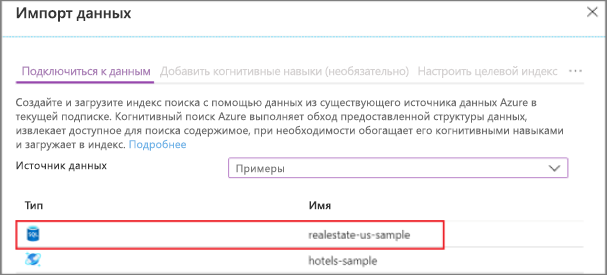
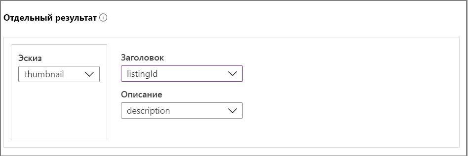
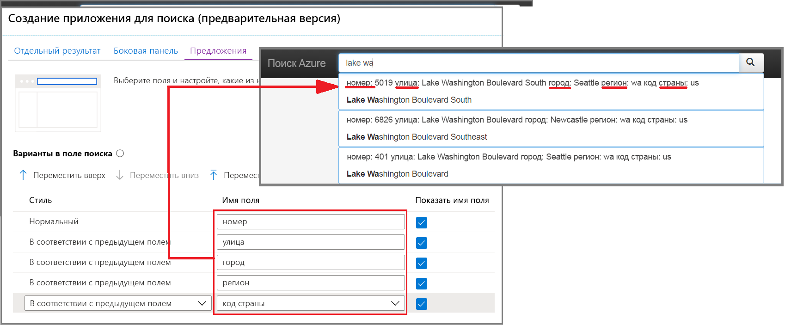
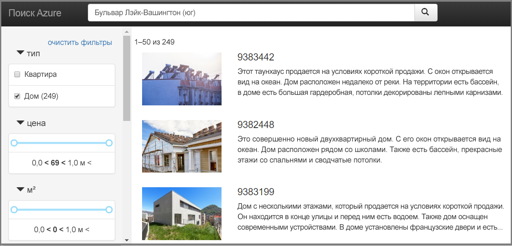

# Краткое руководство. Создание приложения для поиска на портале (Когнитивный поиск Azure)

Используйте мастер **Создание приложения для поиска**, чтобы создать скачиваемое веб-приложение, выполняемое в браузере с локального компьютера. В зависимости от конфигурации созданное приложение автоматически подготавливается к работе при первом запуске, создавая динамическое подключение к удаленному индексу. Приложение по умолчанию может включать строку поиска, область результатов, фильтры на боковой панели и поддержку опережающего ввода.

Если у вас еще нет подписки Azure, [создайте бесплатную учетную запись Azure](https://azure.microsoft.com/free/?WT.mc_id=A261C142F), прежде чем начинать работу. 

## Предварительные требования

[Создайте службу "Когнитивный поиск Azure"](search-create-service-portal.md) или [найдите имеющуюся службу](https://ms.portal.azure.com/#blade/HubsExtension/BrowseResourceBlade/resourceType/Microsoft.Search%2FsearchServices) в рамках текущей подписки. Вы можете использовать бесплатную службу для выполнения инструкций, описанных в этом кратком руководстве. 

[Создайте индекс](search-create-index-portal.md), который станет основой для этого приложения. 

При работе с этим кратким руководством используется встроенный пример данных об объектах недвижимости, который включает эскизные изображения, и индекс для него. Чтобы создать индекс для этого упражнения, запустите мастер **импорта данных**, выбрав источник данных *realestate-us-sample*.

Когда индекс будет готов к использованию, переходите к следующему шагу.

## Запуск мастера

1. Войдите на [портал Azure](https://portal.azure.com) и [найдите службу поиска](https://ms.portal.azure.com/#blade/HubsExtension/BrowseResourceBlade/resourceType/Microsoft.Search%2FsearchServices).

1. На странице "Обзор" выберите **Индексы** из раздела со ссылками в середине страницы. 

1. Выберите *realestate-us-sample-index* из списка существующих индексов.

1. В верхней части страницы индексов выберите **Создание приложения для поиска (предварительная версия)** , чтобы запустить мастер.

1. На первой странице мастера выберите **Enable Cross Origin Resource Sharing (CORS)** (Включить общий доступ к ресурсам в разных источниках (CORS)), чтобы добавить поддержку CORS в определение индекса. Этот шаг является необязательным, но без него локальное веб-приложение не сможет подключиться к удаленному индексу.

## Настройка результатов поиска

Для выводимых результатов поиска в мастере предоставляется базовый макет, который включает пространство для эскиза, заголовка и описания. Для каждого из этих элементов в индексе существует поле, из которого предоставляются данные. 

1. Для параметра Thumbnail (Эскиз) выберите поле *thumbnail* из индекса *realestate-us-sample*. В этом примере эскизные изображения сохраняются в поле *thumbnail* в формате изображений с URL-адресами. Если ваш индекс не содержит изображений, оставьте это поле пустым.

1. Для параметра Title (Заголовок) выберите поле, которое отражает уникальность каждого документа. В этом примере обоснованным выбором будет идентификатор списка.

1. Для параметра Description (Описание) выберите поле, которое содержит полезные сведения для выбора документа, который захочет просмотреть посетитель.

## Добавление боковой панели

Служба поиска поддерживает фасетную навигацию, которая часто отображается в виде боковой панели. Аспекты основаны на полях, для которых в схеме индекса указана возможность фильтровать и аспектировать.

В Когнитивном поиске Azure фасетная навигация представляет собой интерфейс кумулятивной фильтрации. Выбор нескольких фильтров в одной категории позволяет получить более широкий набор результатов (например, Сиэтл и Бельвью для параметра City (Город)). Выбор нескольких фильтров в разных категориях позволяет сузить результаты.

> [!TIP]
> Полную схему индекса вы можете изучить на портале. Используйте для этого ссылку **Определение индекса (JSON)** на странице обзора для каждого индекса. Пригодными для фасетной навигации считаются поля, для которых указаны атрибуты "filterable: true" и "facetable: true".

Подтвердите выбор аспектов и переходите к следующей странице.

## Добавление опережающего ввода

Функция опережающего ввода предоставляется в виде автозаполнения и предложений по запросам. Наш мастер поддерживает предложения по запросам. В зависимости от нажатых пользователем клавиш служба поиска возвращает список "готовых" строк запроса, которые можно выбрать в качестве входных данных.

Предложения включаются в определениях для конкретных полей. Мастер предоставляет возможность указать объем информации, включаемой в предложение. 

На снимке экрана ниже представлены доступные в мастере варианты, наложенные на отображаемую в приложении страницу. Вы здесь видите, как используется выбор полей и параметр "Показать имя поля" для включения и исключения меток в предложении.

## Создание, скачивание и выполнение

1. Щелкните **Создать приложение для поиска**, чтобы создать HTML-файл.

1. Выберите **Скачать приложение** в ответ на соответствующий запрос.

1. Откройте файл. Вы увидите примерно такую страницу, как показано ниже. Введите условие поиска и укажите фильтры, позволяющие сузить результаты. 

Базовый индекс содержит вымышленные и случайным образом созданные данные, которые дублируются в разных документах, а описание часто не соответствует изображению. Вы можете ожидать более согласованные результаты, создав приложение на основе реальных индексов.

## Очистка ресурсов

Если вы работаете в своей подписке, по окончании проекта рекомендуем решить, нужны ли вам созданные ресурсы. Работающие ресурсы могут означать лишние затраты. Можно удалить отдельные ресурсы или удалить группу ресурсов, что позволит удалить весь набор ресурсов.

Просматривать ресурсы и управлять ими можно на портале с помощью ссылок **Все ресурсы** или **Группы ресурсов** на панели навигации слева.

При работе с бесплатной версией службы помните о том, что вам доступно максимум три индекса, индексатора и источника данных. Вы можете удалить отдельные элементы на портале, чтобы не превысить лимит. 

## Дополнительная информация

Базовое приложение удобно для первоначального изучения и выполнения небольших задач, а ознакомление с API на этапе обучения поможет вам лучше понять основные концепции и рабочие процессы.

> [!div class="nextstepaction"]
> [Создание индекса службы поиска Azure с помощью пакета SDK для .NET](https://docs.microsoft.com/azure/search/search-create-index-dotnet)