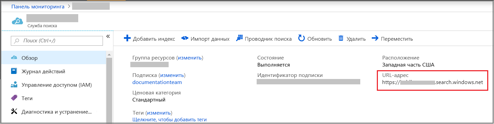
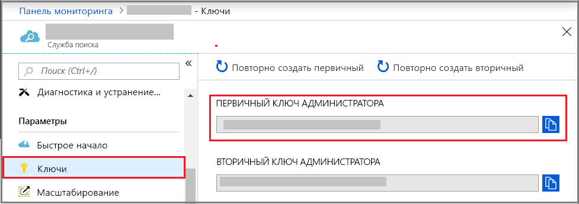

# Создание службы "Поиск Azure" на портале

Поиск Azure — это автономный ресурс, используемый для добавления поиска в пользовательские приложения. Хотя поиск Azure легко интегрируется со многими другими службами Azure, вы также можете использовать его отдельно, с приложениями на серверах сети, или с программным обеспечением, работающим на других облачных платформах.

В этой статье вы узнаете, как создать ресурс "Поиск Azure" на [портале Azure](https://portal.azure.com/).

Предпочитаете использовать PowerShell? Используйте [шаблон службы](https://azure.microsoft.com/resources/templates/101-azure-search-create/) Azure Resource Manager. Сведения для начала работы см. в статье [Управление службой поиска Azure с помощью PowerShell](search-manage-powershell.md).

## Подписка (бесплатная или платная)

[Откройте бесплатную учетную запись Azure](https://azure.microsoft.com/pricing/free-trial/?WT.mc_id=A261C142F) и используйте бесплатные кредиты, чтобы опробовать платные службы Azure. После того, как кредиты будут израсходованы, сохраните свою учетную запись. Вы сможете использовать ее для работы с бесплатными службами Azure, такими как веб-сайты. С вашей кредитной карты не будет взиматься плата, если вы явно не измените параметры и не попросите снимать плату.

Кроме того, вы можете [активировать преимущества подписчика MSDN](https://azure.microsoft.com/pricing/member-offers/msdn-benefits-details/?WT.mc_id=A261C142F). Подписка MSDN каждый месяц приносит вам кредиты, которыми можно оплачивать использование платных служб Azure. 

## Как найти Поиск Azure

1. Войдите на [портале Azure](https://portal.azure.com/).
2. Щелкните знак плюса ("+ Создать ресурс") в левом верхнем углу.
3. Используйте панель поиска, чтобы найти "Поиск Azure" или перейдите к ресурсу с помощью **Web** > **Azure Search**.

## Присвоение имени службы и URL-адреса конечной точки

Имя службы является частью URL-адреса конечной точки, к которой отправляются вызовы API: `https://your-service-name.search.windows.net`. Введите имя службы в поле **URL-адрес**.

Например, если вы хотите, чтобы конечная точка была `https://my-app-name-01.search.windows.net`, вы должны ввести `my-app-name-01`.

Требования к имени службы:

* имя должно быть уникальным в пределах пространства имен search.windows.net;
* должно содержать от 2 до 60 знаков;
* используйте строчные буквы, цифры или дефисы ("-");
* имя не должно содержать дефис ("-") в первых двух и последней позиции;
* имя не должно содержать последовательные дефисы ("--").

## Выбор подписки

Если у вас несколько подписок, выберите ту, которая также содержит службы хранилища данных или файлов. Служба "Поиск Azure" может автоматически определить хранилище таблиц Azure и хранилище BLOB-объектов Azure, базу данных SQL и Azure Cosmos DB для индексирования с помощью [*индексаторов*](search-indexer-overview.md), но только для служб в одной подписке.

## Выбор группы ресурсов

Группы ресурсов — это набор служб и ресурсов Azure, которые используются совместно. Например, если вы используете службу Поиска Azure для индексации базы данных SQL, то обе службы должны входить в одну группу ресурсов.

Если вы не объединяете ресурсы в одну группу или если существующие группы ресурсов заполнены ресурсами, используемыми в несвязанных решениях, создайте новую группу ресурсов только для своего ресурса Поиска Azure.

> [!TIP]
> При удалении группы ресурсов также удаляются службы внутри нее. Если проект прототипа использует нескольких служб, то, поместив их все в одну группу ресурсов, можно упростить очистку после завершения этого проекта.

## Выберите расположение

Являясь службой Azure, Поиск Azure может размещаться в центрах обработки данных по всему миру. [Цены могут отличаться](https://azure.microsoft.com/pricing/details/search/) в зависимости от географического региона.

Если вы индексируете данные, предоставляемые другой службой Azure (служба хранилища Azure, Azure Cosmos DB, База данных SQL Azure), создайте службу "Поиск Azure" в том же регионе, чтобы избежать начисления платы за пропускную способность. Если службы размещаются в одном регионе, плата за исходящий трафик не взимается.

Если вы используете обогащение когнитивного поиска с помощью ИИ, создайте службу в том же регионе, что и ресурс Cognitive Services. Совместное размещение служб является обязательным требованием для обогащения с помощью ИИ.

## Выбор ценовой категории (номера SKU)

[Служба "Поиск Azure" сейчас предлагается в нескольких ценовых категориях](https://azure.microsoft.com/pricing/details/search/): "Бесплатный", "Базовый" и "Стандартный". Каждая категория отличается собственным [объемом и ограничениями](search-limits-quotas-capacity.md). Подробные сведения см. в статье [Выбор SKU или ценовой категории для службы поиска Azure](search-sku-tier.md).

Цен. категория "Стандартный" обычно используется для рабочих нагрузок, но большинство клиентов начинает работу с бесплатной службой.

После создания службы ценовую категорию изменить нельзя. Если позднее вам потребуется повысить или понизить категорию, нужно будет повторно создать службу.

## Создание службы

Не забудьте закрепить службу на панели мониторинга, чтобы иметь к ней быстрый доступ после каждого входа в систему.

## Получение ключа и конечной точки URL-адреса

За редким исключением для использования новой службы необходимо указать конечную точку URL-адреса и ключ API авторизации. Краткие руководства, такие как [Работа с REST API службы "Поиск Azure" с помощью Fiddler или Postman](search-fiddler.md) и [Использование службы поиска Azure в приложении .NET](search-howto-dotnet-sdk.md), примеры и пользовательский код требуют конечной точки и ключа для запуска на конкретном ресурсе.

1. На странице обзора службы найдите и скопируйте конечную точку URL-адреса в правой части страницы.

   

2. На панели навигации слева выберите **Ключи**, а затем скопируйте любой из ключей администратора (они эквивалентны). API-ключи администратора необходимы для создания, обновления и удаления объектов в службе.

   

Конечная точка и ключ не нужны для задач портала. Портал уже связан с вашим ресурсом службы "Поиск Azure" с правами администратора. Дополнительные сведения о портале см. в статье [Краткое руководство. Использование встроенных инструментов на портале для импорта, индексирования и отправки запросов в Поиске Azure](search-get-started-portal.md).

## Выполните масштабирование службы

Создание службы может занять несколько минут (от 15 минут, в зависимости от уровня). Подготовив службу, вы можете выполнить ее масштабирование в соответствии со своими потребностями. Выбрав уровень "Стандартный" для службы поиска Azure, вы сможете масштабировать свою службу в двух измерениях: репликах и секциях. Если вы выбрали уровень "Базовый", то сможете добавлять только реплики. Если подготовлена бесплатная служба, масштабирование будет недоступно.

***Секции*** позволяют службе хранить данные и осуществлять поиск в большем количестве документов.

***Реплики*** дают службе возможность справляться с повышенной нагрузкой запросов поиска.

Добавление ресурсов увеличивает ваш ежемесячный счет. [Калькулятор цен](https://azure.microsoft.com/pricing/calculator/) поможет вам понять, как выставляются счета при добавлении ресурсов. Помните, что вы можете выбирать число ресурсов на основе нагрузки. Например, вы можете сначала увеличить число ресурсов для создания полного начального индекса, а затем уменьшить его до уровня, который больше подходит для добавочного индексирования.

> [!Important]
> У службы должно быть [2 реплики для выполнения соглашения об уровне обслуживания только для чтения и 3 реплики для выполнения соглашения об уровне обслуживания чтения и записи](https://azure.microsoft.com/support/legal/sla/search/v1_0/).

1. Перейдите к странице своей службы поиска на портале Azure.
2. В области навигации слева щелкните **Параметры** > **Масштаб**.
3. Используйте ползунок, чтобы добавить ресурсы любого типа.

> [!Note]
> Каждый уровень имеет свои [ограничения](search-limits-quotas-capacity.md) на общее количество единиц поиска, разрешенных для одной службы (реплики * секции = общее количество единиц поиска).

## Когда следует добавлять вторую службу

Большинство пользователей использует только одну службу, подготовленную на уровне, который обеспечивает [правильный баланс ресурсов](search-sku-tier.md). В одной службе может размещаться несколько индексов с учетом [максимального ограничения выбранного уровня](search-capacity-planning.md), при этом все индексы изолированы друг от друга. В Поиске Azure запросы могут направляться только в один индекс, сводя к минимуму вероятность случайного или преднамеренного извлечения данных из других индексов в той же службе.

Несмотря на то, что большинство пользователей использует только одну службу, избыточность служб может потребоваться, если в эксплуатационных целях необходимо обеспечить следующее:

* Аварийное восстановление (сбой центра обработки данных). Поиск Azure не обеспечивает немедленную отработку отказа в случае сбоя. Рекомендации и инструкции см. в статье [Администрирование службы поиска Azure на портале Azure](search-manage.md).
* Изучая мультитенантную модель, мы определили, что использование дополнительных служб обеспечивает оптимальную архитектуру. Дополнительные сведения см. в статье [Шаблоны разработки для мультитенантных приложений SaaS и Поиска Azure](search-modeling-multitenant-saas-applications.md).
* Для глобально развернутых приложений может потребоваться наличие экземпляра Поиска Azure в нескольких регионах, чтобы минимизировать задержку международного трафика приложения.

> [!NOTE]
> В Поиске Azure невозможно разделить индексирование и рабочие нагрузки запросов. Поэтому вы не сможете создать несколько служб для разделенных рабочих нагрузок. Индекс всегда запрашивается в службе, в которой он был создан (невозможно создать индекс в одной службе и скопировать его на другую).

Для обеспечения высокого уровня доступности вторая служба не является обязательной. Высокая доступность для запросов достигается за счет использования двух или более реплик в одной службе. Обновление реплик выполняется последовательно, то есть при развертывании обновления службы должна работать по крайней мере одна реплика. Дополнительные сведения об обеспечении бесперебойной работы см. в [Соглашении об уровне обслуживания](https://azure.microsoft.com/support/legal/sla/search/v1_0/).

## Дополнительная информация

После подготовки службы "Поиск Azure" вы можете продолжить на портале, чтобы создать свой первый индекс.

> [!div class="nextstepaction"]
> [Руководство Использование встроенных инструментов на портале для отправки запросов и индексирования в службе поиска Azure](search-get-started-portal.md)
