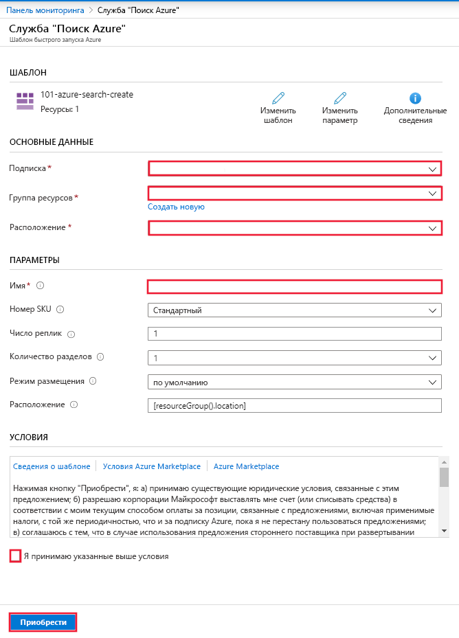

# Краткое руководство. Развертывание службы "Когнитивный поиск" с помощью шаблона ARM

В этой статье описывается процесс использования шаблона Azure Resource Manager (ARM) для развертывания ресурса Когнитивного поиска Azure на портале Azure.

[!INCLUDE [About Azure Resource Manager](../../includes/resource-manager-quickstart-introduction.md)]

Если среда соответствует предварительным требованиям и вы знакомы с использованием шаблонов ARM, нажмите кнопку **Развертывание в Azure**. Шаблон откроется на портале Azure.

## Предварительные требования

Если у вас еще нет подписки Azure, [создайте бесплатную учетную запись](https://azure.microsoft.com/free/?WT.mc_id=A261C142F), прежде чем начинать работу.

## Изучение шаблона

Шаблон, используемый в этом кратком руководстве, взят из [шаблонов быстрого запуска Azure](https://azure.microsoft.com/resources/templates/101-azure-search-create/).

:::code language="json"source="~/quickstart-templates/101-azure-search-create/azuredeploy.json":::

Ресурс Azure, определенный в этом шаблоне:

- [Microsoft.Search/searchServices](/azure/templates/Microsoft.Search/searchServices): создание службы "Когнитивный поиск Azure"

## Развертывание шаблона

Выберите следующее изображение, чтобы войти на портал Azure и открыть шаблон. Шаблон создает ресурс службы "Когнитивный поиск Azure".

На портале отображается форма, позволяющая легко указывать значения параметров. Некоторые параметры предварительно заполняются стандартными значениями из шаблона. Вам потребуется указать подписку, группу ресурсов, расположение и имя службы. Если вы хотите использовать Cognitive Services в конвейере [обогащения с помощью ИИ](cognitive-search-concept-intro.md), например для анализа двоичных файлов изображений для текста, выберите расположение, которое предлагает как Когнитивный поиск, так и Cognitive Services. Для рабочих нагрузок обогащения с помощью ИИ обе службы должны находиться в одном регионе. После заполнения формы необходимо принять условия, а затем нажать кнопку "Приобрести", чтобы завершить развертывание.

> [!div class="mx-imgBorder"]
> 

## Просмотр развернутых ресурсов

После завершения развертывания вы сможете получить доступ к новой группе ресурсов и новой службе поиска на портале.

## Очистка ресурсов

Другие руководства и учебники службы "Когнитивный поиск Azure" созданы на основе этого краткого руководства. Если вы планируете продолжить работу с последующими краткими руководствами и статьями, этот ресурс можно не удалять. Вы можете удалить группу ресурсов, которая удаляет службу "Когнитивный поиск "и связанные с ней ресурсы, если она больше не нужна.

## Дальнейшие действия

Работая с этим кратким руководством, вы создали службу "Когнитивный поиск Azure" с помощью шаблона ARM и проверили развертывание. Дополнительные сведения о службе "Когнитивный поиск Azure" и Azure Resource Manager см. в статьях ниже.

- Ознакомьтесь со статьей [Что собой представляет Когнитивный поиск Azure?](search-what-is-azure-search.md).
- [Создание индекса](search-get-started-portal.md) для службы поиска.
- [Создание демонстрационного приложения](search-create-app-portal.md) с помощью мастера портала.
- [Создание набора навыков](cognitive-search-quickstart-blob.md) для извлечения информации из данных.
