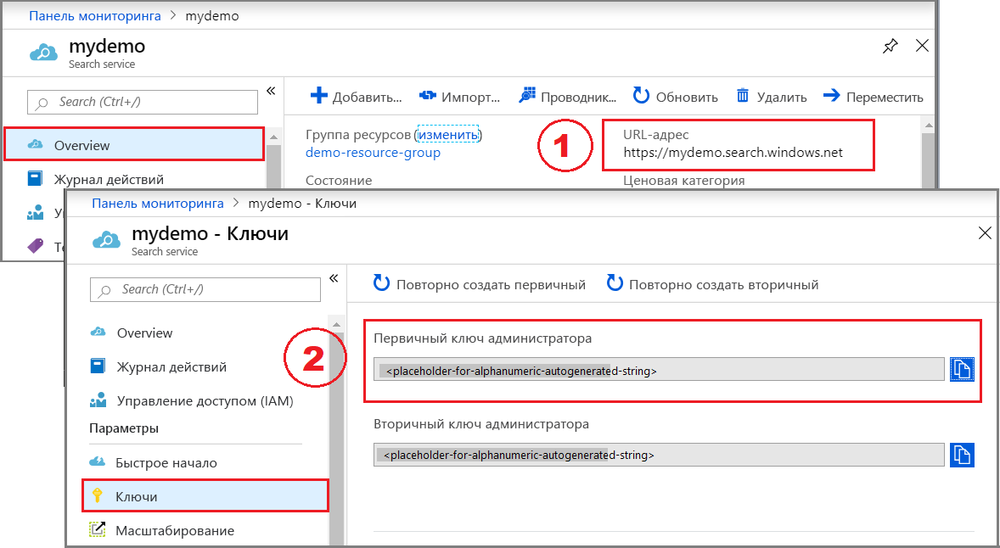

# <a name="quickstart-create-an-azure-cognitive-search-index-in-c-using-the-net-sdk"></a>Краткое руководство. Создание индекса службы "Когнитивный поиск Azure" с помощью C# и пакета SDK .NET
> [!div class="op_single_selector"]
> * [C#](search-get-started-dotnet.md)
> * [Портал](search-get-started-portal.md)
> * [PowerShell](search-create-index-rest-api.md)
> * [Python](search-get-started-python.md)
> * [Postman](search-get-started-postman.md)
>*

Создание консольного приложения .NET Core на языке C#, которое создает, загружает и опрашивает индекс Когнитивного поиска Azure, с помощью Visual Studio и [пакета SDK .NET для Когнитивного поиска Azure](https://aka.ms/search-sdk). В статье описан поэтапный процесс создания предложения. Кроме того, можно [скачать и установить готовую версию приложения](https://github.com/Azure-Samples/azure-search-dotnet-samples/tree/master/Quickstart).

Если у вас еще нет подписки Azure, [создайте бесплатную учетную запись Azure](https://azure.microsoft.com/free/?WT.mc_id=A261C142F), прежде чем начинать работу.

> [!NOTE]
> В демонстрационном коде этой статьи для простоты используются синхронные методы пакета SDK .NET для Когнитивного поиска Azure. Но в приложениях для рабочей среды мы рекомендуем использовать асинхронные методы, чтобы обеспечить масштабируемость и высокую скорость отклика. Например, можно использовать `CreateAsync` и `DeleteAsync` вместо `Create` и `Delete`.

## <a name="prerequisites"></a>Предварительные требования

Для выполнения инструкций из этого краткого руководства необходимы перечисленные ниже службы и инструменты.

+ [Visual Studio](https://visualstudio.microsoft.com/downloads/) (любой выпуск). Пример кода и инструкции были протестированы с помощью бесплатного выпуска Community Edition.

+ [Создайте службу "Когнитивный поиск Azure"](search-create-service-portal.md) или [найдите имеющуюся службу](https://ms.portal.azure.com/#blade/HubsExtension/BrowseResourceBlade/resourceType/Microsoft.Search%2FsearchServices) в рамках текущей подписки. Вы можете использовать бесплатную службу для выполнения инструкций, описанных в этом кратком руководстве.

<a name="get-service-info"></a>

## <a name="get-a-key-and-url"></a>Получение ключа и URL-адреса

Вызовы к службе требуют конечную точку URL-адреса и ключ доступа при каждом запросе. Служба поиска создана с обоими элементами, поэтому если вы добавили службу "Когнитивный поиск Azure" в подписку, выполните следующие действия для получения необходимых сведений:

1. [Войдите на портал Azure](https://portal.azure.com/) и на странице **обзора** службы поиска получите URL-адрес. Пример конечной точки может выглядеть так: `https://mydemo.search.windows.net`.

2. В разделе **Параметры** > **Ключи** получите ключ администратора, чтобы обрести полные права на службу. Существуют два взаимозаменяемых ключа администратора, предназначенных для обеспечения непрерывности бизнес-процессов на случай, если вам потребуется сменить один из них. Вы можете использовать первичный или вторичный ключ для выполнения запросов на добавление, изменение и удаление объектов.

   Получите также ключ запроса. Мы рекомендуем создавать запросы с доступом только для чтения.



Для выполнения любого запроса к службе требуется использование ключа API. Если есть действительный ключ, для каждого запроса устанавливаются отношения доверия между приложением, которое отправляет запрос, и службой, которая его обрабатывает.

## <a name="set-up-your-environment"></a>Настройка среды

Сначала откройте Visual Studio и создайте новый проект консольного приложения, которое будет выполняться на базе .NET Core.

### <a name="install-nuget-packages"></a>Установка пакетов Nuget

[Пакет SDK .NET для Когнитивного поиска Azure](https://aka.ms/search-sdk) состоит из нескольких клиентских библиотек, которые распространяются в формате пакетов NuGet.

Для этого проекта примените версию 9 пакета NuGet `Microsoft.Azure.Search` и последнюю версию пакета NuGet `Microsoft.Extensions.Configuration.Json`.

1. В разделе **Инструменты** > **Диспетчер пакетов NuGet** выберите  **Управление пакетами NugGet для решения...** . 

1. Щелкните **Обзор**.

1. Выполните поиск по `Microsoft.Azure.Search` и выберите версию 9.0.1 или более позднюю.

1. Щелкните **Установить** справа, чтобы добавить сборку в проект и решение.

1. Повторите эти действия для `Microsoft.Extensions.Configuration.Json`, выбрав версию 2.2.0 или более позднюю.


### <a name="add-azure-cognitive-search-service-information"></a>Добавление сведений о службе "Когнитивный поиск Azure"

1. Щелкните правой кнопкой мыши проект в обозревателе решений и выберите **Добавить** > **Новый элемент...** . 

1. В диалоге добавления элемента выполните поиск по строке JSON, чтобы получить список типов элементов, связанных с JSON.

1. Выберите **файл JSON**, присвойте файлу имя appsettings.json и щелкните **Добавить**. 

1. Добавьте файл в каталог выходных данных. Щелкните правой кнопкой мыши файл appsettings.json и выберите **Свойства**. Для параметра **Копировать в выходной каталог** выберите значение **Копировать, если новее**.

1. Скопируйте указанный ниже код JSON в созданный файл JSON. Замените заполнители имени службы поиска (YOUR-SEARCH-SERVICE-NAME) и ключа API администрирования (YOUR-ADMIN-API-KEY) реальными значениями. Если конечная точка службы имеет имя `https://mydemo.search.windows.net`, значит служба называется mydemo.

```json
{
  "SearchServiceName": "<YOUR-SEARCH-SERVICE-NAME>",
  "SearchServiceAdminApiKey": "<YOUR-ADMIN-API-KEY>",
  "SearchIndexName": "hotels-quickstart"
}
```

### <a name="add-class-method-files-to-your-project"></a>Добавление файлов класса ".Method" в проект

При выводе результатов в окно консоли отдельные поля из объекта Hotel должны возвращаться как строки. Для выполнения этой задачи вы можете реализовать метод [ToString()](https://docs.microsoft.com/dotnet/api/system.object.tostring?view=netframework-4.8), скопировав необходимый код в два новых файла.

1. Добавьте в проект два пустых определения классов: Address.Methods.cs и Hotel.Methods.cs.

1. В файле Address.Methods.cs замените содержимое по умолчанию [в строках 1–32](https://github.com/Azure-Samples/azure-search-dotnet-samples/blob/master/Quickstart/AzureSearchQuickstart/Address.Methods.cs/#L1-L32) следующим кодом.

1. Из файла Hotel.Methods.cs скопируйте [строки 1–66](https://github.com/Azure-Samples/azure-search-dotnet-samples/blob/master/Quickstart/AzureSearchQuickstart/Hotel.Methods.cs/#L1-L66).


## <a name="1---create-index"></a>1\. Создание индекса

Индекс отелей состоит из простых и сложных полей. Например, HotelName и Description являются простыми полями, а структура адреса с дополнительными полями и коллекция гостиничных номеров будут примерами сложных. Если индекс содержит сложные типы, вынесите определения сложных полей в отдельные классы.

1. Добавьте в проект два пустых определения классов: Address.cs и Hotel.cs.

1. В файле Address.Methods.cs замените содержимое по умолчанию следующим кодом:

    ```csharp
    using System;
    using Microsoft.Azure.Search;
    using Microsoft.Azure.Search.Models;
    using Newtonsoft.Json;

    namespace AzureSearchQuickstart
    {
        public partial class Address
        {
            [IsSearchable]
            public string StreetAddress { get; set; }

            [IsSearchable, IsFilterable, IsSortable, IsFacetable]
            public string City { get; set; }

            [IsSearchable, IsFilterable, IsSortable, IsFacetable]
            public string StateProvince { get; set; }

            [IsSearchable, IsFilterable, IsSortable, IsFacetable]
            public string PostalCode { get; set; }

            [IsSearchable, IsFilterable, IsSortable, IsFacetable]
            public string Country { get; set; }
        }
    }
    ```

1. Класс в файле Hotel.cs определяет общую структуру индекса, в том числе ссылки на класс address.

    ```csharp
    namespace AzureSearchQuickstart
    {
        using System;
        using Microsoft.Azure.Search;
        using Microsoft.Azure.Search.Models;
        using Newtonsoft.Json;

        public partial class Hotel
        {
            [System.ComponentModel.DataAnnotations.Key]
            [IsFilterable]
            public string HotelId { get; set; }

            [IsSearchable, IsSortable]
            public string HotelName { get; set; }

            [IsSearchable]
            [Analyzer(AnalyzerName.AsString.EnMicrosoft)]
            public string Description { get; set; }

            [IsSearchable]
            [Analyzer(AnalyzerName.AsString.FrLucene)]
            [JsonProperty("Description_fr")]
            public string DescriptionFr { get; set; }

            [IsSearchable, IsFilterable, IsSortable, IsFacetable]
            public string Category { get; set; }

            [IsSearchable, IsFilterable, IsFacetable]
            public string[] Tags { get; set; }

            [IsFilterable, IsSortable, IsFacetable]
            public bool? ParkingIncluded { get; set; }

            [IsFilterable, IsSortable, IsFacetable]
            public DateTimeOffset? LastRenovationDate { get; set; }

            [IsFilterable, IsSortable, IsFacetable]
            public double? Rating { get; set; }

            public Address Address { get; set; }
        }
    }
    ```

    Атрибуты поля определяют его использование в приложении. Например, атрибут `IsSearchable` нужно назначить каждому полю, которое должно включаться в полнотекстовый поиск. 
    
    > [!NOTE]
    > В пакете SDK для .NET полям должны быть явно заданы такие атрибуты, как [`IsSearchable`](https://docs.microsoft.com/dotnet/api/microsoft.azure.search.models.field.issearchable?view=azure-dotnet), [`IsFilterable`](https://docs.microsoft.com/dotnet/api/microsoft.azure.search.models.field.isfilterable?view=azure-dotnet), [`IsSortable`](https://docs.microsoft.com/dotnet/api/microsoft.azure.search.models.field.issortable?view=azure-dotnet) и [`IsFacetable`](https://docs.microsoft.com/dotnet/api/microsoft.azure.search.models.field.isfacetable?view=azure-dotnet). В отличие от этого, REST API неявно включает атрибуты на основе типа данных (например, простые строковые поля автоматически доступны для поиска).

    Только одно поле в индексе типа `string` должно быть назначено как *ключевое* (key), то есть уникальное для каждого документа. В нашей схеме ключевым является `HotelId`.

    В этом индексе поля описания имеют необязательное свойство [`analyzer`](https://docs.microsoft.com/dotnet/api/microsoft.azure.search.models.field.analyzer?view=azure-dotnet), которое используется для переопределения стандартного анализатора Lucene. Поле `description_fr` использует анализатор Lucene для французского языка ([FrLucene](https://docs.microsoft.com/dotnet/api/microsoft.azure.search.models.analyzername.frlucene?view=azure-dotnet)), так как в нем хранится текст на французском языке. Поле `description` использует необязательный анализатор языка Майкрософт ([EnMicrosoft](https://docs.microsoft.com/dotnet/api/microsoft.azure.search.models.analyzername.enmicrosoft?view=azure-dotnet)).

1. Создайте в файле Program.cs экземпляр класса [`SearchServiceClient`](https://docs.microsoft.com/dotnet/api/microsoft.azure.search.searchserviceclient?view=azure-dotnet) для подключения к службе с использованием значений, которые хранятся в файле конфигурации приложения (appsettings.json). 

   `SearchServiceClient` содержит свойство [`Indexes`](https://docs.microsoft.com/dotnet/api/microsoft.azure.search.searchserviceclient.indexes?view=azure-dotnet), которое предоставляет все методы для создания, перечисления, обновления или удаления индексов службы "Когнитивный поиск Azure". 

    ```csharp
    using System;
    using System.Linq;
    using System.Threading;
    using Microsoft.Azure.Search;
    using Microsoft.Azure.Search.Models;
    using Microsoft.Extensions.Configuration;

    namespace AzureSearchQuickstart
    {
        class Program
            // Demonstrates index delete, create, load, and query
            // Commented-out code is uncommented in later steps
            static void Main(string[] args)
            {
                IConfigurationBuilder builder = new ConfigurationBuilder().AddJsonFile("appsettings.json");
                IConfigurationRoot configuration = builder.Build();

                SearchServiceClient serviceClient = CreateSearchServiceClient(configuration);

                string indexName = configuration["SearchIndexName"];

                Console.WriteLine("{0}", "Deleting index...\n");
                DeleteIndexIfExists(indexName, serviceClient);

                Console.WriteLine("{0}", "Creating index...\n");
                CreateIndex(indexName, serviceClient);

                // Uncomment next 3 lines in "2 - Load documents"
                // ISearchIndexClient indexClient = serviceClient.Indexes.GetClient(indexName);
                // Console.WriteLine("{0}", "Uploading documents...\n");
                // UploadDocuments(indexClient);

                // Uncomment next 2 lines in "3 - Search an index"
                // Console.WriteLine("{0}", "Searching index...\n");
                // RunQueries(indexClient);

                Console.WriteLine("{0}", "Complete.  Press any key to end application...\n");
                Console.ReadKey();
            }

            // Create the search service client
            private static SearchServiceClient CreateSearchServiceClient(IConfigurationRoot configuration)
            {
                string searchServiceName = configuration["SearchServiceName"];
                string adminApiKey = configuration["SearchServiceAdminApiKey"];

                SearchServiceClient serviceClient = new SearchServiceClient(searchServiceName, new SearchCredentials(adminApiKey));
                return serviceClient;
            }

            // Delete an existing index to reuse its name
            private static void DeleteIndexIfExists(string indexName, SearchServiceClient serviceClient)
            {
                if (serviceClient.Indexes.Exists(indexName))
                {
                    serviceClient.Indexes.Delete(indexName);
                }
            }

            // Create an index whose fields correspond to the properties of the Hotel class.
            // The Address property of Hotel will be modeled as a complex field.
            // The properties of the Address class in turn correspond to sub-fields of the Address complex field.
            // The fields of the index are defined by calling the FieldBuilder.BuildForType() method.
            private static void CreateIndex(string indexName, SearchServiceClient serviceClient)
            {
                var definition = new Index()
                {
                    Name = indexName,
                    Fields = FieldBuilder.BuildForType<Hotel>()
                };

                serviceClient.Indexes.Create(definition);
            }
        }
    }    
    ```

    По возможности используйте в приложении один экземпляр `SearchServiceClient` для всех задач, чтобы избежать чрезмерно большого числа подключений. Методы этого класса поддерживают такое использование, так как являются потокобезопасными.

   Этот класс имеет несколько конструкторов. Нужный вам конструктор принимает в качестве параметров имя службы поиска и объект `SearchCredentials` . `SearchCredentials` содержит ключ API.

    При определении индекса для создания объектов `Field` проще всего вызвать метод `FieldBuilder.BuildForType` и передать ему класс модели в качестве параметра типа. Свойства класса модели сопоставляются с полями индекса. Это сопоставление позволяет привязать документы из индекса поиска к экземплярам класса модели.

    > [!NOTE]
    > Если вы не планируете использовать класс модели, индекс можно определить путем непосредственного создания объектов `Field`. Имя поля вместе с типом данных можно указать в конструкторе (или анализаторе для строковых полей). Кроме того, вы можете задать другие свойства, например `IsSearchable`, `IsFilterable` и т. д.
    >

1. Нажмите клавишу F5, чтобы скомпилировать приложение и создать индекс. 

    Если сборка проекта завершится успешно, откроется окно консоли с сообщениями о состоянии и экраном для удаления и создания индекса. 

<a name="load-documents"></a>

## <a name="2---load-documents"></a>2\. Загрузка документов

Документы в службе "Когнитивный поиск Azure" представляют собой структуры данных, которые служат входами для индексирования и (или) выходами для запросов. Полученные из внешнего источника данных входные документы могут содержать строки базы данных, большие двоичные объекты из хранилища BLOB-объектов или сохраненные на диске документы JSON. В нашем примере мы выбрали самый простой путь, внедрив прямо в код документы JSON с информацией о четырех отелях. 

При отправке документов следует использовать объект [`IndexBatch`](https://docs.microsoft.com/dotnet/api/microsoft.azure.search.models.indexbatch?view=azure-dotnet). `IndexBatch` содержит коллекцию объектов [`IndexAction`](https://docs.microsoft.com/dotnet/api/microsoft.azure.search.models.indexaction?view=azure-dotnet), каждый из которых содержит документ и свойство с описанием действия, которое должен выполнить Когнитивный поиск Azure ([отправка, объединение, удаление и mergeOrUpload](search-what-is-data-import.md#indexing-actions)).

1. В файле Program.cs создайте массив документов и действий индексирования, а затем передайте этот массив в `IndexBatch`. Приведенные ниже документы соответствуют индексу hotel-quickstart, который определен в классах hotel и address.

    ```csharp
    // Upload documents as a batch
    private static void UploadDocuments(ISearchIndexClient indexClient)
    {
        var actions = new IndexAction<Hotel>[]
        {
            IndexAction.Upload(
                new Hotel()
                {
                    HotelId = "1",
                    HotelName = "Secret Point Motel",
                    Description = "The hotel is ideally located on the main commercial artery of the city in the heart of New York. A few minutes away is Time's Square and the historic centre of the city, as well as other places of interest that make New York one of America's most attractive and cosmopolitan cities.",
                    DescriptionFr = "L'hôtel est idéalement situé sur la principale artère commerciale de la ville en plein cœur de New York. A quelques minutes se trouve la place du temps et le centre historique de la ville, ainsi que d'autres lieux d'intérêt qui font de New York l'une des villes les plus attractives et cosmopolites de l'Amérique.",
                    Category = "Boutique",
                    Tags = new[] { "pool", "air conditioning", "concierge" },
                    ParkingIncluded = false,
                    LastRenovationDate = new DateTimeOffset(1970, 1, 18, 0, 0, 0, TimeSpan.Zero),
                    Rating = 3.6,
                    Address = new Address()
                    {
                        StreetAddress = "677 5th Ave",
                        City = "New York",
                        StateProvince = "NY",
                        PostalCode = "10022",
                        Country = "USA"
                    }
                }
            ),
            IndexAction.Upload(
                new Hotel()
                {
                    HotelId = "2",
                    HotelName = "Twin Dome Motel",
                    Description = "The hotel is situated in a  nineteenth century plaza, which has been expanded and renovated to the highest architectural standards to create a modern, functional and first-class hotel in which art and unique historical elements coexist with the most modern comforts.",
                    DescriptionFr = "L'hôtel est situé dans une place du XIXe siècle, qui a été agrandie et rénovée aux plus hautes normes architecturales pour créer un hôtel moderne, fonctionnel et de première classe dans lequel l'art et les éléments historiques uniques coexistent avec le confort le plus moderne.",
                    Category = "Boutique",
                    Tags = new[] { "pool", "free wifi", "concierge" },
                    ParkingIncluded = false,
                    LastRenovationDate =  new DateTimeOffset(1979, 2, 18, 0, 0, 0, TimeSpan.Zero),
                    Rating = 3.60,
                    Address = new Address()
                    {
                        StreetAddress = "140 University Town Center Dr",
                        City = "Sarasota",
                        StateProvince = "FL",
                        PostalCode = "34243",
                        Country = "USA"
                    }
                }
            ),
            IndexAction.Upload(
                new Hotel()
                {
                    HotelId = "3",
                    HotelName = "Triple Landscape Hotel",
                    Description = "The Hotel stands out for its gastronomic excellence under the management of William Dough, who advises on and oversees all of the Hotel’s restaurant services.",
                    DescriptionFr = "L'hôtel est situé dans une place du XIXe siècle, qui a été agrandie et rénovée aux plus hautes normes architecturales pour créer un hôtel moderne, fonctionnel et de première classe dans lequel l'art et les éléments historiques uniques coexistent avec le confort le plus moderne.",
                    Category = "Resort and Spa",
                    Tags = new[] { "air conditioning", "bar", "continental breakfast" },
                    ParkingIncluded = true,
                    LastRenovationDate = new DateTimeOffset(2015, 9, 20, 0, 0, 0, TimeSpan.Zero),
                    Rating = 4.80,
                    Address = new Address()
                    {
                        StreetAddress = "3393 Peachtree Rd",
                        City = "Atlanta",
                        StateProvince = "GA",
                        PostalCode = "30326",
                        Country = "USA"
                    }
                }
            ),
            IndexAction.Upload(
                new Hotel()
                {
                    HotelId = "4",
                    HotelName = "Sublime Cliff Hotel",
                    Description = "Sublime Cliff Hotel is located in the heart of the historic center of Sublime in an extremely vibrant and lively area within short walking distance to the sites and landmarks of the city and is surrounded by the extraordinary beauty of churches, buildings, shops and monuments. Sublime Cliff is part of a lovingly restored 1800 palace.",
                    DescriptionFr = "Le sublime Cliff Hotel est situé au coeur du centre historique de sublime dans un quartier extrêmement animé et vivant, à courte distance de marche des sites et monuments de la ville et est entouré par l'extraordinaire beauté des églises, des bâtiments, des commerces et Monuments. Sublime Cliff fait partie d'un Palace 1800 restauré avec amour.",
                    Category = "Boutique",
                    Tags = new[] { "concierge", "view", "24-hour front desk service" },
                    ParkingIncluded = true,
                    LastRenovationDate = new DateTimeOffset(1960, 2, 06, 0, 0, 0, TimeSpan.Zero),
                    Rating = 4.6,
                    Address = new Address()
                    {
                        StreetAddress = "7400 San Pedro Ave",
                        City = "San Antonio",
                        StateProvince = "TX",
                        PostalCode = "78216",
                        Country = "USA"
                    }
                }
            ),
        };

        var batch = IndexBatch.New(actions);

        try
        {
            indexClient.Documents.Index(batch);
        }
        catch (IndexBatchException e)
        {
            // When a service is under load, indexing might fail for some documents in the batch. 
            // Depending on your application, you can compensate by delaying and retrying. 
            // For this simple demo, we just log the failed document keys and continue.
            Console.WriteLine(
                "Failed to index some of the documents: {0}",
                String.Join(", ", e.IndexingResults.Where(r => !r.Succeeded).Select(r => r.Key)));
        }

        // Wait 2 seconds before starting queries 
        Console.WriteLine("Waiting for indexing...\n");
        Thread.Sleep(2000);
    }
    ```

    Получив инициализированный объект `IndexBatch`, вы можете отправить его в индекс, вызвав метод [`Documents.Index`](https://docs.microsoft.com/dotnet/api/microsoft.azure.search.documentsoperationsextensions.index?view=azure-dotnet) из объекта [`SearchIndexClient`](https://docs.microsoft.com/dotnet/api/microsoft.azure.search.searchindexclient?view=azure-dotnet). `Documents` является свойством `SearchIndexClient` и предоставляет методы для добавления, изменения, удаления документов в индексе и запроса по ним.

    Блок `try`/`catch` вокруг вызова метода `Index` перехватывает ошибки индексирования, которые могут возникать при большой нагрузке на службу. В реальной системе вы можете после некоторой паузы повторить попытку индексирования документов, с которыми возникла ошибка, либо занести ошибку в журнал и продолжить работу, как в нашем примере, или выполнить другие действия в зависимости от требований к целостности данных для вашего приложения.

    2-секундная задержка дает достаточно времени для асинхронного индексирования, чтобы все документы уже были проиндексированы перед выполнением запросов. Задержки в коде обычно используются только в демонстрациях, тестах и примерах приложений.

1. В файле Program.cs раскомментируйте в методе main строки раздела "2 - Load documents" (Загрузка документов). 

    ```csharp
    // Uncomment next 3 lines in "2 - Load documents"
    ISearchIndexClient indexClient = serviceClient.Indexes.GetClient(indexName);
    Console.WriteLine("{0}", "Uploading documents...\n");
    UploadDocuments(indexClient);
    ```
1. Нажмите клавишу F5, чтобы пересобрать приложение. 

    Если сборка проекта завершится успешно, откроется окно консоли с сообщениями о состоянии, где теперь будет сообщение об отправке документов. На портале Azure откройте **обзорную страницу** для службы поиска, на которой теперь должно появиться четыре документа в индексе hotels-quickstart.

Дополнительные сведения об обработке документов см. в разделе [Обработка документов пакетом SDK для .NET](search-howto-dotnet-sdk.md#how-dotnet-handles-documents).

## <a name="3---search-an-index"></a>3\. Поиск в индексе

Результаты запросов можно получить сразу по завершении индексирования первого документа, но для полноценного тестирования индекса придется подождать, пока закончится индексирование всех документов. 

В этом разделе мы добавим две новые функции: логику запроса и результаты. Для запросов используйте метод [`Search`](https://docs.microsoft.com/dotnet/api/microsoft.azure.search.documentsoperationsextensions.search?view=azure-dotnet
). Этот метод принимает текст для поиска и другие [параметры](https://docs.microsoft.com/dotnet/api/microsoft.azure.search.models.searchparameters?view=azure-dotnet). 

Класс [`DocumentsSearchResult`](https://docs.microsoft.com/dotnet/api/microsoft.azure.search.models.documentsearchresult-1?view=azure-dotnet) представляет результаты запроса.


1. В файле Program.cs создайте метод WriteDocuments, который выводит в консоль результаты поиска.

    ```csharp
    private static void WriteDocuments(DocumentSearchResult<Hotel> searchResults)
    {
        foreach (SearchResult<Hotel> result in searchResults.Results)
        {
            Console.WriteLine(result.Document);
        }

        Console.WriteLine();
    }
    ```

1. Создайте метод RunQueries для выполнения запросов и возврата результатов. Результаты имеют формат объектов Hotel. С помощью параметра select вы можете выбрать для получения отдельные поля. Если поле не включено в параметр select, соответствующее свойство объекта Hotle будет иметь значение NULL.

    ```csharp
    private static void RunQueries(ISearchIndexClient indexClient)
    {
        SearchParameters parameters;
        DocumentSearchResult<Hotel> results;

        // Query 1 
        Console.WriteLine("Query 1: Search for term 'Atlanta' with no result trimming");
        parameters = new SearchParameters();
        results = indexClient.Documents.Search<Hotel>("Atlanta", parameters);
        WriteDocuments(results);

        // Query 2
        Console.WriteLine("Query 2: Search on the term 'Atlanta', with trimming");
        Console.WriteLine("Returning only these fields: HotelName, Tags, Address:\n");
        parameters =
            new SearchParameters()
            {
                Select = new[] { "HotelName", "Tags", "Address" },
            };
        results = indexClient.Documents.Search<Hotel>("Atlanta", parameters);
        WriteDocuments(results);

        // Query 3
        Console.WriteLine("Query 3: Search for the terms 'restaurant' and 'wifi'");
        Console.WriteLine("Return only these fields: HotelName, Description, and Tags:\n");
        parameters =
            new SearchParameters()
            {
                Select = new[] { "HotelName", "Description", "Tags" }
            };
        results = indexClient.Documents.Search<Hotel>("restaurant, wifi", parameters);
        WriteDocuments(results);

        // Query 4 -filtered query
        Console.WriteLine("Query 4: Filter on ratings greater than 4");
        Console.WriteLine("Returning only these fields: HotelName, Rating:\n");
        parameters =
            new SearchParameters()
            {
                Filter = "Rating gt 4",
                Select = new[] { "HotelName", "Rating" }
            };
        results = indexClient.Documents.Search<Hotel>("*", parameters);
        WriteDocuments(results);

        // Query 5 - top 2 results
        Console.WriteLine("Query 5: Search on term 'boutique'");
        Console.WriteLine("Sort by rating in descending order, taking the top two results");
        Console.WriteLine("Returning only these fields: HotelId, HotelName, Category, Rating:\n");
        parameters =
            new SearchParameters()
            {
                OrderBy = new[] { "Rating desc" },
                Select = new[] { "HotelId", "HotelName", "Category", "Rating" },
                Top = 2
            };
        results = indexClient.Documents.Search<Hotel>("boutique", parameters);
        WriteDocuments(results);
    }
    ```

    Существует два [метода сопоставления терминов в запросе](search-query-overview.md#types-of-queries): полнотекстовый поиск и фильтры. Полнотекстовый поисковый запрос ищет один или несколько терминов в полях `IsSearchable` в индексе. Фильтр является логическим выражением, которое оценивается для всех полей `IsFilterable` в индексе. Полнотекстовый поиск и фильтры можно использовать вместе или по отдельности.

    Поиск и фильтрация выполняются с помощью метода `Documents.Search` . Поисковый запрос можно передать в параметре `searchText`, а выражение фильтра — в свойстве `Filter` класса `SearchParameters`. Чтобы выполнить фильтрацию и при этом не выполнять поиск, в качестве значения параметра `searchText` укажите `"*"`. Чтобы выполнить поиск, не прибегая к фильтрации, не задавайте значение свойства `Filter` или вообще не передавайте его в экземпляр `SearchParameters`.

1. В файле Program.cs раскомментируйте в методе main строки раздела "3 - Search" (Поиск). 

    ```csharp
    // Uncomment next 2 lines in "3 - Search an index"
    Console.WriteLine("{0}", "Searching documents...\n");
    RunQueries(indexClient);
    ```
1. Теперь наше решение полностью готово. Нажмите клавишу F5, чтобы перестроить приложение и запустить полнофункциональную программу. 

    Выходные данные содержат те же сообщения, что и ранее, с новыми сведениями о запросе и результатах.

## <a name="clean-up-resources"></a>Очистка ресурсов

Если вы работаете в своей подписке, по окончании проекта рекомендуем решить, нужны ли вам созданные ресурсы. Работающие ресурсы могут означать лишние затраты. Можно удалить отдельные ресурсы или удалить группу ресурсов, что позволит удалить весь набор ресурсов.

Просматривать ресурсы и управлять ими можно на портале с помощью ссылок **Все ресурсы** или **Группы ресурсов** на панели навигации слева.

При работе с бесплатной версией службы помните о том, что вам доступно максимум три индекса, индексатора и источника данных. Вы можете удалить отдельные элементы на портале, чтобы не превысить лимит. 

## <a name="next-steps"></a>Дополнительная информация

В этом кратком руководстве для C# вы отработали ряд задач по созданию индекса, загрузке документов в него и выполнению запросов. Мы несколько упростили решение, чтобы код было проще читать и понимать. Если основные понятия вы усвоили хорошо, мы рекомендуем перейти к следующей статье для изучения альтернативных подходов и основных понятий, которые дополнят и расширят ваши знания. 

Примеры кода и индекса являются развернутой версией этого индекса. Следующий пример добавляет коллекцию Rooms, применяет разные классы и действия, а также более подробно демонстрирует процессы обработки.

> [!div class="nextstepaction"]
> [Разработка в .NET](search-howto-dotnet-sdk.md)