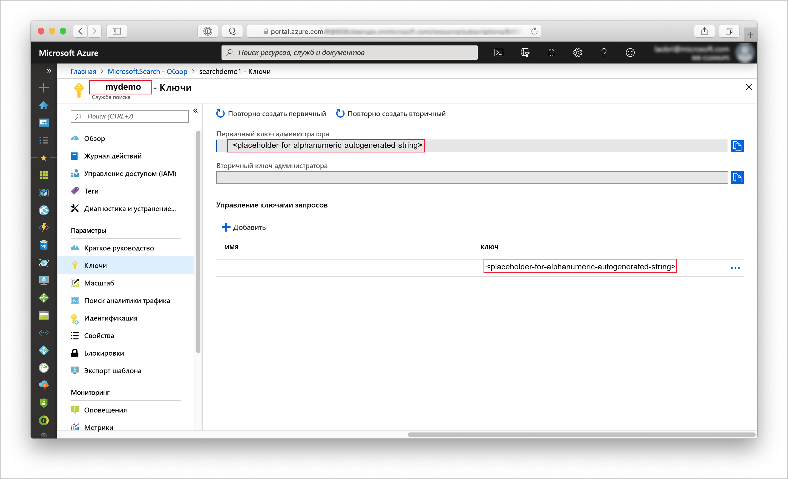
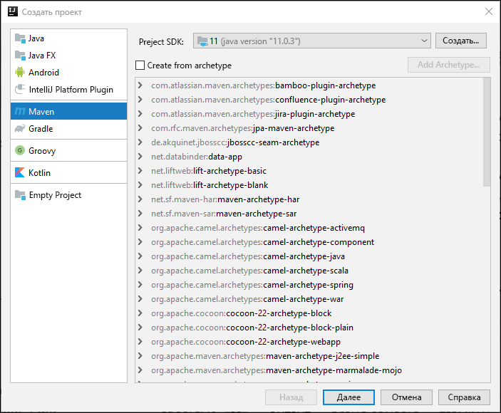
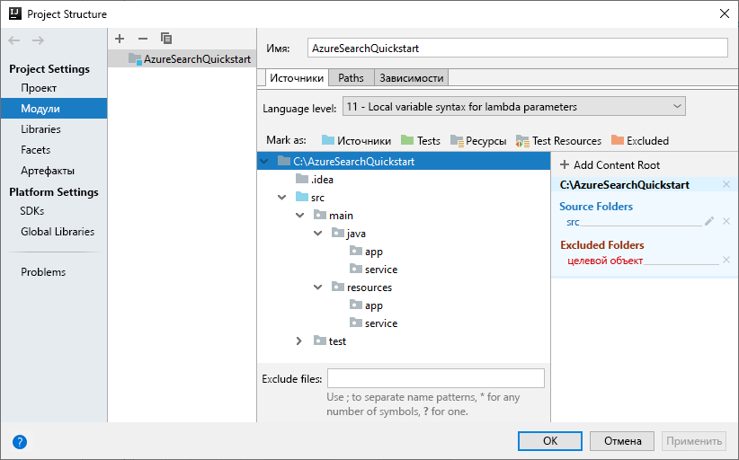
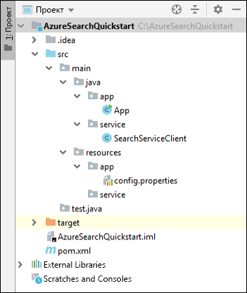
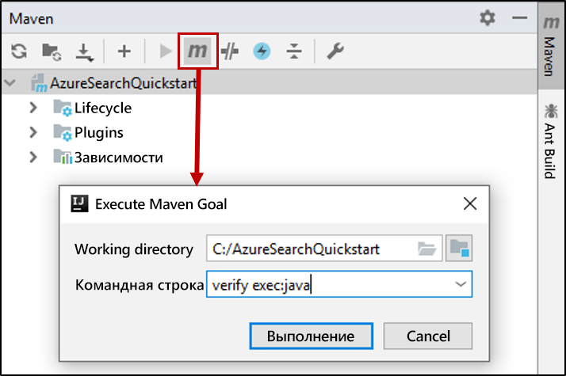

# <a name="quickstart-create-load-and-query-indexes-using-azure-search-rest-apis-with-java"></a>Краткое руководство. Создание, загрузка индексов и отправка запросов к ним с помощью REST API Поиска Azure на языке Java
> [!div class="op_single_selector"]
> * [JavaScript](search-get-started-nodejs.md)
> * [C#](search-get-started-dotnet.md)
> * [Java](search-get-started-java.md)
> * [Портал](search-get-started-portal.md)
> * [PowerShell](search-create-index-rest-api.md)
> * [Python](search-get-started-python.md)
> * [Postman](search-get-started-postman.md)

В статье приводятся пошаговые инструкции по созданию консольного приложения Java, которое создает, загружает и запрашивает индекс Поиска Azure с помощью [IntelliJ](https://www.jetbrains.com/idea/), [пакета SDK для Java 11](/java/azure/jdk/?view=azure-java-stable) и [REST API Поиска Azure](/rest/api/searchservice/). Кроме того, можно [скачать и установить готовую версию приложения](/samples/azure-samples/azure-search-java-samples/java-sample-quickstart/).

Если у вас еще нет подписки Azure, [создайте бесплатную учетную запись Azure](https://azure.microsoft.com/free/?WT.mc_id=A261C142F), прежде чем начинать работу.

## <a name="prerequisites"></a>Предварительные требования

Для сборки и проверки этого примера мы использовали следующее программное обеспечение и службы:

+ [IntelliJ IDEA](https://www.jetbrains.com/idea/)

+ [Пакет SDK для Java 11](/java/azure/jdk/?view=azure-java-stable)

+ [Создайте службу "Поиск Azure"](search-create-service-portal.md) или [найдите имеющуюся службу](https://ms.portal.azure.com/#blade/HubsExtension/BrowseResourceBlade/resourceType/Microsoft.Search%2FsearchServices) в рамках текущей подписки. Вы можете использовать бесплатную службу для выполнения инструкций, описанных в этом кратком руководстве.

<a name="get-service-info"></a>

## <a name="get-a-key-and-url"></a>Получение ключа и URL-адреса

Вызовы к службе требуют конечную точку URL-адреса и ключ доступа при каждом запросе. Служба поиска создана с обоими элементами, поэтому если вы добавили службу "Поиск Azure" в подписку, выполните следующие действия для получения необходимых сведений:

1. [Войдите на портал Azure](https://portal.azure.com/) и на странице **обзора** службы поиска получите URL-адрес. Пример конечной точки может выглядеть так: `https://mydemo.search.windows.net`.

2. В разделе **Параметры** > **Ключи** получите ключ администратора, чтобы обрести полные права на службу. Существуют два взаимозаменяемых ключа администратора, предназначенных для обеспечения непрерывности бизнес-процессов на случай, если вам потребуется сменить один из них. Вы можете использовать первичный или вторичный ключ для выполнения запросов на добавление, изменение и удаление объектов.

   Создайте также ключ запросов. Мы рекомендуем создавать запросы с доступом только для чтения.



Для любого запроса, отправляемого к службе, требуется ключ API. Если есть действительный ключ, для каждого запроса устанавливаются отношения доверия между приложением, которое отправляет запрос, и службой, которая его обрабатывает.

## <a name="set-up-your-environment"></a>Настройка среды

Для начала откройте IntelliJ IDEA и настройте новый проект.

### <a name="create-the-project"></a>Создание проекта

1. Откройте IntelliJ IDEA и выберите **Create New Project** (Создать проект).
1. Выберите **Maven**.
1. В списке **Project SDK** (Пакет SDK проекта) выберите Java 11 SDK (Пакет SDK для Java 11).

     

1. Для параметров **GroupId** и **ArtifactId** введите значение `AzureSearchQuickstart`.
1. Для остальных параметров подтвердите значения по умолчанию, чтобы открыть проект.

### <a name="specify-maven-dependencies"></a>Указание зависимостей Maven

1. Щелкните **File** (Файл) > **Settings** (Параметры).
1. В окне **Settings** (Параметры) выберите **Build, Execution, Deployment** (Сборка, выполнение, развертывание) > **Build Tools** (Средства сборки) > **Maven** > **Importing** (Импорт).
1. Установите флажок **Import Maven projects automatically**(Импортировать проекты Maven автоматически) и щелкните **OK**, чтобы закрыть это окно. Подключаемые модули Maven и другие зависимости теперь автоматически синхронизируются, когда вы обновите файл pom.xml на следующем шаге.

    

1. Откройте файл pom.xml и замените его содержимое следующими параметрами настройки Maven. Сюда входят ссылки на [подключаемый модуль Exec Maven](https://www.mojohaus.org/exec-maven-plugin/) и [API интерфейса JSON](https://javadoc.io/doc/org.glassfish/javax.json/1.0.2).

    ```xml
    <?xml version="1.0" encoding="UTF-8"?>
    <project xmlns="http://maven.apache.org/POM/4.0.0"
             xmlns:xsi="http://www.w3.org/2001/XMLSchema-instance"
             xsi:schemaLocation="http://maven.apache.org/POM/4.0.0 http://maven.apache.org/xsd/maven-4.0.0.xsd">
        <modelVersion>4.0.0</modelVersion>
    
        <groupId>AzureSearchQuickstart</groupId>
        <artifactId>AzureSearchQuickstart</artifactId>
        <version>1.0-SNAPSHOT</version>
        <build>
            <sourceDirectory>src</sourceDirectory>
            <plugins>
                <plugin>
                    <artifactId>maven-compiler-plugin</artifactId>
                    <version>3.1</version>
                    <configuration>
                        <source>11</source>
                        <target>11</target>
                    </configuration>
                </plugin>
                <plugin>
                    <groupId>org.codehaus.mojo</groupId>
                    <artifactId>exec-maven-plugin</artifactId>
                    <version>1.6.0</version>
                    <executions>
                        <execution>
                            <goals>
                                <goal>exec</goal>
                            </goals>
                        </execution>
                    </executions>
                    <configuration>
                        <mainClass>main.java.app.App</mainClass>
                        <cleanupDaemonThreads>false</cleanupDaemonThreads>
                    </configuration>
                </plugin>
            </plugins>
        </build>
        <dependencies>
            <dependency>
                <groupId>org.glassfish</groupId>
                <artifactId>javax.json</artifactId>
                <version>1.0.2</version>
            </dependency>
        </dependencies>   
    </project>
    ```

### <a name="set-up-the-project-structure"></a>Настройка структуры проекта

1. Выберите **File** (Файл)  > **Project Structure** (Структура проекта).
1. Щелкните **Modules** (Модули) и разверните дерево источников, чтобы просмотреть содержимое папки `src` >  `main`.
1. В папке `src` >  `main` > `java` добавьте папки `app` и `service`. Для этого выберите папку `java`, нажмите сочетание клавиш ALT+INSERT, а затем введите имя папки.
1. В папке `src` >  `main` >`resources` добавьте папки `app` и `service`.

    По завершении дерево проектов должно выглядеть как на следующем изображении.

    

1. Нажмите кнопку **ОК** , чтобы закрыть окно.

### <a name="add-azure-search-service-information"></a>Добавление сведений о службе "Поиск Azure"

1. В окне **Project** (Проект) разверните дерево источников, чтобы просмотреть содержимое папки `src` >  `main` >`resources` > `app`, и добавьте в нее файл `config.properties`. Для этого выберите папку `app`, нажмите сочетание клавиш ALT+INSERT, выберите вариант **File** (Файл) и введите имя файла.

1. Скопируйте в новый файл следующие параметры и замените значения `<YOUR-SEARCH-SERVICE-NAME>`, `<YOUR-ADMIN-KEY>` и `<YOUR-QUERY-KEY>` именем и ключами вашей службы. Если конечная точка службы имеет имя `https://mydemo.search.windows.net`, значит служба называется mydemo.

    ```java
        SearchServiceName=<YOUR-SEARCH-SERVICE-NAME>
        SearchServiceAdminKey=<YOUR-ADMIN-KEY>
        SearchServiceQueryKey=<YOUR-QUERY-KEY>
        IndexName=hotels-quickstart
        ApiVersion=2019-05-06
    ```

### <a name="add-the-main-method"></a>Добавление метода main

1. В папке `src` >  `main` > `java` > `app` добавьте класс `App`. Для этого выберите папку `app`, нажмите сочетание клавиш ALT+INSERT, выберите вариант **Java Class** (Класс Java) и введите имя класса.
1. Откройте класс `App` и замените его содержимое следующим кодом: Этот код содержит метод `main`. 

    Незакомментированный код считывает параметры службы поиска и применяет их для создания экземпляра клиента службы поиска. Код в клиент службы поиска мы добавим в следующем разделе.

    Закомментированный код в этом классе мы раскомментируем далее в этом кратком руководстве.

    ```java
    package main.java.app;
    
    import main.java.service.SearchServiceClient;
    import java.io.IOException;
    import java.util.Properties;
    
    public class App {
    
        private static Properties loadPropertiesFromResource(String resourcePath) throws IOException {
            var inputStream = App.class.getResourceAsStream(resourcePath);
            var configProperties = new Properties();
            configProperties.load(inputStream);
            return configProperties;
        }
    
        public static void main(String[] args) {
            try {
                var config = loadPropertiesFromResource("/app/config.properties");
                var client = new SearchServiceClient(
                        config.getProperty("SearchServiceName"),
                        config.getProperty("SearchServiceAdminKey"),
                        config.getProperty("SearchServiceQueryKey"),
                        config.getProperty("ApiVersion"),
                        config.getProperty("IndexName")
                );
    
    
    //Uncomment the next 3 lines in the 1 - Create Index section of the quickstart
    //            if(client.indexExists()){ client.deleteIndex();}
    //            client.createIndex("/service/index.json");
    //            Thread.sleep(1000L); // wait a second to create the index
    
    //Uncomment the next 2 lines in the 2 - Load Documents section of the quickstart
    //            client.uploadDocuments("/service/hotels.json");
    //            Thread.sleep(2000L); // wait 2 seconds for data to upload
    
    //Uncomment the following 5 search queries in the 3 - Search an index section of the quickstart
    //            // Query 1
    //            client.logMessage("\n*QUERY 1****************************************************************");
    //            client.logMessage("Search for: Atlanta'");
    //            client.logMessage("Return: All fields'");
    //            client.searchPlus("Atlanta");
    //
    //            // Query 2
    //            client.logMessage("\n*QUERY 2****************************************************************");
    //            client.logMessage("Search for: Atlanta");
    //            client.logMessage("Return: HotelName, Tags, Address");
    //            SearchServiceClient.SearchOptions options2 = client.createSearchOptions();
    //            options2.select = "HotelName,Tags,Address";
    //            client.searchPlus("Atlanta", options2);
    //
    //            //Query 3
    //            client.logMessage("\n*QUERY 3****************************************************************");
    //            client.logMessage("Search for: wifi & restaurant");
    //            client.logMessage("Return: HotelName, Description, Tags");
    //            SearchServiceClient.SearchOptions options3 = client.createSearchOptions();
    //            options3.select = "HotelName,Description,Tags";
    //            client.searchPlus("wifi,restaurant", options3);
    //
    //            // Query 4 -filtered query
    //            client.logMessage("\n*QUERY 4****************************************************************");
    //            client.logMessage("Search for: all");
    //            client.logMessage("Filter: Ratings greater than 4");
    //            client.logMessage("Return: HotelName, Rating");
    //            SearchServiceClient.SearchOptions options4 = client.createSearchOptions();
    //            options4.filter="Rating%20gt%204";
    //            options4.select = "HotelName,Rating";
    //            client.searchPlus("*",options4);
    //
    //            // Query 5 - top 2 results, ordered by
    //            client.logMessage("\n*QUERY 5****************************************************************");
    //            client.logMessage("Search for: boutique");
    //            client.logMessage("Get: Top 2 results");
    //            client.logMessage("Order by: Rating in descending order");
    //            client.logMessage("Return: HotelId, HotelName, Category, Rating");
    //            SearchServiceClient.SearchOptions options5 = client.createSearchOptions();
    //            options5.top=2;
    //            options5.orderby = "Rating%20desc";
    //            options5.select = "HotelId,HotelName,Category,Rating";
    //            client.searchPlus("boutique", options5);
    
            } catch (Exception e) {
                System.err.println("Exception:" + e.getMessage());
                e.printStackTrace();
            }
        }
    }
    ```

### <a name="add-the-http-operations"></a>Добавление операций HTTP

1. В папке `src` >  `main` > `java` > `service` добавьте класс `SearchServiceClient`. Для этого выберите папку `service`, нажмите сочетание клавиш ALT+INSERT, выберите вариант **Java Class** (Класс Java) и введите имя класса.
1. Откройте класс `SearchServiceClient` и замените его содержимое следующим кодом. Этот код реализует операции HTTP, которые нужны для использования REST API Поиска Azure. Дополнительные методы для создания индекса, отправки документов и запроса индекса мы добавим позже.

    ```java
    package main.java.service;

    import javax.json.Json;
    import javax.net.ssl.HttpsURLConnection;
    import java.io.IOException;
    import java.io.StringReader;
    import java.net.HttpURLConnection;
    import java.net.URI;
    import java.net.http.HttpClient;
    import java.net.http.HttpRequest;
    import java.net.http.HttpResponse;
    import java.nio.charset.StandardCharsets;
    import java.util.Formatter;
    import java.util.function.Consumer;
    
        /* This class is responsible for implementing HTTP operations for creating the index, uploading documents and searching the data*/
        public class SearchServiceClient {
            private final String _adminKey;
            private final String _queryKey;
            private final String _apiVersion;
            private final String _serviceName;
            private final String _indexName;
            private final static HttpClient client = HttpClient.newHttpClient();
    
        public SearchServiceClient(String serviceName, String adminKey, String queryKey, String apiVersion, String indexName) {
            this._serviceName = serviceName;
            this._adminKey = adminKey;
            this._queryKey = queryKey;
            this._apiVersion = apiVersion;
            this._indexName = indexName;
        }

        private static HttpResponse<String> sendRequest(HttpRequest request) throws IOException, InterruptedException {
            logMessage(String.format("%s: %s", request.method(), request.uri()));
            return client.send(request, HttpResponse.BodyHandlers.ofString());
        }

        private static URI buildURI(Consumer<Formatter> fmtFn)
                {
                    Formatter strFormatter = new Formatter();
                    fmtFn.accept(strFormatter);
                    String url = strFormatter.out().toString();
                    strFormatter.close();
                    return URI.create(url);
        }
    
        public static void logMessage(String message) {
            System.out.println(message);
        }
    
        public static boolean isSuccessResponse(HttpResponse<String> response) {
            try {
                int responseCode = response.statusCode();
    
                logMessage("\n Response code = " + responseCode);
    
                if (responseCode == HttpURLConnection.HTTP_OK || responseCode == HttpURLConnection.HTTP_ACCEPTED
                        || responseCode == HttpURLConnection.HTTP_NO_CONTENT || responseCode == HttpsURLConnection.HTTP_CREATED) {
                    return true;
                }
    
                // We got an error
                var msg = response.body();
                if (msg != null) {
                    logMessage(String.format("\n MESSAGE: %s", msg));
                }
    
            } catch (Exception e) {
                e.printStackTrace();
            }
    
            return false;
        }
    
        public static HttpRequest httpRequest(URI uri, String key, String method, String contents) {
            contents = contents == null ? "" : contents;
            var builder = HttpRequest.newBuilder();
            builder.uri(uri);
            builder.setHeader("content-type", "application/json");
            builder.setHeader("api-key", key);
    
            switch (method) {
                case "GET":
                    builder = builder.GET();
                    break;
                case "HEAD":
                    builder = builder.GET();
                    break;
                case "DELETE":
                    builder = builder.DELETE();
                    break;
                case "PUT":
                    builder = builder.PUT(HttpRequest.BodyPublishers.ofString(contents));
                    break;
                case "POST":
                    builder = builder.POST(HttpRequest.BodyPublishers.ofString(contents));
                    break;
                default:
                    throw new IllegalArgumentException(String.format("Can't create request for method '%s'", method));
            }
            return builder.build();
        }
    }
    
    ```

### <a name="build-the-project"></a>Сборка проекта

1. Убедитесь, что проект имеет следующую структуру.

    

1. Откройте окно инструментов **Maven** и выполните такую цель Maven: `verify exec:java`


Когда обработка завершится, найдите сообщение BUILD SUCCESS с нулевым (0) кодом выхода после него.

## <a name="1---create-index"></a>1\. Создание индекса

Определение индекса гостиниц содержит несколько простых и одно сложное поле. Простыми полями тут являются HotelName и Description. Поле Address является сложным, так как содержит подполя Street Address, City и т. д. В этом кратком руководстве индекс определен на языке JSON.

1. В окне **Project** (Проект) разверните дерево источников, чтобы просмотреть содержимое папки `src` >  `main` >`resources` > `service`, и добавьте в нее файл `index.json`. Для этого выберите папку `app`, нажмите сочетание клавиш ALT+INSERT, выберите вариант **File** (Файл) и введите имя файла.

1. Откройте файл `index.json` и вставьте следующее определение индекса.

    ```json
    {
      "name": "hotels-quickstart",
      "fields": [
        {
          "name": "HotelId",
          "type": "Edm.String",
          "key": true,
          "filterable": true
        },
        {
          "name": "HotelName",
          "type": "Edm.String",
          "searchable": true,
          "filterable": false,
          "sortable": true,
          "facetable": false
        },
        {
          "name": "Description",
          "type": "Edm.String",
          "searchable": true,
          "filterable": false,
          "sortable": false,
          "facetable": false,
          "analyzer": "en.lucene"
        },
        {
          "name": "Description_fr",
          "type": "Edm.String",
          "searchable": true,
          "filterable": false,
          "sortable": false,
          "facetable": false,
          "analyzer": "fr.lucene"
        },
        {
          "name": "Category",
          "type": "Edm.String",
          "searchable": true,
          "filterable": true,
          "sortable": true,
          "facetable": true
        },
        {
          "name": "Tags",
          "type": "Collection(Edm.String)",
          "searchable": true,
          "filterable": true,
          "sortable": false,
          "facetable": true
        },
        {
          "name": "ParkingIncluded",
          "type": "Edm.Boolean",
          "filterable": true,
          "sortable": true,
          "facetable": true
        },
        {
          "name": "LastRenovationDate",
          "type": "Edm.DateTimeOffset",
          "filterable": true,
          "sortable": true,
          "facetable": true
        },
        {
          "name": "Rating",
          "type": "Edm.Double",
          "filterable": true,
          "sortable": true,
          "facetable": true
        },
        {
          "name": "Address",
          "type": "Edm.ComplexType",
          "fields": [
            {
              "name": "StreetAddress",
              "type": "Edm.String",
              "filterable": false,
              "sortable": false,
              "facetable": false,
              "searchable": true
            },
            {
              "name": "City",
              "type": "Edm.String",
              "searchable": true,
              "filterable": true,
              "sortable": true,
              "facetable": true
            },
            {
              "name": "StateProvince",
              "type": "Edm.String",
              "searchable": true,
              "filterable": true,
              "sortable": true,
              "facetable": true
            },
            {
              "name": "PostalCode",
              "type": "Edm.String",
              "searchable": true,
              "filterable": true,
              "sortable": true,
              "facetable": true
            },
            {
              "name": "Country",
              "type": "Edm.String",
              "searchable": true,
              "filterable": true,
              "sortable": true,
              "facetable": true
            }
          ]
        }
      ]
    }
    ```

    Этому индексу будет задано имя hotels-quickstart. Атрибуты в полях индекса определяют, как выполнять поиск индексированных данных в приложении. Например, атрибут `IsSearchable` нужно назначить каждому полю, которое должно включаться в полнотекстовый поиск. Дополнительные сведения см. в разделе о [коллекции полей и атрибутах поля](search-what-is-an-index.md#fields-collection).
    
    Поле `Description` в этом индексе использует необязательное свойство `analyzer` для переопределения стандартного анализатора языка Lucene. Поле `Description_fr` использует анализатор Lucene для французского языка `fr.lucene`, так как в нем хранится текст на французском языке. Поле `Description` использует необязательный анализатор языка Майкрософт en.lucene. Дополнительные сведения см. в статье об [анализаторах для обработки текста в службе "Поиск Azure"](search-analyzers.md).

1. Добавьте в класс `SearchServiceClient` приведенный далее код. Эти методы создают URL-адреса службы REST Поиска Azure, которые позволяют создавать и удалять индекс, а также определять его наличие. Эти методы также выполняют HTTP-запрос.

    ```java
    public boolean indexExists() throws IOException, InterruptedException {
        logMessage("\n Checking if index exists...");
        var uri = buildURI(strFormatter -> strFormatter.format(
                "https://%s.search.windows.net/indexes/%s/docs?api-version=%s&search=*",
                _serviceName,_indexName,_apiVersion));
        var request = httpRequest(uri, _adminKey, "HEAD", "");
        var response = sendRequest(request);
        return isSuccessResponse(response);
    }
    
    public boolean deleteIndex() throws IOException, InterruptedException {
        logMessage("\n Deleting index...");
        var uri = buildURI(strFormatter -> strFormatter.format(
                "https://%s.search.windows.net/indexes/%s?api-version=%s",
                _serviceName,_indexName,_apiVersion));
        var request = httpRequest(uri, _adminKey, "DELETE", "*");
        var response = sendRequest(request);
        return isSuccessResponse(response);
    }
    
    
    public boolean createIndex(String indexDefinitionFile) throws IOException, InterruptedException {
        logMessage("\n Creating index...");
        //Build the search service URL
        var uri = buildURI(strFormatter -> strFormatter.format(
                "https://%s.search.windows.net/indexes/%s?api-version=%s",
                _serviceName,_indexName,_apiVersion));
        //Read in index definition file
        var inputStream = SearchServiceClient.class.getResourceAsStream(indexDefinitionFile);
        var indexDef = new String(inputStream.readAllBytes(), StandardCharsets.UTF_8);
        //Send HTTP PUT request to create the index in the search service
        var request = httpRequest(uri, _adminKey, "PUT", indexDef);
        var response = sendRequest(request);
        return isSuccessResponse(response);
    }
    ```

1. Раскомментируйте следующий код в классе `App`. Этот код удаляет индекс hotels-quickstart, если он существует, и создает новый индекс на основе определения индекса из файла index.json. 

    После запроса на создание индекса добавляется пауза длительностью в одну секунду. Эта пауза гарантирует, что индекс будет создан перед отправкой документов.

    ```java
        if (client.indexExists()) { client.deleteIndex();}
          client.createIndex("/service/index.json");
          Thread.sleep(1000L); // wait a second to create the index
    ```

1. Откройте окно инструментов **Maven** и выполните такую цель Maven: `verify exec:java`.

    По мере выполнения кода ожидайте сообщения о создании индекса с кодом ответа 201 после него. Этот код ответа подтверждает успешное создание индекса. По завершении выполнения вы увидите сообщение BUILD SUCCESS с нулевым (0) кодом выхода.
    
## <a name="2---load-documents"></a>2\. Загрузка документов

1. В окне **Project** (Проект) разверните дерево источников, чтобы просмотреть содержимое папки `src` >  `main` >`resources` > `service`, и добавьте в нее файл `hotels.json`. Для этого выберите папку `app`, нажмите сочетание клавиш ALT+INSERT, выберите вариант **File** (Файл) и введите имя файла.
1. В этот файл добавьте следующие документы об отелях.

    ```json
    {
      "value": [
        {
          "@search.action": "upload",
          "HotelId": "1",
          "HotelName": "Secret Point Motel",
          "Description": "The hotel is ideally located on the main commercial artery of the city in the heart of New York. A few minutes away is Time's Square and the historic centre of the city, as well as other places of interest that make New York one of America's most attractive and cosmopolitan cities.",
          "Description_fr": "L'hôtel est idéalement situé sur la principale artère commerciale de la ville en plein cœur de New York. A quelques minutes se trouve la place du temps et le centre historique de la ville, ainsi que d'autres lieux d'intérêt qui font de New York l'une des villes les plus attractives et cosmopolites de l'Amérique.",
          "Category": "Boutique",
          "Tags": [ "pool", "air conditioning", "concierge" ],
          "ParkingIncluded": "false",
          "LastRenovationDate": "1970-01-18T00:00:00Z",
          "Rating": 3.60,
          "Address": {
            "StreetAddress": "677 5th Ave",
            "City": "New York",
            "StateProvince": "NY",
            "PostalCode": "10022",
            "Country": "USA"
          }
        },
        {
          "@search.action": "upload",
          "HotelId": "2",
          "HotelName": "Twin Dome Motel",
          "Description": "The hotel is situated in a  nineteenth century plaza, which has been expanded and renovated to the highest architectural standards to create a modern, functional and first-class hotel in which art and unique historical elements coexist with the most modern comforts.",
          "Description_fr": "L'hôtel est situé dans une place du XIXe siècle, qui a été agrandie et rénovée aux plus hautes normes architecturales pour créer un hôtel moderne, fonctionnel et de première classe dans lequel l'art et les éléments historiques uniques coexistent avec le confort le plus moderne.",
          "Category": "Boutique",
          "Tags": [ "pool", "free wifi", "concierge" ],
          "ParkingIncluded": "false",
          "LastRenovationDate": "1979-02-18T00:00:00Z",
          "Rating": 3.60,
          "Address": {
            "StreetAddress": "140 University Town Center Dr",
            "City": "Sarasota",
            "StateProvince": "FL",
            "PostalCode": "34243",
            "Country": "USA"
          }
        },
        {
          "@search.action": "upload",
          "HotelId": "3",
          "HotelName": "Triple Landscape Hotel",
          "Description": "The Hotel stands out for its gastronomic excellence under the management of William Dough, who advises on and oversees all of the Hotel’s restaurant services.",
          "Description_fr": "L'hôtel est situé dans une place du XIXe siècle, qui a été agrandie et rénovée aux plus hautes normes architecturales pour créer un hôtel moderne, fonctionnel et de première classe dans lequel l'art et les éléments historiques uniques coexistent avec le confort le plus moderne.",
          "Category": "Resort and Spa",
          "Tags": [ "air conditioning", "bar", "continental breakfast" ],
          "ParkingIncluded": "true",
          "LastRenovationDate": "2015-09-20T00:00:00Z",
          "Rating": 4.80,
          "Address": {
            "StreetAddress": "3393 Peachtree Rd",
            "City": "Atlanta",
            "StateProvince": "GA",
            "PostalCode": "30326",
            "Country": "USA"
          }
        },
        {
          "@search.action": "upload",
          "HotelId": "4",
          "HotelName": "Sublime Cliff Hotel",
          "Description": "Sublime Cliff Hotel is located in the heart of the historic center of Sublime in an extremely vibrant and lively area within short walking distance to the sites and landmarks of the city and is surrounded by the extraordinary beauty of churches, buildings, shops and monuments. Sublime Cliff is part of a lovingly restored 1800 palace.",
          "Description_fr": "Le sublime Cliff Hotel est situé au coeur du centre historique de sublime dans un quartier extrêmement animé et vivant, à courte distance de marche des sites et monuments de la ville et est entouré par l'extraordinaire beauté des églises, des bâtiments, des commerces et Monuments. Sublime Cliff fait partie d'un Palace 1800 restauré avec amour.",
          "Category": "Boutique",
          "Tags": [ "concierge", "view", "24-hour front desk service" ],
          "ParkingIncluded": "true",
          "LastRenovationDate": "1960-02-06T00:00:00Z",
          "Rating": 4.60,
          "Address": {
            "StreetAddress": "7400 San Pedro Ave",
            "City": "San Antonio",
            "StateProvince": "TX",
            "PostalCode": "78216",
            "Country": "USA"
          }
        }
      ]
    }
    ```

1. Вставьте приведенный ниже код в класс `SearchServiceClient`. Этот код создает URL-адрес службы REST для отправки документов об отелях в индекс, а затем выполняет запрос HTTP POST.

    ```java
    public boolean uploadDocuments(String documentsFile) throws IOException, InterruptedException {
        logMessage("\n Uploading documents...");
        //Build the search service URL
        var endpoint = buildURI(strFormatter -> strFormatter.format(
                "https://%s.search.windows.net/indexes/%s/docs/index?api-version=%s",
                _serviceName,_indexName,_apiVersion));
        //Read in the data to index
        var inputStream = SearchServiceClient.class.getResourceAsStream(documentsFile);
        var documents = new String(inputStream.readAllBytes(), StandardCharsets.UTF_8);
        //Send HTTP POST request to upload and index the data
        var request = httpRequest(endpoint, _adminKey, "POST", documents);
        var response = sendRequest(request);
        return isSuccessResponse(response);
    }
    ```

1. Раскомментируйте следующий код в классе `App`. Этот код передает в индекс документы из файла hotels.json.

    ```java
    client.uploadDocuments("/service/hotels.json");
    Thread.sleep(2000L); // wait 2 seconds for data to upload
    ```

    После запроса на отправку добавлена пауза длительностью в две секунды, чтобы гарантировать завершение загрузки документа перед запросом к индексу.

1. Откройте окно инструментов **Maven** и выполните такую цель Maven: `verify exec:java`.

    Так как на предыдущем шаге вы создали индекс hotels-quickstart, этот код удалит его и создаст повторно перед загрузкой документов об отелях.

    По мере выполнения кода ожидайте сообщения об отправке документов с кодом ответа 200 после него. Этот код ответа подтверждает успешную отправку документов в индекс. По завершении выполнения вы увидите сообщение BUILD SUCCESS с нулевым (0) кодом выхода.

## <a name="3---search-an-index"></a>3\. Поиск в индексе

После загрузки документов об отелях вы можете создать поисковые запросы для доступа к данным об отелях.

1. Добавьте в класс `SearchServiceClient` приведенный далее код. Этот код создает URL-адреса службы REST Поиска Azure для поиска по индексированным данным и выводит результаты поиска.

    Класс `SearchOptions` и метод `createSearchOptions` позволяют указать подмножество доступных параметров запроса REST API Поиска Azure. Дополнительные сведения о параметрах запроса REST API см. в статье о [поиске документов с помощью REST API Поиска Azure](/rest/api/searchservice/search-documents).

    Метод `SearchPlus` создает URL-адрес поискового запроса, выполняет поисковый запрос и выводит результаты в консоль. 

    ```java
    public SearchOptions createSearchOptions() { return new SearchOptions();}

    //Defines available search parameters that can be set
    public static class SearchOptions {

        public String select = "";
        public String filter = "";
        public int top = 0;
        public String orderby= "";
    }

    //Concatenates search parameters to append to the search request
    private String createOptionsString(SearchOptions options)
    {
        String optionsString = "";
        if (options != null) {
            if (options.select != "")
                optionsString = optionsString + "&$select=" + options.select;
            if (options.filter != "")
                optionsString = optionsString + "&$filter=" + options.filter;
            if (options.top != 0)
                optionsString = optionsString + "&$top=" + options.top;
            if (options.orderby != "")
                optionsString = optionsString + "&$orderby=" +options.orderby;
        }
        return optionsString;
    }
    
    public void searchPlus(String queryString)
    {
        searchPlus( queryString, null);
    }
    
    public void searchPlus(String queryString, SearchOptions options) {
    
        try {
            String optionsString = createOptionsString(options);
            var uri = buildURI(strFormatter -> strFormatter.format(
                    "https://%s.search.windows.net/indexes/%s/docs?api-version=%s&search=%s%s",
                    _serviceName, _indexName, _apiVersion, queryString, optionsString));
            var request = httpRequest(uri, _queryKey, "GET", null);
            var response = sendRequest(request);
            var jsonReader = Json.createReader(new StringReader(response.body()));
            var jsonArray = jsonReader.readObject().getJsonArray("value");
            var resultsCount = jsonArray.size();
            logMessage("Results:\nCount: " + resultsCount);
            for (int i = 0; i <= resultsCount - 1; i++) {
                logMessage(jsonArray.get(i).toString());
            }
    
            jsonReader.close();
    
        }
        catch (Exception e) {
            e.printStackTrace();
        }
    
    }
    ```

1. Раскомментируйте следующий код в классе `App`. Этот код настраивает пять разных запросов, в том числе искомый текст, параметры запроса и возвращаемые поля данных. 

    ```java
    // Query 1
    client.logMessage("\n*QUERY 1****************************************************************");
    client.logMessage("Search for: Atlanta");
    client.logMessage("Return: All fields'");
    client.searchPlus("Atlanta");

    // Query 2
    client.logMessage("\n*QUERY 2****************************************************************");
    client.logMessage("Search for: Atlanta");
    client.logMessage("Return: HotelName, Tags, Address");
    SearchServiceClient.SearchOptions options2 = client.createSearchOptions();
    options2.select = "HotelName,Tags,Address";
    client.searchPlus("Atlanta", options2);

    //Query 3
    client.logMessage("\n*QUERY 3****************************************************************");
    client.logMessage("Search for: wifi & restaurant");
    client.logMessage("Return: HotelName, Description, Tags");
    SearchServiceClient.SearchOptions options3 = client.createSearchOptions();
    options3.select = "HotelName,Description,Tags";
    client.searchPlus("wifi,restaurant", options3);

    // Query 4 -filtered query
    client.logMessage("\n*QUERY 4****************************************************************");
    client.logMessage("Search for: all");
    client.logMessage("Filter: Ratings greater than 4");
    client.logMessage("Return: HotelName, Rating");
    SearchServiceClient.SearchOptions options4 = client.createSearchOptions();
    options4.filter="Rating%20gt%204";
    options4.select = "HotelName,Rating";
    client.searchPlus("*",options4);

    // Query 5 - top 2 results, ordered by
    client.logMessage("\n*QUERY 5****************************************************************");
    client.logMessage("Search for: boutique");
    client.logMessage("Get: Top 2 results");
    client.logMessage("Order by: Rating in descending order");
    client.logMessage("Return: HotelId, HotelName, Category, Rating");
    SearchServiceClient.SearchOptions options5 = client.createSearchOptions();
    options5.top=2;
    options5.orderby = "Rating%20desc";
    options5.select = "HotelId,HotelName,Category,Rating";
    client.searchPlus("boutique", options5);
    ```


    Существует два [метода сопоставления терминов в запросе](search-query-overview.md#types-of-queries): полнотекстовый поиск и фильтры. Полнотекстовый поисковый запрос ищет один или несколько терминов в полях `IsSearchable` в индексе. Фильтр является логическим выражением, которое оценивается для всех полей `IsFilterable` в индексе. Полнотекстовый поиск и фильтры можно использовать вместе или по отдельности.

1. Откройте окно инструментов **Maven** и выполните такую цель Maven: `verify exec:java`.

    Отслеживайте сводку по каждому запросу и результатам. По завершении выполнения вы увидите сообщение BUILD SUCCESS с нулевым (0) кодом выхода.

## <a name="clean-up"></a>Очистка

Если вы работаете в своей подписке, после завершения проекта целесообразно удалить созданные ресурсы, которые вам больше не потребуются. Работающие ресурсы могут означать лишние затраты. Можно удалить отдельные ресурсы или удалить группу ресурсов, что позволит удалить весь набор ресурсов.

Просматривать ресурсы и управлять ими можно на портале с помощью ссылок **Все ресурсы** или **Группы ресурсов** на панели навигации слева.

При работе с бесплатной версией службы помните о том, что вам доступно максимум три индекса, индексатора и источника данных. Вы можете удалить отдельные элементы на портале, чтобы не превысить лимит. 

## <a name="next-steps"></a>Дополнительная информация

В этом кратком руководстве для Java вы отработали ряд задач по созданию индекса, загрузке документов в него и выполнению запросов. Если вы хорошо разобрались с основными концепциями, мы рекомендуем перейти к следующим статьям для более подробного изучения.

+ [Операции с индексом](/rest/api/searchservice/index-operations)

+ [Операции с документами](/rest/api/searchservice/document-operations)

+ [Операции с индексатором](/rest/api/searchservice/indexer-operations)
