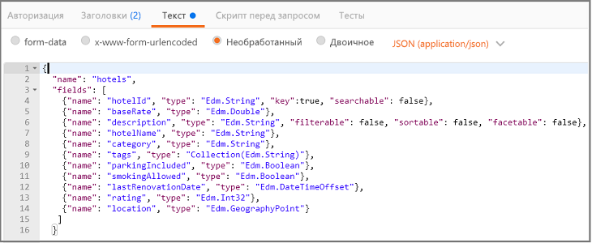
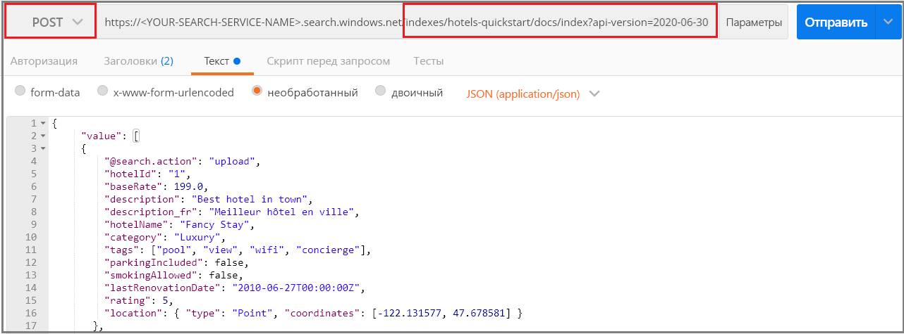
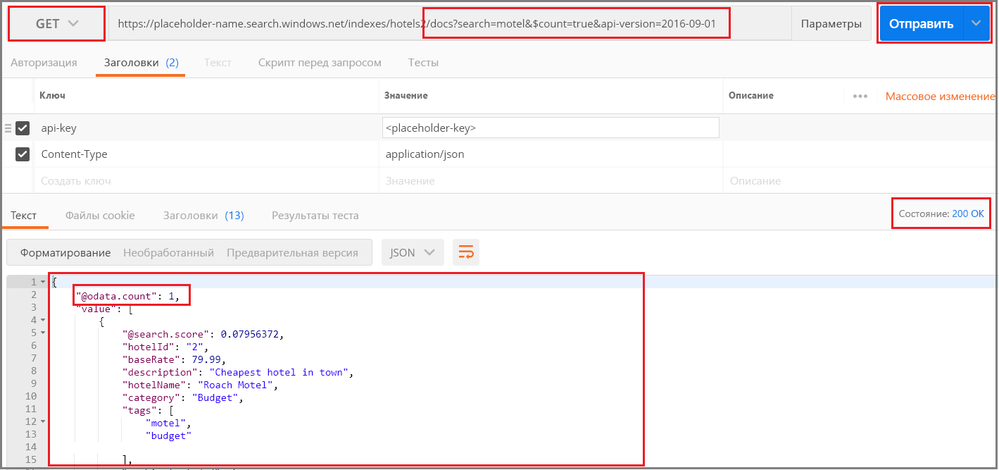
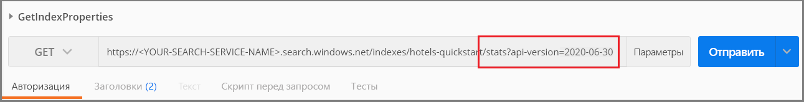

# <a name="quickstart-create-an-azure-search-index-in-postman-using-rest-apis"></a>Краткое руководство. Создание индекса службы "Поиск Azure" в Postman с помощью REST API
> [!div class="op_single_selector"]
> * [Postman](search-get-started-postman.md)
> * [C#](search-create-index-dotnet.md)
> * [Python](search-get-started-python.md)
> * [Портал](search-get-started-portal.md)
> * [PowerShell](search-howto-dotnet-sdk.md)
>*

[REST API службы "Поиск Azure"](https://docs.microsoft.com/rest/api/searchservice) проще всего изучить с помощью Postman или другого средства веб-тестирования для формирования HTTP-запросов и изучения ответов. С помощью соответствующих средств и этих инструкций вы сможете отправлять запросы и просматривать ответы без написания кода.

В этой статье описывается, как интерактивно формулировать запросы. Кроме того, вы можете [скачать и импортировать коллекцию Postman](https://github.com/Azure-Samples/azure-search-postman-samples/tree/master/Quickstart) для использования готовых запросов.

Если у вас еще нет подписки Azure, [создайте бесплатную учетную запись Azure](https://azure.microsoft.com/free/?WT.mc_id=A261C142F), прежде чем начинать работу.

## <a name="prerequisites"></a>Предварительные требования

Для выполнения инструкций из этого краткого руководства необходимы перечисленные ниже службы и инструменты. 

+ Используйте [классическое приложение Postman](https://www.getpostman.com/) для отправки запросов в службу "Поиск Azure".

+ [Создайте службу "Поиск Azure"](search-create-service-portal.md) или [найдите имеющуюся службу](https://ms.portal.azure.com/#blade/HubsExtension/BrowseResourceBlade/resourceType/Microsoft.Search%2FsearchServices) в рамках текущей подписки. Вы можете использовать бесплатную службу для выполнения инструкций, описанных в этом кратком руководстве. 

## <a name="get-a-key-and-url"></a>Получение ключа и URL-адреса

Вызовам REST требуется URL-адрес службы и ключ доступа при каждом запросе. Служба поиска создана с обоими элементами, поэтому если вы добавили службу "Поиск Azure" в подписку, выполните следующие действия для получения необходимых сведений:

1. [Войдите на портал Azure](https://portal.azure.com/) и на странице **обзора** службы поиска получите URL-адрес. Пример конечной точки может выглядеть так: `https://mydemo.search.windows.net`.

1. В разделе **Параметры** > **Ключи** получите ключ администратора, чтобы обрести полные права на службу. Существуют два взаимозаменяемых ключа администратора, предназначенных для обеспечения непрерывности бизнес-процессов на случай, если вам потребуется сменить один из них. Вы можете использовать первичный или вторичный ключ для выполнения запросов на добавление, изменение и удаление объектов.


Для выполнения любого запроса к службе требуется использование ключа API. Если есть действительный ключ, для каждого запроса устанавливаются отношения доверия между приложением, которое отправляет запрос, и службой, которая его обрабатывает.

## <a name="connect-to-azure-search"></a>Подключение к Поиску Azure

В этом разделе вы примените удобные для вас веб-инструменты, чтобы настроить подключения к Поиску Azure. Каждый инструмент сохраняет сведения заголовка запроса для сеанса. Это означает, что ключ API и тип содержимого нужно ввести только один раз.

Независимо от выбранного средства, вам нужно выбрать команду (GET, POST, PUT и т. д.), предоставить URL-адрес конечной точки, а для некоторых задач — включить код JSON в текст запроса. Замените имя службы поиска (YOUR-SEARCH-SERVICE-NAME) допустимым значением. Добавьте `$select=name`, чтобы вернуть только имя каждого индекса. 

    https://<YOUR-SEARCH-SERVICE-NAME>.search.windows.net/indexes?api-version=2019-05-06&$select=name

Запишите префикс HTTPS, имя службы, имя объекта (в данном случае коллекцию индексов) и значение [api-version](search-api-versions.md). Версия API (api-version) является обязательной — это строка в нижнем регистре, заданная как `?api-version=2019-05-06` для текущей версии. Версии API регулярно обновляются. Включая версию API для каждого запроса дает полный контроль над используемой версией.  

Структура заголовка запроса содержит два элемента: тип содержимого (Content-Type) и ключ API (api-key) для аутентификации в службе "Поиск Azure". Замените ключ API администратора (YOUR-AZURE-SEARCH-ADMIN-API-KEY) допустимым значением. 

    api-key: <YOUR-AZURE-SEARCH-ADMIN-API-KEY>
    Content-Type: application/json

Сформулируйте в Postman запрос такого формата, как показано на следующем снимке экрана. Выберите команду **GET**, укажите URL-адрес и нажмите **Отправить**. Эта команда подключается к Поиску Azure, считывает коллекцию индексов и возвращает код состояния HTTP 200 при успешном подключении. Если служба уже имеет индексы, ответ также будет содержать определения индекса.


## <a name="1---create-an-index"></a>1\. Создание индекса

В Поиске Azure индекс обычно создается заранее, до его загрузки вместе с данными. Для этой цели используется [REST API для создания индекса](https://docs.microsoft.com/rest/api/searchservice/create-index). 

URL-адрес дополняется именем индекса `hotels`.

Для этого выполните в Postman следующие действия:

1. Измените команду на **PUT**.

2. Скопируйте этот URL-адрес: `https://<YOUR-SEARCH-SERVICE-NAME>.search.windows.net/indexes/hotels-quickstart?api-version=2019-05-06`.

3. Укажите в тексте запроса определение индекса (код для копирования приведен ниже).

4. Нажмите кнопку **Отправить**.



### <a name="index-definition"></a>Определение индексов

Коллекция полей определяет структуру документа. Каждый документ должен содержать эти поля, и для каждого поля должен быть указан тип данных. Строковые поля используются в полнотекстовом поиске, поэтому может потребоваться привести числовые данные как строки, если требуется, чтобы содержимое было доступно для поиска.

Атрибуты поля определяют допустимое действие. Интерфейсы REST API по умолчанию позволяют выполнять множество действий. Например, по умолчанию все строки доступны для поиска, извлечения, фильтрования и применения аспектов. Обычно атрибуты приходится указывать только для того, чтобы отключить определенные возможности.

```json
{
    "name": "hotels-quickstart",  
    "fields": [
        {"name": "HotelId", "type": "Edm.String", "key": true, "filterable": true},
        {"name": "HotelName", "type": "Edm.String", "searchable": true, "filterable": false, "sortable": true, "facetable": false},
        {"name": "Description", "type": "Edm.String", "searchable": true, "filterable": false, "sortable": false, "facetable": false, "analyzer": "en.lucene"},
        {"name": "Category", "type": "Edm.String", "searchable": true, "filterable": true, "sortable": true, "facetable": true},
        {"name": "Tags", "type": "Collection(Edm.String)", "searchable": true, "filterable": true, "sortable": false, "facetable": true},
        {"name": "ParkingIncluded", "type": "Edm.Boolean", "filterable": true, "sortable": true, "facetable": true},
        {"name": "LastRenovationDate", "type": "Edm.DateTimeOffset", "filterable": true, "sortable": true, "facetable": true},
        {"name": "Rating", "type": "Edm.Double", "filterable": true, "sortable": true, "facetable": true},
        {"name": "Address", "type": "Edm.ComplexType", 
        "fields": [
        {"name": "StreetAddress", "type": "Edm.String", "filterable": false, "sortable": false, "facetable": false, "searchable": true},
        {"name": "City", "type": "Edm.String", "searchable": true, "filterable": true, "sortable": true, "facetable": true},
        {"name": "StateProvince", "type": "Edm.String", "searchable": true, "filterable": true, "sortable": true, "facetable": true},
        {"name": "PostalCode", "type": "Edm.String", "searchable": true, "filterable": true, "sortable": true, "facetable": true},
        {"name": "Country", "type": "Edm.String", "searchable": true, "filterable": true, "sortable": true, "facetable": true}
        ]
     }
  ]
}
```

При отправке запроса вы должны получить ответ HTTP 201, указывающий, что индекс создан успешно. Это действие можно проверить на портале, однако обратите внимание, что на странице портала настроены интервалы обновления, поэтому изменения отразятся через минуту или две.

> [!TIP]
> Если вы получите код HTTP 504, проверьте, что в URL указан протокол HTTPS. Если возникают сообщения об ответных кодах 400 или 404 протокола HTTP, следует удостовериться в отсутствии ошибок при копировании. Код HTTP 403, как правило, означает, что возникла ошибка с ключом API (либо он недействительный, либо имеется ошибка синтаксиса при указании ключа).

## <a name="2---load-documents"></a>2\. Загрузка документов

Создание и заполнение индекса выполняется по отдельности. В службе "Поиск Azure" индекс содержит все данные с возможностью поиска, которые можно указать в виде документов JSON. Для этой задачи используется [REST API для добавления, обновления и удаления документов](https://docs.microsoft.com/rest/api/searchservice/addupdate-or-delete-documents). 

URL-адрес дополняется коллекциями `docs` и операцией `index`.

Для этого выполните в Postman следующие действия:

1. Изменить команду на **POST**.

2. Скопируйте этот URL-адрес: `https://<YOUR-SEARCH-SERVICE-NAME>.search.windows.net/indexes/hotels-quickstart/docs/index?api-version=2019-05-06`.

3. Укажите в тексте запроса документы JSON (код для копирования приведен ниже).

4. Нажмите кнопку **Отправить**.



### <a name="json-documents-to-load-into-the-index"></a>Документы JSON для загрузки в индекс

Тело запроса содержит четыре документа, которые нужно добавить в индекс отелей.

```json
{
    "value": [
    {
    "@search.action": "upload",
    "HotelId": "1",
    "HotelName": "Secret Point Motel",
    "Description": "The hotel is ideally located on the main commercial artery of the city in the heart of New York. A few minutes away is Time's Square and the historic centre of the city, as well as other places of interest that make New York one of America's most attractive and cosmopolitan cities.",
    "Category": "Boutique",
    "Tags": [ "pool", "air conditioning", "concierge" ],
    "ParkingIncluded": false,
    "LastRenovationDate": "1970-01-18T00:00:00Z",
    "Rating": 3.60,
    "Address": 
        {
        "StreetAddress": "677 5th Ave",
        "City": "New York",
        "StateProvince": "NY",
        "PostalCode": "10022",
        "Country": "USA"
        } 
    },
    {
    "@search.action": "upload",
    "HotelId": "2",
    "HotelName": "Twin Dome Motel",
    "Description": "The hotel is situated in a  nineteenth century plaza, which has been expanded and renovated to the highest architectural standards to create a modern, functional and first-class hotel in which art and unique historical elements coexist with the most modern comforts.",
    "Category": "Boutique",
    "Tags": [ "pool", "free wifi", "concierge" ],
    "ParkingIncluded": false,
    "LastRenovationDate": "1979-02-18T00:00:00Z",
    "Rating": 3.60,
    "Address": 
        {
        "StreetAddress": "140 University Town Center Dr",
        "City": "Sarasota",
        "StateProvince": "FL",
        "PostalCode": "34243",
        "Country": "USA"
        } 
    },
    {
    "@search.action": "upload",
    "HotelId": "3",
    "HotelName": "Triple Landscape Hotel",
    "Description": "The Hotel stands out for its gastronomic excellence under the management of William Dough, who advises on and oversees all of the Hotel’s restaurant services.",
    "Category": "Resort and Spa",
    "Tags": [ "air conditioning", "bar", "continental breakfast" ],
    "ParkingIncluded": true,
    "LastRenovationDate": "2015-09-20T00:00:00Z",
    "Rating": 4.80,
    "Address": 
        {
        "StreetAddress": "3393 Peachtree Rd",
        "City": "Atlanta",
        "StateProvince": "GA",
        "PostalCode": "30326",
        "Country": "USA"
        } 
    },
    {
    "@search.action": "upload",
    "HotelId": "4",
    "HotelName": "Sublime Cliff Hotel",
    "Description": "Sublime Cliff Hotel is located in the heart of the historic center of Sublime in an extremely vibrant and lively area within short walking distance to the sites and landmarks of the city and is surrounded by the extraordinary beauty of churches, buildings, shops and monuments. Sublime Cliff is part of a lovingly restored 1800 palace.",
    "Category": "Boutique",
    "Tags": [ "concierge", "view", "24-hour front desk service" ],
    "ParkingIncluded": true,
    "LastRenovationDate": "1960-02-06T00:00:00Z",
    "Rating": 4.60,
    "Address": 
        {
        "StreetAddress": "7400 San Pedro Ave",
        "City": "San Antonio",
        "StateProvince": "TX",
        "PostalCode": "78216",
        "Country": "USA"
        }
    }
  ]
}
```

Через несколько секунд в списке сеансов появится ответ HTTP 201. Это означает, что документы были успешно созданы. 

Код 207 говорит об ошибке загрузки хотя бы одного из документов. Если вы получаете код 404, текст или заголовок запроса содержат синтаксические ошибки. Убедитесь, что вы изменили конечную точку, чтобы включить `/docs/index`.

> [!Tip]
> Для выбранных источников данных можно выбрать альтернативный подход *индексатора*, упрощающий работу и уменьшающий объем кода, необходимого для индексирования. Дополнительные сведения см. в статье [Indexer operations (Azure Search Service REST API)](https://docs.microsoft.com/rest/api/searchservice/indexer-operations) (Операции индексатора (REST API службы "Поиск Azure")).


## <a name="3---search-an-index"></a>3\. Поиск в индексе

Теперь, когда индекс и документы загружены, вы можете создавать запросы к ним, используя [REST API для поиска документов](https://docs.microsoft.com/rest/api/searchservice/search-documents).

URL-адрес дополняется выражением запроса в формате оператора поиска.

Для этого выполните в Postman следующие действия:

1. Измените команду на **GET**.

2. Скопируйте этот URL-адрес: `https://<YOUR-SEARCH-SERVICE-NAME>.search.windows.net/indexes/hotels-quickstart/docs?search=*&$count=true&api-version=2019-05-06`.

3. Нажмите кнопку **Отправить**.

Этот запрос пуст и возвращает число документов в результатах поиска. После того как вы щелкнете **Send** (Отправить), запрос и ответ для Postman будут выглядеть как на следующем снимке экрана. Код состояния должен быть 200.

 

Выполните еще несколько примеров запросов, чтобы ознакомиться с синтаксисом. Вы можете выполнять поиск по строкам, буквальные запросы $filter, ограничивать наборы результатов, осуществлять поиск только по определенным полям и многое другое.

Замените имеющийся URL-адрес указанными ниже адресами, нажимая**Отправить** каждый раз для просмотра результатов.

```
# Query example 1 - Search on restaurant and wifi
# Return only the HotelName, Description, and Tags fields
https://<YOUR-SEARCH-SERVICE>.search.windows.net/indexes/hotels-quickstart/docs?search=restaurant wifi&$count=true&$select=HotelName,Description,Tags&api-version=2019-05-06

# Query example 2 - Apply a filter to the index to find hotels rated 4 or highter
# Returns the HotelName and Rating. Two documents match
https://<YOUR-SEARCH-SERVICE>.search.windows.net/indexes/hotels-quickstart/docs?search=*&$filter=Rating gt 4&$select=HotelName,Rating&api-version=2019-05-06

# Query example 3 - Take the top two results, and show only HotelName and Category in the results
https://<YOUR-SEARCH-SERVICE>.search.windows.net/indexes/hotels-quickstart/docs?search=boutique&$top=2&$select=HotelName,Category&api-version=2019-05-06

# Query example 4 - Sort by a specific field (Address/City) in ascending order
https://<YOUR-SEARCH-SERVICE>.search.windows.net/indexes/hotels-quickstart/docs?search=pool&$orderby=Address/City asc&$select=HotelName, Address/City, Tags, Rating&api-version=2019-05-06
```

## <a name="get-index-properties"></a>Запрос свойств индекса
Вы также можете воспользоваться кнопкой [Получить статистику](https://docs.microsoft.com/rest/api/searchservice/get-index-statistics), чтобы отправить запросы для данных счетчиков документов и размера индекса: 

```
https://<YOUR-SEARCH-SERVICE-NAME>.search.windows.net/indexes/hotels-quickstart/stats?api-version=2019-05-06`
```

Добавление `/stats` к URL-адресу позволяет получить данные об индексе. В Postman запрос должен выглядеть следующим образом, а ответ включает число документов и используемое пространство в байтах.

 

Обратите внимание, что синтаксис api-version отличается. Для этого запроса используйте `?` для добавления api-version. `?` отделяет URL-адрес от строки запроса, а символ & отделяет каждую пару имя=значение в строке запроса. Для этого запроса api-version — первый и единственный элемент в строке запроса.

## <a name="clean-up"></a>Очистка

Если вы работаете в своей подписке, по окончании проекта рекомендуем решить, нужны ли вам созданные ресурсы. Работающие ресурсы могут означать лишние затраты. Можно удалить отдельные ресурсы или удалить группу ресурсов, что позволит удалить весь набор ресурсов.

Просматривать ресурсы и управлять ими можно на портале с помощью ссылок **Все ресурсы** или **Группы ресурсов** на панели навигации слева.

При работе с бесплатной версией службы помните о том, что вам доступно максимум три индекса, индексатора и источника данных. Вы можете удалить отдельные элементы на портале, чтобы не превысить лимит. 

## <a name="next-steps"></a>Дополнительная информация

Теперь, когда вы умеете выполнять основные задачи, вы можете изучить другие вызовы REST API для более сложных функций, таких как индексаторы или [настройка конвейера Когнитивного поиска](cognitive-search-tutorial-blob.md). Далее мы рекомендуем изучить следующие материалы:

> [!div class="nextstepaction"]
> [Руководство по использованию REST. Индексирование и поиск частично структурированных данных (больших двоичных объектов JSON) в службе "Поиск Azure"](search-semi-structured-data.md)
