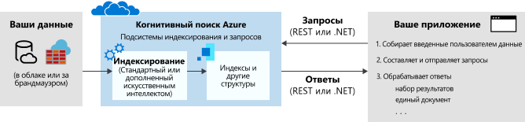

# Что такое Azure Когнитивный поиск?

Когнитивный поиск Azure ([прежнее название — "Поиск Azure"](whats-new.md#new-service-name)) — это облачное решение типа "Поиск как услуга", которое предоставляет разработчикам API-интерфейсы и средства для добавления расширенных возможностей поиска по закрытому, разнородному содержимому в веб-, мобильных и корпоративных приложениях. . Код или средство вызывает прием данных (индексирование) для создания и загрузки индекса. При необходимости можно добавить профессиональные навыки для применения процессов AI во время индексирования. Это позволяет добавлять новые сведения и структуры, полезные для поиска и других сценариев.

На другой стороне службы код приложения выдает запросы запросов и обрабатывает ответы. Интерфейс поиска определяется в клиенте с помощью функций Когнитивный поиск Azure с выполнением запросов по постоянно созданному индексу, который вы создаете, владеете и сохраняете в службе.

Эта служба предоставляется через простой [REST API](/rest/api/searchservice/) или [пакет SDK для .NET](search-howto-dotnet-sdk.md), которые скрывают естественную сложность извлечения информации. Кроме API, портал Azure обеспечивает поддержку администрирования и управления содержимым с помощью средств для создания прототипов и запроса индексов. Поскольку служба работает в облаке, инфраструктурой и доступностью управляет корпорация Майкрософт.

## Когда следует использовать Azure Когнитивный поиск

Когнитивный поиск Azure хорошо подходит для следующих сценариев приложений:

+ Консолидация разнородных типов содержимого в единый закрытый индекс с поддержкой поиска. Запросы всегда передаются по индексу, который создается и загружается с документами, а индекс всегда находится в облаке в службе Когнитивный поиск Azure. Индекс можно заполнить потоками документов JSON из любого источника или платформы. Кроме того, для содержимого из Azure можно использовать *индексатор* для извлечения данных в индекс. Определение индекса, управление и владение — это основная причина использования Когнитивный поиск Azure.

+ Необработанное содержимое — это большой неструктурированный текст, файлы изображений или файлы приложений, например типы содержимого Office в источнике данных Azure, например хранилище BLOB-объектов Azure или Cosmos DB. Для добавления структуры или извлечения значений из файлов изображений и приложений можно применять в процессе индексирования собственные навыки.

+ Простая реализация функций, связанных с поиском. API Когнитивный поиск Azure упрощают создание запросов, навигацию с аспектами, фильтры (включая геопространственный Поиск), сопоставление синонимов, typeahead запросы и настройку релевантности. Встроенные функции позволяют удовлетворить все требования пользователей к поиску, предоставляя возможности на уровне коммерческих систем поиска в Интернете.

+ Индексирование неструктурированного текста или извлечение текста и сведений из файлов с изображениями. Функция [обогащения искусственного интеллекта](cognitive-search-concept-intro.md) Azure когнитивный Поиск добавляет обработку искусственного интеллекта в конвейер индексирования. Среди распространенных вариантов использования можно упомянуть распознавание текста по сканированному документу, распознавание сущностей и извлечение ключевых фраз для больших документов, определение языка и перевод текста, а также анализ тональности.

+ Лингвистические требования удовлетворены с помощью пользовательских и языковых анализаторов Когнитивный поиск Azure. При наличии содержимого, отличного от английского, Azure Когнитивный поиск поддерживает и анализаторы Lucene, и процессоры естественного языка Майкрософт. Вы также можете настроить анализаторы для специализированной обработки необработанного содержимого, например для фильтрации диакритических знаков.

## Описание функций

| Основной&nbsp;поиск&nbsp;&nbsp;&nbsp;&nbsp;&nbsp;&nbsp;&nbsp;&nbsp;&nbsp;&nbsp;&nbsp;&nbsp;&nbsp;&nbsp;&nbsp;&nbsp;&nbsp;&nbsp;&nbsp;&nbsp;&nbsp;&nbsp;&nbsp;&nbsp;  | Функции |
|-------------------|----------|
|Текстовый поиск со свободной формой записи | [**Полнотекстовый поиск**](search-lucene-query-architecture.md) — это основной вариант использования для большинства приложений на основе поиска. Запросы можно создавать с помощью поддерживаемого синтаксиса.   [**Простой синтаксис запросов службы поиска Azure**](query-simple-syntax.md) включает в себя логические операторы, операторы поиска фраз, постфиксные операторы и операторы приоритета.  [**Синтаксис запросов Lucene**](query-lucene-syntax.md) включает в себя все операции простого синтаксиса с дополнительными возможностями нечеткого поиска, поиска по сходству, повышения приоритета слов и регулярных выражений.|
| релевантности | [**Простая оценка**](index-add-scoring-profiles.md) — это ключевое преимущество Azure когнитивный Поиск. Профили повышения позволяют моделировать релевантность как функцию значений в самих документах. Например, можно на высокие позиции в результатах поиска вывести более новые товары или товары со скидкой. Профили оценки можно также формировать с помощью тегов, позволяющих персонализировать ранжирование в соответствии с предпочтениями клиентов, которые отслеживаются и хранятся отдельно. |
| Геопространственный поиск | Azure Когнитивный поиск обрабатывает, фильтрует и отображает географические расположения. Эта служба позволяет пользователям просматривать данные на основе приближенности результатов поиска к физическому расположению. Чтобы узнать больше, просмотрите [это видео](https://channel9.msdn.com/Shows/Data-Exposed/Azure-Search-and-Geospatial-Data) или [ознакомьтесь с этим примером](https://github.com/Azure-Samples/search-dotnet-asp-net-mvc-jobs). |
| Фильтры и аспекты | [**Фасетная навигация**](search-faceted-navigation.md) работает при использовании параметра одиночного запроса. Когнитивный поиск Azure возвращает структуру навигации с различными аспектами, которую можно использовать в качестве кода для списка категорий, для самостоятельной фильтрации (например, для фильтрации элементов каталога по ценам или торговым маркам).    [**Фильтры**](query-odata-filter-orderby-syntax.md) позволяют внедрять фасетную навигацию в интерфейс приложения, улучшать формулировку запроса и выполнять фильтрацию на основе указанных пользователем или разработчиком критериев. Создавайте фильтры с помощью синтаксиса OData. |
| Возможности для пользователя | Можно включить [**автозавершение**](search-autocomplete-tutorial.md) для упреждающего ввода запросов в поле поиска.   [**Варианты** ](https://docs.microsoft.com/rest/api/searchservice/suggesters) также работают при частичном вводе текста в строке поиска, но результатами являются фактические документы в индексе, а не условия запроса.   Функция [**Синонимы**](search-synonyms.md) связывает эквивалентные термины, которые неявно расширяют область запроса, даже если пользователь не указал их.   [**При выделении совпадений**](https://docs.microsoft.com/rest/api/searchservice/Search-Documents) применяется форматирование текста к совпадающему ключевому слову в результатах поиска. Вы можете выбирать поля, которые возвращают выделенные фрагменты.  [**Сортировка**](https://docs.microsoft.com/rest/api/searchservice/Search-Documents) для нескольких полей выполняется с помощью схемы индексирования. Затем во время выполнения поискового запроса применяется единый параметр поиска.   [**Разбиение на страницы**](search-pagination-page-layout.md) и регулирование результатов поиска очень просто с помощью детально настроенного элемента управления, который когнитивный Поиск Azure предлагает в результатах поиска.    |

| &nbsp;Обогащение данных на основе ИИ&nbsp;&nbsp;&nbsp;&nbsp;&nbsp;&nbsp;&nbsp;&nbsp;&nbsp;&nbsp;&nbsp;       | Функции |
|-------------------|----------|
|Документы, обогащенные на основе ИИ | [**Обогащение искусственного интеллекта**](cognitive-search-concept-intro.md) для анализа изображений и текста можно применить к конвейеру индексирования для извлечения текстовых данных из необработанного содержимого. Вот несколько примеров [встроенных навыков](cognitive-search-predefined-skills.md): оптическое распознавание символов (возможность поиска по отсканированным изображениям в формате JPEG), распознавание сущностей (идентификация организации, имени или расположения) и распознавание ключевых фраз. Вы также можете [писать код для пользовательских навыков](cognitive-search-create-custom-skill-example.md), чтобы присоединять их к конвейеру. |
| Сохраненные обогащения для анализа и использования| [**Хранилище знаний (предварительная версия)** ](knowledge-store-concept-intro.md) — это расширение индексирования на основе ИИ. Используя хранилище Azure как внутреннюю службу, можно сохранять обогащения, созданные во время индексирования. С помощью этих артефактов можно создавать более эффективные наборы навыков или формировать либо структурировать беспорядочные и неоднозначные данные. Из этих структур можно создавать проекции, ориентированные на конкретные рабочие нагрузки или пользователей. Также можно напрямую анализировать извлеченные данные или загружать их в другие приложения.   |

| &nbsp;Импорт и индексирование данных | Функции |
|----------------------------------|----------|
| Источники данных | Индексы Когнитивный поиск Azure принимают данные из любого источника, если они передаются в виде структуры данных JSON.    [**Индексаторы**](search-indexer-overview.md) автоматизируют прием данных для поддерживаемых источников данных Azure и выполняют сериализацию JSON. Подключитесь к [Базе данных SQL Azure](search-howto-connecting-azure-sql-database-to-azure-search-using-indexers.md), [Azure Cosmos DB](search-howto-index-cosmosdb.md) или [хранилищу BLOB-объектов Azure](search-howto-indexing-azure-blob-storage.md), чтобы извлекать доступное для поиска содержимое из основных хранилищ данных. Индексаторы больших двоичных объектов Azure могут выполнять *открытие документов* для [извлечения текста из основных форматов файлов](search-howto-indexing-azure-blob-storage.md), включая Microsoft Office, PDF и HTML-документы. |
| Иерархическая и вложенная структуры данных | [**Сложные типы**](search-howto-complex-data-types.md) и коллекции позволяют моделировать практически любой тип структуры JSON как индекс Azure когнитивный Поиск. Кратность "один ко многим" и "многие ко многим" можно выразить в собственном коде с помощью коллекций, сложных типов и коллекций сложных типов.|
| Лингвистический анализ | Анализаторы — это компоненты, используемые для обработки текста во время выполнения операций индексирования и поиска. Существует два типа ключей.   [**Пользовательские лексические анализаторы**](index-add-custom-analyzers.md) используются для сложных поисковых запросов с использованием фонетического сопоставления и регулярных выражений.   [**Анализаторы языка**](index-add-language-analyzers.md) от Lucene или Microsoft можно использовать для интеллектуальной обработки лингвистики конкретного языка, включая времена глагола, пол, нестандартное изменение существительных во множественном числе (например, "человек" и "люди"), отмену объединения слов, разбиение на слова (для языков без пробелов) и многое другое.   |

| Уровень&nbsp;платформы&nbsp;&nbsp;&nbsp;&nbsp;&nbsp;&nbsp;&nbsp;&nbsp;&nbsp;&nbsp;&nbsp;&nbsp;&nbsp;| Функции |
|-------------------|----------|
| Средства для создания прототипов и проверки | На портале можно использовать мастер [**импорта данных**](search-import-data-portal.md) для настройки индексаторов, конструктор индексов для настройки индекса, а также [**обозреватель поиска**](search-explorer.md), позволяющий тестировать запросы и уточнять профили оценки. Вы также можете открыть любой индекс для просмотра его схемы. |
| Мониторинг и диагностика | [**Включите функции мониторинга**](search-monitor-usage.md), чтобы получать более подробные метрики, помимо основных, которые всегда отображаются на портале. Метрики количества запросов в секунду, задержки и регулирования записываются на страницах портала без дополнительной настройки.|
| Шифрование на стороне сервера | [**Функция шифрования неактивных данных под управлением Майкрософт**](search-security-overview.md#encrypted-transmission-and-storage) встроена в слой внутреннего хранилища, и ее нельзя отключить. По желанию основное шифрование можно дополнить [**собственными ключами шифрования (предварительная версия)** ](search-security-manage-encryption-keys.md). Ключи, которые вы создаете и управляете в Azure Key Vault, используются для шифрования индексов и сопоставлений синонимов в Azure Когнитивный поиск. |
| Инфраструктура | **Платформа высокой надежности** обеспечивает надежность поисковой системы. При правильном масштабировании [Azure когнитивный Поиск предлагает соглашение об уровне обслуживания 99,9%](https://azure.microsoft.com/support/legal/sla/search/v1_0/).   **Полностью управляемое и масштабируемое** как комплексное решение, когнитивный Поиск Azure не требует управления инфраструктурой. Службу можно адаптировать в соответствии с вашими потребностями путем масштабирования в двух направлениях (в т. ч. одновременно). Это позволяет обрабатывать большой объем хранилища документов и ускорить выполнение запросов.  |

## Как использовать Azure Когнитивный поиск
### Шаг 1. Подготовка службы
Вы можете подготавливать службу Когнитивный поиск Azure в [портал Azure](https://portal.azure.com/) или через [API управления ресурсами Azure](/rest/api/searchmanagement/). Она поддерживает два варианта использования: бесплатная категория, в рамках которой вы используете службу вместе с другими подписчиками, и [платная категория](https://azure.microsoft.com/pricing/details/search/), в рамках которой ресурсы выделяются только для вашей службы. При использовании платной категории службу можно масштабировать в двух направлениях: 

- Добавление реплик для увеличения емкости, позволяющей обрабатывать большие объемы запросов.   
- Добавление секций для увеличения хранилища, что позволяет использовать больше документов. 

Управляя пропускной способностью запросов и хранилищем документов по отдельности, вы можете настроить ресурсы под нужды своей рабочей среды.

### Шаг 2. Создание индекса
Перед отправкой содержимого, доступного для поиска, необходимо определить индекс Azure Когнитивный поиск. Индекс похож на таблицу базы данных, которая содержит данные и может принимать поисковые запросы. Вы определяете схему индекса для сопоставления структуры документов, по которым требуется выполнить поиск. Это похоже на использование полей в базе данных.

Схему можно создать на портале Azure либо программным способом с помощью [пакета SDK для .NET](search-howto-dotnet-sdk.md) или [REST API](/rest/api/searchservice/).

### Шаг 3. Загрузка данных
После определения индекса можно отправлять содержимое. используя модель передачи или извлечения.

Модель извлечения получает данные из внешних источников. Она реализуется через *индексаторы*, что позволяет упростить и автоматизировать такие аспекты приема данных, как подключение, чтение и сериализация данных. [Индексаторы](/rest/api/searchservice/Indexer-operations) доступны в Azure Cosmos DB, в Базе данных SQL Azure, в хранилище BLOB-объектов Azure и на сервере SQL Server, размещенном на виртуальной машине Azure. Индексатор поддерживает обновление по запросу или расписанию.

Модель проталкивания реализуется через пакет SDK или REST API и используется для отправки в индекс обновленных документов. Вы можете передавать данные практически из любого набора данных в формате JSON. Инструкции по отправке данных см. в статьях о [добавлении, обновлении или удалении документов](/rest/api/searchservice/addupdate-or-delete-documents) и об [использовании пакета SDK для .NET](search-howto-dotnet-sdk.md).

### Шаг 4. Поиск
Заполнив индекс, вы сможете [отправлять запросы поиска](search-query-overview.md) к конечной точке службы с помощью простых HTTP-запросов, используя [REST API](/rest/api/searchservice/Search-Documents) или пакет [SDK для .NET](https://docs.microsoft.com/dotnet/api/microsoft.azure.search.idocumentsoperations).

Выполните инструкции из руководства по [созданию приложения для поиска](tutorial-csharp-create-first-app.md), чтобы создать и расширить веб-страницу, которая собирает вводимые пользователем данные и обрабатывает результаты. Чтобы запросить существующий индекс, также можно использовать [Postman для интерактивных вызовов REST](search-get-started-postman.md) или встроенный [обозреватель поиска](search-explorer.md) на портале Azure.

## Сопоставление

Клиенты часто запрашивают, как Когнитивный поиск Azure сравнивается с другими решениями, связанными с поиском. В следующей таблице представлены основные отличия.

| По сравнению с | Основные отличия |
|-------------|-----------------|
|Bing; | [API Bing для поиска в Интернете](https://docs.microsoft.com/azure/cognitive-services/bing-web-search/) ищет совпадение с введенными словами в индексах на сайте Bing.com. Индексы создаются на основе содержимого HTML, XML и другого веб-содержимого с общедоступных сайтов. Служба [Пользовательский поиск Bing](https://docs.microsoft.com/azure/cognitive-services/bing-custom-search/) основана на той же платформе и предлагает ту же технологию поискового модуля для типов веб-содержимого, но предназначена для отдельных веб-сайтов.  Azure Когнитивный поиск ищет заданный индекс, заполненный данными и документами, часто из различных источников. Azure Когнитивный поиск обладает возможностями обходчика для некоторых источников данных с помощью [индексаторов](search-indexer-overview.md), но можно отправить любой документ JSON, который соответствует схеме индекса, в единый консолидированный ресурс с возможностью поиска. |
|Поиск по базе данных | Многие платформы баз данных имеют встроенный поисковый интерфейс. SQL Server поддерживает [полнотекстовый поиск](https://docs.microsoft.com/sql/relational-databases/search/full-text-search). Cosmos DB и аналогичные технологии содержат индексы с поддержкой запросов. При оценке систем, сочетающих возможности поиска и хранения, бывает сложно выбрать оптимальный вариант. Многие решения используют оба варианта: СУБД для хранения и Когнитивный поиск Azure для специализированных функций поиска.  По сравнению с поиском СУБД, Azure Когнитивный поиск сохраняет содержимое из разнородных источников и предлагает специализированные функции обработки текста, такие как обработка текста с учетом особенностей (парадигматические модули, лемматизация, формы Word) на [языках 56](https://docs.microsoft.com/rest/api/searchservice/language-support). Также эта служба поддерживает автоматическое исправление слов с ошибками, [синонимы](https://docs.microsoft.com/rest/api/searchservice/synonym-map-operations), [предложения](https://docs.microsoft.com/rest/api/searchservice/suggestions), [управление оценкой](https://docs.microsoft.com/rest/api/searchservice/add-scoring-profiles-to-a-search-index), [аспекты](https://docs.microsoft.com/azure/search/search-filters-facets) и [пользовательскую разметку](https://docs.microsoft.com/rest/api/searchservice/custom-analyzers-in-azure-search). Поисковая [Система полнотекстового поиска](search-lucene-query-architecture.md) в Azure когнитивный Поиск основана на Apache Lucene, промышленном стандарте получения информации. Хотя Когнитивный поиск Azure сохраняет данные в форме инвертированного индекса, она редко является заменой для истинного хранения данных. Дополнительные сведения см. в [этой теме форума](https://stackoverflow.com/questions/40101159/can-azure-search-be-used-as-a-primary-database-for-some-data).   Другим важным отличием в этой категории является использование ресурсов. Для индексирования и некоторых запросов часто требуются большие объемы вычислительных ресурсов. Перенос заданий поиска из СУБД в специализированное облачное решение позволяет сберечь ресурсы для обработки транзакций. Более того, внешнее решение для поиска упрощает масштабирование при изменении объема запросов.|
|Специализированное решение для поиска | Предположим, что вы решили использовать выделенное решение поиска с полный спектром функций. Теперь вам важно сравнить возможности локальных и облачных служб в этой категории. Многие технологии поиска предоставляют контроль над конвейерами индексирования и запросов, расширенный синтаксис запросов и фильтров, контроль над ранжированием и релевантностью, а также функции автоматического и интеллектуального поиска.   Облачная служба является правильным выбором, если вам необходимо готовое масштабируемое решение, которое почти не нуждается в обслуживании и дополнительных затратах.   В рамках облачной модели некоторые поставщики предоставляют сопоставимые базовые функции с полнотекстовым и геопространственным поиском и возможность обработки определенного уровня неоднозначности во входных данных для поиска. Обычно выбор подходящего варианта зависит от наличия [специализированных функций](#feature-drilldown), простых и удобных API-интерфейсов, а также нужных инструментов и средств управления. |

Среди поставщиков облачных служб Когнитивный поиск Azure является самым надежным для рабочих нагрузок полнотекстового поиска по хранилищам содержимого и базам данных в Azure, для приложений, которые в основном используются для поиска как получения информации, так и навигации по содержимому. 

Ниже перечислены ключевые преимущества.

+ Интеграция данных Azure (с использованием поисковых модулей) на уровне индексирования
+ Портал Azure для централизованного управления
+ Масштабирование, надежность и доступность мирового уровня в Azure
+ Обработка необработанных данных с использованием искусственного интеллекта делает данные более доступными для поиска. Сюда относится текст с изображений и поиск закономерностей в неструктурированном содержимом.
+ Лингвистический и пользовательский анализ с анализаторами для надежного полнотекстового поиска, доступными на 56 языках
+ [Основные функции, общие для поисковых приложений:](#feature-drilldown) система оценок, фасетная навигация, предложения, синонимы, геопространственный поиск и многое другое.

> [!Note]
> Источники данных, отличные от Azure, полностью поддерживаются, но полагаются на методологию принудительной отправки на основе кода, а не индексаторы. С помощью API можно передать любую коллекцию документов JSON в индекс Azure Когнитивный поиск.

Среди наших клиентов, которые могут использовать широкий спектр функций в Azure Когнитивный поиск включают в себя каталоги в Интернете, Бизнес-программы и приложения обнаружения документов.

## REST API | Пакет SDK для .NET

Хотя на портале можно выполнять многие задачи, Azure Когнитивный поиск предназначен для разработчиков, желающих интегрировать функции поиска в существующие приложения. Доступны следующие программные интерфейсы.

|Платформа |Description (Описание) |
|-----|------------|
|[REST](/rest/api/searchservice/) | HTTP-команды, поддерживаемые любой платформой и языком программирования, включая Xamarin, Java и JavaScript.|
|[Пакет SDK для .NET](search-howto-dotnet-sdk.md) | Оболочка .NET для REST API обеспечивает эффективное кодирование на языке C# и других управляемых кодом языках, предназначенных для .NET Framework. |

## Бесплатная пробная версия
Подписчики Azure могут [подготовить службу на уровне "Бесплатный"](search-create-service-portal.md).

Если вы не являетесь подписчиком, вы можете [открыть учетную запись Azure бесплатно](https://azure.microsoft.com/pricing/free-trial/?WT.mc_id=A261C142F). Вы получите кредиты для ознакомления с платными службами Azure. После того, как кредиты израсходованы, ваша учетная запись не исчезнет. Вы сможете использовать ее для работы с [бесплатными службами Azure](https://azure.microsoft.com/free/). С вашей кредитной карты не будет взиматься плата, если вы явно не измените параметры и не попросите снимать плату.

Также можно [активировать преимущества подписчика MSDN](https://azure.microsoft.com/pricing/member-offers/msdn-benefits-details/?WT.mc_id=A261C142F) — ваша подписка MSDN каждый месяц приносит вам кредиты, которые можно использовать для оплаты служб Azure. 

## Как приступить к работе

1. Создайте [бесплатную службу](search-create-service-portal.md). Все руководства можно выполнить в бесплатной версии службы.

2. Поэтапно выполните действия [руководства по использованию встроенных средств для индексирования и запросов](search-get-started-portal.md). Изучите важные основные понятия и ознакомьтесь с информацией на портале.

3. Продолжайте работу с кодом, используя .NET или REST API:

   + Руководство [Использование службы поиска Azure в приложении .NET](search-howto-dotnet-sdk.md) демонстрирует основной рабочий процесс в управляемом коде.  
   + [Getting Started with Azure Search using the REST API](https://github.com/Azure-Samples/search-rest-api-getting-started) (Начало работы с Поиском Azure с использованием REST API) показывает те же шаги с использованием REST API. Это краткое руководство можно также использовать для вызова API-интерфейсов RESTFUL от posts или Fiddler: [изучение Azure когнитивный Поиск интерфейсы API-интерфейса](search-get-started-postman.md).

## Рекомендуемый видеоролик

Поисковые системы представляют собой общие драйвера для извлечения сведений из мобильных приложений, Интернета и корпоративных хранилищ данных. Azure Когнитивный поиск предоставляет средства для создания функций поиска, аналогичные тем, которые находятся на крупных коммерческих веб-сайтах.

В этом 9-минутном видео руководитель программы Лиам Кавана (Liam Cavanagh) объясняет преимущества интеграции поисковой системы для приложения. В кратких демонстрационных роликах рассматриваются ключевые функции Когнитивный поиск Azure и типичный рабочий процесс. 

>[!VIDEO https://channel9.msdn.com/Events/Connect/2016/138/player]
 
+ До 3 минуты в этом видео речь идет о ключевых возможностях и сценариях использования.
+ 3–4 минуты: подготовка службы. 
+ 4–6 минуты: использование мастера импорта данных для создания индекса с помощью встроенного набора данных, связанного с недвижимостью.
+ 6–9 минут: обозреватель поиска и различные запросы.
