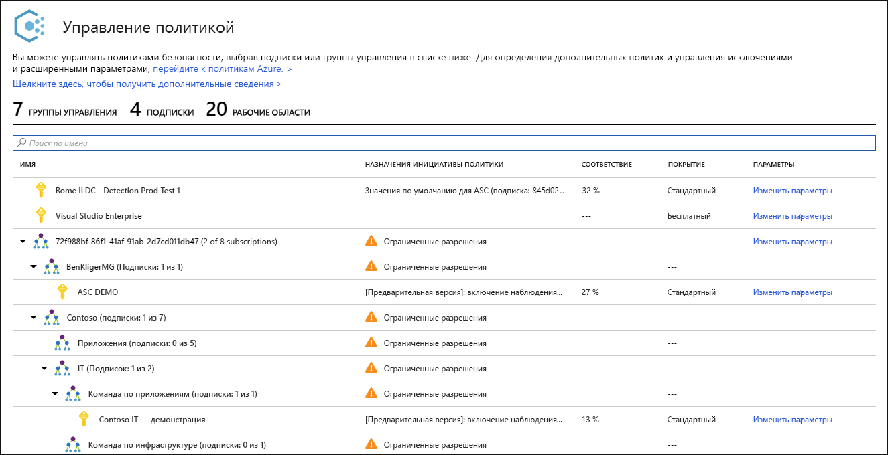
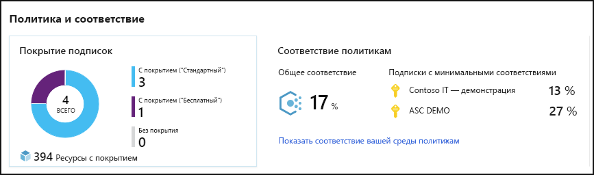
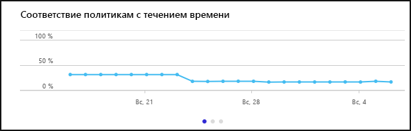
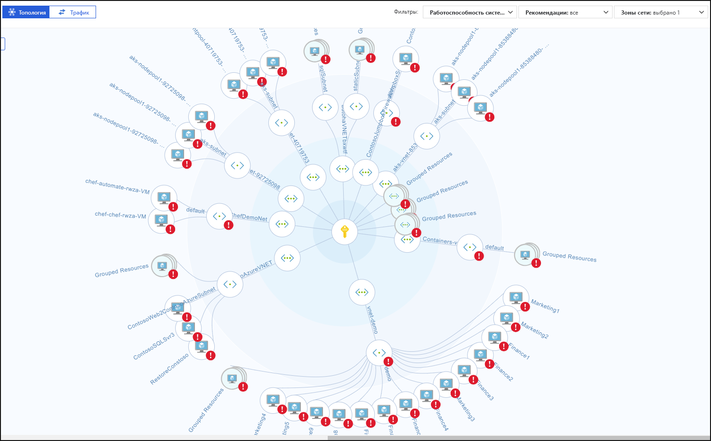
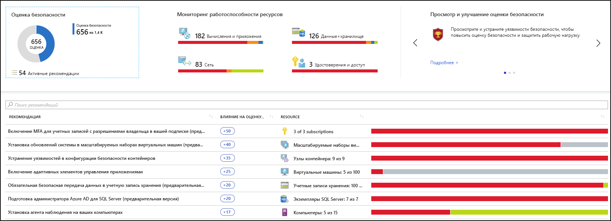
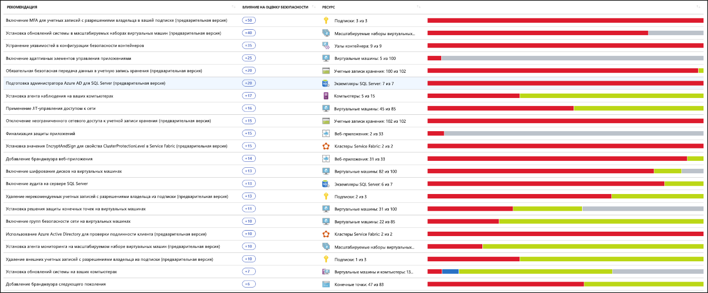
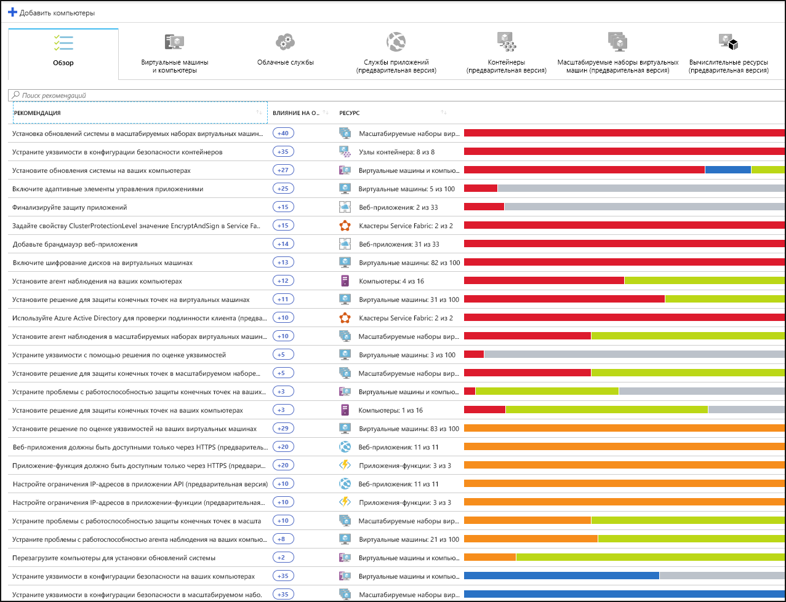
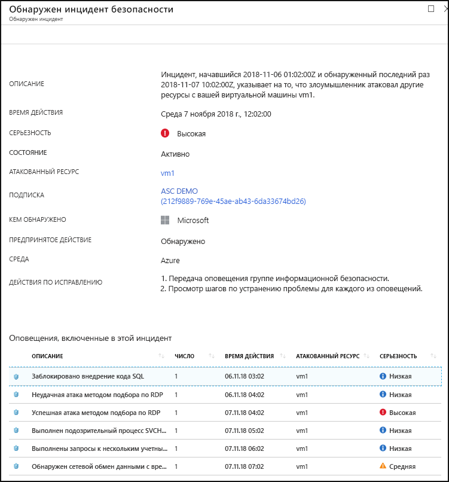

# Что такое Центр безопасности Azure?

Центр безопасности Azure — единая система управления безопасностью инфраструктуры, которая повышает уровень защищенности центров обработки данных и предоставляет расширенную защиту от угроз в гибридных рабочих нагрузках в облаке независимо от того, находятся ли они в Azure или нет, а также локально.

Безопасность ваших ресурсов — это совместные действия вашего поставщика облачных служб, Azure и вас, клиента. Необходимо убедиться, что рабочие нагрузки являются безопасными при переходе в облако. В то же время перемещение в IaaS (инфраструктура как услуга) в большей мере ответственность клиента, чем перемещение в PaaS (платформа как услуга) и SaaS (программное обеспечение как услуга). Центр безопасности Azure предоставляет средства, необходимые для усиления безопасности вашей сети, защиты служб и гарантии того, что ваши системы находятся на верхнем уровне безопасности.

Центр безопасности Azure справляется с тремя наиболее срочными угрозами безопасности:

-   **Быстро меняющиеся рабочие нагрузки**. Это преимущество и недостаток облака. С одной стороны пользователи получают расширенные возможности. С другой стороны — как можно гарантировать, что постоянно меняющиеся службы, применяемые и создаваемые пользователями, соответствуют вашим стандартам безопасности и рекомендациям?

-   **Все более изощренные атаки** . Везде, где вы выполняете рабочие нагрузки, атаки становятся все более изощренными. Вам нужно защитить свои рабочие нагрузки в публичном облаке, которые являются, по сути, рабочими нагрузками с доступом в Интернет, которые могут увеличить число уязвимостей, если вы не следуете рекомендациям по безопасности.

-   **Специалистов в области безопасности недостаточно** . Количество оповещений безопасности и систем оповещения значительно превышает количество администраторов с необходимой подготовкой и опытом, позволяющими убедиться в том, что среды защищены. Оставаться в курсе последних атак — это постоянная задача, которая не позволяет оставаться на месте, так как мир систем безопасности постоянно меняется.

Чтобы помочь вам защититься от этих проблем, Центр безопасности предоставляет средства для таких задач:

-   **Повышение уровня безопасности**. Центр безопасности оценивает среду и предоставляет вам сведения о состоянии ресурсов, а также об их безопасности.

-   **Защита от угроз**. Центр безопасности оценивает рабочие нагрузки и выдает рекомендации по предотвращению угроз и оповещения об обнаружении угроз.

-   **Быстрое получение системы безопасности**. В Центре безопасности все выполняется с облачной скоростью. Так как он изначально интегрирован, развернуть Центр безопасности несложно, он предоставляет автоматическую подготовку и защиту с помощью служб Azure.

## Архитектура

Так как Центр безопасности является частью Azure, службы в Azure — включая Service Fabric, базы данных SQL и учетные записи хранения — отслеживаются и защищены Центром безопасности, не требуя каких-либо развертываний.

Кроме того, Центр безопасности защищает сторонние серверы, не связанные с Azure, и виртуальные машины в облаке или локально, для серверов Windows и Linux, установив Microsoft Monitoring Agent на них. Виртуальные машины Azure автоматически подготавливаются в Центре безопасности.

События, собранные с агентов и Azure, коррелируют в модуле аналитики безопасности для предоставления вам специализированных рекомендаций (задачи по усилению), которым необходимо следовать, чтобы убедиться, что рабочие нагрузки являются безопасными, а также оповещений об обнаружении угроз. Следует обратить внимание на такие оповещения как можно скорее, чтобы убедиться, что на рабочие нагрузки не происходит вредоносных атак.

Если включить Центр безопасности, встроенные в нем политики безопасности будут отражены как встроенная инициатива в категории "Центр безопасности" в службе "Политика Azure". Встроенная инициатива автоматически назначается всем подпискам, зарегистрированным в Центре безопасности (ценовые категории "Бесплатный" или "Стандартный"). Встроенная инициатива содержит только политики аудита. Дополнительные сведения об использовании политик Центра безопасности в службе "Политика Azure" см. в статье [Использование политик безопасности](tutorial-security-policy.md).

## Повышение уровня безопасности

Центр безопасности Azure позволяет усилить систему безопасности. Это означает, что он помогает определить и выполнить задачи усиления защиты, рекомендуемые как лучшие методики по обеспечению безопасности, а также внедрить их на ваших компьютерах, в службах данных и приложениях. Это включает управление и принудительное применение политик безопасности и обеспечение соответствия виртуальных машин Azure, сторонних серверов, не связанных с Azure, и служб Azure PaaS. Центр безопасности предоставляет средства, необходимые для внимательного просмотра рабочих нагрузок и фокусирования на состоянии вашей сети безопасности. 

### Управление политикой безопасности организации и соответствия требованиям

Для обеспечения безопасности в первую очередь нужно убедиться, что ваши рабочие нагрузки в безопасности, и начать с внедрения настроенных политик безопасности. Так как все политики в Центре безопасности создаются на основе элементов управления политики Azure, вы получаете полный диапазон и гибкость  **решения политики мирового уровня**. В Центре безопасности можно задать политики, применяемые в группах управления, между подписками и даже для всего клиента.

Центр безопасности помогает в  **определении подписок для несанкционированного использования ИТ-ресурсов в компании**. Взглянув на подписки с меткой **не защищены** на панели мониторинга, вы можете немедленно узнать о недавно созданных подписках и убедиться, что они защищаются политиками и Центром безопасности Azure.

Расширенные функции мониторинга в Центре безопасности также позволяют  **отслеживать совместимость и систему управления и управлять ими в течение определенного периода**.  **Общее соответствие**  позволяет определить, насколько подписки соответствуют требованиям политики, связанной с вашей рабочей нагрузкой. 

### Непрерывные оценки

Центр безопасности постоянно обнаруживает новые ресурсы, развертываемые в рабочих нагрузках, и оценивает, настроены ли они в соответствии с рекомендациями по безопасности. Если нет, они помечаются и вы получаете список приоритетных рекомендаций относительно того, что необходимо исправить для защиты своих компьютеров.

Одно из самых мощных средств Центра безопасности, предоставляемых для постоянного мониторинга состояния безопасности сети, —  **карта сети**. Карта позволяет вам просмотреть топологию рабочих нагрузок, чтобы вы могли убедиться, что каждый узел настроен правильно. Вы можете увидеть, как соединены ваши узлы, что помогает блокировать нежелательные подключения, которые потенциально упрощают злоумышленнику проникновение в вашу сеть.

Центр безопасности делает устранение причин оповещений безопасности на один шаг проще за счет  **оценки безопасности**. Оценки безопасности теперь связаны с каждой получаемой рекомендацией, благодаря чему вы сможете понять, насколько важна каждая из них для общего уровня безопасности. Очень важно назначить  **приоритет работе системы безопасности**.

### Оптимизация и повышение уровня безопасности путем настройки рекомендуемых элементов управления

Основная ценность Центра безопасности Azure состоит в его рекомендациях. Рекомендации предназначены для разрешения определенных проблем безопасности, найденных в ваших рабочих нагрузках, Центр безопасности выполняет за вас работу администратора безопасности: он не только находит уязвимости, но и предоставляет вам определенные инструкции по их устранению.

Таким образом, Центр безопасности позволяет не только задавать политики безопасности, но и применять стандарты конфигурации безопасности в ваших ресурсах.

Рекомендации помогают снизить вероятность атак каждого из ваших ресурсов. Это включает виртуальные машины Azure, серверы за пределами Azure и службы Azure PaaS, такие как SQL и учетные записи хранения, и многое другое, где каждый тип ресурса оценивается иначе и имеет собственные стандарты.

## Защита от угроз

Защита от угроз Центра безопасности позволяет обнаруживать и предотвращать угрозы на уровне инфраструктуры как услуги (IaaS), серверов за пределами Azure, а также на уровне платформы как услуги (PaaS) в Azure.

Защита от угроз Центра безопасности включает объединение анализа цепочки отказов, который автоматически сопоставляет оповещения в среде на основе анализа цепочки отказов в киберсреде, чтобы помочь лучше понять полную историю кампании атаки, откуда она была запущена и какое влияние имела на ваши ресурсы.

### Дополнительная защита от угроз

Благодаря Центру безопасности вы получаете интеграцию платформенной функциональности с готовой Расширенной защитой от угроз в Защитнике Windows. Это означает, что без какой-либо настройки ваши виртуальные машины и серверы Windows полностью интегрированы с рекомендациями Центра безопасности и оценками. Расширенное обнаружение угроз также предлагается по умолчанию для серверов и виртуальных машин Linux.

Кроме того, Центр безопасности позволяет автоматизировать политики управления приложениями в серверных средах. Адаптивные элементы управления приложениями в Центре безопасности позволяют комплексно создавать списки разрешенных приложений на серверах Windows. Вам не нужно создавать правила и проверять нарушения, все это выполняется автоматически.

### Защита PaaS

Центр безопасности помогает выявлять угрозы в службах Azure PaaS. Вы можете обнаружить угрозы для служб Azure, включая службы приложений Azure, Azure SQL, учетную запись хранения Azure и другие службы данных. Вы также можете воспользоваться интеграцией платформенной функциональности в аналитике поведения пользователей и сущностей (UEBA) Microsoft Cloud App Security для обнаружения аномалий в журналах действий Azure.

### Блокирование атак методом подбора

Центр безопасности позволяет снизить уязвимость к атакам методом подбора. За счет сокращения доступа к портам виртуальной машины можно усилить свою сеть, предотвращая ненужный доступ с применением JIT-доступа к виртуальной машине. Вы можете установить политики безопасного доступа на выбранных портах только для авторизованных пользователей, допустимых диапазонов IP-адресов источника или IP-адресов и на ограниченный период времени.

### Защита службы данных

Центр безопасности включает возможности, которые помогут вам автоматически выполнять классификацию данных в Azure SQL. Вы также можете получить оценки потенциальных уязвимостей в Azure SQL и службе хранилища, а также рекомендации по их устранению.

## Быстрое получение системы безопасности

Собственная интеграция Azure (включая службы "Политика Azure" и Log Analytics) в сочетании с прозрачной интеграцией с другими решениями безопасности корпорации Майкрософт, такими как Microsoft Cloud App Security и Расширенная защита от угроз в Защитнике Windows, позволяет сделать ваше решение безопасности комплексным, простым в подключении и развертывании.

Кроме того, вы можете расширить полное решение за пределы Azure в рабочие нагрузки, выполняющиеся на других облаках и в локальных центрах обработки данных.

### Автоматическое обнаружение и подключение ресурсов Azure

Центр безопасности предоставляет простую встроенную интеграцию с платформой Azure и ее ресурсами. Это означает, что вы можете объединить систему безопасности, включающую службу "Политика Azure" и встроенные политики Центра безопасности во всех ресурсах Azure и убедиться, что они автоматически применяются к обнаруженным ресурсам по мере их создания в Azure.

Расширенный сбор журналов — журналы Windows и Linux используются в модуле анализа безопасности для создания рекомендаций и предупреждений.

## Дополнительная информация

- Для начала работы с Центром безопасности необходима подписка Microsoft Azure. Если у вас нет подписки, вы можете зарегистрироваться для получения [бесплатной пробной версии](https://azure.microsoft.com/free/).
- Ценовая категория "Бесплатный" центра безопасности включается с помощью подписки Azure. Чтобы воспользоваться преимуществами расширенного управления безопасностью и возможностями обнаружения угроз, необходимо повысить ценовую категорию до уровня "Стандартный". Центр безопасности Azure ценовой категории "Стандартный" доступен в бесплатной пробной версии. Дополнительные сведения см. на странице с [ценами на центр безопасности](https://azure.microsoft.com/pricing/details/security-center/).
- Если вы готовы включить Центр безопасности уровня "Стандартный" сейчас, ознакомьтесь со статьей [Краткое руководство: Переход подписки Azure на ценовую категорию Центра безопасности "Стандартный"](security-center-get-started.md).

