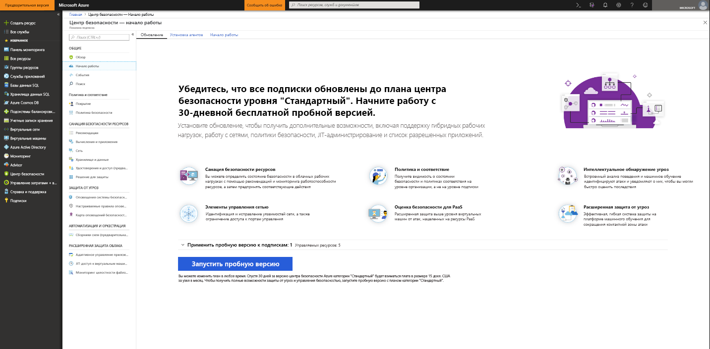
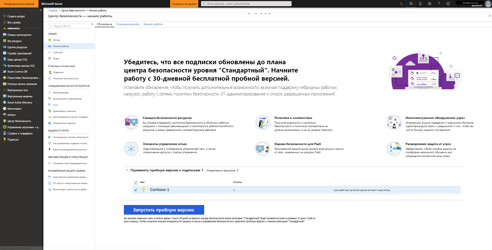

# Подключение к центру безопасности Azure уровня "Стандартный" для повышения уровня безопасности
Обновите центр безопасности до уровня "Стандартный", чтобы воспользоваться преимуществами управления повышенной безопасностью и защиты от угроз для гибридных облачных рабочих нагрузок.  Пробную версию уровня "Стандартный" можно использовать бесплатно. Дополнительные сведения см. на странице [цен на центр безопасности](https://azure.microsoft.com/pricing/details/security-center/).

Центр безопасности уровня "Стандартный" включает в себя следующее:

- **Гибридная защита.** Получите комплексный обзор безопасности всех локальных и облачных рабочих нагрузок. Применяйте политики безопасности и непрерывно проверяйте уровень безопасности гибридных облачных рабочих нагрузок, чтобы обеспечить соответствие стандартам безопасности. Выполняйте сбор, поиск и анализ данных о безопасности из разных источников, включая брандмауэры и другие партнерские решения.
- **Расширенное обнаружение угроз.** Предотвращайте прогрессивные кибератаки, используя возможности расширенной аналитики и Microsoft Intelligent Security Graph.  Определяйте атаки и уязвимости нулевого дня с помощью встроенного анализа поведения и машинного обучения. Обнаруживайте входящие атаки и отслеживайте дальнейшую работу систем за счет мониторинга сетей, компьютеров и облачных служб. Ускорьте анализ с помощью интерактивных инструментов и контекстной аналитики угроз.
- **Элементы управления доступом и приложениями.** Блокируйте вредоносные и другие нежелательные программы, используя рекомендации списка разрешений с поддержкой машинного обучения, адаптированных к определенным рабочим нагрузкам. Уменьшите количество сетевых атак с помощью управляемого JIT-доступа к портам управления на виртуальных машинах Azure, чтобы значительно сократить вероятность атак методом подбора и других сетевых атак.

## Обнаружение незащищенных ресурсов     
Центр безопасности автоматически обнаруживает подписки и рабочие области Azure, не включенные в центр безопасности уровня "Стандартный". Сюда входят подписки Azure, использующие версию центра безопасности уровня "Бесплатный" и рабочие нагрузки без включенного решения безопасности.

Всей подписки Azure можно обновить до уровня Standard, который наследуется всех поддерживаемых ресурсов в подписке. Стандартный уровень в рабочую область применяется ко всем ресурсам, отчеты в рабочую область.

> [!NOTE]
> Вам может потребоваться выполнить управление затратами и ограничить объем данных, собираемых для решения, ограничив его конкретным набором агентов. [Нацеливание решений](../operations-management-suite/operations-management-suite-solution-targeting.md) позволяет применять область к решениям и выполнять нацеливание подмножества компьютеров в рабочей области.  Если используется нацеливание решений, центр безопасности отображает рабочую область как область без решения.
>
>

## Обновление подписки Azure или рабочей области
Чтобы обновить подписку или рабочую область до уровня "Стандартный", сделайте следующее:
1. В главном меню центра безопасности выберите **Приступая к работе**.
  
2. В разделе **Обновление** центра безопасности появится список подписок и рабочих областей, доступных для подключения. 
   - Вы можете щелкнуть расширяемый список **Apply your trial** (Применить пробную версию), чтобы отобразить все подписки и рабочие области, для которых доступна пробная версия.
   -    Вы можете обновить подписки и рабочие области, пробная версия для которых недоступна.
   -    Вы можете выбрать подходящие рабочие области и подписки для использования в режиме пробной версии.
3.  Нажмите кнопку **Запустить пробную версию**, чтобы начать пробное использование выбранных подписок.
  

   > [!NOTE]
   > Бесплатных возможностей центра безопасности, применяются только к виртуальным машинам Azure и масштабируемого набора виртуальных МАШИН. Возможности уровня "Бесплатный" не применяются к компьютерам, не относящимся к Azure. Если вы выбрали уровень, стандартные возможности применяются для всех виртуальных машин Azure, масштабируемые наборы виртуальных Машин и компьютеров не Azure, отчеты в рабочую область. Мы рекомендуем применять уровень "Стандартный", чтобы обеспечить расширенную безопасность для ресурсов Azure и сторонних ресурсов.
   >
   >

## Подключение компьютеров, которые не относятся к Azure
Центр безопасности может отслеживать состояние безопасности компьютеров, не относящихся к Azure. Однако сначала необходимо подключить эти ресурсы. Компьютеры, не относящиеся к Azure, можно добавить из колонки **Приступая к работе** или **Вычисления**. Мы рассмотрим оба метода.

### Добавление новых компьютеров, не относящихся к Azure, из колонки **Приступая к работе**

1. Вернитесь к колонке **Приступая к работе**.   
2. Выберите вкладку **Начало работы**.

   

3. Выберите **Настроить** в разделе **Добавление новых компьютеров, не относящихся к Azure**. Отобразится список ваших рабочих областей Log Analytics. В этот список входит, если это применимо, рабочая область по умолчанию, созданная центром безопасности при включении автоматической подготовки. Выберите эту или другую рабочую область, которую следует использовать.

   ![Добавление компьютера, который не относится к Azure][7]

Имеющиеся рабочие области отображаются в разделе **Add new Non-Azure computers** (Добавление новых компьютеров, не относящихся к Azure). Вы можете создать рабочую область или добавить компьютеры в имеющуюся. Чтобы создать рабочую область, щелкните ссылку для **добавления новой рабочей области**.

### Добавление новых компьютеров, не относящихся к Azure, из колонки **Вычисления**

**Создание рабочей области и добавление компьютера**

1. В разделе **Add new non-Azure computers** (Добавление новых компьютеров, не относящихся к Azure) щелкните ссылку для **добавления новой рабочей области**.

   ![Добавление новой рабочей области][4]

2. В разделе **Безопасность и аудит** щелкните **Рабочая область OMS**, чтобы создать рабочую область.
   > [!NOTE]
   > Рабочие области OMS теперь называются рабочими областями Log Analytics.
3. В разделе **Рабочая область OMS** введите сведения для рабочей области.
4. В разделе **Рабочая область OMS** нажмите кнопку **ОК**.  После этого вы получите ссылку для загрузки агента и ключей Windows или Linux для идентификатора рабочей области, используемого при настройке агента.
5. В разделе **Безопасность и аудит** нажмите кнопку **ОК**.

**Выбор имеющейся рабочей области и добавление компьютера**

Вы можете добавить компьютер, выполнив рабочий процесс из колонки **подключений**, как показано выше, или из колонки **вычислений**. В этом примере мы используем колонку **вычислений**.

1. Вернитесь в главное меню центра безопасности и к **обзорной** панели мониторинга.

   ![Обзор][5]

2. Выберите **Вычисления и приложения**.
3. В разделе **Вычисления и приложения** выберите **Добавить компьютеры**.

   ![Колонка вычислений][6]

4. В разделе **Add new non-Azure computers** (Добавление новых компьютеров, не относящихся к Azure) выберите рабочую область, к которой необходимо подключить компьютер, и нажмите кнопку **Добавить компьютеры**.

   ![Добавление компьютеров][7]

   Колонка **Прямой агент** содержит ссылку для загрузки агента и ключей Windows или Linux для идентификатора рабочей области, используемого при настройке агента.   

## Дальнейшие действия
Из этой статьи вы узнали, как подключить ресурсы Azure и сторонние ресурсы, чтобы получить преимущества расширенной безопасности центра безопасности.  Чтобы расширить возможности работы с подключаемыми ресурсами, ознакомьтесь со следующими статьями:

- [Включение сбора данных](security-center-enable-data-collection.md)
- [Отчет об исследовании угроз](security-center-threat-report.md)
- [Управление доступом к виртуальным машинам с помощью JIT](security-center-just-in-time.md)

<!--Image references-->
[1]: ./media/security-center-onboarding/onboard.png
[2]: ./media/security-center-onboarding/onboard-subscription.png
[3]: ./media/security-center-onboarding/get-started.png
[4]: ./media/security-center-onboarding/create-workspace.png
[5]: ./media/security-center-onboarding/overview.png
[6]: ./media/security-center-onboarding/compute-blade.png
[7]: ./media/security-center-onboarding/add-computer.png
[8]: ./media/security-center-onboarding/onboard-workspace.png
