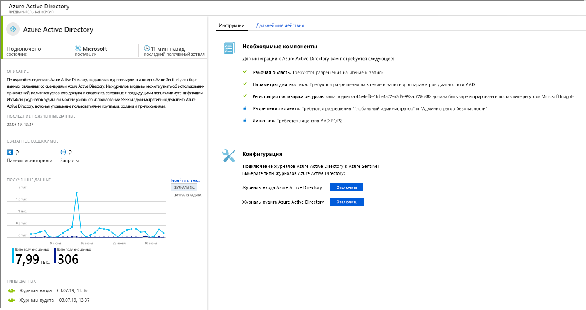
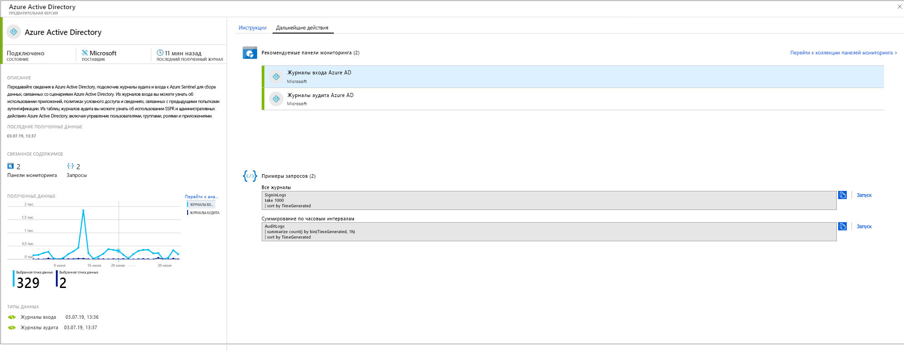
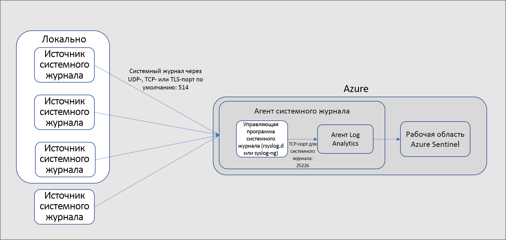
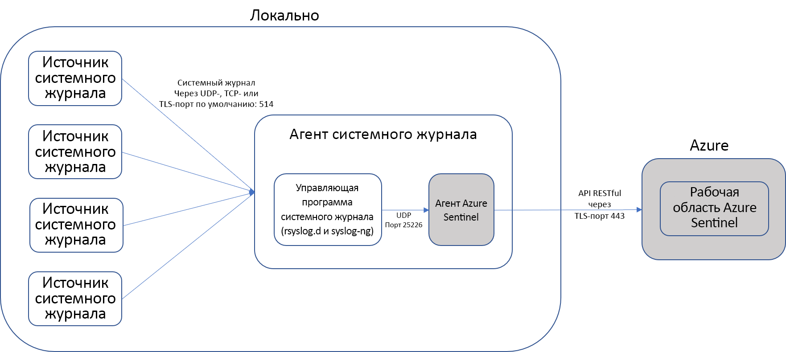

# Подключение источников данных

> [!IMPORTANT]
> Сейчас Azure Sentinel предоставляется в общедоступной предварительной версии.
> Эта предварительная версия предоставляется без соглашения об уровне обслуживания и не рекомендована для использования рабочей среде. Некоторые функции могут не поддерживаться или их возможности могут быть ограничены. Дополнительные сведения см. в статье [Дополнительные условия использования предварительных выпусков Microsoft Azure](https://azure.microsoft.com/support/legal/preview-supplemental-terms/).

Чтобы подключить Azure Sentinel, необходимо сначала подключиться к источникам данных. Azure Sentinel поставляется с несколькими соединителями для решений Майкрософт, которые доступны по умолчанию и обеспечивают интеграцию в режиме реального времени, включая решения Microsoft Threat Protection, источники Microsoft 365, Office 365, Azure AD, Azure ATP, Microsoft Cloud App Security и многое другое. Кроме того, доступны встроенные соединители для более широкой экосистемы безопасности для решений сторонних разработчиков. Чтобы подключить источники данных к Azure Sentinel, вы также можете использовать общий формат событий, Syslog или REST API.  

1. В меню выберите **Data connectors** (Соединители данных). На этой странице приведен полный список соединителей Azure Sentinel и показано состояние каждого из них. Выберите нужный соединитель и щелкните **Open connector page** (Открыть страницу соединителя). 

   

1. На странице соединителя проверьте, выполнены ли все предварительные требования, и следуйте инструкциям, чтобы подключить данные к Azure Sentinel. Синхронизация журналов с Azure Sentinel может начаться не сразу. После подключения вы увидите сводку данных в графе **Data received** (Полученные данные) и состояние подключения для типов данных.

   
  
1. Перейдите на вкладку **Next steps** (Дальнейшие действия), чтобы посмотреть список готового содержимого, предоставляемого Azure Sentinel для определенного типа данных.

   
 

## Методы подключения к данным

Azure Sentinel поддерживает следующие методы подключения к данным:

- **Службы Майкрософт**.  Службы Майкрософт подключены в собственном коде с помощью платформы Azure для готовой интеграции. Следующие решения можно подключить несколькими щелчками мыши.
    - [Office 365](connect-office-365.md)
    - [Данные для входа и журналы аудита Azure AD](connect-azure-active-directory.md)
    - [Действия Azure](connect-azure-activity.md)
    - [Защита идентификации Azure AD](connect-azure-ad-Identity-protection.md)
    - [Центр безопасности Azure](connect-azure-security-center.md)
    - [Azure Information Protection](connect-azure-information-protection.md)
    - [Расширенная защита от угроз Azure](connect-azure-atp.md)
    - [Cloud App Security](connect-cloud-app-security.md)
    - [События безопасности Windows](connect-windows-security-events.md) 
    - [Брандмауэр Windows](connect-windows-firewall.md)

- **Внешние решения через API**. Некоторые источники данных подключены с помощью интерфейсов API, предоставляемых подключенным источником данных. Как правило, большинство технологий безопасности предоставляют набор API, с помощью которых можно получить журналы событий. API подключаются к Azure Sentinel и собирают определенные типы данных, а затем отправляют их в Azure Log Analytics. Устройства, подключенные с помощью API:
    - [Barracuda](connect-barracuda.md)
    - [Symantec](connect-symantec.md)
- **Внешние решения через агента**. Azure Sentinel может подключаться ко всем источникам данных, которые могут выполнять потоковую передачу журнала в режиме реального времени с помощью протокола Syslog, через агента.  Большинство устройств использует протокол Syslog для отправки сообщений о событиях, которые включают сам журнал и данные о нем. Журналы имеют разный формат, но большинство устройств поддерживает стандарт общего формата событий (CEF).  Агент Azure Sentinel, основанный на Microsoft Monitoring Agent, преобразует журналы в формате CEF в формат, который принимается службой Log Analytics. В зависимости от типа устройства агент устанавливается или непосредственно на устройстве, или на выделенном сервере Linux. Агент для Linux получает события из управляющей программы Syslog по протоколу UDP. Если компьютер Linux должен собирать большое количество событий Syslog, отправка производится по протоколу TCP из управляющей программы Syslog в агент, а затем — в Log Analytics.
    - Брандмауэры, прокси-серверы и конечные точки.
        - [F5](connect-f5.md)
        - [Check Point](connect-checkpoint.md)
        - [Cisco ASA](connect-cisco.md)
        - [Fortinet](connect-fortinet.md)
        - [Palo Alto](connect-paloalto.md)
        - [Другие устройства CEF](connect-common-event-format.md)
        - [Другие устройства Syslog](connect-syslog.md)
    - Решения DLP
    - [Поставщики Threat Intelligence](connect-threat-intelligence.md)
    - [Компьютеры DNS](connect-dns.md) — агент установлен непосредственно на компьютере DNS
    - Серверы Linux
    - Другие облака
    
## Параметры подключения агента

Чтобы подключить внешнее устройство к Azure Sentinel, агент должен быть развернут на выделенном компьютере (виртуальной машине или локальном компьютере) для поддержки связи между устройством и Azure Sentinel. Вы можете развернуть агент автоматически или вручную. Автоматическое развертывание доступно только в том случае, если выделенный компьютер является новой созданной в Azure виртуальной машиной. 

Вместо этого вы можете развернуть агент вручную на существующей виртуальной машине Azure, на виртуальной машине в другом облаке или на локальном компьютере.

## Дополнительная информация

- Чтобы начать работу с Azure Sentinel, вам нужна подписка на Microsoft Azure. Если у вас нет подписки, вы можете зарегистрироваться для получения [бесплатной пробной версии](https://azure.microsoft.com/free/).
- Узнайте, как [подключить данные к Azure Sentinel](quickstart-onboard.md), и [отслеживайте свои данные и потенциальные угрозы](quickstart-get-visibility.md).
