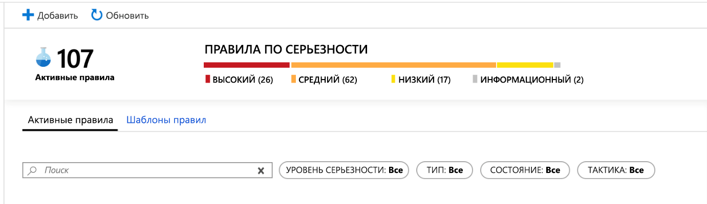
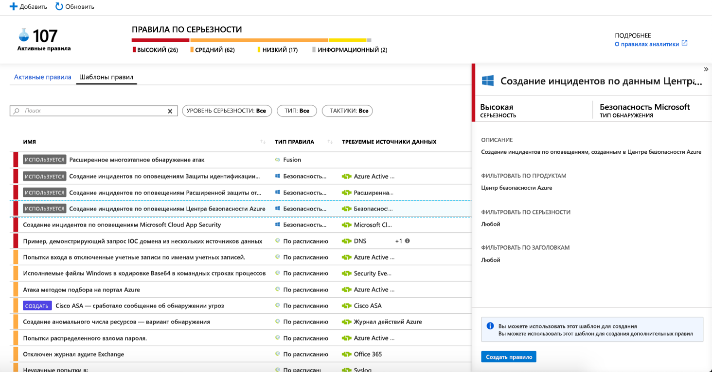
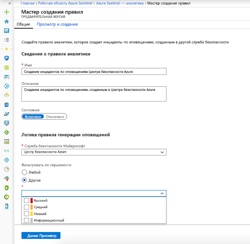
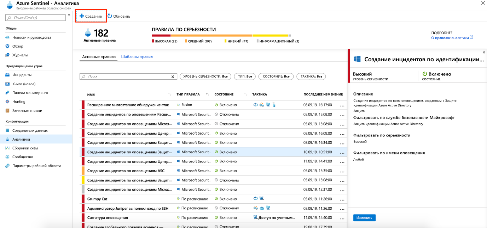
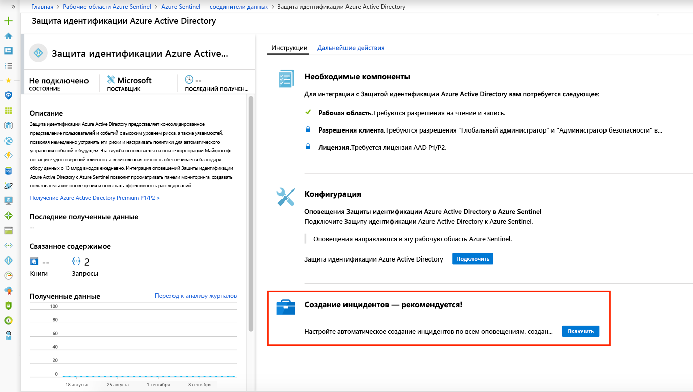

# Автоматически создавайте инциденты на основе оповещений системы безопасности Майкрософт

Оповещения, активируемые в решениях безопасности Майкрософт, подключенных к Azure Sentinel, например Microsoft Cloud App Security и Расширенная защита от угроз Azure, не создают инциденты в Azure автоматически. По умолчанию при подключении решения Майкрософт к Azure Sentinel все предупреждения, созданные в этой службе, будут храниться в виде необработанных данных в Azure Sentinel в таблице оповещений системы безопасности в рабочей области Azure Sentinel. Затем эти данные можно использовать как любые другие необработанные данные, которые подключаются к Sentinel.

Вы можете легко настроить Azure Sentinel для автоматического создания инцидентов при каждом запуске оповещения в подключенном решении безопасности Майкрософт, следуя инструкциям в этой статье.

## Предварительные требования
Чтобы включить создание инцидентов на основе оповещений службы безопасности, необходимо [подключить Решения безопасности Майкрософт](connect-data-sources.md#data-connection-methods).

## Использование правил аналитики для создания инцидентов безопасности Майкрософт

Используйте встроенные правила, доступные в Azure Sentinel, чтобы выбрать, какие подключенные решения безопасности Майкрософт должны автоматически создавать инциденты Azure Sentinel в режиме реального времени. Можно также изменить правила, чтобы определить более конкретные параметры фильтрации оповещений, создаваемых решением безопасности Майкрософт, которые должны создавать инциденты в Azure Sentinel. Например, вы можете создать инциденты Azure Sentinel автоматически только из оповещений центра безопасности Azure с высоким уровнем серьезности.

1. На портале Azure в разделе Azure Sentinel выберите **Аналитика**.

1. Выберите вкладку **Шаблоны правил**, чтобы просмотреть все встроенные правила аналитики.

    

1. Выберите шаблон правила аналитики **безопасности Майкрософт**, который вы хотите использовать, и щелкните **Создать правило**.

    

1. Вы можете изменить сведения о правиле и выбрать фильтрацию оповещений, которые будут создавать инциденты по серьезности предупреждения или по тексту, содержащемуся в имени оповещения.  
      
    Например, если вы выбираете **Центр безопасности Azure** в поле **службы безопасности Azure**, а затем значение **High** (Высокая) в поле **Фильтр по серьезности**, автоматически создавать инциденты в Azure Sentinel будут только оповещения Центра безопасности Azure с высоким уровнем серьезности.  

    

1. Можно также создать новое правило **безопасности Майкрософт**, которое фильтрует оповещения от разных служб безопасности Майкрософт, щелкнув **+Создать** и выбрав **правило создания инцидента Microsoft**.

    

  Вы можете создать более одного аналитического правила **безопасности Майкрософт** для каждого типа **службы безопасности Майкрософт**. Это не создает дублирующихся инцидентов, так как каждое правило используется в качестве фильтра. Даже если оповещение совпадает с более чем одним аналитическим правилом **безопасности Майкрософт**, он создает только один инцидент Azure Sentinel.

## Включение автоматического создания инцидентов во время подключения
 При подключении решения безопасности Майкрософт можно выбрать, будут ли оповещения в решении безопасности автоматически создавать инциденты в Azure Sentinel.

1. Подключение источника данных решения безопасности Майкрософт. 

   

1. В разделе **Создать инциденты** выберите **Разрешить**, чтобы включить правило аналитики по умолчанию, которое автоматически создает инциденты на основе оповещений, созданных в подключенной службе безопасности. Затем это правило можно изменить в разделе **Аналитика**, а затем **Активные правила**.

## Дополнительная информация

- Чтобы начать работу с Azure Sentinel, вам нужна подписка на Microsoft Azure. Если у вас нет подписки, вы можете зарегистрироваться для получения [бесплатной пробной версии](https://azure.microsoft.com/free/).
- Узнайте, как [подключить данные к Azure Sentinel](quickstart-onboard.md), и [отслеживайте свои данные и потенциальные угрозы](quickstart-get-visibility.md).
