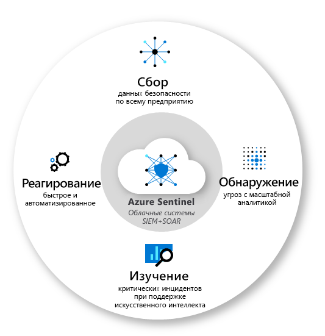
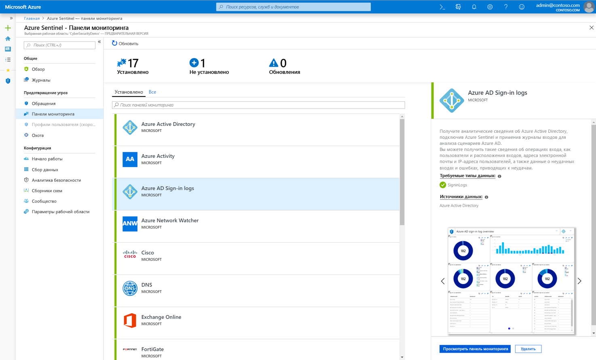
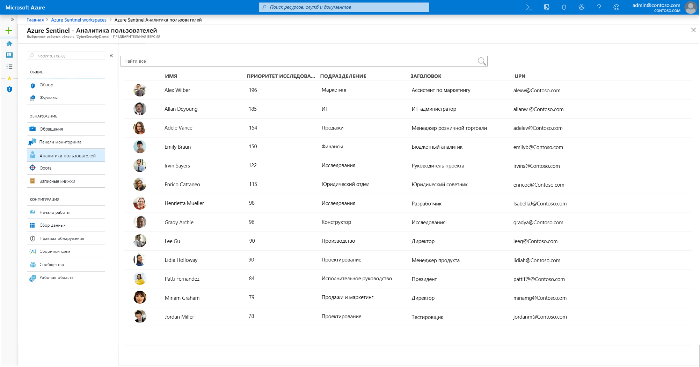
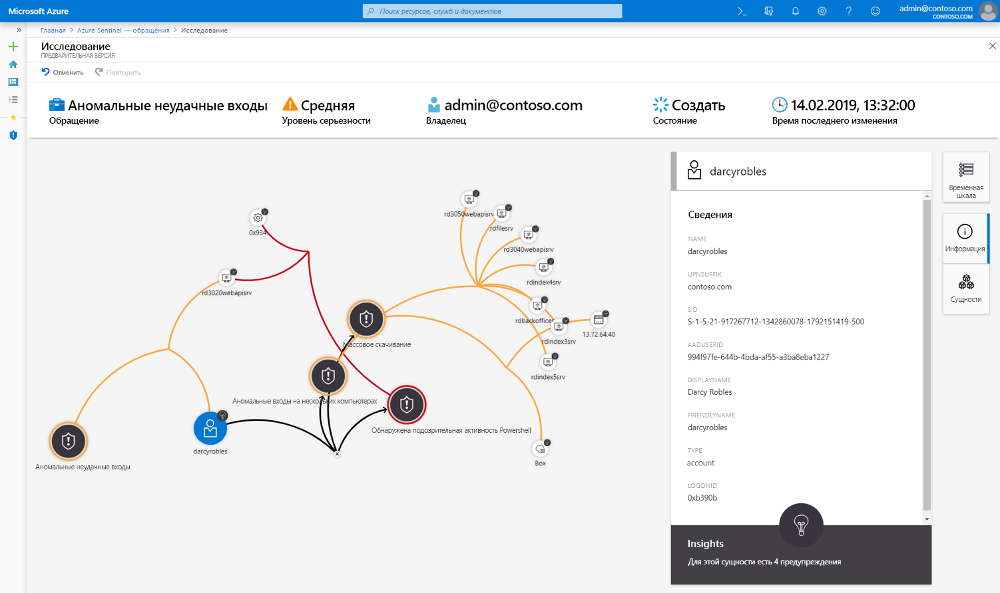
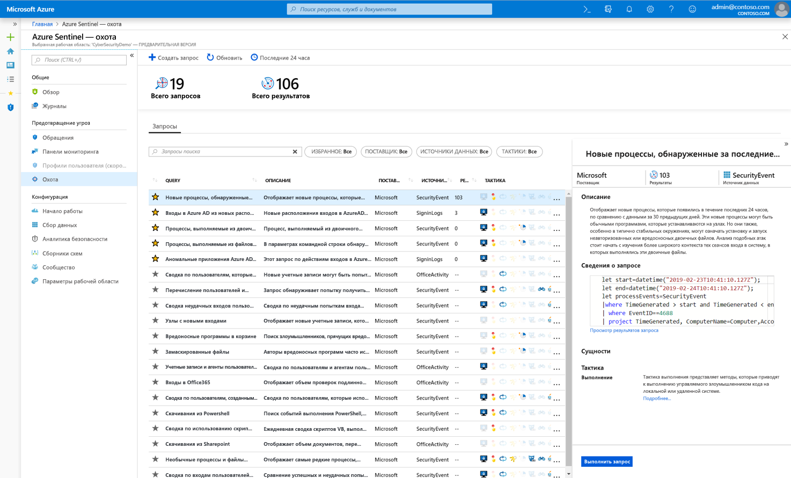
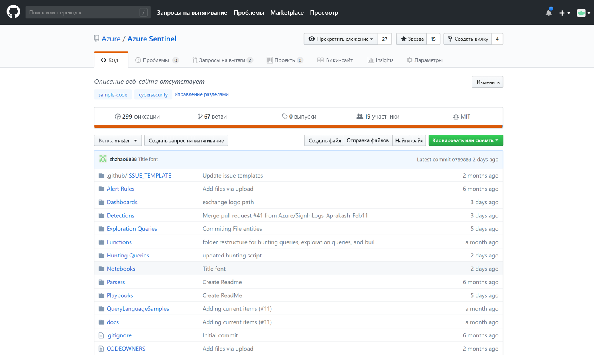

# Что такое предварительная версия Azure Sentinel?

> [!IMPORTANT]
> Сейчас Azure Sentinel предоставляется в общедоступной предварительной версии.
> Эта предварительная версия предоставляется без соглашения об уровне обслуживания и не рекомендована для использования рабочей среде. Некоторые функции могут не поддерживаться или их возможности могут быть ограничены. Дополнительные сведения см. в статье [Дополнительные условия использования предварительных выпусков Microsoft Azure](https://azure.microsoft.com/support/legal/preview-supplemental-terms/).

Microsoft Azure Sentinel — это масштабируемое ориентированное на облако решение для **управления информационной безопасностью и событиями безопасности (SIEM)**, а также для **автоматического ответа с помощью оркестрации операций защиты**. Azure Sentinel обеспечивает интеллектуальные средства для анализа данных безопасности и аналитику угроз по всему предприятию, предоставляя единое решение для обнаружения предупреждений, видимости угроз, упреждающего поиска и реагирования на угрозы. 

Azure Sentinel откроет вам полную картину происходящего на предприятии, позволяя избавиться от стресса, вызванного все более изощренными атаками, увеличением количества предупреждений и длительными временными рамками разрешения.

- **Собирайте данные облачного масштаба**, касающиеся всех пользователей, устройств, приложений и инфраструктуры как в локальной среде, так и во множестве облаков. 

- **Выявляйте угрозы, которые ранее не удавалось обнаружить**, и уменьшайте количество ложных срабатываний с помощью решений для анализа и не имеющих аналогов средств аналитики угроз от Майкрософт. 

- **Исследуйте угрозы с помощью искусственного интеллекта** и выявляйте подозрительные действия в любом масштабе, воспользовавшись преимуществами решений Майкрософт, разработанными на основе многолетнего опыта в сфере кибербезопасности. 

- **Оперативно реагируйте на инциденты** с помощью встроенных средств оркестрации и автоматизации стандартных задач.

Основываясь на полном спектре существующих служб Azure, Azure Sentinel изначально включает в себя проверенные основы, такие как Log Analytics и Logic Apps. Azure Sentinel расширяет возможности вашего исследования и обнаружения с помощью ИИ, а также обеспечивает поток аналитики угроз от Майкрософт и позволяет вам предоставить свою собственную аналитику угроз. 

 
## Подключение ко всем вашим данным

Чтобы подключить Sentinel Azure, необходимо сначала [подключиться к источникам безопасности](connect-data-sources.md). Azure Sentinel поставляется с несколькими соединителями для решений Майкрософт, которые доступны по умолчанию и обеспечивают интеграцию в режиме реального времени, включая решения Microsoft Threat Protection, источники Microsoft 365, Office 365, Azure AD, Azure ATP, Microsoft Cloud App Security и многое другое. Кроме того, доступны встроенные соединители для более широкой экосистемы безопасности для решений сторонних разработчиков. Чтобы подключить источники данных к Azure Sentinel, вы также можете использовать общий формат событий, Syslog или REST API.  

## Панели мониторинга

После подключения источников данных вы можете выбирать из коллекции [профессионально созданных панелей мониторинга](quickstart-get-visibility.md#dashboards), которые отображают ваши источники данных. Каждая панель мониторинга полностью настраивается: вы можете добавить свою собственную логику или изменить запросы, или вы можете создать панель мониторинга с нуля.

Панели мониторинга предоставляют интерактивную визуализацию с использованием расширенной аналитики, чтобы помочь вашим аналитикам по безопасности лучше понять, что происходит во время атаки. Инструменты исследования позволяют вам глубоко погрузиться в любую область, из любых данных, чтобы быстро обнаружить контекст угрозы. 

## Analytics

Чтобы помочь вам снизить уровень шума и свести к минимуму количество предупреждений, которые необходимо просматривать и исследовать, Azure Sentinel использует [аналитику для сопоставления предупреждений со случаями](tutorial-detect-threats.md). **Случаи** — это группы связанных предупреждений, создающих вместе возможную угрозу, которую вы можете изучить и устранить. Используйте встроенные правила корреляции как есть или используйте их в качестве исходной точки для создания своих собственных. Azure Sentinel также предоставляет правила машинного обучения для сопоставления поведения сети и поиска аномалий в ваших ресурсах. Эта аналитика соединяет точки, путем объединения оповещений с низкой достоверностью о различных объектах в потенциальные инциденты безопасности с высокой достоверностью.

## Аналитика пользователей

Благодаря интеграции платформенной функциональности машинного обучения (ML) и [аналитике пользователя](user-analytics.md) Azure Sentinel помогает быстро обнаруживать угрозы. Azure Sentinel легко интегрируется с Расширенной защитой от угроз Azure, чтобы анализировать поведение пользователей и определять, каких пользователей вы должны исследовать, основываясь в первую очередь на их предупреждениях и подозрительных последовательностях действий в Azure Sentinel и Microsoft 365.

## Автоматизация безопасности и оркестрация

Автоматизируйте свои общие задачи и [упростите оркестрацию безопасности с помощью сборников схем](tutorial-respond-threats-playbook.md), которые интегрируются со службами Azure, а также с вашими существующими средствами. Решение Azure Sentinel для автоматизации и оркестрации, созданное на основе Azure Logic Apps, обеспечивает расширяемую архитектуру, которая предоставляет масштабируемую автоматизацию по мере появления новых технологий и угроз. Чтобы создать сборники схем с помощью Azure Logic Apps, вы можете выбирать из растущей коллекции встроенных сборников схем. К ним относятся [более 200 соединителей](https://docs.microsoft.com/azure/connectors/apis-list) для служб, таких как Функции Azure. Соединители позволяют применять любую пользовательскую логику в коде, ServiceNow, Jira, Zendesk, HTTP-запросах, Microsoft Teams, Slack, ATP в Защитнике Windows и Cloud App Security.

Например, если вы пользуетесь системой отправки запросов ServiceNow, вы можете воспользоваться предоставленными средствами для использования Azure Logic Apps, чтобы автоматизировать ваши рабочие процессы и отправлять запросы в ServiceNow при каждом обнаружении определенного события.

## Исследование

Средства [глубокого исследования](tutorial-investigate-cases.md) Azure Sentinel помогут вам распознать область и найти первопричину потенциальной угрозы безопасности. Вы можете выбрать объект на интерактивной диаграмме, чтобы задать интересные вопросы касательно конкретного объекта, и детализировать этот объект и его связи, чтобы найти первопричину угрозы. 

## Поиск

Используйте [мощные инструменты поиска и отправки запросов Azure Sentinel](hunting.md), основанные на платформе MITRE, которые позволяют вам активно искать угрозы безопасности в источниках данных вашей организации до того, как сработает оповещение. После того как вы узнаете, какой поисковый запрос предоставляет ценные сведения о возможных атаках, вы также можете создавать настраиваемые правила обнаружения на основе вашего запроса и отображать эти сведения в качестве предупреждений для тех, кто реагирует на инциденты безопасности. Во время поиска вы можете создавать закладки для интересных событий, что позволит вам вернуться к ним позже, поделиться ими с другими и сгруппировать их с другими согласованными событиями, чтобы создать убедительные аргументы для изучения.

## Сообщество

Сообщество Azure Sentinel — это мощный ресурс для обнаружения угроз и автоматизации. Аналитики по безопасности компании Майкрософт постоянно создают и добавляют новые панели мониторинга, сборники схем, запросы поиска угроз и многое другое, публикуя их в сообществе, чтобы вы могли использовать их в вашей среде. Вы можете загрузить пример содержимого из частного[репозитория](https://aka.ms/asicommunity) сообщества на GitHub, чтобы создавать настраиваемые панели мониторинга, запросы поиска угроз, записные книжки и сборники схем для Azure Sentinel. 

## Дополнительная информация

- Чтобы начать работу с Azure Sentinel, вам нужна подписка на Microsoft Azure. Если у вас нет подписки, вы можете зарегистрироваться для получения [бесплатной пробной версии](https://azure.microsoft.com/free/).
- Узнайте, как [подключить данные к Azure Sentinel](quickstart-onboard.md), и [отслеживайте свои данные и потенциальные угрозы](quickstart-get-visibility.md).
