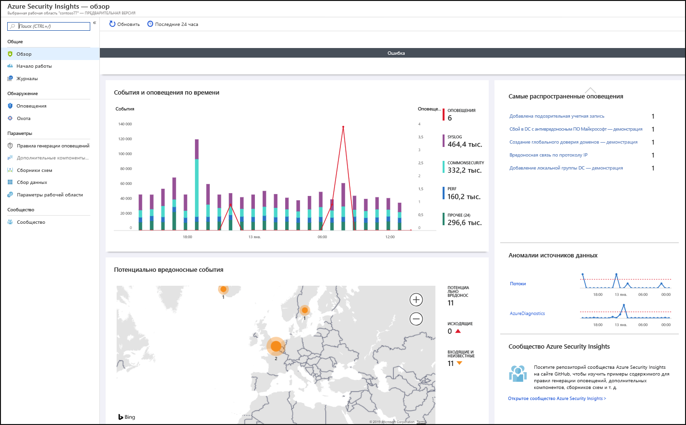
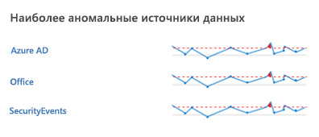
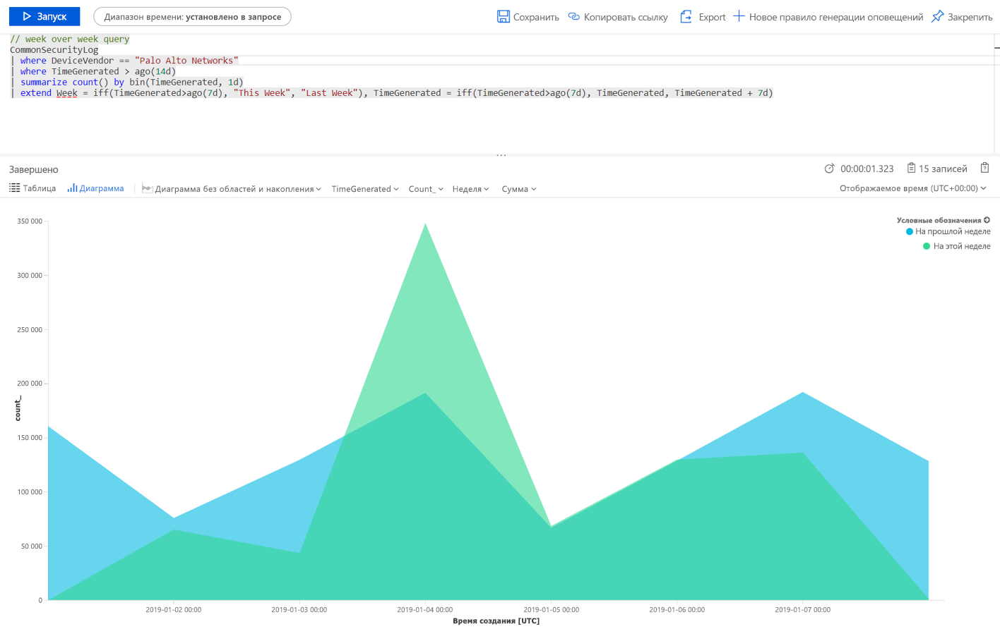
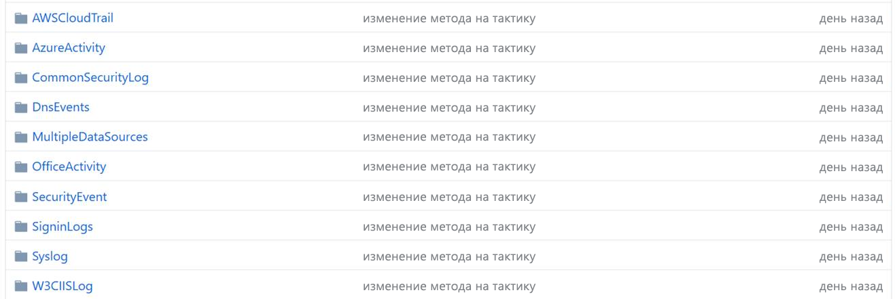
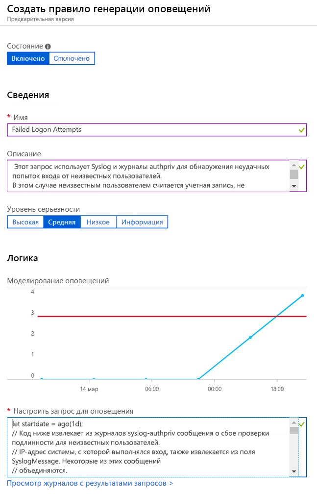

# Краткое руководство. Начало работы с предварительной версией Azure Sentinel

> [!IMPORTANT]
> Сейчас Azure Sentinel предоставляется в общедоступной предварительной версии.
> Эта предварительная версия предоставляется без соглашения об уровне обслуживания и не рекомендована для использования рабочей среде. Некоторые функции могут не поддерживаться или их возможности могут быть ограничены. Дополнительные сведения см. в статье [Дополнительные условия использования предварительных выпусков Microsoft Azure](https://azure.microsoft.com/support/legal/preview-supplemental-terms/).

В этом кратком руководстве содержатся сведения о том, как быстро просматривать и отслеживать процессы в вашей среде с помощью Azure Sentinel. После подключения источников данных к Azure Sentinel вы получаете мгновенную визуализацию и анализ данных, чтобы вы могли знать, что происходит во всех подключенных источниках данных. Azure Sentinel предоставляет панели мониторинга, которые предоставляют вам все возможности инструментов, уже доступных в Azure, а также таблицы и диаграммы, которые встроены для предоставления аналитики журналов и запросов. Вы можете использовать встроенные панели мониторинга или с легкостью создать новую с нуля или на основе существующей панели мониторинга. 

## Получение визуализации

Для визуализации и анализа того, что происходит в вашей среде, сначала взгляните на панель мониторинга с общими сведениями, чтобы получить представление о состоянии безопасности вашей организации. Вы можете нажать на каждый элемент этих плиток, чтобы перейти к необработанным данным, из которых они созданы. Чтобы помочь вам снизить уровень шума и свести к минимуму количество предупреждений, которые необходимо просматривать и исследовать, Azure Sentinel использует технологии слияния для сопоставления предупреждений со случаями. **Случаи** — это группы связанных предупреждений, которые вместе создают ситуацию, требующую действий, которую вы можете изучить и устранить.

- На портале Azure выберите Azure Sentinel и рабочую область, которую необходимо отслеживать.

  

- Панель инструментов в верхней части содержит сведения о количестве полученных событий за выбранный период времени и сравнивает их со сведениями за предыдущие 24 часа. Исходя из этих событий, панель инструментов указывает на те оповещения, которые были инициированы (малое число отображает изменение за последние 24 часа), а затем относительно этих событий сообщает количество открытых, в работе и закрытых. Убедитесь, что не произошло резкого увеличения или уменьшения количества событий. Если произошло уменьшение, соединение могло перестать отправлять отчеты в Azure Sentinel. Если произошло увеличение, возможно, произошло что-то подозрительное. Проверьте, есть ли у вас новые оповещения.

   

Основная часть страницы основных сведений дает представление о состоянии безопасности вашей рабочей области.

- **События и оповещения по времени**. Перечисляет количество событий и предупреждений, созданных на основе этих событий. Если возникает необычный пик, должно отобразится оповещения об этом событии. Но если происходит что-то необычное при пике событий, а оповещений нет, это может быть причиной для беспокойства.

- **Потенциально вредоносные события**. При обнаружении трафика из источников, которые, как известно, являются вредоносными, Azure Sentinel предупреждает вас на карте. Оранжевый цвет свидетельствует о входящем трафике: кто-то пытается получить доступ к вашей организации с известного вредоносного IP-адреса. Если вы видите исходящую (красную) активность, это означает, что данные из сети перенаправляются из вашей организации на известный вредоносный IP-адрес.

   

- **Последние события**. Для просмотра последних событий, их серьезности и количества связанных с ними предупреждений. Если вы видите внезапный пик в определенном типе оповещения, это может означать, что в данный момент запущена активная атака. Например, если у вас есть внезапный пик 20 событий Pass-the-hash от Azure ATP, возможно, кто-то пытается атаковать вас.

- **Аномалии источника данных**. Аналитики данных корпорации Майкрософт создали модели, которые постоянно проверяют данные на наличие аномалий в источниках данных. Если никаких аномалий нет, ничего не отображается. Если обнаружены аномалии, необходимо глубоко их исследовать, чтобы увидеть их причину. Например, щелкните пик в действиях Azure. Щелкните **Диаграмма**, чтобы увидеть, когда произошел пик, после чего установите фильтр для действий, произошедших во время этого периода времени, чтобы узнать, что стало причиной этого пика.

   

## Использование встроенных панелей мониторинга

Встроенные панели мониторинга предоставляют данные собранные из подключенных источников данных, что позволяет вам узнать больше о событиях, создаваемых в этих службах. Ко встроенным панелям мониторинга относятся идентификатор Azure, события действий Azure и локальные данные, полученные из серверов событий Windows, из собственных оповещений, от сторонних производителей, включая журналы трафика брандмауэра, Office 365 и небезопасные протоколы, основанные на событиях Windows.

1. В разделе **Параметры** выберите **Панели мониторинга**. В разделе **Установленные** вы можете увидеть все установленные панели мониторинга. В разделе **Все** отображается вся коллекция встроенных панелей мониторинга, доступных для установки. 
2. Найдите определенную панель мониторинга, чтобы увидеть полный список и описание того, что каждая из них предлагает. 
3. Мы рекомендуем установить по крайней мере следующие панели мониторинга, если для начала работы Azure Sentinel вы используете Azure AD.
   - **Azure AD**. Используйте одно или оба из приведенных ниже действий.
       - **Данные для входа Azure AD** анализируют входы в систему за определенный период времени, чтобы обнаружить аномалии. На этой панели мониторинга представлены неудачные входы приложений, устройств и расположений, таким образом, вы можете быстро заметить возникновение чего-то необычного. Обратите внимание на несколько неудачных входов. 
       - **Журналы аудита Azure AD** анализируют действия администратора, например изменение пользователей (добавления, удаления и т. д.), создание группы и изменение файлов.  

   - Добавьте панель мониторинга для брандмауэра. Например, добавьте панель мониторинга Palo Alto. Панель мониторинга анализирует трафик брандмауэра, предоставляя корреляцию между событиями данных и угрозой для вашего брандмауэра, и выделяет подозрительные события между сущностями. Панели мониторинга предоставляют сведения о тенденциях трафика и позволяют детализировать и фильтровать результаты. 

      

Вы можете настроить панель мониторинга путем редактирования основного запроса (). Нажмите на кнопку , чтобы перейти в [Log Analytics для изменения запроса](../azure-monitor/log-query/get-started-portal.md). Вы можете выбрать кнопку с многоточием (...) и щелкнуть **Настройка данных плитки**, что позволяет изменить основной фильтр времени или удалить определенные плитки с панели мониторинга.

Дополнительные сведения о работе с запросами см. в статье [Создание панелей мониторинга данных Log Analytics и предоставление общего доступа к ним](../azure-monitor/learn/tutorial-logs-dashboards.md)

### Добавление новой плитки

Чтобы добавить новую плитку, поместите ее в существующую панель мониторинга, либо в любую созданную вами, либо во встроенную панель мониторинга Azure Sentinel. 
1. Создайте плитку в Log Analytics с помощью инструкций, приведенных в статье [Создание панелей мониторинга данных Log Analytics и предоставление общего доступа к ним](../azure-monitor/learn/tutorial-logs-dashboards.md). 
2. После создания плитки в разделе **ПИН-код** выберите панель мониторинга, в которой будет отображаться плитка.

## Создание новых панелей мониторинга
Вы можете создать новую панель мониторинга с нуля или использовать встроенную панель мониторинга в качестве основы для новой.

1. Чтобы создать новую панель мониторинга с нуля, выберите **Панели мониторинга**, а затем — **+ Новая панель мониторинга**.
2. Выберите подписку, в которой создана панель мониторинга, и присвойте ей описательное имя. Каждая из панелей мониторинга — это, как и другие службы, ресурс Azure, и вы можете присвоить ей роли (RBAC) для определения и ограничения доступа. 
3. Чтобы включить появление каждой из них среди панелей мониторинга, на которых закрепляется визуализация, вам необходимо предоставить к ним общий доступ. Щелкните **Общая папка** и **Управление пользователями**. 
 
1. Как и для других ресурсов Azure, используйте **Проверить доступ** и **Назначения ролей**. Дополнительные сведения см. в статье [Предоставление общего доступа к панелям мониторинга Azure с помощью управления доступом на основе ролей](../azure-portal/azure-portal-dashboard-share-access.md).

## Примеры новых панелей мониторинга

В следующем примере запрос позволяет сравнить тенденции трафика по неделям. Вы можете с легкостью переключаться между устройствами поставщика и источниками данных. на которых будете выполнять запрос. В этом примере используется SecurityEvent из Windows. Вы можете переключиться на AzureActivity или CommonSecurityLog на любом другом брандмауэре.

     |where DeviceVendor = = "Palo Alto Networks":
      // week over week query
      SecurityEvent
      | where TimeGenerated > ago(14d)
      | summarize count() by bin(TimeGenerated, 1d)
      | extend Week = iff(TimeGenerated>ago(7d), "This Week", "Last Week"), TimeGenerated = iff(TimeGenerated>ago(7d), TimeGenerated, TimeGenerated + 7d)

Вы можете создать запрос, который включает в себя данные из нескольких источников. Вы можете создать запрос, который ищет в журналах аудита Azure Active Directory новых, только что созданных пользователей, а затем проверяет журналы Azure, чтобы узнать, начал ли пользователь вносить изменения в назначения ролей в течение 24 часов после создания. Такое подозрительное действие будет отображаться на панели мониторинга.

    AuditLogs
    | where OperationName == "Add user"
    | project AddedTime = TimeGenerated, user = tostring(TargetResources[0].userPrincipalName)
    | join (AzureActivity
    | where OperationName == "Create role assignment"
    | project OperationName, RoleAssignmentTime = TimeGenerated, user = Caller) on user
    | project-away user1

На основе роли пользователя, который просматривает данные, и того, что он ищет, вы можете создавать разные панели мониторинга. Например, вы можете создать панель мониторинга для администратора сети, содержащую данные брандмауэра. Вы также можете создавать панели мониторинга в зависимости от того, как часто хотите просматривать их, существуют ли элементы, которые вы хотите просматривать каждый день, или другие элементы, которые нужно проверять раз в час (например, каждый час вы просматриваете входы Azure AD, чтобы выявить аномалии). 

## Создание обнаружений

Создание обнаружений в [источниках данных, которые подключены к Azure Sentinel](connect-data-sources.md), для обнаружения угроз в вашей организации.

При создании обнаружения, используйте встроенные обнаружения, созданные специалистами Майкрософт по вопросам безопасности и предназначенные для источников данных, к которым вы подключены.

1. [В сообществе GitHub](https://github.com/Azure/Azure-Sentinel/tree/master/Detections) перейдите в каталог **Detections** (Обнаружения) и выберите соответствующие папки.
   
 
3.  Перейдите на вкладку **Analytics** и выберите **Добавить**.
   

3.  Скопируйте все параметры для правила и нажмите кнопку **Создать**.
   

 
## Дополнительная информация
Из этого краткого руководства вы узнали, как начать работу с Azure Sentinel. Продолжите изучение в руководстве об [обнаружении угроз](tutorial-detect-threats.md).
> [!div class="nextstepaction"]
> [Обнаруживайте угрозы](tutorial-detect-threats.md), чтобы автоматизировать ответы на них.

