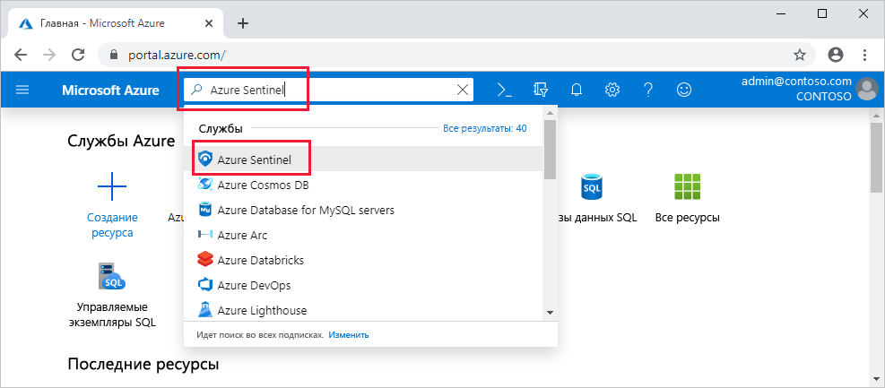

# Встроенный Sentinel Azure

В этом кратком руководстве вы узнаете, как настроить метку Azure. 

Чтобы подключить метку Azure, сначала необходимо включить метку Azure, а затем подключиться к источникам данных. В состав Azure Sentinel входит ряд соединителей для решений Майкрософт, которые доступны в режиме реального времени и обеспечивают интеграцию с Microsoft Threat Protection, в том числе решения Майкрософт для защиты от угроз, Microsoft 365 источники, включая Office 365, Azure AD, Azure ATP и Microsoft Cloud App Security и многое другое. Кроме того, доступны встроенные соединители для более широкой экосистемы безопасности для решений сторонних разработчиков. Для подключения источников данных к Azure Sentinel можно также использовать общий формат событий, системный журнал или интерфейс API RESTFUL.  

После подключения источников данных выберите из коллекции книг, созданных экспертами, которые позволяют отображать данные в соответствии с вашими данными. Эти книги можно легко настроить в своих нуждах.

## Глобальные предварительные требования

- Активная подписка Azure. Если у вас ее нет, создайте [бесплатную учетную запись](https://azure.microsoft.com/free/?WT.mc_id=A261C142F) , прежде чем начинать работу.

- Рабочая область Log Analytics. Узнайте, как [создать рабочую область log Analytics](../log-analytics/log-analytics-quick-create-workspace.md)

-  Чтобы включить метку Azure, необходимы разрешения участника для подписки, в которой находится рабочая область Azure Sentinel. 
- Для использования Sentinel Azure требуются разрешения участника или читателя на группу ресурсов, к которой принадлежит Рабочая область.
- Для подключения к конкретным источникам данных могут потребоваться дополнительные разрешения.
- Azure Sentinel — это платная служба. Сведения о ценах см. в статье [об Azure Sentinel](https://go.microsoft.com/fwlink/?linkid=2104058).
 
## Включение Sentinel Azure

1. Перейдите в портал Azure.
2. Убедитесь, что выбрана подписка, в которой создан метку Azure. 
3. Выполните поиск по фразе Azure Sentinel. 
   

1. Щелкните **+Добавить**.
1. Выберите рабочую область, которую вы хотите использовать, или создайте новую. Вы можете запускать метку Azure в нескольких рабочих областях, но данные изолированы по одной рабочей области.

   

   >[!NOTE] 
   > - Рабочие области по умолчанию, созданные центром безопасности Azure, не будут отображаться в списке. Вы не можете установить на них метку Azure.
   > - Sentinel Azure можно запускать в рабочих областях в любой общедоступной [области log Analytics](https://azure.microsoft.com/global-infrastructure/services/?products=monitor) за исключением регионов Китая, Германии и Azure для государственных организаций. Данные, созданные с помощью Sentinel Azure (например, инциденты, закладки и правила генерации оповещений, которые могут содержать данные о клиентах из этих рабочих областей), сохраняются либо в Западной Европе (для рабочих областей, расположенных в Европе), либо в восточной части США (для всех рабочих областей на основе США, а также любой другой регион, кроме Европы.

6. Щелкните **Добавить метку Azure**.
  

## Подключение источников данных

Azure Sentinel создает подключение к службам и приложениям, подключаясь к службе и перенаправляя события и журналы в Azure Sentinel. Для компьютеров и виртуальных машин можно установить агент Sentinel Azure, который собирает журналы и перенаправит их в Azure Sentinel. Для брандмауэров и прокси-серверов в Azure Sentinel используется сервер syslog Linux. Агент устанавливается на нем, откуда агент собирает файлы журнала и пересылает их в Azure Sentinel. 
 
1. Щелкните **сбор данных**.
2. Существует плитка для каждого источника данных, к которому можно подключиться. 
Например, щелкните **Azure Active Directory**. Если вы подключаете этот источник данных, вы выполняете потоковую передачу всех журналов из Azure AD в метку Azure. Вы можете выбрать тип журналов, которые вы хотите включить в глобальную сеть для входа в журналы и (или) журналы аудита.  
В нижней части Azure Sentinel приводятся рекомендации по выбору книг, которые следует установить для каждого соединителя, чтобы вы могли немедленно получить интересующие вас данные.   Следуйте инструкциям по установке или см. Дополнительные сведения в [соответствующем руководстве по подключению](connect-data-sources.md) . Дополнительные сведения о соединителях данных см. в разделе [Подключение служб Майкрософт](connect-data-sources.md).

После подключения источников данных данные запускают потоковую передачу в Azure Sentinel и готовы начать работу с. Вы можете просмотреть журналы на [встроенных панелях мониторинга](quickstart-get-visibility.md) и начать создавать запросы в log Analytics для [изучения данных](tutorial-investigate-cases.md).

## Следующие шаги
В этом документе вы узнали о подключении источников данных к Azure Sentinel. Ознакомьтесь с дополнительными сведениями об Azure Sentinel в соответствующих статьях.
- Узнайте, как [получить представление о данных и потенциальных угрозах](quickstart-get-visibility.md).
- Приступая [к обнаружению угроз с помощью Azure Sentinel](tutorial-detect-threats-built-in.md).
- Потоковая передача данных из [стандартных форматов ошибок](connect-common-event-format.md) в Azure Sentinel.
