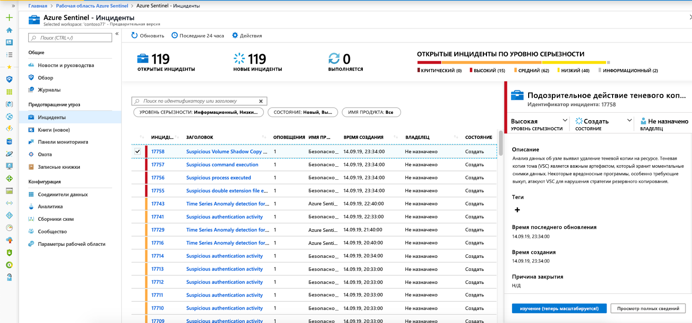
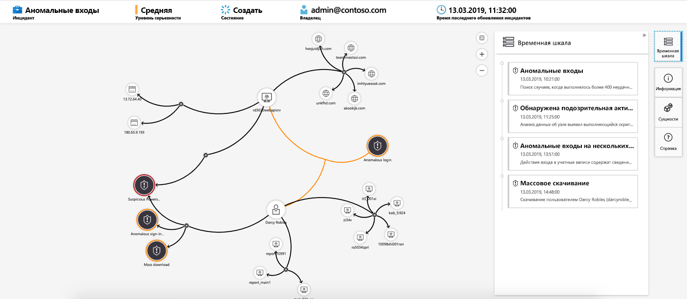

# Учебник. Изучение инцидентов с помощью Azure Sentinel

> [!IMPORTANT]
> График расследования в настоящее время находится в общедоступной предварительной версии.
> Эта функция предоставляется без соглашения об уровне обслуживания и не рекомендуется для рабочих нагрузок.
> Дополнительные сведения см. в статье [Дополнительные условия использования предварительных выпусков Microsoft Azure](https://azure.microsoft.com/support/legal/preview-supplemental-terms/).

Этот учебник поможет исследовать инциденты с помощью Azure Sentinel. После подключения источников данных к Sentinel Azure вы будете получать уведомления о подозрительных событиях. Чтобы сделать это, Azure Sentinel позволяет создавать дополнительные правила генерации оповещений, которые создают инциденты, которые можно назначать и исследовать.

В этой статье рассматриваются следующие действия:
> [!div class="checklist"]
> * Изучение инцидентов
> * Использование графа расследования
> * Реагирование на угрозы

Инцидент может включать несколько предупреждений. Это совокупность всех соответствующих доказательств для конкретного расследования. Инцидент создается на основе правил аналитики, созданных на странице **аналитика** . Свойства, связанные с предупреждениями, такие как серьезность и состояние, задаются на уровне инцидента. После того как вы разрешите Azure Sentinel узнать, какие типы угроз вам нужны, и как их найти, вы можете отслеживать обнаруженные угрозы, изучая инциденты.

## Предварительные требования
Вы сможете исследовать инцидент только в том случае, если вы использовали поля сопоставления сущностей при настройке аналитического правила. Для работы с графиком расследования требуется, чтобы исходный инцидент включал в себя сущности.

## Изучение инцидентов

1. Выберите **инциденты**. На странице **инциденты** вы узнаете, сколько инцидентов имеется, сколько открыто, сколько настроено на **выполнение**и сколько закрыто. Для каждого инцидента можно увидеть время его возникновения и состояние инцидента. Взгляните на серьезность, чтобы решить, какие инциденты должны быть обработаны первыми.

    

1. Можно отфильтровать инциденты по мере необходимости, например по состоянию или серьезности.

1. Чтобы начать исследование, выберите конкретный инцидент. Справа можно просмотреть подробные сведения об инциденте, включая его серьезность, сводку по количеству задействованных сущностей, необработанные события, которые активировали этот инцидент, и уникальный идентификатор инцидента.

1. Чтобы просмотреть дополнительные сведения об оповещениях и сущностях в инциденте, выберите **Просмотреть все сведения** на странице инцидент и просмотрите соответствующие вкладки, которые обобщаются сведения об инциденте. На вкладке **оповещения** ознакомьтесь с самим предупреждением. Вы можете просмотреть все соответствующие сведения о предупреждении — запрос, который активировал предупреждение, число возвращенных результатов на запрос, а также возможность запуска модули PlayBook для оповещений. Чтобы продолжить детализацию в инциденте, выберите число **событий**. Откроется запрос, создавший результаты, и события, вызвавшие предупреждение в Log Analytics. На вкладке **сущности** можно просмотреть все сущности, сопоставленные как часть определения правила генерации оповещений.

    

1. Если вы активно изучаете инцидент, рекомендуется установить состояние инцидента **в значение выполняется** до тех пор, пока вы не закроете его.

1. Инциденты могут назначаться конкретному пользователю. Для каждого инцидента можно назначить владельца, задав поле **владелец инцидента** . Все инциденты запускаются как неназначенные. Кроме того, можно добавлять комментарии, чтобы другие аналитики могли понять, что вы изучаете, и какие проблемы связаны с инцидентом.

    

1. Выберите **исследовать** , чтобы просмотреть карту расследований.

## Воспользуйтесь графиком расследования для глубокого изучения

Исследовательский график позволяет аналитикам задавать правильные вопросы для каждого расследования. Этот график помогает понять область и определить основную причину потенциальной угрозы безопасности путем корреляции релевантных данных с любой вовлеченной сущностью. Вы можете глубже изучить любую сущность, представленную на графе, выбрав ее и выбрав один из вариантов расширения.  
  
На диаграмме расследования представлено следующее:

- **Визуальный контекст из необработанных данных**: В режиме реального времени Visual Graph отображает связи сущностей, извлеченные автоматически из необработанных данных. Это позволяет легко просматривать соединения в разных источниках данных.

- **Полное обнаружение области исследования**: Расширьте область расследования с помощью встроенных запросов на изучение, чтобы полностью определить область нарушения.

- **Встроенные процедуры расследования**: Используйте предварительно определенные параметры просмотра, чтобы убедиться, что вы задаете нужные вопросы на стороне угрозы.

Чтобы использовать диаграмму расследования, выполните следующие действия.

1. Выберите инцидент, а затем нажмите кнопку **исследовать**. Откроется диаграмма расследования. Граф предоставляет наглядную карту сущностей, непосредственно подключенных к предупреждению, и каждый ресурс, подключенный дальше.

   > [!IMPORTANT] 
   > Вы сможете исследовать инцидент только в том случае, если вы использовали поля сопоставления сущностей при настройке аналитического правила. Для работы с графиком расследования требуется, чтобы исходный инцидент включал в себя сущности.

   

1. Выберите сущность, чтобы открыть область **сущности** , чтобы можно было просматривать сведения об этой сущности.

    
  
1. Расширьте свой анализ, наведя указатель мыши на каждую сущность, чтобы получить список вопросов, которые были разработаны специалистами по безопасности и аналитиками для каждого типа сущности, чтобы углубить ваше исследование. Мы вызываем эти параметры, чтобы **исследовать запросы**.

    

   Например, на компьютере можно запросить связанные оповещения. Если выбрать запрос на просмотр, результирующие права будут добавлены обратно в граф. В этом примере при выборе **связанных предупреждений** в графе возвращаются следующие оповещения:

    

1. Для каждого запроса на просмотр можно выбрать параметр, чтобы открыть необработанные результаты события и запрос, используемый в Log Analytics, выбрав **события @ no__t-1**.

1. Чтобы разобраться в инциденте, граф предоставляет параллельную временную шкалу.

    

1. Наведите указатель мыши на временную шкалу, чтобы увидеть, какие элементы на диаграмме произошли в тот момент времени.

    

## Следующие шаги
В этом руководстве вы узнали, как приступить к исследованию инцидентов с помощью Sentinel Azure. Перейдите к руководству по [реагированию на угрозы с помощью автоматизированного модули PlayBook](tutorial-respond-threats-playbook.md).
> [!div class="nextstepaction"]
> [Реагирование на угрозы](tutorial-respond-threats-playbook.md) для автоматизации реагирования на угрозы.

