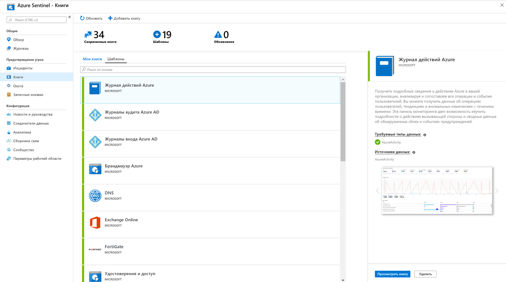

# Учебник. мониторинг данных

После [подключения источников данных](quickstart-onboard.md) к Azure Sentinel вы можете отслеживать данные с помощью интеграции Sentinel azure с Azure Monitor книгами, что обеспечивает универсальность при создании настраиваемых панелей мониторинга. Хотя рабочие книги отображаются по-разному в Azure Sentinel, может быть полезно ознакомиться [с созданием интерактивных отчетов с Azure Monitor книгами](../azure-monitor/app/usage-workbooks.md). Azure Sentinel позволяет создавать пользовательские книги для данных, а также встроенные шаблоны книг, позволяющие быстро получать ценные сведения по данным сразу после подключения к источнику данных.

Этот учебник поможет вам отслеживать данные в Azure Sentinel.
> [!div class="checklist"]
> * Использование встроенных книг
> * Создание новых книг

## предварительным требованиям

- У вас должно быть по крайней мере разрешение на доступ к книге или участник книги в группе ресурсов рабочей области "Sentinel" Azure.

> [!NOTE]
> Книги, которые вы видите в Azure Sentinel, сохраняются в группе ресурсов рабочей области Azure Sentinel и отмечаются рабочей областью, в которой они были созданы.

## Использование встроенных книг

1. Перейдите в раздел **книги** , а затем выберите **шаблоны** , чтобы просмотреть полный список встроенных книг Azure Sentinel. Чтобы увидеть, какие данные относятся к подключенным типам данных, в поле **обязательные типы данных** в каждой книге будет отображаться тип данных рядом с зеленой галочкой, если вы уже пометите в поток релевантную передачу данных в Azure Sentinel.
  
1. Нажмите кнопку **просмотреть книгу** , чтобы просмотреть шаблон, заполненный вашими данными.
  
1. Чтобы изменить книгу, нажмите кнопку **сохранить**, а затем выберите расположение, в котором нужно сохранить JSON файл для шаблона. 

   > [!NOTE]
   > Это приведет к созданию ресурса Azure на основе соответствующего шаблона и сохранению самого файла JSON шаблона, а не данных.

1. Выберите **Просмотр книги**. Затем нажмите кнопку **изменить** в верхней части страницы. Теперь можно изменить книгу и настроить ее в соответствии с вашими потребностями. Дополнительные сведения о настройке книги см. в статье [Создание интерактивных отчетов с помощью Azure Monitor книг](../azure-monitor/app/usage-workbooks.md).

1. После внесения изменений можно сохранить книгу. 

1. Можно также клонировать книгу: выберите **изменить** , а затем **Сохранить как**, сохранив ее под другим именем в той же подписке и группе ресурсов. Эти книги отображаются на вкладке **Мои книги** .

## Создать новую книгу

1. Перейдите в раздел **книги** и выберите команду **Добавить книгу** , чтобы создать новую книгу с нуля.
  

1. Чтобы изменить книгу, выберите **изменить**, а затем при необходимости добавьте текст, запросы и параметры. Дополнительные сведения о настройке книги см. в статье [Создание интерактивных отчетов с помощью Azure Monitor книг](../azure-monitor/app/usage-workbooks.md). 

1. При создании запроса установите для **источника данных** значение **журналы**, для параметра **тип ресурса** — значение **log Analytics** а затем выберите соответствующие рабочие области. 

1. После создания книги сохраните книгу, убедившись в том, что она сохранена в подписке и группе ресурсов рабочей области "Sentinel" Azure.

1. Если вы хотите разрешить другим пользователям в вашей организации использовать книгу, в разделе **сохранить для** выбора **общих отчетов**. Если вы хотите, чтобы эта книга была доступна только вам, выберите **Мои отчеты**.

1. Для переключения между книгами в рабочей области можно выбрать пункт **открыть** в верхней области любой книги. В окне, открывающемся справа, переключитесь между книгами.

   

## Удаление книг

Вы можете удалить книги, созданные на основе шаблона Sentinel Azure. 

Чтобы удалить настроенную книгу, на странице книги выберите сохраненную книгу, которую необходимо удалить, и нажмите кнопку **Удалить**. Сохраненная книга будет удалена.

> [!NOTE]
> При этом удаляется ресурс, а также все изменения, внесенные в шаблон. Исходный шаблон останется доступным.

## Дополнительная информация

В этом руководстве вы узнали, как просматривать данные в Azure Sentinel.

Сведения об автоматизации реагирования на угрозы см. в статье [Настройка автоматических ответов на угрозы в Azure Sentinel](tutorial-respond-threats-playbook.md).
