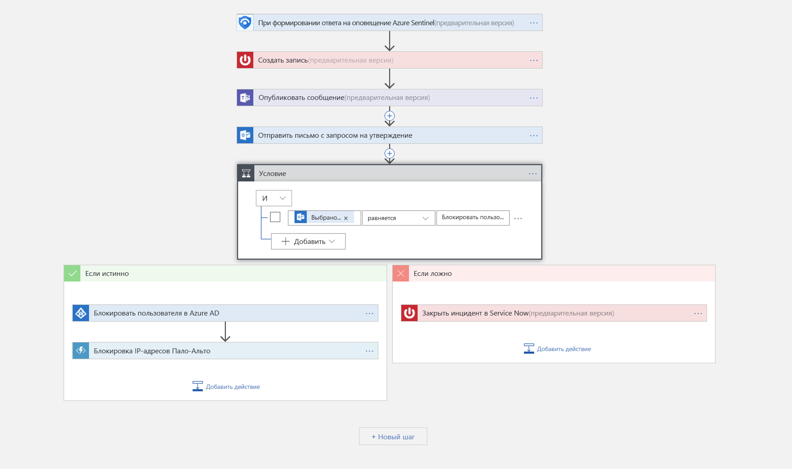

# Руководство по настройке автоматического реагирования на угрозы в предварительной версии Azure Sentinel

> [!IMPORTANT]
> Azure Sentinel сейчас предоставляется в режиме общедоступной предварительной версии.
> Эта предварительная версия предоставляется без соглашения об уровне обслуживания и не рекомендована для использования рабочей среде. Некоторые функции могут не поддерживаться или их возможности могут быть ограничены. Дополнительные сведения см. в статье [Дополнительные условия использования предварительных выпусков Microsoft Azure](https://azure.microsoft.com/support/legal/preview-supplemental-terms/).

В этом учебнике показано, как использовать сборники схем по обеспечению безопасности в Azure Sentinel для настройки автоматического реагирования на связанные с безопасностью угрозы, обнаруженные Azure Sentinel.

> [!div class="checklist"]
> * Общие сведения о сборниках схем
> * Создание сборника схем
> * Запуск сборника схем
> * Автоматизация реагирования на угрозы

## Что такое сборник схем по обеспечению безопасности в Azure Sentinel?

Сборник схем по обеспечению безопасности — это набор процедур, которые могут запускаться из Azure Sentinel в ответ на оповещение. Сборник схем по обеспечению безопасности может помочь автоматизировать и организовать ответные действия. Его можно запустить вручную или настроить на автоматический запуск при возникновении определенных оповещений. Сборники схем по обеспечению безопасности в Azure Sentinel основаны на [Azure Logic Apps](https://docs.microsoft.com/azure/logic-apps/logic-apps-what-are-logic-apps). Это означает, что вы получаете все функции, возможности настройки и встроенные шаблоны Logic Apps. Каждый сборник схем создается для конкретной выбранной подписки, но на странице сборников отображаются все сборники во всех выбранных подписках.

> [!NOTE]
> Сборники схем используют Azure Logic Apps, поэтому плата взимается. Посетите страницу цен на [Azure Logic Apps](https://azure.microsoft.com/pricing/details/logic-apps/) для получения подробных сведений о ценообразовании.

Например, если вы беспокоитесь о том, что злоумышленники получат доступ к вашим сетевым ресурсам, вы можете настроить отправку оповещения в случае, если вредоносные IP-адреса обращаются к вашей сети. Затем вы можете создать сборник схем, который позволяет выполнять следующие действия:
1. Когда возникнет оповещение, откройте запрос в ServiceNow или любой другой системе.
2. Отправьте сообщение в ваш канал операций обеспечения безопасности в Microsoft Teams или Slack, чтобы убедиться, что ваши аналитики безопасности знают об инциденте.
3. Отправьте всю информацию в оповещении своему старшему сетевому администратору и администратору безопасности. Сообщение электронной почты также содержит две пользовательские кнопки: **Блокировать** и **Игнорировать**.
4. Сборник схем продолжает работать после получения ответа от администраторов.
5. Если администраторы нажимают кнопку **Блокировать**, IP-адрес блокируется в брандмауэре и пользователь отключается в Azure AD.
6. Если администраторы нажимают кнопку **Игнорировать**, оповещение закрывается в Azure Sentinel, а инцидент — в ServiceNow.

Сборник схем по обеспечению безопасности можно запустить как вручную, так и автоматически. Запуск их вручную означает, что когда вы получаете оповещение, вы можете выбрать запуск сборника схем по запросу в качестве ответа на выбранное предупреждение. Их автоматический запуск означает, что при создании правила корреляции вы настраиваете автоматический запуск одного или нескольких сборников схем при возникновении оповещения.

## Создание сборника схем по обеспечению безопасности

Чтобы создать сборник схем по обеспечению безопасности в Azure Sentinel, сделайте следующее:

1. Откройте панель мониторинга **Azure Sentinel**.
2. В разделе **Управление** щелкните **Сборники схем**.

   

3. На странице **Azure Sentinel - Playbooks (Preview)** (Azure Sentinel. Сборники схем (предварительная версия)) нажмите кнопку **Добавить**.

    

4. На странице **Создание приложения логики** введите запрашиваемые сведения для создания приложения логики и нажмите кнопку **Создать**. 

5. В [**конструкторе приложений логики**](../logic-apps/logic-apps-overview.md) выберите нужный шаблон. Если вы выбираете шаблон, для которого требуются учетные данные, вам придется предоставить их. Кроме того, вы можете создать пустой сборник схем с нуля. Выберите **Пустое приложение логики**. 

   

6. Откроется конструктор приложений логики, где вы можете либо создать новое приложение, либо изменить шаблон. Дополнительные сведения о создании сборника схем с помощью Logic Apps см. [здесь](../logic-apps/logic-apps-create-logic-apps-from-templates.md).

7. При создании пустого сборника схем в поле **Поиск по всем соединителям и триггерам** введите *Azure Sentinel* и выберите **When a response to an Azure Sentinel alert is triggered** (Когда срабатывает реагирование на оповещение Azure Sentinel).  Созданный сборник схем появится в списке **Сборники схем**. В противном случае нажмите кнопку **Обновить**. 

7. Теперь можно определить, что произойдет при активации сборника тренировочных заданий. Можно добавить действие, логическое условие, условия для оператора switch или циклы.

   

## Запуск сборника схем по обеспечению безопасности

Вы можете запускать сборник схем по запросу.

Чтобы запустить сборник схем по запросу:

1. На странице **Инциденты** выберите инцидент и щелкните **Просмотреть полные сведения**.

2. На вкладке **Оповещения** щелкните оповещение, для которого должен запускаться сборник схем, прокрутите до упора вправо, щелкните **Просмотреть сборники схем** и выберите сборник для **запуска** из списка доступных сборников в подписке. 

## Автоматизация реагирования на угрозы

Команды SIEM и SOC могут получать огромное количество оповещений системы безопасности. Объем созданных оповещений иногда настолько велик, что работающие администраторы систем безопасности могут быть перегружены. В результате этого очень часто проверяются не все оповещения, из-за чего организация остается уязвимой для атак, которые не были замечены. 

Многие (если не большинство) этих предупреждений подчиняются повторяющимся шаблонам, к которым можно применить определенные действия по исправлению. Azure Sentinel позволяет определить шаги по исправлению в сборниках схем. Кроме того, в рамках определения сборника схем вы можете настроить автоматизацию в реальном времени. Это позволит полностью автоматизировать определенную процедуру реагирования на конкретные оповещения системы безопасности. Благодаря полной автоматизации процедур реагирования в реальном времени для повторяющихся типов оповещений группы реагирования смогут значительно сократить рабочую нагрузку и сосредоточиться на уникальных оповещениях, анализе шаблонов, поиске угроз и т. д.

Для автоматизации реагирования сделайте следующее:

1. Выберите оповещение, для которого необходимо автоматизировать реагирование.
1. В меню навигации рабочей области Azure Sentinel выберите **Аналитика**.
1. Выберите оповещение, для которого нужно настроить автоматизацию. 
1. На странице **Изменить правило оповещения**, в разделе **Real-time automation** (Автоматизация в реальном времени) выберите **активируемый сборник схем**, который должен выполняться при соответствии этому правилу создания оповещений.
1. Щелкните **Сохранить**.

   

## Дополнительная информация

В этом учебнике вы узнали, как запустить сборник схем в Azure Sentinel. Перейдите к статье [об упреждающем обнаружении угроз](hunting.md) с помощью Azure Sentinel.

