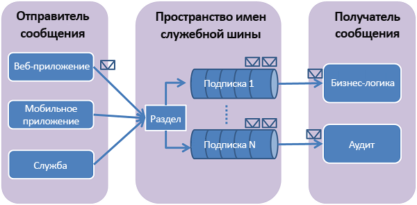

# <a name="how-to-use-service-bus-topics-and-subscriptions-with-java"></a>Как использовать разделы и подписки служебной шины с Java

[!INCLUDE [service-bus-selector-topics](../../includes/service-bus-selector-topics.md)]

При работе с этим кратким руководством вы выполните следующие задачи: 

- создание раздела с помощью портала Azure;
- создание трех подписок на раздел с помощью портала Azure;
- создание кода Java для отправки сообщений в раздел;
- создание кода для получения сообщений из подписок.

## <a name="prerequisites"></a>Предварительные требования

- Подписка Azure. Если у вас еще нет подписки Azure, [создайте бесплатную учетную запись](https://azure.microsoft.com/free), прежде чем начать работу.
- [Пакет Azure SDK для Java][Azure SDK for Java]. 

## <a name="what-are-service-bus-topics-and-subscriptions"></a>Что такое разделы и подписки служебной шины?
Разделы и подписки служебной шины поддерживают модель обмена сообщениями " *публикация и подписка* ". При использовании разделов и подписок компоненты распределенного приложения не взаимодействуют между собой напрямую, а обмениваются сообщениями через раздел, который выступает в качестве посредника.



В отличие от очередей служебной шины, где каждое сообщение обрабатывается одним потребителем, разделы и подписки предоставляют вид связи одного со многими с помощью шаблона публикации/подписки. Можно зарегистрировать несколько подписок на раздел. Когда сообщение отправляется в раздел, оно затем может обрабатываться независимо каждой подпиской. Раздел подписки напоминает виртуальную очередь, которая получает копии сообщений, отправленных в раздел. Вы можете зарегистрировать правила фильтрации для раздела на основе подписки, которые позволят указать, какие сообщения и от каких подписок могут быть получены разделом.

Разделы и подписки служебной шины обеспечивают возможность масштабирования для обработки большого количества сообщений для большого количества пользователей и приложений.

## <a name="create-a-service-bus-namespace"></a>Создание пространства имен служебной шины

Пространство имен служебной шины для обмена сообщениями предоставляет уникальный контейнер, ограничивающий область действия. Вы можете обращаться к этому контейнеру по [полному доменному имени](https://wikipedia.org/wiki/Fully_qualified_domain_name) и создавать в нем очереди, разделы и подписки. В следующем примере создается пространство имен служебной шины для обмена сообщениями в новой или существующей [группе ресурсов](/azure/azure-resource-manager/resource-group-portal):

1. На портале в области навигации слева щелкните **+ Создать ресурс**, **Интеграция Enterprise** и **Служебная шина**.
2. В диалоговом окне **Создание пространства имен** укажите имя пространства имен. Система немедленно проверяет, доступно ли оно.
3. Убедившись, что пространство имен доступно, выберите ценовую категорию: "Стандартный" или "Премиум".
4. Выберите **подписку** Azure, в рамках которой будет создано пространство имен.
5. Выберите имеющуюся **группу ресурсов**, в которую будет включено это пространство имен, или создайте новую.      
6. Укажите **расположение**— страну или регион для размещения пространства имен.
7. Нажмите кнопку **Создать**. Теперь система создает пространство имен и включает его. Возможно, вам придется подождать несколько минут, пока система выделит ресурсы для вашей учетной записи.

  

### <a name="obtain-the-management-credentials"></a>Получение учетных данных управления

При создании нового пространства имен автоматически создается начальное правило подписанного URL-адреса (SAS) и связанная с ним пара первичного и вторичного ключей, каждый из которых предоставляет полный контроль над всеми аспектами пространства имен. Чтобы скопировать начальное правило, выполните следующие действия.

1. Щелкните **Все ресурсы**, а затем щелкните созданное имя пространства имен.
2. В окне пространства имен щелкните **Политики общего доступа**.
3. В окне **Политики общего доступа** щелкните **RootManageSharedAccessKey**.
4. В окне **Policy: RootManageSharedAccessKey** (Политика: RootManageSharedAccessKey) нажмите кнопку **Копировать** рядом с полем **Первичная строка подключения**, чтобы скопировать строку подключения в буфер обмена для последующего использования. Вставьте на время эти значения в Блокноте или любом другом месте.

    
5. Повторите предыдущий шаг, скопировав и вставив значение **первичного ключа** во временное расположение для последующего использования.

## <a name="create-a-topic"></a>Создание раздела 
Чтобы создать раздел служебной шины, укажите пространство имен, в котором вы хотите его создать. В следующем примере показано, как создать раздел на портале.

1. В левой области навигации портала щелкните **Служебная шина**. Если элемент **Служебная шина** не отображается, щелкните **Все службы**.
2. Щелкните пространство имен, в котором хотите создать раздел.
3. В окне пространства имен выберите **Разделы**, а затем в окне **Разделы** щелкните **+ Раздел**.
4. Введите **BasicTopic** в поле **Имя** для раздела, а остальные значения по умолчанию не изменяйте.
5. Нажмите кнопку **Создать** в нижней части окна.


## <a name="create-subscriptions-for-the-topic"></a>Создание подписок на раздел
1. Выберите только что созданный **раздел**.
2. Щелкните **+ Подписка**, введите имя подписки **Subscription1** и сохраните значения по умолчанию для остальных параметров.
3. Повторите предыдущую процедуру дважды, создав подписки с именами **Subscription2** и **Subscription3**.


## <a name="configure-your-application-to-use-service-bus"></a>Настройка приложения для использования служебной шины
Перед созданием этого образца убедитесь, что вы установили [пакет Azure SDK для Java][Azure SDK for Java]. При использовании Eclipse можно установить [набор средств Azure для Eclipse][Azure Toolkit for Eclipse], включающий в себя пакет Azure SDK для Java. Затем можно добавить **библиотеки Microsoft Azure для Java** в проект.


Добавьте также следующие JAR-файлы в путь сборки для Java:

- gson-2.6.2.jar;
- commons-cli-1.4.jar;
- proton-j-0.21.0.jar.

Добавьте класс с методом **Main** и в верхней части файла Java добавьте следующие инструкции `import`:

```java
import com.google.gson.reflect.TypeToken;
import com.microsoft.azure.servicebus.*;
import com.microsoft.azure.servicebus.primitives.ConnectionStringBuilder;
import com.google.gson.Gson;
import static java.nio.charset.StandardCharsets.*;
import java.time.Duration;
import java.util.*;
import java.util.concurrent.*;
import java.util.function.Function;
import org.apache.commons.cli.*;
import org.apache.commons.cli.DefaultParser;
```

## <a name="send-messages-to-a-topic"></a>Отправка сообщений в раздел
Обновите метод **Main**, чтобы создавать в нем объект **TopicClient** и вызывать вспомогательный метод, который асинхронно отправляет тестовые сообщения в раздел Служебной шины.

> [!NOTE] 
> - Замените `<NameOfServiceBusNamespace>` именем пространства имен своей Служебной шины. 
> - Замените `<AccessKey>` ключом доступа для этого пространства имен.

```java
public class MyServiceBusTopicClient {

    static final Gson GSON = new Gson();
    
    public static void main(String[] args) throws Exception, ServiceBusException {
        // TODO Auto-generated method stub

        TopicClient sendClient;
        String connectionString = "Endpoint=sb://<NameOfServiceBusNamespace>.servicebus.windows.net/;SharedAccessKeyName=RootManageSharedAccessKey;SharedAccessKey=<AccessKey>";
        sendClient = new TopicClient(new ConnectionStringBuilder(connectionString, "BasicTopic"));       
        sendMessagesAsync(sendClient).thenRunAsync(() -> sendClient.closeAsync());
    }

    static CompletableFuture<Void> sendMessagesAsync(TopicClient sendClient) {
        List<HashMap<String, String>> data =
                GSON.fromJson(
                        "[" +
                                "{'name' = 'Einstein', 'firstName' = 'Albert'}," +
                                "{'name' = 'Heisenberg', 'firstName' = 'Werner'}," +
                                "{'name' = 'Curie', 'firstName' = 'Marie'}," +
                                "{'name' = 'Hawking', 'firstName' = 'Steven'}," +
                                "{'name' = 'Newton', 'firstName' = 'Isaac'}," +
                                "{'name' = 'Bohr', 'firstName' = 'Niels'}," +
                                "{'name' = 'Faraday', 'firstName' = 'Michael'}," +
                                "{'name' = 'Galilei', 'firstName' = 'Galileo'}," +
                                "{'name' = 'Kepler', 'firstName' = 'Johannes'}," +
                                "{'name' = 'Kopernikus', 'firstName' = 'Nikolaus'}" +
                                "]",
                        new TypeToken<List<HashMap<String, String>>>() {
                        }.getType());

        List<CompletableFuture> tasks = new ArrayList<>();
        for (int i = 0; i < data.size(); i++) {
            final String messageId = Integer.toString(i);
            Message message = new Message(GSON.toJson(data.get(i), Map.class).getBytes(UTF_8));
            message.setContentType("application/json");
            message.setLabel("Scientist");
            message.setMessageId(messageId);
            message.setTimeToLive(Duration.ofMinutes(2));
            System.out.printf("Message sending: Id = %s\n", message.getMessageId());
            tasks.add(
                    sendClient.sendAsync(message).thenRunAsync(() -> {
                        System.out.printf("\tMessage acknowledged: Id = %s\n", message.getMessageId());
                    }));
        }
        return CompletableFuture.allOf(tasks.toArray(new CompletableFuture<?>[tasks.size()]));
    }
}
```

Разделы служебной шины поддерживают максимальный размер сообщения 256 КБ для [уровня "Стандартный"](service-bus-premium-messaging.md) и 1 МБ для [уровня Premium](service-bus-premium-messaging.md). Максимальный размер заголовка, который содержит стандартные и настраиваемые свойства приложения, — 64 КБ. Ограничения количества сообщений в разделе нет, но есть максимальный общий размер сообщений, содержащихся в разделе. Этот размер раздела определяется при создании с верхним пределом 5 ГБ.

## <a name="how-to-receive-messages-from-a-subscription"></a>Как получать сообщения из подписки
Обновите метод **main**, чтобы создавать три объекта **SubscriptionClient** для трех подписок и вызывать вспомогательный метод, который асинхронно получает сообщения из раздела Служебной шины. В этом примере кода предполагается, что вы создали раздел с именем **BasicTopic** и три подписки с именами **Subscription1**, **Subscription2** и  **Subscription3**. Если вы использовали для них другие имена, скорректируйте код перед тестовым запуском. 

```java
public class MyServiceBusTopicClient {

    static final Gson GSON = new Gson();
    
    public static void main(String[] args) throws Exception, ServiceBusException {
        SubscriptionClient subscription1Client = new SubscriptionClient(new ConnectionStringBuilder(connectionString, "BasicTopic/subscriptions/Subscription1"), ReceiveMode.PEEKLOCK);
        SubscriptionClient subscription2Client = new SubscriptionClient(new ConnectionStringBuilder(connectionString, "BasicTopic/subscriptions/Subscription2"), ReceiveMode.PEEKLOCK);
        SubscriptionClient subscription3Client = new SubscriptionClient(new ConnectionStringBuilder(connectionString, "BasicTopic/subscriptions/Subscription3"), ReceiveMode.PEEKLOCK);        

        registerMessageHandlerOnClient(subscription1Client);
        registerMessageHandlerOnClient(subscription2Client);
        registerMessageHandlerOnClient(subscription3Client);
    }
    
    static void registerMessageHandlerOnClient(SubscriptionClient receiveClient) throws Exception {

        // register the RegisterMessageHandler callback
        IMessageHandler messageHandler = new IMessageHandler() {
            // callback invoked when the message handler loop has obtained a message
            public CompletableFuture<Void> onMessageAsync(IMessage message) {
                // receives message is passed to callback
                if (message.getLabel() != null &&
                        message.getContentType() != null &&
                        message.getLabel().contentEquals("Scientist") &&
                        message.getContentType().contentEquals("application/json")) {

                    byte[] body = message.getBody();
                    Map scientist = GSON.fromJson(new String(body, UTF_8), Map.class);

                    System.out.printf(
                            "\n\t\t\t\t%s Message received: \n\t\t\t\t\t\tMessageId = %s, \n\t\t\t\t\t\tSequenceNumber = %s, \n\t\t\t\t\t\tEnqueuedTimeUtc = %s," +
                                    "\n\t\t\t\t\t\tExpiresAtUtc = %s, \n\t\t\t\t\t\tContentType = \"%s\",  \n\t\t\t\t\t\tContent: [ firstName = %s, name = %s ]\n",
                            receiveClient.getEntityPath(),
                            message.getMessageId(),
                            message.getSequenceNumber(),
                            message.getEnqueuedTimeUtc(),
                            message.getExpiresAtUtc(),
                            message.getContentType(),
                            scientist != null ? scientist.get("firstName") : "",
                            scientist != null ? scientist.get("name") : "");
                }
                return receiveClient.completeAsync(message.getLockToken());
            }
            
            public void notifyException(Throwable throwable, ExceptionPhase exceptionPhase) {
                System.out.printf(exceptionPhase + "-" + throwable.getMessage());
            }
        };

 
        receiveClient.registerMessageHandler(
                    messageHandler,
                    // callback invoked when the message handler has an exception to report
                // 1 concurrent call, messages are auto-completed, auto-renew duration
                new MessageHandlerOptions(1, false, Duration.ofMinutes(1)));

    }
}
```

## <a name="run-the-program"></a>Запуск программы
Выполните программу и убедитесь, что выходные данные выглядят примерно так:

```java
Message sending: Id = 0
Message sending: Id = 1
Message sending: Id = 2
Message sending: Id = 3
Message sending: Id = 4
Message sending: Id = 5
Message sending: Id = 6
Message sending: Id = 7
Message sending: Id = 8
Message sending: Id = 9
    Message acknowledged: Id = 0
    Message acknowledged: Id = 9
    Message acknowledged: Id = 7
    Message acknowledged: Id = 8
    Message acknowledged: Id = 5
    Message acknowledged: Id = 6
    Message acknowledged: Id = 3
    Message acknowledged: Id = 2
    Message acknowledged: Id = 4
    Message acknowledged: Id = 1

                BasicTopic/subscriptions/Subscription1 Message received: 
                        MessageId = 0, 
                        SequenceNumber = 11, 
                        EnqueuedTimeUtc = 2018-10-29T18:58:12.442Z,
                        ExpiresAtUtc = 2018-10-29T19:00:12.442Z, 
                        ContentType = "application/json",  
                        Content: [ firstName = Albert, name = Einstein ]

                BasicTopic/subscriptions/Subscription2 Message received: 
                        MessageId = 0, 
                        SequenceNumber = 11, 
                        EnqueuedTimeUtc = 2018-10-29T18:58:12.442Z,
                        ExpiresAtUtc = 2018-10-29T19:00:12.442Z, 
                        ContentType = "application/json",  
                        Content: [ firstName = Albert, name = Einstein ]

                BasicTopic/subscriptions/Subscription1 Message received: 
                        MessageId = 9, 
                        SequenceNumber = 12, 
                        EnqueuedTimeUtc = 2018-10-29T18:58:12.520Z,
                        ExpiresAtUtc = 2018-10-29T19:00:12.520Z, 
                        ContentType = "application/json",  
                        Content: [ firstName = Nikolaus, name = Kopernikus ]

                BasicTopic/subscriptions/Subscription1 Message received: 
                        MessageId = 8, 
                        SequenceNumber = 13, 
                        EnqueuedTimeUtc = 2018-10-29T18:58:12.520Z,
                        ExpiresAtUtc = 2018-10-29T19:00:12.520Z, 
                        ContentType = "application/json",  
                        Content: [ firstName = Johannes, name = Kepler ]

                BasicTopic/subscriptions/Subscription3 Message received: 
                        MessageId = 0, 
                        SequenceNumber = 11, 
                        EnqueuedTimeUtc = 2018-10-29T18:58:12.442Z,
                        ExpiresAtUtc = 2018-10-29T19:00:12.442Z, 
                        ContentType = "application/json",  
                        Content: [ firstName = Albert, name = Einstein ]

                BasicTopic/subscriptions/Subscription2 Message received: 
                        MessageId = 9, 
                        SequenceNumber = 12, 
                        EnqueuedTimeUtc = 2018-10-29T18:58:12.520Z,
                        ExpiresAtUtc = 2018-10-29T19:00:12.520Z, 
                        ContentType = "application/json",  
                        Content: [ firstName = Nikolaus, name = Kopernikus ]

                BasicTopic/subscriptions/Subscription1 Message received: 
                        MessageId = 7, 
                        SequenceNumber = 14, 
                        EnqueuedTimeUtc = 2018-10-29T18:58:12.520Z,
                        ExpiresAtUtc = 2018-10-29T19:00:12.520Z, 
                        ContentType = "application/json",  
                        Content: [ firstName = Galileo, name = Galilei ]

                BasicTopic/subscriptions/Subscription3 Message received: 
                        MessageId = 9, 
                        SequenceNumber = 12, 
                        EnqueuedTimeUtc = 2018-10-29T18:58:12.520Z,
                        ExpiresAtUtc = 2018-10-29T19:00:12.520Z, 
                        ContentType = "application/json",  
                        Content: [ firstName = Nikolaus, name = Kopernikus ]

                BasicTopic/subscriptions/Subscription2 Message received: 
                        MessageId = 8, 
                        SequenceNumber = 13, 
                        EnqueuedTimeUtc = 2018-10-29T18:58:12.520Z,
                        ExpiresAtUtc = 2018-10-29T19:00:12.520Z, 
                        ContentType = "application/json",  
                        Content: [ firstName = Johannes, name = Kepler ]

                BasicTopic/subscriptions/Subscription1 Message received: 
                        MessageId = 6, 
                        SequenceNumber = 15, 
                        EnqueuedTimeUtc = 2018-10-29T18:58:12.520Z,
                        ExpiresAtUtc = 2018-10-29T19:00:12.520Z, 
                        ContentType = "application/json",  
                        Content: [ firstName = Michael, name = Faraday ]

                BasicTopic/subscriptions/Subscription3 Message received: 
                        MessageId = 8, 
                        SequenceNumber = 13, 
                        EnqueuedTimeUtc = 2018-10-29T18:58:12.520Z,
                        ExpiresAtUtc = 2018-10-29T19:00:12.520Z, 
                        ContentType = "application/json",  
                        Content: [ firstName = Johannes, name = Kepler ]

                BasicTopic/subscriptions/Subscription2 Message received: 
                        MessageId = 7, 
                        SequenceNumber = 14, 
                        EnqueuedTimeUtc = 2018-10-29T18:58:12.520Z,
                        ExpiresAtUtc = 2018-10-29T19:00:12.520Z, 
                        ContentType = "application/json",  
                        Content: [ firstName = Galileo, name = Galilei ]

                BasicTopic/subscriptions/Subscription1 Message received: 
                        MessageId = 5, 
                        SequenceNumber = 16, 
                        EnqueuedTimeUtc = 2018-10-29T18:58:12.520Z,
                        ExpiresAtUtc = 2018-10-29T19:00:12.520Z, 
                        ContentType = "application/json",  
                        Content: [ firstName = Niels, name = Bohr ]

                BasicTopic/subscriptions/Subscription3 Message received: 
                        MessageId = 7, 
                        SequenceNumber = 14, 
                        EnqueuedTimeUtc = 2018-10-29T18:58:12.520Z,
                        ExpiresAtUtc = 2018-10-29T19:00:12.520Z, 
                        ContentType = "application/json",  
                        Content: [ firstName = Galileo, name = Galilei ]

                BasicTopic/subscriptions/Subscription2 Message received: 
                        MessageId = 6, 
                        SequenceNumber = 15, 
                        EnqueuedTimeUtc = 2018-10-29T18:58:12.520Z,
                        ExpiresAtUtc = 2018-10-29T19:00:12.520Z, 
                        ContentType = "application/json",  
                        Content: [ firstName = Michael, name = Faraday ]

                BasicTopic/subscriptions/Subscription1 Message received: 
                        MessageId = 4, 
                        SequenceNumber = 17, 
                        EnqueuedTimeUtc = 2018-10-29T18:58:12.520Z,
                        ExpiresAtUtc = 2018-10-29T19:00:12.520Z, 
                        ContentType = "application/json",  
                        Content: [ firstName = Isaac, name = Newton ]

                BasicTopic/subscriptions/Subscription3 Message received: 
                        MessageId = 6, 
                        SequenceNumber = 15, 
                        EnqueuedTimeUtc = 2018-10-29T18:58:12.520Z,
                        ExpiresAtUtc = 2018-10-29T19:00:12.520Z, 
                        ContentType = "application/json",  
                        Content: [ firstName = Michael, name = Faraday ]

                BasicTopic/subscriptions/Subscription2 Message received: 
                        MessageId = 5, 
                        SequenceNumber = 16, 
                        EnqueuedTimeUtc = 2018-10-29T18:58:12.520Z,
                        ExpiresAtUtc = 2018-10-29T19:00:12.520Z, 
                        ContentType = "application/json",  
                        Content: [ firstName = Niels, name = Bohr ]

                BasicTopic/subscriptions/Subscription1 Message received: 
                        MessageId = 3, 
                        SequenceNumber = 18, 
                        EnqueuedTimeUtc = 2018-10-29T18:58:12.520Z,
                        ExpiresAtUtc = 2018-10-29T19:00:12.520Z, 
                        ContentType = "application/json",  
                        Content: [ firstName = Steven, name = Hawking ]

                BasicTopic/subscriptions/Subscription3 Message received: 
                        MessageId = 5, 
                        SequenceNumber = 16, 
                        EnqueuedTimeUtc = 2018-10-29T18:58:12.520Z,
                        ExpiresAtUtc = 2018-10-29T19:00:12.520Z, 
                        ContentType = "application/json",  
                        Content: [ firstName = Niels, name = Bohr ]

                BasicTopic/subscriptions/Subscription2 Message received: 
                        MessageId = 4, 
                        SequenceNumber = 17, 
                        EnqueuedTimeUtc = 2018-10-29T18:58:12.520Z,
                        ExpiresAtUtc = 2018-10-29T19:00:12.520Z, 
                        ContentType = "application/json",  
                        Content: [ firstName = Isaac, name = Newton ]

                BasicTopic/subscriptions/Subscription1 Message received: 
                        MessageId = 2, 
                        SequenceNumber = 19, 
                        EnqueuedTimeUtc = 2018-10-29T18:58:12.520Z,
                        ExpiresAtUtc = 2018-10-29T19:00:12.520Z, 
                        ContentType = "application/json",  
                        Content: [ firstName = Marie, name = Curie ]

                BasicTopic/subscriptions/Subscription3 Message received: 
                        MessageId = 4, 
                        SequenceNumber = 17, 
                        EnqueuedTimeUtc = 2018-10-29T18:58:12.520Z,
                        ExpiresAtUtc = 2018-10-29T19:00:12.520Z, 
                        ContentType = "application/json",  
                        Content: [ firstName = Isaac, name = Newton ]

                BasicTopic/subscriptions/Subscription2 Message received: 
                        MessageId = 3, 
                        SequenceNumber = 18, 
                        EnqueuedTimeUtc = 2018-10-29T18:58:12.520Z,
                        ExpiresAtUtc = 2018-10-29T19:00:12.520Z, 
                        ContentType = "application/json",  
                        Content: [ firstName = Steven, name = Hawking ]

                BasicTopic/subscriptions/Subscription1 Message received: 
                        MessageId = 1, 
                        SequenceNumber = 20, 
                        EnqueuedTimeUtc = 2018-10-29T18:58:12.520Z,
                        ExpiresAtUtc = 2018-10-29T19:00:12.520Z, 
                        ContentType = "application/json",  
                        Content: [ firstName = Werner, name = Heisenberg ]

                BasicTopic/subscriptions/Subscription2 Message received: 
                        MessageId = 2, 
                        SequenceNumber = 19, 
                        EnqueuedTimeUtc = 2018-10-29T18:58:12.520Z,
                        ExpiresAtUtc = 2018-10-29T19:00:12.520Z, 
                        ContentType = "application/json",  
                        Content: [ firstName = Marie, name = Curie ]

                BasicTopic/subscriptions/Subscription3 Message received: 
                        MessageId = 3, 
                        SequenceNumber = 18, 
                        EnqueuedTimeUtc = 2018-10-29T18:58:12.520Z,
                        ExpiresAtUtc = 2018-10-29T19:00:12.520Z, 
                        ContentType = "application/json",  
                        Content: [ firstName = Steven, name = Hawking ]

                BasicTopic/subscriptions/Subscription3 Message received: 
                        MessageId = 2, 
                        SequenceNumber = 19, 
                        EnqueuedTimeUtc = 2018-10-29T18:58:12.520Z,
                        ExpiresAtUtc = 2018-10-29T19:00:12.520Z, 
                        ContentType = "application/json",  
                        Content: [ firstName = Marie, name = Curie ]

                BasicTopic/subscriptions/Subscription2 Message received: 
                        MessageId = 1, 
                        SequenceNumber = 20, 
                        EnqueuedTimeUtc = 2018-10-29T18:58:12.520Z,
                        ExpiresAtUtc = 2018-10-29T19:00:12.520Z, 
                        ContentType = "application/json",  
                        Content: [ firstName = Werner, name = Heisenberg ]

                BasicTopic/subscriptions/Subscription3 Message received: 
                        MessageId = 1, 
                        SequenceNumber = 20, 
                        EnqueuedTimeUtc = 2018-10-29T18:58:12.520Z,
                        ExpiresAtUtc = 2018-10-29T19:00:12.520Z, 
                        ContentType = "application/json",  
                        Content: [ firstName = Werner, name = Heisenberg ]
```


## <a name="next-steps"></a>Дополнительная информация
Дополнительные сведения см. в статье об [очередях, разделах и подписках Служебной шины][Service Bus queues, topics, and subscriptions].

[Azure SDK for Java]: http://azure.microsoft.com/develop/java/
[Azure Toolkit for Eclipse]: ../azure-toolkit-for-eclipse.md
[Service Bus queues, topics, and subscriptions]: service-bus-queues-topics-subscriptions.md
[SqlFilter]: /dotnet/api/microsoft.azure.servicebus.sqlfilter
[SqlFilter.SqlExpression]: /dotnet/api/microsoft.azure.servicebus.sqlfilter.sqlexpression
[BrokeredMessage]: /dotnet/api/microsoft.servicebus.messaging.brokeredmessage

[0]: ./media/service-bus-java-how-to-use-topics-subscriptions/sb-queues-13.png
[2]: ./media/service-bus-java-how-to-use-topics-subscriptions/sb-queues-04.png
[3]: ./media/service-bus-java-how-to-use-topics-subscriptions/sb-queues-09.png
