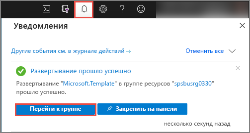
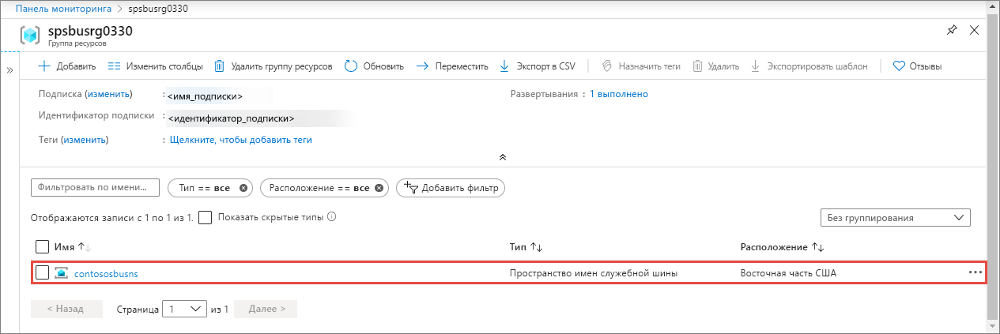
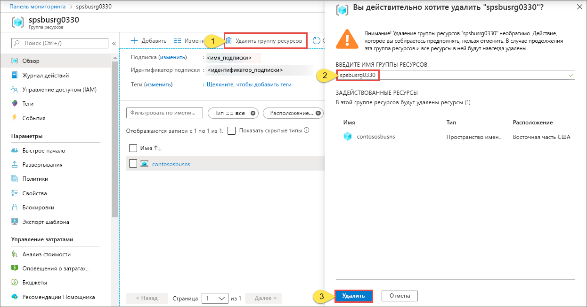

# Краткое руководство. Создание пространства имен служебной шины и очереди с помощью шаблона ARM

В этой статье показано, как использовать шаблон Azure Resource Manager, (шаблон ARM) позволяющий создать пространство имен служебной шины и очередь в нем. Здесь объясняется, как указать развертываемые ресурсы и определить параметры, указываемые при развертывании. Этот шаблон можно использовать для собственных развертываний или настроить его в соответствии с вашими требованиями.

[!INCLUDE [About Azure Resource Manager](../../includes/resource-manager-quickstart-introduction.md)]

Если среда соответствует предварительным требованиям и вы знакомы с использованием шаблонов ARM, нажмите кнопку **Развертывание в Azure**. Шаблон откроется на портале Azure.

## Предварительные требования

Если у вас еще нет подписки Azure, [создайте бесплатную учетную запись Azure](https://azure.microsoft.com/free/), прежде чем начинать работу.

## Изучение шаблона

Шаблон, используемый в этом кратком руководстве, взят из [шаблонов быстрого запуска Azure](https://azure.microsoft.com/resources/templates/201-servicebus-create-queue).

:::code language="json" source="~/quickstart-templates/201-servicebus-create-queue/azuredeploy.json":::

В шаблоне определены следующие ресурсы:

- [**Microsoft.ServiceBus/namespaces**](/azure/templates/microsoft.servicebus/namespaces)
- [**Microsoft.ServiceBus/namespaces/queues**](/azure/templates/microsoft.servicebus/namespaces/queues)

> [!NOTE]
> Для загрузки и развертывания доступны следующие шаблоны ARM.
>
> * [Создание пространства имен служебной шины с очередью и правилом авторизации](service-bus-resource-manager-namespace-auth-rule.md)
> * [Создание пространства имен служебной шины с разделом и подпиской](service-bus-resource-manager-namespace-topic.md)
> * [Создайте пространство имен служебной шины](service-bus-resource-manager-namespace.md)
> * [Создание пространства имен служебной шины с разделом, подпиской и правилом с помощью шаблона Azure Resource Manager](service-bus-resource-manager-namespace-topic-with-rule.md)

Другие шаблоны можно найти на странице [Шаблоны быстрого запуска Azure](https://azure.microsoft.com/resources/templates/?resourceType=Microsoft.Servicebus&pageNumber=1&sort=Popular).

## Развертывание шаблона

С помощью этого шаблона вы развернете пространство имен служебной шины с очередью.

[Очереди служебной шины](service-bus-queues-topics-subscriptions.md#queues) доставляют сообщения конкурирующим получателям по типу FIFO (в порядке очереди).

Чтобы выполнить развертывание автоматически, нажмите следующую кнопку. Создайте группу ресурсов для развертывания, чтобы потом вы могли легко было выполнить очистку.

## Проверка развертывания

1. Выберите **Уведомления** вверху, чтобы просмотреть состояние развертывания. Подождите, пока развертывание успешно завершится. Затем в сообщении уведомления выберите **Перейти к группе ресурсов**, чтобы открыть страницу группы ресурсов, содержащую пространство имен Служебной шины. 

    
2. Проверьте, отображается ли пространство имен Служебной шины в списке ресурсов. 

    
3. Выберите пространство имен в списке, чтобы открылась страница **Пространство имен Служебной шины**. 

## Очистка ресурсов

1. На портале Azure перейдите на страницу **Группа ресурсов** для своей группы ресурсов.
2. На панели инструментов выберите **Удалить группу ресурсов**. 
3. Введите имя группы ресурсов и щелкните **Удалить**. 

    

## Дальнейшие действия

См. следующий раздел, в котором показано, как создать правило авторизации для пространства имен или очереди:

[Создание правила авторизации служебной шины для пространства имен и очереди с помощью шаблона ARM](service-bus-resource-manager-namespace-auth-rule.md)

Узнайте, как управлять этими ресурсами, просмотрев следующие статьи:

* [Управление служебной шиной с помощью PowerShell](service-bus-manage-with-ps.md)
* [Управление ресурсами служебной шины с помощью обозревателя служебной шины](https://github.com/paolosalvatori/ServiceBusExplorer/releases)

[Authoring Azure Resource Manager templates]: ../azure-resource-manager/templates/template-syntax.md
[Service Bus namespace and queue template]: https://github.com/Azure/azure-quickstart-templates/blob/master/201-servicebus-create-queue/
[Azure Quickstart Templates]: https://azure.microsoft.com/documentation/templates/?term=service+bus
[Learn more about Service Bus queues]: service-bus-queues-topics-subscriptions.md
[Using Azure PowerShell with Azure Resource Manager]: ../azure-resource-manager/management/manage-resources-powershell.md
[Using the Azure CLI for Mac, Linux, and Windows with Azure Resource Management]: ../azure-resource-manager/management/manage-resources-cli.md