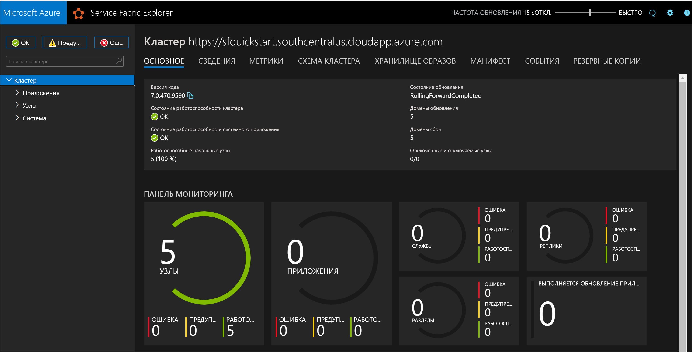
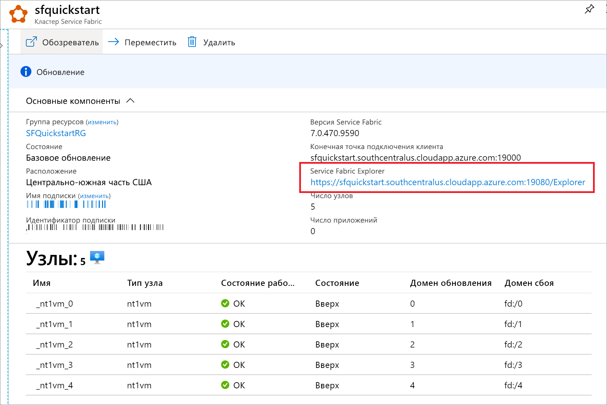

# <a name="quickstart-create-a-service-fabric-cluster-using-arm-template"></a>Краткое руководство. Создание кластера Service Fabric с помощью шаблона ARM

Azure Service Fabric — это платформа распределенных систем, которая дает возможность не только легко упаковывать и развертывать масштабируемые надежные микрослужбы и контейнеры, но и управлять ими. *Кластер* Service Fabric — это подключенный к сети набор виртуальных машин, в котором вы развертываете микрослужбы и управляете ими. В этой статье описано развертывание тестового кластера Service Fabric в Azure с помощью шаблона Azure Resource Manager (ARM).

[!INCLUDE [About Azure Resource Manager](../../includes/resource-manager-quickstart-introduction.md)]

Этот кластер с пятью узлами Windows защищен с помощью самозаверяющего сертификата и, таким образом, предназначен только для обучения (а не для рабочих нагрузок). Для развертывания шаблона мы будем использовать Azure PowerShell. В дополнение к Azure PowerShell можно также использовать портал Azure, Azure CLI и REST API. Дополнительные сведения о других методах развертывания см. в статье о [развертывании с использованием шаблонов](../azure-resource-manager/templates/deploy-portal.md).

Если среда соответствует предварительным требованиям и вы знакомы с использованием шаблонов ARM, нажмите кнопку **Развертывание в Azure**. Шаблон откроется на портале Azure.

[](https://portal.azure.com/#create/Microsoft.Template/uri/https%3A%2F%2Fraw.githubusercontent.com%2FAzure%2Fazure-quickstart-templates%2Fmaster%2Fservice-fabric-secure-cluster-5-node-1-nodetype%2Fazuredeploy.json)

## <a name="prerequisites"></a>Предварительные требования

Если у вас еще нет подписки Azure, создайте [бесплатную](https://azure.microsoft.com/free/) учетную запись Azure, прежде чем начинать работу.

### <a name="install-service-fabric-sdk-and-powershell-modules"></a>Установите пакет SDK для Service Fabric и модуль PowerShell.

Для работы с этим кратким руководством выполните следующие действия:

* Установите [пакет SDK для Service Fabric и модуль PowerShell](service-fabric-get-started.md).

* Установите [Azure PowerShell](/powershell/azure/install-az-ps).

### <a name="download-the-sample-template-and-certificate-helper-script"></a>Загрузка примера шаблона и вспомогательного скрипта сертификата

Клонируйте или загрузите репозиторий с [шаблонами Resource Manager для быстрого начала работы](https://github.com/Azure/azure-quickstart-templates). Кроме того, скопируйте локально следующие файлы, которые будут использоваться, из папки *Service-Fabric-Secure-Cluster-5-node-1-NodeType*.

* [New-ServiceFabricClusterCertificate.ps1](https://raw.githubusercontent.com/Azure/azure-quickstart-templates/master/service-fabric-secure-cluster-5-node-1-nodetype/New-ServiceFabricClusterCertificate.ps1)
* [azuredeploy.json](https://raw.githubusercontent.com/Azure/azure-quickstart-templates/master/service-fabric-secure-cluster-5-node-1-nodetype/azuredeploy.json)
* [azuredeploy.parameters.json](https://raw.githubusercontent.com/Azure/azure-quickstart-templates/master/service-fabric-secure-cluster-5-node-1-nodetype/azuredeploy.parameters.json)

### <a name="sign-in-to-azure"></a>Вход в Azure

Войдите в Azure и назначьте подписку, которая будет использоваться для создания кластера Service Fabric.

```powershell
# Sign in to your Azure account
Login-AzAccount -SubscriptionId "<subscription ID>"
```

### <a name="create-a-self-signed-certificate-stored-in-key-vault"></a>Создание самозаверяющего сертификата, хранящегося в Key Vault

Service Fabric использует сертификаты X.509 для [защиты кластера](./service-fabric-cluster-security.md) и обеспечения функций безопасности приложений, а также [Key Vault](../key-vault/general/overview.md) для управления сертификатами. Для успешного создания кластера требуется сертификат кластера, чтобы включить обмен данными между узлами. Для создания тестового кластера, используемого в этом кратком руководстве, мы создадим самозаверяющий сертификат для проверки подлинности в кластере. Для рабочих нагрузок требуются сертификаты, созданные с помощью правильно настроенной службы сертификатов Windows Server или из утвержденного центра сертификации (ЦС).

```powershell
# Designate unique (within cloudapp.azure.com) names for your resources
$resourceGroupName = "SFQuickstartRG"
$keyVaultName = "SFQuickstartKV"

# Create a new resource group for your Key Vault and Service Fabric cluster
New-AzResourceGroup -Name $resourceGroupName -Location SouthCentralUS

# Create a Key Vault enabled for deployment
New-AzKeyVault -VaultName $KeyVaultName -ResourceGroupName $resourceGroupName -Location SouthCentralUS -EnabledForDeployment

# Generate a certificate and upload it to Key Vault
.\New-ServiceFabricClusterCertificate.ps1
```

Скрипт предложит вам ввести следующие учетные данные (обязательно измените *CertDNSName* и *KeyVaultName* из приведенных ниже примеров значений):

* **Пароль:** Password!1
* **CertDNSName:** *sfquickstart*.southcentralus.cloudapp.azure.com
* **KeyVaultName** *SFQuickstartKV*
* **KeyVaultSecretName:** clustercert

После завершения скрипт предоставит значения параметров, необходимые для развертывания шаблона. Обязательно сохраните их в следующих переменных, так как они понадобятся для развертывания шаблона кластера:

```powershell
$sourceVaultId = "<Source Vault Resource Id>"
$certUrlValue = "<Certificate URL>"
$certThumbprint = "<Certificate Thumbprint>"
```

## <a name="review-the-template"></a>Изучение шаблона

Шаблон, используемый в этом кратком руководстве, взят из [шаблонов быстрого запуска Azure](https://azure.microsoft.com/resources/templates/service-fabric-secure-cluster-5-node-1-nodetype/). Шаблон для этой статьи слишком длинный, чтобы его можно было здесь отобразить. Вы можете просмотреть его в файле [azuredeploy.json](https://raw.githubusercontent.com/Azure/azure-quickstart-templates/master/service-fabric-secure-cluster-5-node-1-nodetype/azuredeploy.json).

В шаблоне определено несколько ресурсов Azure:

* [Microsoft.Storage/storageAccounts](/azure/templates/microsoft.storage/storageaccounts)
* [Microsoft.Network/virtualNetworks](/azure/templates/microsoft.network/virtualnetworks)
* [Microsoft.Network/publicIPAddresses](/azure/templates/microsoft.network/publicipaddresses)
* [Microsoft.Network/loadBalancers](/azure/templates/microsoft.network/loadbalancers)
* [Microsoft.Compute/virtualMachineScaleSets](/azure/templates/microsoft.compute/virtualmachinescalesets)
* [Microsoft.ServiceFabric/clusters](/azure/templates/microsoft.servicefabric/clusters)

Чтобы найти дополнительные связанные шаблоны Azure Service Fabric, перейдите на страницу [Шаблоны быстрого запуска Azure](https://azure.microsoft.com/resources/templates/?sort=Popular&term=service+fabric).

### <a name="customize-the-parameters-file"></a>Настройка файла параметров

Откройте файл *azuredeploy.parameters.json* и измените значения параметров.

* **clusterName** должно соответствовать значению, указанному для *CertDNSName* при создании сертификата кластера.
* **adminUserName** — это значение, отличное от маркера *GEN-UNIQUE* по умолчанию.
* **adminPassword** — это значение, отличное от маркера *GEN-PASSWORD* по умолчанию.
* **certificateThumbprint**, **sourceVaultResourceId** и **certificateUrlValue** — это пустые строки (`""`).

Пример:

```json
{
  "$schema": "https://schema.management.azure.com/schemas/2019-04-01/deploymentParameters.json#",
  "contentVersion": "1.0.0.0",
  "parameters": {
    "clusterName": {
      "value": "sfquickstart"
    },
    "adminUsername": {
      "value": "testadm"
    },
    "adminPassword": {
      "value": "Password#1234"
    },
    "certificateThumbprint": {
      "value": ""
    },
    "sourceVaultResourceId": {
      "value": ""
    },
    "certificateUrlValue": {
      "value": ""
    }
  }
}
```

## <a name="deploy-the-template"></a>Развертывание шаблона

Сохраните пути к шаблону ARM и файлам параметров в переменных, а затем разверните шаблон.

```powershell
$templateFilePath = "<full path to azuredeploy.json>"
$parameterFilePath = "<full path to azuredeploy.parameters.json>"

New-AzResourceGroupDeployment `
    -ResourceGroupName $resourceGroupName `
    -TemplateFile $templateFilePath `
    -TemplateParameterFile $parameterFilePath `
    -CertificateThumbprint $certThumbprint `
    -CertificateUrlValue $certUrlValue `
    -SourceVaultResourceId $sourceVaultId `
    -Verbose
```

## <a name="review-deployed-resources"></a>Просмотр развернутых ресурсов

После завершения развертывания найдите значение `managementEndpoint` в выходных данных и откройте адрес в веб-браузере, чтобы просмотреть кластер в [Service Fabric Explorer](./service-fabric-visualizing-your-cluster.md).



Вы также можете найти конечную точку Service Fabric Explorer в колонке ресурсов Service Explorer на портале Azure.



## <a name="clean-up-resources"></a>Очистка ресурсов

Удалите ненужную группу ресурсов. Ресурсы в ней будут также удалены.

```powershell
$resourceGroupName = Read-Host -Prompt "Enter the Resource Group name"
Remove-AzResourceGroup -Name $resourceGroupName
Write-Host "Press [ENTER] to continue..."
```

## <a name="next-steps"></a>Дальнейшие действия

Дополнительные сведения о создании настраиваемого шаблона кластера Azure Service Fabric см. в статье:

> [!div class="nextstepaction"]
> [Создание шаблона Resource Manager для кластера Service Fabric](service-fabric-cluster-creation-create-template.md)
