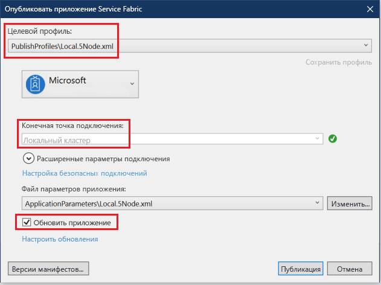
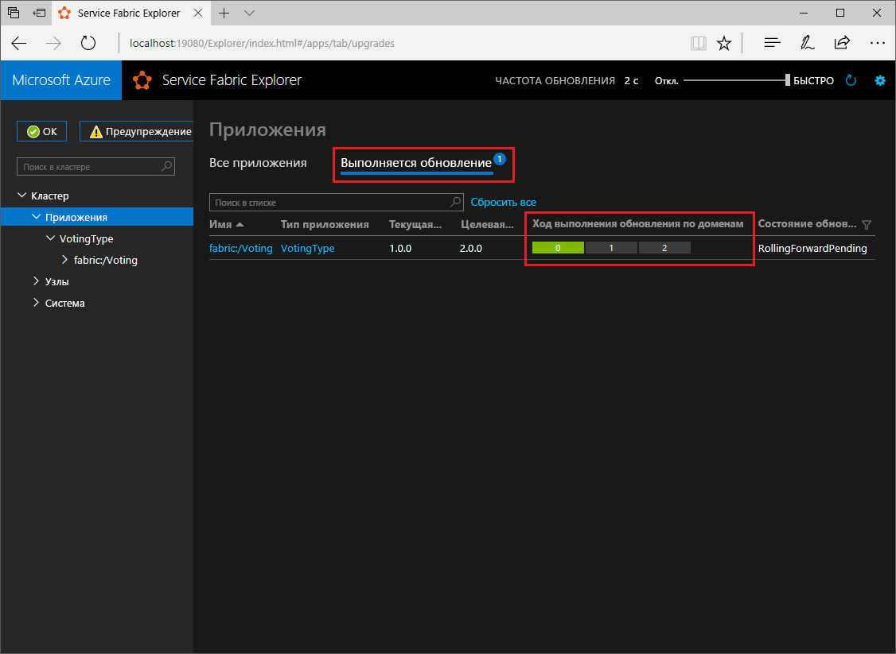

# <a name="quickstart-deploy-a-net-reliable-services-application-to-service-fabric"></a>Краткое руководство. Развертывание приложения надежных служб .NET в Service Fabric

Azure Service Fabric — это платформа распределенных систем для развертывания масштабируемых надежных микрослужб и контейнеров и управления ими.

В этом руководстве описано, как развернуть свое первое приложение .NET в Service Fabric. После выполнения задач этого руководства вы получите приложение для голосования с клиентской частью в виде веб-приложения ASP.NET Core, которое сохраняет результаты голосования во внутренней службе с отслеживанием состояния в кластере.


С помощью этого приложения вы узнаете, как выполнить следующие действия:

* Создание приложения с использованием .NET и Service Fabric
* Использование ASP.NET Core в качестве внешнего веб-интерфейса
* Хранение данных приложения в службе с отслеживанием состояния
* Локальная отладка приложения
* Масштабирование приложения на несколько узлов
* Последовательное обновление приложения

## <a name="prerequisites"></a>Предварительные требования

Для работы с этим кратким руководством сделайте следующее:

1. [Установите Visual Studio 2019](https://www.visualstudio.com/), а также рабочие нагрузки **разработка Azure** и **ASP.NET и веб-разработка**.
2. [установите Git](https://git-scm.com/);
3. [Установите пакет SDK для Microsoft Azure Service Fabric](https://www.microsoft.com/web/handlers/webpi.ashx?command=getinstallerredirect&appid=MicrosoftAzure-ServiceFabric-CoreSDK)
4. Выполните следующую команду, чтобы разрешить развертывание на локальный кластер Service Fabric в Visual Studio:

   ```powershell
   Set-ExecutionPolicy -ExecutionPolicy Unrestricted -Force -Scope CurrentUser
   ```
    
## <a name="build-a-cluster"></a>Создание кластера

После установки среды выполнения, пакета SDK, средства Visual Studio, Docker и запуска Docker создайте локальный кластер разработки с пятью узлами.

> [!Note]
> Во время создания необходимо запускать Docker, так как кластер создается с включенными функциями контейнера. Если Docker не запущен, создайте кластер еще раз, чтобы включить функции контейнера.
> Хоть это и не требуется в рамках руководства, инструкция по запуску Docker во время создания кластера показана в качестве рекомендации.
> Проверьте, работает ли Docker, открыв окно терминала и выполнив команду `docker ps`, которая укажет, возникает ли ошибка. Если полученный ответ не является ошибкой, это значит что Docker работает и можно начинать создание кластера.

1. Откройте окно PowerShell с повышенными правами от имени администратора.
2. Чтобы создать кластер разработки, выполните следующую команду PowerShell.

   ```powershell
   . "C:\Program Files\Microsoft SDKs\Service Fabric\ClusterSetup\DevClusterSetup.ps1"
   ```
3. Чтобы запустить локальное средство управления кластером, выполните следующую команду.

   ```powershell
   . "C:\Program Files\Microsoft SDKs\Service Fabric\Tools\ServiceFabricLocalClusterManager\ServiceFabricLocalClusterManager.exe"
   ```

>[!NOTE]
> В примере приложения в этом кратком руководстве используются функции, недоступные в Windows 7.
>

## <a name="download-the-sample"></a>Скачивание примера приложения

В окне терминала выполните следующую команду, чтобы клонировать репозиторий с примером приложения на локальный компьютер.

```git
git clone https://github.com/Azure-Samples/service-fabric-dotnet-quickstart
```

## <a name="run-the-application-locally"></a>Локальный запуск приложения

Щелкните правой кнопкой мыши значок Visual Studio в меню "Пуск" и выберите **Запуск от имени администратора**. Чтобы подключить отладчик к службам, необходимо запустить Visual Studio от имени администратора.

В клонированном репозитории откройте решение **Voting.sln** в Visual Studio.

Приложение для голосования по умолчанию ожидает передачи данных с порта 8080.  Порт приложения задается в файле */VotingWeb/PackageRoot/ServiceManifest.xml*.  Можно изменить порт приложения, обновив атрибут **Port** для элемента **Endpoint**.  Для локального развертывания и запуска приложения порт приложения должен быть открыт и доступен на компьютере.  Если вы изменили порт приложения, замените значение порта нового приложения на "8080" в этой статье.

Чтобы развернуть приложение, нажмите клавишу **F5**.

> [!NOTE]
> В окне выходных данных Visual Studio появится сообщение "The application URL is not set or is not an HTTP/HTTPS URL so the browser will not be opened to the application" (URL-адрес приложения не задан или не является URL-адресом HTTP/HTTPS, поэтому браузер не будет открыт для приложения).  Это сообщение не указывает на ошибку, но браузер не будет запускаться автоматически.

После развертывания откройте в окне браузера страницу `http://localhost:8080` для просмотра веб-приложения.


Теперь можно добавить варианты для выбора в голосовании и начать прием голосов. Приложение запускается и хранит все данные в кластере Service Fabric без необходимости использования отдельной базы данных.

## <a name="walk-through-the-voting-sample-application"></a>Описание примера приложения для голосования

Приложение для голосования состоит из двух служб:

* Служба веб-интерфейса (VotingWeb) — служба веб-интерфейса ASP.NET Core, которая обслуживает веб-страницу и предоставляет доступ к веб-API для связи с внутренней службой.
* Внутренняя служба (VotingData) — веб-служба ASP.NET Core, которая предоставляет API для сохранения результатов голосования в надежном словаре на диске.


Во время голосования в приложении происходят следующие события.

1. JavaScript отправляет запрос о голосовании веб-API в службе веб-интерфейса в виде запроса HTTP PUT.

2. Служба веб-интерфейса использует прокси, чтобы обнаружить и перенаправить запрос HTTP PUT внутренней службе.

3. Внутренняя служба принимает входящий запрос и сохраняет обновленный результат в надежном словаре, который реплицируется на несколько узлов в кластере и сохраняется на диске. Все данные приложения хранятся в кластере, поэтому база данных не требуется.

## <a name="debug-in-visual-studio"></a>Отладка в Visual Studio

Приложение должно работать нормально, но вы можете использовать отладчик, чтобы узнать, как функционируют основные компоненты приложения. При отладке приложения в Visual Studio вы используете локальный кластер разработки Service Fabric. Вы можете настроить отладку для своего сценария. В этом приложении данные хранятся во внутренней службе с помощью надежного словаря. По умолчанию при остановке отладчика Visual Studio удаляет приложение. При удалении приложения данные во внутренней службе также удаляются. Для сохранения данных между сеансами отладки можно изменить свойство **Режим отладки приложения** проекта **Voting** в Visual Studio.

Чтобы посмотреть, как выполняется код, сделайте следующее:

1. Откройте файл **/VotingWeb/Controllers/VotesController.cs** и установите точку останова в методе **Put** для веб-API (строка 69). Найти нужный файл можно с помощью функции поиска в обозревателе решений в Visual Studio.

2. Откройте файл **/VotingData/Controllers/VoteDataController.cs** и установите точку останова в методе **Put** этого веб-API (строка 54).

3. Вернитесь в браузер и выберите один из вариантов голосования или добавьте новый вариант. Выполнение остановится на первой точке останова в контроллере API клиентского веб-интерфейса.
   * На этом этапе код JavaScript в браузере отправляет запрос контроллеру веб-API в службе внешнего интерфейса.

     

   * Сначала создайте URL-адрес обратного прокси-сервера внутренней службы **(1)** .
   * Затем отправьте HTTP-запрос PUT к обратному прокси-серверу **(2)** .
   * Наконец, верните ответ внутренней службы клиенту **(3)** .

4. Нажмите клавишу **F5**, чтобы продолжить выполнение кода.
   - При появлении запроса в браузере предоставьте группе ServiceFabricAllowedUsers права на чтение и выполнение в режиме отладки.
   - Теперь вы находитесь в точке останова внутренней службы.

     

   - В первой строке метода **(1)** используется `StateManager` для получения или добавления надежного словаря `counts`.
   - Все взаимодействие с надежным словарем осуществляется с помощью транзакций. Для создания транзакции используется инструкция using **(2)** .
   - В транзакции обновите значение соответствующего ключа для варианта голосования и зафиксируйте операцию **(3)** . После возврата метода фиксации данные в словаре обновляются и реплицируются на другие узлы в кластере. Теперь данные безопасно хранятся в кластере, и внутренняя служба может выполнять отработку отказа на другие узлы, сохраняя доступ к данным.
5. Нажмите клавишу **F5**, чтобы продолжить выполнение кода.

Чтобы остановить сеанс отладки, нажмите **SHIFT + F5**.

## <a name="perform-a-rolling-application-upgrade"></a>Последовательное обновление приложения

Service Fabric развертывает обновления для приложения безопасным способом. Последовательные обновления позволяют избежать простоя, а также автоматического отката в случае возникновения ошибок.

Для обновления приложения выполните следующие действия:

1. Откройте файл **/VotingWeb/Views/Home/Index.cshtml** в Visual Studio.
2. Измените заголовок на странице, добавив или обновив текст. Например, измените заголовок на Service Fabric Voting Sample v2.
3. Сохраните файл.
4. Щелкните правой кнопкой мыши **Voting** в обозревателе решений и выберите **Опубликовать**. Появится диалоговое окно "Опубликовать".
5. Нажмите кнопку **Версия манифеста**, чтобы изменить версию службы и приложения.
6. Например, измените версию элемента **Code** в разделе **VotingWebPkg** на "2.0.0" и нажмите кнопку **Сохранить**.

    
7. В диалоговом окне **Опубликовать приложение Service Fabric** установите флажок **Обновить приложение**.
8.  Измените **целевой профиль** на **PublishProfiles\Local.5Node.xml** и убедитесь, что в качестве **конечной точки подключения** задан **локальный кластер**. 
9. Выберите **Обновить приложение**.

    

10. Щелкните **Опубликовать**.

    Во время обновления вы можете использовать приложение. Из-за наличия двух экземпляров службы, запущенных в кластере, некоторые из ваших запросов могут получить обновленную версию приложения, а другие — старую версию.

11. Откройте в браузере адрес кластера, добавив порт 19080. Например, `http://localhost:19080/`.
12. Щелкните узел **Приложения** в дереве, а затем щелкните **Выполняемые обновления** в области справа. Вы увидите, как обновление проходит по доменам обновления в кластере, проверяя работоспособность каждого домена перед переходом к следующему. Зеленый цвет индикатора состояния для домена обновления указывает на то, что его работоспособность подтверждена.
    

    Service Fabric выполняет надежное обновление. Для этого после обновления службы на каждом узле кластера выполняется ожидание в течение двух минут, и затем Service Fabric переходит к следующему узлу кластера. Все обновление должно занять около 8 минут.

## <a name="next-steps"></a>Дополнительная информация

Из этого руководства вы узнали, как выполнить следующие действия:

* Создание приложения с использованием .NET и Service Fabric
* Использование ASP.NET Core в качестве внешнего веб-интерфейса
* Хранение данных приложения в службе с отслеживанием состояния
* Локальная отладка приложения
* Масштабирование приложения на несколько узлов
* Последовательное обновление приложения

Дополнительные сведения о Service Fabric и .NET см. в следующем руководстве:
> [!div class="nextstepaction"]
> [Приложение .NET в Service Fabric](service-fabric-tutorial-create-dotnet-app.md)
