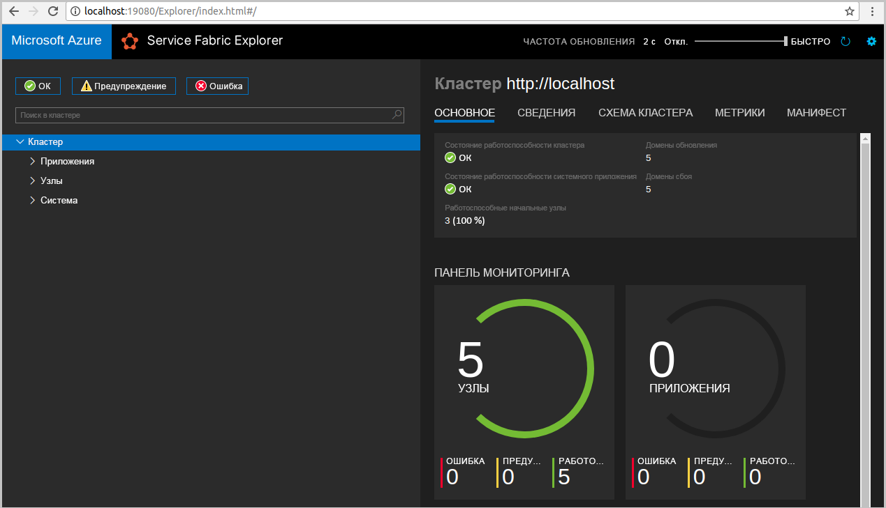
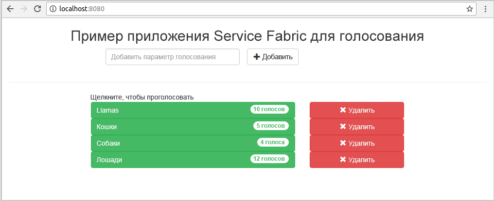
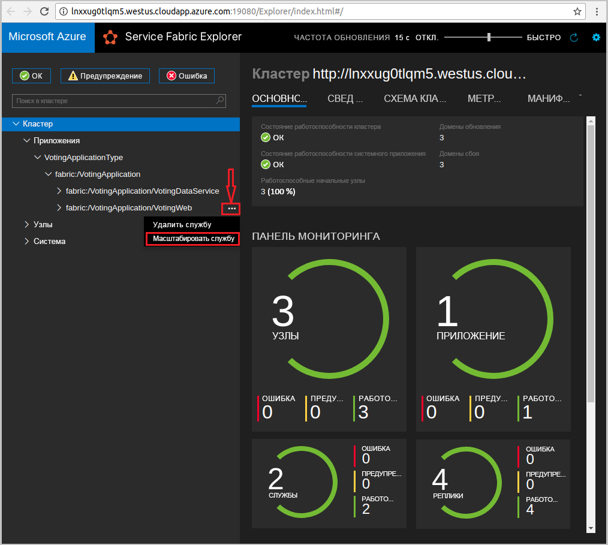

# <a name="quickstart--deploy-a-java-app-to-azure-service-fabric-on-linux"></a>Краткое руководство.  Развертывание приложения Java в Azure Service Fabric в Linux

В этом кратком руководстве мы развернем приложение Java в Azure Service Fabric, используя интегрированную среду разработки Eclipse на компьютере разработчика Linux. После завершения этого руководства вы получите приложение для голосования с клиентской частью в виде веб-приложения Java, которое сохраняет результаты голосования во внутренней службе с отслеживанием состояния в кластере.

Azure Service Fabric — это платформа распределенных систем для развертывания микрослужб и контейнеров и управления ими.

## <a name="prerequisites"></a>Предварительные требования

- [Среда Java](./service-fabric-get-started-linux.md#set-up-java-development) и [Yeoman](./service-fabric-get-started-linux.md#set-up-yeoman-generators-for-containers-and-guest-executables).
- [Eclipse Neon версии 4.6 или новее](https://www.eclipse.org/downloads/packages/) и [подключаемый модуль Eclipse для Service Fabric](./service-fabric-get-started-linux.md#install-the-eclipse-plug-in-optional).
- [Пакет SDK и интерфейс командной строки (CLI) для Service Fabric](./service-fabric-get-started-linux.md#installation-methods).
- [Git](https://git-scm.com/downloads);

## <a name="download-the-sample"></a>Скачивание примера приложения

В окне терминала выполните следующую команду, чтобы клонировать репозиторий с примером приложения на локальный компьютер.

```bash
git clone https://github.com/Azure-Samples/service-fabric-java-quickstart.git
```

## <a name="run-the-application-locally"></a>Локальный запуск приложения

1. Запустите локальный кластер, выполнив следующую команду:

    ```bash
    sudo /opt/microsoft/sdk/servicefabric/common/clustersetup/devclustersetup.sh
    ```
    Запуск локального кластера занимает некоторое время. Чтобы убедиться, что кластер работает, откройте Service Fabric Explorer по адресу `http://localhost:19080`. Наличие пяти работоспособных узлов означает, что локальный кластер запущен и работает.

    

2. Откройте Eclipse.
3. Щелкните **File** > **Import** > **Gradle** > **Existing Gradle Project** (Файл > Импорт > Gradle > Существующий проект Gradle) и следуйте указаниям мастера.
4. Щелкните **Directory** (Каталог) и в клонированной из GitHub папке **service-fabric-java-quickstart** выберите каталог **Voting** (Голосование). Нажмите кнопку **Готово**.

    

5. Теперь у вас имеется проект `Voting` в обозревателе пакетов для Eclipse.
6. Щелкните правой кнопкой мыши проект и выберите **Publish Application** (Опубликовать приложение) в раскрывающемся списке **Service Fabric**. Выберите **PublishProfiles/Local.json** в качестве целевого профиля и нажмите кнопку **Publish** (Опубликовать).

    

7. Откройте любой веб-браузер и перейдите к приложению по адресу `http://localhost:8080`.

    

Теперь можно добавить варианты для выбора в голосовании и начать прием голосов. Приложение запускается и хранит все данные в кластере Service Fabric без необходимости использования отдельной базы данных.



## <a name="scale-applications-and-services-in-a-cluster"></a>Масштабирование приложений и служб в кластере

Службы могут легко масштабироваться в кластере с учетом изменения нагрузки на службы. Масштабирование службы осуществляется путем изменения числа экземпляров, запущенных в кластере. Существует много способов масштабировать службы. Например, можно использовать скрипты или команды CLI для Service Fabric (`sfctl`). В следующих шагах используется Service Fabric Explorer.

Средство Service Fabric Explorer работает во всех кластерах Service Fabric. Чтобы открыть его, укажите в браузере порт управления HTTP (19080) для нужного кластера. Например, `http://localhost:19080`.

Для масштабирования службы веб-интерфейса сделайте следующее:

1. Откройте Service Fabric Explorer в своем кластере. Например, `https://localhost:19080`.
2. Щелкните многоточие ( **...** ) рядом с узлом **fabric:/Voting/VotingWeb** в дереве и выберите **Масштабировать службу**.

    

    Теперь вы можете изменить количество экземпляров службы веб-интерфейса.

3. Измените количество на **2** и щелкните **Масштабировать службу**.
4. Выберите узел **fabric:/Voting/VotingWeb** в дереве и разверните узел раздела (он отображается в виде идентификатора GUID).

    

    Теперь вы видите, что у службы есть два экземпляра, а с помощью дерева вы можете определить узлы, на которых запущены эти экземпляры.

С помощью этой простой задачи управления вы удвоили количество ресурсов для обработки пользовательской нагрузки для службы веб-интерфейса. Важно понимать, что для надежной работы службы не требуется запускать несколько экземпляров службы. При сбое в работе службы Service Fabric запускает новый экземпляр службы в кластере.

## <a name="next-steps"></a>Дальнейшие действия

Из этого руководства вы узнали, как выполнить следующие действия:

* Использование Eclipse в качестве средства для приложений Java Service Fabric.
* Развертывание приложений Java в локальном кластере.
* Масштабирование приложения на несколько узлов

Дополнительные сведения о работе с приложениями Java в Service Fabric см. в руководстве по приложениям Java.

> [!div class="nextstepaction"]
> [Развертывание приложения Java](./service-fabric-tutorial-create-java-app.md)
