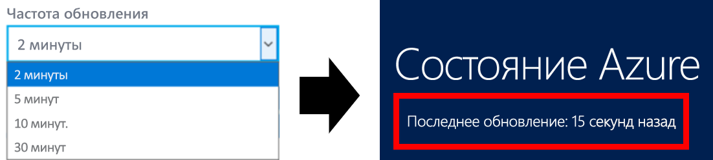

# Состояние Azure
[Состояние Azure](https://azure.microsoft.com/status/) — это глобальное представление работоспособности служб Azure. Просматривая состояние Azure, можно получать актуальную информацию о доступности служб. Просматривать состояние Azure, а также всех служб, сообщающих о своей работоспособности, могут все пользователи. 

## Обновления состояния Azure
Страница состояния Azure обновляется в режиме реального времени по мере изменения работоспособности служб Azure. Если оставить страницу состояния Azure открытой, можно контролировать скорость поступления новых данных на страницу. В верхней части отображается время последнего обновления страницы.

## Журнал состояний Azure
На странице состояния Azure всегда отображаются последние данные о работоспособности. Более старые события можно просмотреть на [странице журнала состояния Azure](https://azure.microsoft.com/status/history/).

Здесь можно просмотреть события за прошлый период (до 90 дней), включая сведения о предварительной первопричине, устранении рисков и дальнейших действиях в среде Azure.

## RSS-канал
В рамках сведений о состоянии Azure также предоставляется [RSS-канал](https://azure.microsoft.com/status/feed/) изменений работоспособности служб Azure, на который можно подписаться.

## Дальнейшие действия
* Узнайте, как можно получить более персонализированное представление о работоспособности Azure с помощью средства [Работоспособность служб](./service-health-overview.md).
* Узнайте, как можно получить подробное представление о работоспособности определенных ресурсов Azure с помощью средства [Работоспособность ресурсов](./resource-health-overview.md).
