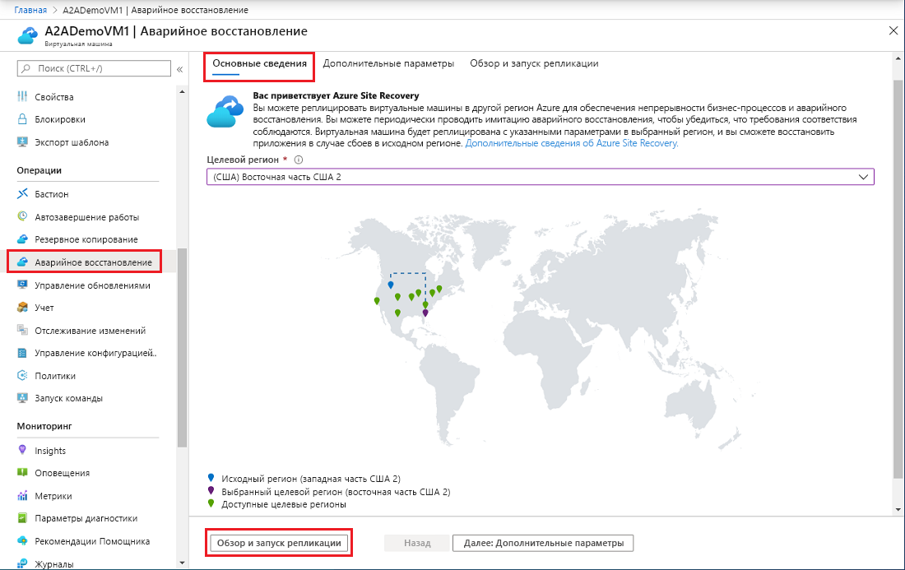
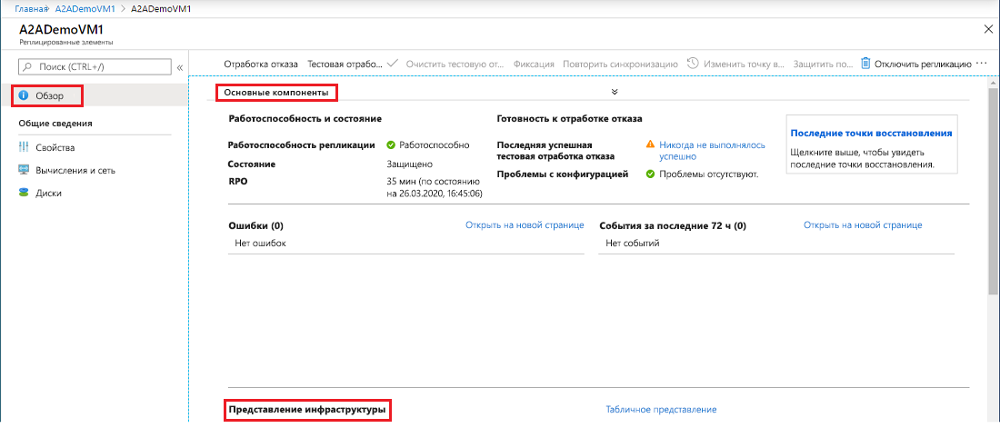
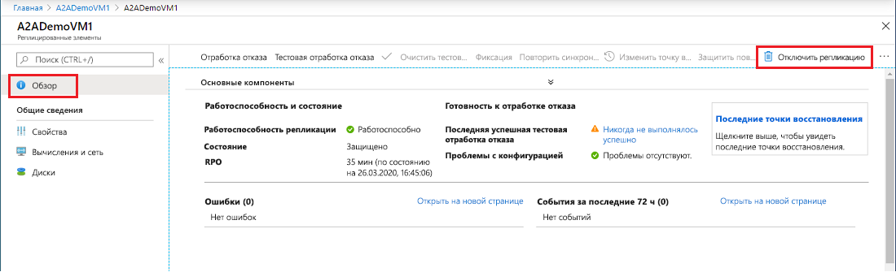

# Настройка аварийного восстановления виртуальной машины Azure в дополнительный регион Azure        

Служба [Azure Site Recovery](site-recovery-overview.md) помогает реализовать стратегию непрерывности бизнес-процессов и аварийного восстановления (BCDR), обеспечивая работоспособность бизнес-приложений во время запланированных и незапланированных простоев. Site Recovery управляет аварийным восстановлением локальных компьютеров и виртуальных машин Azure, включая операции репликации, отработки отказа и восстановления.

В этом кратком руководстве описывается, как настроить аварийное восстановление для виртуальной машины Azure, реплицировав ее в другой регион Azure.

Если у вас еще нет подписки Azure, [создайте бесплатную учетную запись Azure](https://azure.microsoft.com/free/?WT.mc_id=A261C142F), прежде чем начинать работу.

> [!NOTE]
> Эта статья — краткое руководство для новых пользователей. Здесь используется самый простой путь с параметрами по умолчанию и минимальной настройкой.  Более подробное пошаговое руководство см. в [нашем руководстве](azure-to-azure-tutorial-enable-replication.md).

## Вход в Azure

Войдите на портал Azure по адресу https://portal.azure.com.

## Включение репликации виртуальной машины Azure

1. На портале Azure щелкните **Виртуальные машины**, а затем выберите виртуальную машину, которую требуется реплицировать.
2. В разделе **Операции** щелкните **Аварийное восстановление**.
3. В разделе **Настройка аварийного восстановления** > **Целевой регион** выберите целевой регион, в который будет выполняться репликация.
4. Для выполнения действий в этом кратком руководстве примите другие значения по умолчанию.
5. Щелкните **Включить репликацию**. Будет запущено задание для включения репликации виртуальной машины.

    

## Проверка параметров

После завершения задания репликации можно проверить состояние репликации, изменить параметры настройки репликации и протестировать развертывание.

1. В разделе **Операции** щелкните **Аварийное восстановление**.
2. Можно проверить работоспособность репликации, созданные точки восстановления, а также исходный и целевой регионы на карте.

   

## Очистка ресурсов

Репликация виртуальной машины в основном регионе останавливается при отключении репликации:

- Параметры репликации в источнике автоматически очищаются. Расширение Site Recovery, устанавливаемое на виртуальной машине в рамках репликации, автоматически не удаляется, для этого необходимо удаление вручную. 
- Выставление счетов Site Recovery за виртуальную машину прекращается.

Действия по остановке репликации:

1. Выберите виртуальную машину.
2. Выберите **Аварийное восстановление** и щелкните **Отключить репликацию**.

   

## Дополнительная информация

В этом кратком руководстве вы реплицировали виртуальную машину в дополнительный регион. Теперь попробуйте выполнить репликацию нескольких виртуальных машин Azure с помощью плана восстановления.

> [!div class="nextstepaction"]
> [Настройка аварийного восстановления для виртуальных машин Azure](azure-to-azure-tutorial-enable-replication.md)
