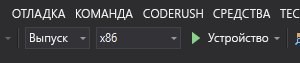

# Краткое руководство. Создание приложения HoloLens с использованием Пространственных привязок Azure в C++/WinRT и DirectX

В этом кратком руководстве показано, как создать приложение HoloLens с использованием [Пространственных привязок Azure](../overview.md) в C++/WinRT и DirectX. "Пространственные привязки Azure" — это кроссплатформенная служба разработчика, которая позволяет создавать среды смешанной реальности с применением объектов, не меняющих своего расположения на устройствах с течением времени. По завершении работы с руководством у вас будет приложение HoloLens, которое может сохранять и отзывать пространственные привязки.

Вы узнаете, как:

> [!div class="checklist"]
> * создавать учетную запись в службе "Пространственные привязки";
> * настроить идентификатор и ключ учетной записи в службе "Пространственные привязки";
> * развернуть и запустить приложение на устройстве HoloLens.

[!INCLUDE [quickstarts-free-trial-note](../../../includes/quickstarts-free-trial-note.md)]

## Предварительные требования

В рамках этого краткого руководства вам потребуются:

- Компьютер Windows с установленной программой <a href="https://www.visualstudio.com/downloads/" target="_blank">Visual Studio 2019+</a> с рабочей нагрузкой **Разработка приложений для универсальной платформы Windows** и компонентом **Пакет SDK для Windows 10 (10.0.17763.0 или более поздняя версия)** , а также <a href="https://git-scm.com/download/win" target="_blank">Git для Windows</a>.
- Установленное [расширение Visual Studio C++/WinRT](https://aka.ms/cppwinrt/vsix) из [Visual Studio Marketplace](https://marketplace.visualstudio.com/).
- Устройство HoloLens с включенным [режимом разработчика](https://docs.microsoft.com/windows/mixed-reality/using-visual-studio). Для этой статьи требуется устройство HoloLens с [обновлением Windows 10 за октябрь 2018 г.](https://docs.microsoft.com/windows/mixed-reality/release-notes-october-2018 ) (также известным как RS5). Чтобы обновить HoloLens до последней версии, откройте приложение **Параметры**, перейдите в раздел **Обновление и безопасность**, а затем нажмите кнопку **Проверить обновления**.
- В манифесте AppX приложения необходимо настроить возможность **spatialPerception**.

[!INCLUDE [Create Spatial Anchors resource](../../../includes/spatial-anchors-get-started-create-resource.md)]

## Открытие примера проекта

[!INCLUDE [Clone Sample Repo](../../../includes/spatial-anchors-clone-sample-repository.md)]

Откройте `HoloLens\DirectX\SampleHoloLens.sln` в Visual Studio.

## Настройка идентификатора и ключа учетной записи

Следующим шагом является настройка приложения для использования идентификатора вашей учетной записи и ключа учетной записи. Вы скопировали их в текстовый редактор, когда выполняли [настройку ресурсов Пространственных привязок](#create-a-spatial-anchors-resource).

Откройте `HoloLens\DirectX\SampleHoloLens\ViewController.cpp`.

Найдите поле `SpatialAnchorsAccountKey` и замените `Set me` ключом учетной записи.

Найдите поле `SpatialAnchorsAccountId` и замените `Set me` идентификатором учетной записи.

## Развертывание приложения в HoloLens

Укажите для параметра **Solution Configuration** (Конфигурация решения) значение **Release** (Выпуск), а для параметра **Solution Platform** (Платформа решения) значение **x86** и выберите **Device** (Устройство) в списке целевых вариантов развертывания.

При использовании HoloLens 2 **платформой решения** будет **ARM**, а не **x86**.

Включите устройство HoloLens, войдите и подключите его к ПК с помощью USB-кабеля.

Выберите **Debug** > **Start debugging** (Отладка > Начать отладку), чтобы развернуть приложение и запустить отладку.

Следуйте инструкциям в программе для размещения и отзыва привязки.

В Visual Studio остановите приложение, выбрав **Остановить отладку** или нажав клавиши **SHIFT+F5**.

[!INCLUDE [Clean-up section](../../../includes/clean-up-section-portal.md)]

[!INCLUDE [Next steps](../../../includes/spatial-anchors-quickstarts-nextsteps.md)]

> [!div class="nextstepaction"]
> [Руководство. по совместному использованию службы "Пространственные привязки" на разных устройствах](../tutorials/tutorial-share-anchors-across-devices.md)
