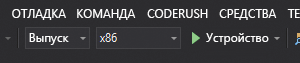

# Краткое руководство Создание приложения HoloLens Unity с помощью службы "Пространственные привязки"

Краткое руководство по созданию приложения HoloLens Unity с помощью службы [Пространственные привязки Azure](../overview.md). "Пространственные привязки Azure" — это кроссплатформенная служба разработчика, которая позволяет создавать среды смешанной реальности с применением объектов, не меняющих своего расположения на устройствах с течением времени. Завершив работу, вы получите приложение HoloLens, разработанное с использованием Unity, которое может сохранять и удалять пространственные привязки.

Вы узнаете, как:

> [!div class="checklist"]
> * создать учетную запись в службе "Пространственные привязки";
> * настроить параметры сборки Unity;
> * настроить идентификатор и ключ учетной записи в службе "Пространственные привязки";
> * экспортировать проект HoloLens в Visual Studio;
> * развернуть и запустить приложение на устройстве HoloLens.

[!INCLUDE [quickstarts-free-trial-note](../../../includes/quickstarts-free-trial-note.md)]

## Предварительные требования

В рамках этого краткого руководства вам потребуются:

- Компьютер Windows с установленными решениями <a href="https://unity3d.com/get-unity/download" target="_blank">Unity 2018.3+</a> и <a href="https://www.visualstudio.com/downloads/" target="_blank">Visual Studio 2017+</a> с рабочей нагрузкой **Разработка приложений для универсальной платформы Windows**.
- Устройство HoloLens с включенным [режимом разработчика](https://docs.microsoft.com/windows/mixed-reality/using-visual-studio).
- Приложение должно активировать функцию **SpatialPerception** в меню **Build Settings**->**Player Settings**->**Publishing Settings**->**Capabilities** (Параметры сборки > Параметры проигрывателя > Параметры публикации > Возможности).
- Приложение должно активировать функцию **Virtual Reality Supported** (Поддержка виртуальной реальности) с использованием **пакета SDK смешанной реальности Windows** в меню **Build Settings**->**Player Settings**->**XR Settings** (Параметры сборки > Параметры проигрывателя > Параметры XR).

[!INCLUDE [Create Spatial Anchors resource](../../../includes/spatial-anchors-get-started-create-resource.md)]

## Открытие примера проекта в Unity

[!INCLUDE [Clone Sample Repo](../../../includes/spatial-anchors-clone-sample-repository.md)]

Откройте Unity, а затем откройте проект в папке `Unity`.

Откройте **Build Settings** (Параметры сборки), выбрав пункты **File** -> **Build Settings** (Файл > Параметры сборки).

В разделе **Platform** (Платформа) выберите **Universal Windows Platform** (Универсальная платформа Windows). Затем измените **Target Device** (Целевое устройство) на **HoloLens**.

Выберите **Switch Platform** (Изменить платформу), чтобы изменить значение на **Universal Windows Platform** (Универсальная платформа Windows).

Закройте окно **Build Settings** (Параметры сборки).

## Настройка идентификатора и ключа учетной записи

В области **Project** (Проект) перейдите к `Assets/AzureSpatialAnchorsPlugin/Examples` и откройте файл сцены `AzureSpatialAnchorsBasicDemo.unity`.

[!INCLUDE [Configure Unity Scene](../../../includes/spatial-anchors-unity-configure-scene.md)]

Сохраните сцену, выбрав **File** -> **Save** (Файл > Сохранить).

## Экспорт проекта HoloLens в Visual Studio

[!INCLUDE [Export Unity Project](../../../includes/spatial-anchors-unity-export-project-snip.md)]

Выберите **Build** (Сборка), чтобы открыть диалоговое окно. Затем выберите папку для экспорта проекта HoloLens в Visual Studio.

После завершения экспорта появится папка, содержащая экспортированный проект HoloLens.

## Развертывание приложения HoloLens

Чтобы открыть проект в Visual Studio, дважды щелкните `HelloAR U3D.sln` в папке.

Укажите для параметра **Solution Configuration** (Конфигурация решения) значение **Release** (Выпуск), а для параметра **Solution Platform** (Платформа решения) значение **x86** и выберите **Device** (Устройство) в списке целевых вариантов развертывания.

Включите устройство HoloLens, войдите и подключите его к ПК с помощью USB-кабеля.

Выберите **Debug** > **Start debugging** (Отладка > Начать отладку), чтобы развернуть приложение и запустить отладку.

Следуйте инструкциям в программе для размещения и отзыва привязки.

В Visual Studio остановите приложение, выбрав **Остановить отладку** или нажав клавиши **SHIFT+F5**.

[!INCLUDE [Clean-up section](../../../includes/clean-up-section-portal.md)]

[!INCLUDE [Next steps](../../../includes/spatial-anchors-quickstarts-nextsteps.md)]

> [!div class="nextstepaction"]
> [Руководство по совместному использованию службы "Пространственные привязки" на разных устройствах](../tutorials/tutorial-share-anchors-across-devices.md)
