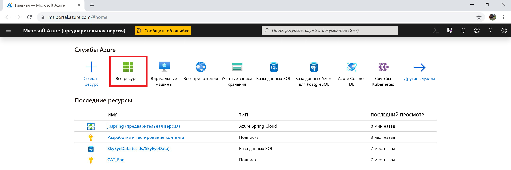
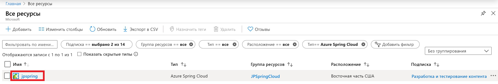
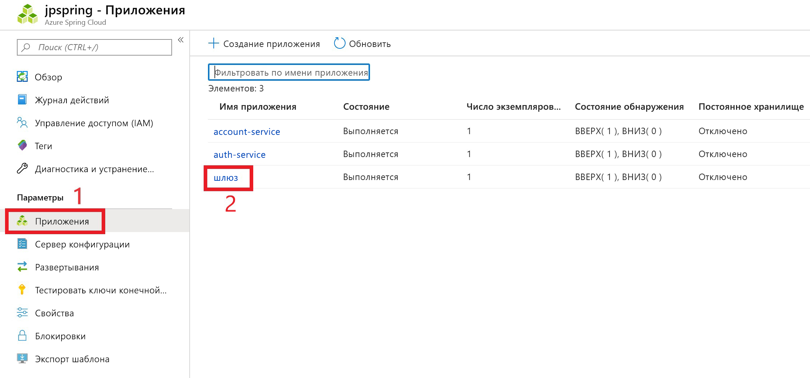
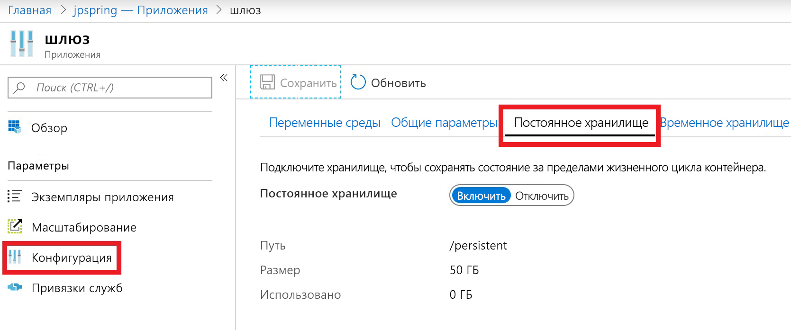

# <a name="how-to-use-persistent-storage-in-azure-spring-cloud"></a>Как использовать постоянное хранилище в Azure Веснного облака

Azure Веснного облака предоставляет два типа хранилища для вашего приложения: постоянные и временные.  Azure Веснного облака по умолчанию включает временное хранилище для каждого экземпляра приложения. Временное хранилище ограничено 5 ГБ с путем подключения по умолчанию: `/tmp`.

> [!WARNING]
> Перезапуск экземпляра приложения приведет к безвозвратному удалению связанного временного хранилища.

Постоянное хранилище — это контейнер файлового ресурса, управляемый Azure, выделенный для каждого приложения. Данные, хранящиеся в постоянном хранилище, являются общими для всех экземпляров приложения. В экземпляре облачной службы Azure весны может быть не более 10 приложений с включенным постоянным диском. Каждое приложение получает 50 ГБ постоянного хранилища. Путь подключения по умолчанию для постоянного хранилища — `/persistent`.

> [!WARNING]
> *Отключение* постоянного хранилища приведет к отмене выделения хранилища для этого приложения.  Все данные в этой учетной записи хранения будут потеряны. 

## <a name="enable-persistent-storage-using-the-azure-portal"></a>Включение постоянного хранилища с помощью портал Azure

1. На начальном экране портал Azure выберите **все ресурсы**.

     >

1. Найдите и выберите облачный ресурс Azure "Весна", требующий постоянного хранения.  В этом примере приложение называется *жпспринг*.

    > 

1. Под заголовком **Параметры** выберите **приложения**.

1. В таблице будут показаны облачные службы весны.  Выберите службу, к которой необходимо добавить постоянное хранилище.  В этом примере мы будем выбирать службу **шлюза** .

    > 

1. В колонке конфигурации службы выберите **Конфигурация** .

1. Перейдите на вкладку **постоянное хранилище** и включите постоянное хранилище.

    > 

Если постоянное хранилище включено, его размер и путь будут показаны на этой странице.

## <a name="use-the-azure-cli-to-modify-persistent-storage"></a>Использование Azure CLI для изменения постоянного хранилища

При необходимости установите расширение "Весна Cloud" для Azure CLI:

```azurecli
az extension add --name spring-cloud
```

Создание приложения с включенным постоянным диском:
 
```azurecli
az spring-cloud app create -n <app> -g <resource-group> -s <service-name> --enable-persistent-storage true
```

Включить постоянное хранилище в существующем приложении:

```azurecli
az spring-cloud app update -n <app> -g <resource-group> -s <service-name> --enable-persistent-storage true
``` 

Отключить постоянное хранилище в существующем приложении:

> [!WARNING]
> Отключение постоянного хранилища приведет к отмене выделения хранилища для этого приложения без окончательного потери хранящихся в нем данных. 

```azurecli
az spring-cloud app update -n <app> -g <resource-group> -s <service-name> --enable-persistent-storage false
```

## <a name="next-steps"></a>Дальнейшие действия

Сведения о [квотах приложений и служб](spring-cloud-quotas.md), а также о том, как [масштабировать приложение вручную](spring-cloud-tutorial-scale-manual.md).