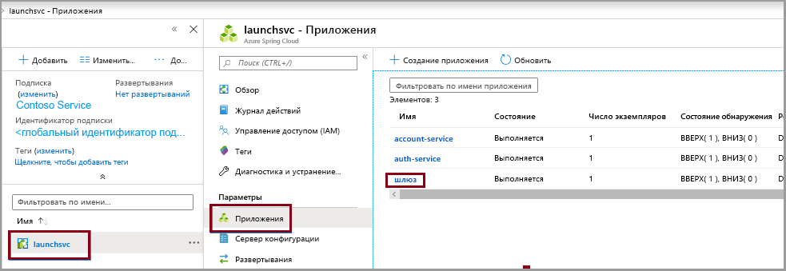
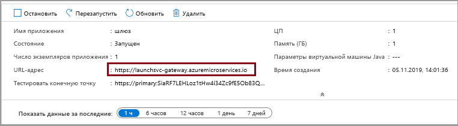

# <a name="quickstart-launch-a-java-spring-application-using-the-azure-cli"></a>Краткое руководство. Запуск приложения Java Spring с помощью Azure CLI

Azure Spring Cloud позволяет легко запустить приложение для микрослужб на основу Spring Boot в Azure.

В этом кратком руководстве описано, как развернуть имеющееся приложение Java Spring Cloud в Azure. По завершении вы сможете продолжить управление приложением с помощью Azure CLI или перейти на портал Azure.

Из этого руководства вы узнаете, как выполнить следующие задачи:

> [!div class="checklist"]
> * подготовка экземпляра службы к работе;
> * задание сервера конфигурации для экземпляра;
> * локальное выполнение сборки приложения для микрослужб;
> * развертывание каждой микрослужбы;
> * назначение общедоступной конечной точки для приложения.

## <a name="prerequisites"></a>Предварительные требования

>[!Note]
> Azure Spring Cloud в настоящее время предлагается в качестве общедоступной предварительной версии. Предложения общедоступной предварительной версии позволяют клиентам поэкспериментировать с новыми функциями до официального выпуска.  Функции и службы общедоступной предварительной версии не предназначены для использования в рабочей среде.  Чтобы получить дополнительные сведения о поддержке на этапе использования предварительных версий, ознакомьтесь с разделом [Вопросы и ответы](https://azure.microsoft.com/support/faq/) или оформите [запрос на поддержку](https://docs.microsoft.com/azure/azure-supportability/how-to-create-azure-support-request).

>[!TIP]
> Azure Cloud Shell — это бесплатная интерактивная оболочка, с помощью которой можно выполнять действия, описанные в этой статье.  Она содержит предварительно установленные общие инструменты Azure вместе с новейшими версиями Git, JDK, Maven и Azure CLI. Если вы вошли в подписку Azure, запустите [Azure Cloud Shell](https://shell.azure.com) на сайте shell.azure.com.  Дополнительные сведения об Azure Cloud Shell см. в [нашей документации](../cloud-shell/overview.md)

Для работы с этим кратким руководством сделайте следующее:

1. [установите Git](https://git-scm.com/);
2. [установите JDK версии 8](https://docs.microsoft.com/java/azure/jdk/?view=azure-java-stable);
3. [установите Maven 3.0 или более поздней версии](https://maven.apache.org/download.cgi);
4. [установите Azure CLI (версии 2.0.67 или выше)](https://docs.microsoft.com/cli/azure/install-azure-cli?view=azure-cli-latest);
5. [зарегистрируйтесь для получения подписки Azure](https://azure.microsoft.com/free/).

## <a name="install-the-azure-cli-extension"></a>Установка расширения Azure CLI

Установите расширение Azure Spring Cloud для Azure CLI с помощью следующей команды:

```azurecli
az extension add --name spring-cloud
```

## <a name="provision-a-service-instance-on-the-azure-cli"></a>Подготовка экземпляра службы к работе в Azure CLI

1. Войдите в Azure CLI и выберите активную подписку. Выбранная активная подписка должна быть добавлена в список разрешений для Azure Spring Cloud.

    ```azurecli
        az login
        az account list -o table
        az account set --subscription
    ```

2. Подготовьте имя службы Azure Spring Cloud.  Его длина должна быть от 4 до 32 знаков. Имя может содержать только строчные буквы, цифры и дефисы.  Первым символом в имени службы должна быть буква, а последним — буква или цифра.

3. Создайте группу ресурсов, которая будет содержать службу Azure Spring Cloud.

    ```azurecli
        az group create --location eastus --name <resource group name>
    ```
    Узнайте больше о [группах ресурсов Azure](../azure-resource-manager/resource-group-overview.md).

4. Откройте окно Azure CLI и выполните приведенные ниже команды, чтобы подготавливать экземпляр Azure Spring Cloud к работе.

    ```azurecli
        az spring-cloud create -n <service name> -g <resource group name>
    ```

    Развертывание экземпляра службы займет около пяти минут.

5. Задайте стандартные имена группы ресурсов и кластера с помощью следующих команд:

    ```azurecli
        az configure --defaults group=<service group name>
        az configure --defaults spring-cloud=<service instance name>
    ```

## <a name="setup-your-configuration-server"></a>Настройка сервера конфигурации

Обновите файл config-server, указав расположение репозитория Git для нашего проекта:

```git
az spring-cloud config-server git set -n <your-service-name> --uri https://github.com/Azure-Samples/piggymetrics --label config
```

## <a name="build-the-microservices-applications-locally"></a>Локальное выполнение сборки приложений для микрослужб

1. Создайте папку и клонируйте пример репозитория приложения в облачную учетную запись Azure.  

    ```azurecli
        mkdir source-code
        git clone https://github.com/Azure-Samples/piggymetrics
    ```

2. Перейдите в каталог и выполните сборку проекта.

    ```azurecli
        cd piggymetrics
        mvn clean package -D skipTests
    ```

Компиляция проекта занимает около 5 минут.  После завершения у вас должны быть отдельные JAR-файлы для каждой службы в соответствующих папках.

## <a name="create-the-microservices"></a>Создание микрослужб

Создайте микрослужбы Spring Cloud с помощью JAR-файлов, полученных на предыдущем шаге. Вы создадите три микрослужбы: **gateway**, **auth-service** и **account-service**.

```azurecli
az spring-cloud app create --name gateway
az spring-cloud app create --name auth-service
az spring-cloud app create --name account-service
```

## <a name="deploy-applications-and-set-environment-variables"></a>Развертывание приложений и задание переменных среды

Приложения необходимо фактически развернуть в Azure. Чтобы развернуть все три приложения, используйте следующие команды:

```azurecli
az spring-cloud app deploy -n gateway --jar-path ./gateway/target/gateway.jar
az spring-cloud app deploy -n account-service --jar-path ./account-service/target/account-service.jar
az spring-cloud app deploy -n auth-service --jar-path ./auth-service/target/auth-service.jar
```

## <a name="assign-public-endpoint-to-gateway"></a>Назначение общедоступной конечной точки шлюзу

Нам нужен способ доступа к приложению через веб-браузер. Приложению шлюза требуется общедоступная конечная точка, которую можно назначить с помощью следующей команды:

```azurecli
az spring-cloud app update -n gateway --is-public true
```

Наконец, отправьте к приложению **gateway** запрос на получение общедоступного IP-адреса, чтобы убедиться, что приложение запущено:

```azurecli
az spring-cloud app show --name gateway | grep url
```

Перейдите по URL-адресу, указанному в предыдущей команде, чтобы запустить приложение PiggyMetrics.
    

URL-адрес можно найти на портале Azure. 
1. Перейдите к службе.
1. Выберите **Приложения**.
1. Выберите **шлюз**.

    
1. Найдите URL-адрес на странице **общих сведений о шлюзе**. 

## <a name="next-steps"></a>Дальнейшие действия

В этом кратком руководстве вы развернули приложение Spring Cloud из Azure CLI.  Дополнительные сведения об Azure Spring Cloud см. в учебнике по подготовке приложения к развертыванию.

> [!div class="nextstepaction"]
> [Подготовка приложения Azure Spring Cloud к развертыванию](spring-cloud-tutorial-prepare-app-deployment.md)
