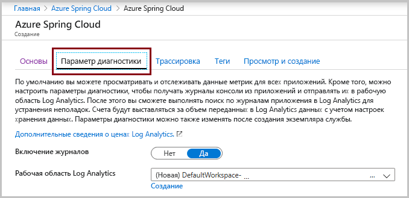
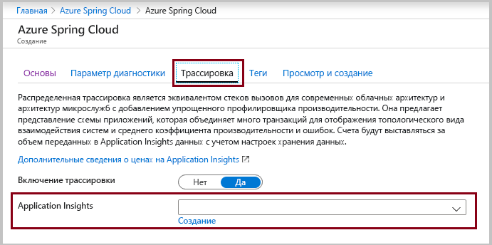

# <a name="quickstart-launch-an-existing-azure-spring-cloud-application-using-the-azure-portal"></a>Краткое руководство. Запуск существующего приложения Azure Spring Cloud с помощью портала Azure

В этом кратком руководстве описано, как развернуть имеющееся приложение Spring Cloud в Azure. Azure Spring Cloud позволяет легко выполнять приложения микрослужб Spring Cloud в Azure. 

Пример кода приложения, используемый в этом руководстве, можно найти в [репозитории примеров GitHub](https://github.com/Azure-Samples/PiggyMetrics). После завершения работы предоставленный пример приложения будет доступен в сети и готов к управлению с помощью портала Azure.

Из этого руководства вы узнаете, как выполнить следующие задачи:

> [!div class="checklist"]
> * подготовка экземпляра службы к работе;
> * задание сервера конфигурации для экземпляра;
> * локальное выполнение сборки приложения для микрослужб;
> * развертывание каждой микрослужбы;
> * назначение общедоступной конечной точки для приложения.

## <a name="prerequisites"></a>Предварительные требования

>[!Note]
> Сейчас предоставляется общедоступная предварительная версия Azure Spring Cloud. Предложения общедоступной предварительной версии позволяют клиентам экспериментировать с новыми функциями до официального выпуска.  Общедоступные предварительные версии функций и служб не предназначены для использования в рабочей среде.  Чтобы получить дополнительные сведения о поддержке на этапе использования предварительных версий, ознакомьтесь с разделом [Вопросы и ответы](https://azure.microsoft.com/support/faq/) или оформите [запрос на поддержку](https://docs.microsoft.com/azure/azure-portal/supportability/how-to-create-azure-support-request).

>[!TIP]
> Azure Cloud Shell — это бесплатная интерактивная оболочка, с помощью которой можно выполнять действия, описанные в этой статье.  Она содержит предварительно установленные общие инструменты Azure вместе с новейшими версиями Git, JDK, Maven и Azure CLI. Если вы вошли в подписку Azure, запустите [Azure Cloud Shell](https://shell.azure.com) на сайте shell.azure.com.  Дополнительные сведения об Azure Cloud Shell см. в [нашей документации](../cloud-shell/overview.md)

Для работы с этим кратким руководством сделайте следующее:

1. [установите Git](https://git-scm.com/);
2. [установите JDK версии 8](https://docs.microsoft.com/java/azure/jdk/?view=azure-java-stable);
3. [установите Maven 3.0 или более поздней версии](https://maven.apache.org/download.cgi);
4. [установите Azure CLI (версии 2.0.67 или выше)](https://docs.microsoft.com/cli/azure/install-azure-cli?view=azure-cli-latest);
5. [Регистрация для получения подписки Azure](https://azure.microsoft.com/free/)

## <a name="provision-a-service-instance-on-the-azure-portal"></a>Подготовка экземпляра службы к работе на портале Azure

1. На новой вкладке откройте [портал Azure](https://ms.portal.azure.com/). 

2. В поле поиска сверху введите **Azure Spring Cloud**.

3. Выберите пункт **Azure Spring Cloud** в списке результатов.

 

4. На странице Azure Spring Cloud щелкните элемент **+ Добавить**.

 

5. Заполните форму на странице **создания** Azure Spring Cloud.  Ознакомьтесь со следующими рекомендациями:
    - **Подписка**: Выберите подписку, на которую будет выставляться счет за этот ресурс.  Убедитесь, что эта подписка добавлена в наш список разрешений для Azure Spring Cloud.
    - **Группа ресурсов.** Советуем создавать группы ресурсов для новых ресурсов.
    - **Сведения о службе или ее название.** Укажите имя экземпляра службы.  Его длина должна быть от 4 до 32 знаков. Имя может содержать только строчные буквы, цифры и дефисы.  Первым символом в имени службы должна быть буква, а последним — буква или цифра.
    - **Расположение.** Выберите расположение для экземпляра службы. В настоящее время поддерживаются следующие расположения: восточная часть США, западная часть США 2, Западная Европа и Юго-Восточная Азия.

    

6. Щелкните вкладку **Diagnostic Setting** (Параметр диагностики), чтобы открыть следующее диалоговое окно.

7. Вы можете задать для параметра **Включить журналы** значение *да* или *нет* в соответствии со своими требованиями.

    

8. Щелкните вкладку **Трассировка**.

9. Вы можете задать для параметра **Включить трассировку** значение *да* или *нет* в соответствии со своими требованиями.  Если задаете для параметра **Включить трассировку** значение "да", также выберите существующую функцию Application Insights или создайте новую. Если не задать **Application Insights**, произойдет ошибка проверки.


    

10. Щелкните **Проверка и создание**.

11. Проверьте спецификации и щелкните **Создать**.

Развертывание службы занимает около 5 минут.  После развертывания появится страница **Обзор** для экземпляра службы.

> [!div class="nextstepaction"]
> [У меня есть проблема](https://www.research.net/r/javae2e?tutorial=asc-portal-quickstart&step=provision)


## <a name="set-up-your-configuration-server"></a>Настройка сервера конфигурации

1. Перейдите на страницу **Обзор** службы и выберите **Config Server** (Сервер конфигурации).

2. В разделе **Репозиторий по умолчанию** задайте для **URI** значение "https://github.com/Azure-Samples/piggymetrics-config".

3. Щелкните **Применить**, чтобы сохранить изменения.

    

> [!div class="nextstepaction"]
> [У меня есть проблема](https://www.research.net/r/javae2e?tutorial=asc-portal-quickstart&step=config-server)

## <a name="build-and-deploy-microservice-applications"></a>Создание и развертывание приложений микрослужб

1. Откройте [Azure Cloud Shell](https://shell.azure.com) или локальную оболочку с установленным интерфейсом командной строки Azure. Перед клонированием примера приложения мы создадим временный каталог `source-code`.

    ```console
    mkdir source-code
    cd source-code
    git clone https://github.com/Azure-Samples/piggymetrics
    ```

2. Выполните сборку клонированного пакета.

    ```console
    cd piggymetrics
    mvn clean package -DskipTests
    ```

3. Установите расширение Azure Spring Cloud для Azure CLI с помощью следующей команды:

    ```azurecli
    az extension add --name spring-cloud
    ```

4. Назначьте имена группе ресурсов и службе. Обязательно замените заполнители ниже именем группы ресурсов и именем службы, подготовленными ранее в этом учебнике.

    ```azurecli
    az configure --defaults group=<resource group name>
    az configure --defaults spring-cloud=<service instance name>
    ```

5. Создайте приложение `gateway` и выполните развертывание файла JAR.

    Создайте приложение с помощью расширения Spring Cloud:

    ```azurecli
    az spring-cloud app create -n gateway
    az spring-cloud app deploy -n gateway --jar-path ./gateway/target/gateway.jar
    ```

6. Следуя той же схеме, создайте приложения `account-service` и `auth-service`, и выполните развертывание их файлов JAR.

    ```azurecli
    az spring-cloud app create -n account-service
    az spring-cloud app deploy -n account-service --jar-path ./account-service/target/account-service.jar
    az spring-cloud app create -n auth-service
    az spring-cloud app deploy -n auth-service --jar-path ./auth-service/target/auth-service.jar
    ```

7. Для завершения развертывания приложений потребуется несколько минут. Чтобы убедиться, что они развернуты, перейдите в колонку **Приложения** на портале Azure. Вы увидите строку каждого из трех приложений.

> [!div class="nextstepaction"]
> [У меня есть проблема](https://www.research.net/r/javae2e?tutorial=asc-portal-quickstart&step=deploy)

## <a name="assign-a-public-endpoint-to-gateway"></a>Назначение общедоступной конечной точки шлюзу

1. В меню слева откройте вкладку **Приложения**.

2. Выберите приложение `gateway`, чтобы отобразить страницу **Обзор**.

3. Выберите **Назначить конечную точку**, чтобы назначить общедоступную конечную точку шлюзу. Это может занять несколько минут.

    

4. Введите назначенную общедоступную конечную точку (помеченный **URL-адрес**) в браузере, чтобы просмотреть работающее приложение.

    

> [!div class="nextstepaction"]
> [У меня есть проблема](https://www.research.net/r/javae2e?tutorial=asc-portal-quickstart&step=public-endpoint)

## <a name="next-steps"></a>Дальнейшие действия

Из этого руководства вы узнали, как выполнить следующие действия:

> [!div class="checklist"]
> * подготовка экземпляра службы к работе;
> * задание сервера конфигурации для экземпляра;
> * локальное выполнение сборки приложения для микрослужб;
> * развертывание каждой микрослужбы;
> * Назначение общедоступной конечной точки для шлюза приложения

> [!div class="nextstepaction"]
> [Подготовка приложения Azure Spring Cloud к развертыванию](spring-cloud-tutorial-prepare-app-deployment.md)

Дополнительные примеры доступны на GitHub: [Примеры для Azure Spring Cloud](https://github.com/Azure-Samples/Azure-Spring-Cloud-Samples/tree/master/service-binding-cosmosdb-sql).
