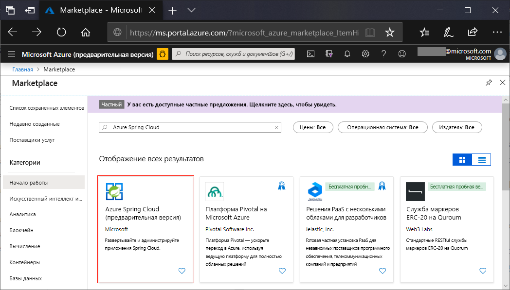

# <a name="quickstart-launch-an-azure-spring-cloud-application-using-the-azure-portal"></a>Краткое руководство. Запуск приложения Azure Spring Cloud с помощью портала Azure

Azure Spring Cloud позволяет легко выполнять приложения микрослужб Spring Cloud в Azure.

В этом кратком руководстве описано, как развернуть имеющееся приложение Spring Cloud в Azure. [Ниже приведена ссылка](https://github.com/Azure-Samples/PiggyMetrics) на пример кода приложения, используемого в этом учебнике. После завершения работы предоставленный пример приложения будет доступен в сети и готов к управлению с помощью портала Azure.

Из этого руководства вы узнаете, как выполнить следующие задачи:

> [!div class="checklist"]
> * подготовка экземпляра службы к работе;
> * задание сервера конфигурации для экземпляра;
> * локальное выполнение сборки приложения для микрослужб;
> * развертывание каждой микрослужбы;
> * назначение общедоступной конечной точки для приложения.

## <a name="prerequisites"></a>Предварительные требования

>[!Note]
> Прежде чем приступить к работе с этим кратким руководством, убедитесь, что ваша подписка Azure имеет доступ к Azure Spring Cloud.  Так как служба находится на этапе предварительной версии, свяжитесь с нами, чтобы мы добавили вашу подписку в список разрешенных.  Если вы хотите изучить возможности Azure Spring Cloud, свяжитесь с нами по электронной почте: azure-spring-cloud@service.microsoft.com.

>[!TIP]
> Azure Cloud Shell — это бесплатная интерактивная оболочка, с помощью которой можно выполнять действия, описанные в этой статье.  Она содержит предварительно установленные общие инструменты Azure вместе с новейшими версиями Git, JDK, Maven и Azure CLI. Если вы вошли в подписку Azure, запустите [Azure Cloud Shell](https://shell.azure.com) на сайте shell.azure.com.  Дополнительные сведения об Azure Cloud Shell см. в [нашей документации](../cloud-shell/overview.md)

Для работы с этим кратким руководством сделайте следующее:

1. [установите Git](https://git-scm.com/);
2. [установите JDK версии 8](https://docs.microsoft.com/java/azure/jdk/?view=azure-java-stable);
3. [установите Maven 3.0 или более поздней версии](https://maven.apache.org/download.cgi);
4. [Установка Azure CLI](https://docs.microsoft.com/cli/azure/install-azure-cli?view=azure-cli-latest)
5. [зарегистрируйтесь для получения подписки Azure](https://azure.microsoft.com/free/).

## <a name="install-the-azure-cli-extension"></a>Установка расширения Azure CLI

Установите расширение Azure Spring Cloud для Azure CLI с помощью следующей команды:

```Azure CLI
az extension add -y --source https://azureclitemp.blob.core.windows.net/spring-cloud/spring_cloud-0.1.0-py2.py3-none-any.whl
```

## <a name="provision-a-service-instance-on-the-azure-portal"></a>Подготовка экземпляра службы к работе на портале Azure

1. В веб-браузере откройте [эту ссылку на Azure Spring Cloud на портале Azure](https://ms.portal.azure.com/?microsoft_azure_marketplace_ItemHideKey=AppPlatformExtension#blade/Microsoft_Azure_Marketplace/MarketplaceOffersBlade/selectedMenuItemId/home/searchQuery/Azure%20Spring%20Cloud).

    

1. Выберите **Spring Cloud для Azure**, чтобы перейти на страницу обзора. Чтобы начать, нажмите кнопку **Создать**.

1. Заполните форму, принимая во внимание следующие рекомендации:
    - Имя службы: Укажите имя экземпляра службы.  Его длина должна быть от 4 до 32 знаков. Имя может содержать только строчные буквы, цифры и дефисы.  Первым символом в имени службы должна быть буква, а последним — буква или цифра.
    - Подписка: Выберите подписку, на которую будет выставляться счет за этот ресурс.  Убедитесь, что эта подписка добавлена в наш список разрешений для Azure Spring Cloud.
    - Группа ресурсов: Советуем создавать группы ресурсов для новых ресурсов.
    - Расположение. Выберите расположение для экземпляра службы. В настоящее время поддерживаются следующие расположения: восточная часть США, западная часть США 2, Западная Европа и Юго-Восточная Азия.
    
Развертывание службы занимает около 5 минут.  После развертывания появится страница **Обзор** для экземпляра службы.

## <a name="set-up-your-configuration-server"></a>Настройка сервера конфигурации

1. Перейдите на страницу **Обзор** службы и выберите **Config Server** (Сервер конфигурации).

1. В разделе **Репозиторий по умолчанию** задайте для параметра **URI** значение https://github.com/Azure-Samples/piggymetrics, для параметра **Метки** значение config и щелкните **Применить**, чтобы сохранить изменения.

    

## <a name="build-and-deploy-microservice-applications"></a>Создание и развертывание приложений микрослужб

1. Откройте окно терминала и выполните следующую команду, чтобы клонировать репозиторий с примером приложения на локальный компьютер.

    ```cli
    git clone https://github.com/Azure-Samples/piggymetrics
    ```

1. Создайте проект, выполнив приведенную ниже команду.

    ```cli
    cd PiggyMetrics
    mvn clean package -DskipTests
    ```

1. Вход в Azure CLI и настройка активной подписки.

    ```cli
    # Login to Azure CLI
    az login

    # List all subscriptions
    az account list -o table

    # Set active subscription
    az account set --subscription <target subscription ID>
    ```

1. Назначьте имена группе ресурсов и службе. Обязательно замените заполнители ниже именем группы ресурсов и именем службы, подготовленными ранее в этом учебнике.

    ```azurecli
    az configure --defaults group=<resource group name>
    az configure --defaults spring-cloud=<service instance name>
    ```

1. Создайте приложение `gateway` и выполните развертывание файла JAR.

    ```azurecli
    az spring-cloud app create -n gateway
    az spring-cloud app deploy -n gateway --jar-path ./gateway/target/gateway.jar
    ```

1. Следуя той же схеме, создайте приложения `account-service` и `auth-service`, и выполните развертывание их файлов JAR.

    ```cli
    az spring-cloud app create -n account-service
    az spring-cloud app deploy -n account-service --jar-path ./account-service/target/account-service.jar
    az spring-cloud app create -n auth-service
    az spring-cloud app deploy -n auth-service --jar-path ./auth-service/target/auth-service.jar
    ```

1. Для завершения развертывания приложений потребуется несколько минут. Чтобы убедиться, что они развернуты, перейдите в колонку **Приложения** на портале Azure. Вы увидите строку каждого из трех приложений.

## <a name="assign-a-public-endpoint-to-gateway"></a>Назначение общедоступной конечной точки шлюзу

1. В меню слева откройте вкладку **Приложения**.
2. Выберите приложение `gateway`, чтобы отобразить страницу **Обзор**.
3. Выберите **Назначить домен**, чтобы назначить общедоступную конечную точку шлюзу. Для этого может потребоваться несколько минут.

    

1. Введите назначенную общедоступную конечную точку (помеченный **URL-адрес**) в браузере, чтобы просмотреть работающее приложение.

    


## <a name="next-steps"></a>Дополнительная информация

Из этого руководства вы узнали, как выполнить следующие действия:

> [!div class="checklist"]
> * подготовка экземпляра службы к работе;
> * задание сервера конфигурации для экземпляра;
> * локальное выполнение сборки приложения для микрослужб;
> * развертывание каждой микрослужбы;
> * Назначение общедоступной конечной точки для шлюза приложения

> [!div class="nextstepaction"]
> [Подготовка приложения Azure Spring Cloud к развертыванию](spring-cloud-tutorial-prepare-app-deployment.md)
