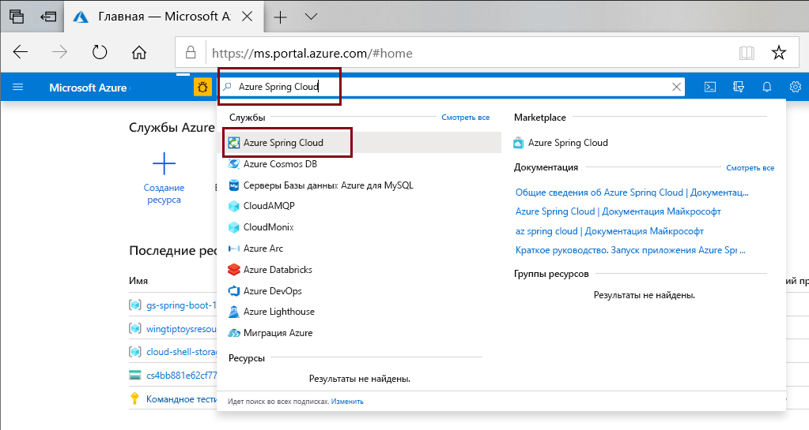
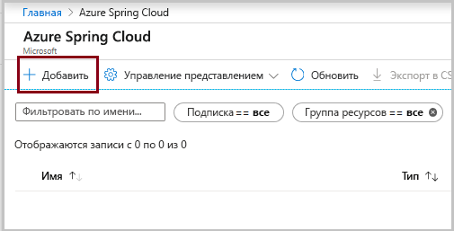
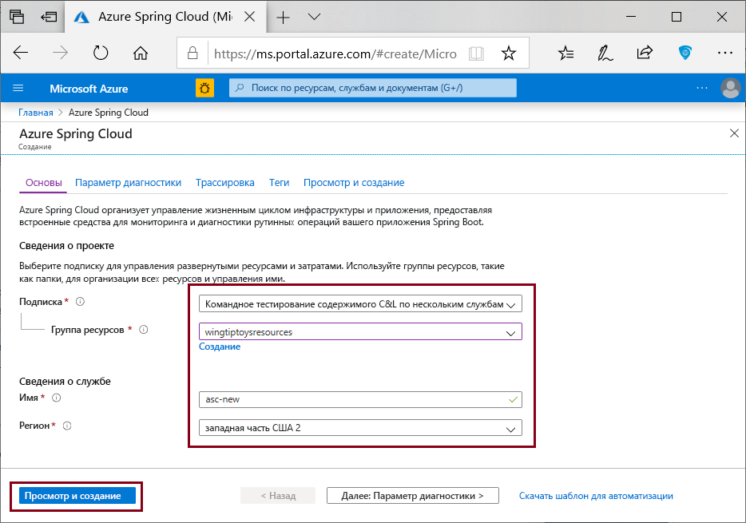

# <a name="quickstart-provision-azure-spring-cloud-service"></a>Краткое руководство. Подготовка службы Azure Spring Cloud

::: zone pivot="programming-language-csharp"
В этом кратком руководстве для подготовки экземпляра Azure Spring Cloud используется Azure CLI.

## <a name="prerequisites"></a>Предварительные требования

* Учетная запись Azure с активной подпиской. [Создайте учетную запись](https://azure.microsoft.com/free/?WT.mc_id=A261C142F) бесплатно.
* [Пакет SDK для .NET Core 3.1](https://dotnet.microsoft.com/download/dotnet-core/3.1). Служба Azure Spring Cloud поддерживает .NET Core 3.1 и более поздние версии.
* [Azure CLI версии 2.0.67 или выше](https://docs.microsoft.com/cli/azure/install-azure-cli?view=azure-cli-latest&preserve-view=true).
* [Git](https://git-scm.com/).

## <a name="install-azure-cli-extension"></a>Установка расширения Azure CLI

Убедитесь в наличии Azure CLI версии 2.0.67 или более поздней.

```azurecli
az --version
```

Установите расширение Azure Spring Cloud для Azure CLI с помощью следующей команды:

```azurecli
az extension add --name spring-cloud
```

## <a name="log-in-to-azure"></a>Вход в Azure

1. Войдите в интерфейс командной строки Azure.

    ```azurecli
    az login
    ```

1. Если у вас есть несколько подписок, выберите ту, которую будете использовать для изучения этого краткого руководства.

   ```azurecli
   az account list -o table
   ```

   ```azurecli
   az account set --subscription <Name or ID of a subscription from the last step>
   ```

## <a name="provision-an-instance-of-azure-spring-cloud"></a>Подготовка к работе экземпляра Azure Spring Cloud

1. Создайте [группу ресурсов](../azure-resource-manager/management/overview.md), которая будет содержать службу Azure Spring Cloud. Имя группы ресурсов может содержать буквы, цифры, символ подчеркивания, круглые скобки, дефис и точку (но не в конце имени), а также символы Юникода.

   ```azurecli
   az group create --location eastus --name <resource group name>
   ```

1. Подготовьте к работе экземпляра службы Azure Spring Cloud. Его имя должно быть уникальным и содержать от 4 до 32 знаков (только строчные буквы, цифры и дефисы). Первым символом в имени службы должна быть буква, а последним — буква или цифра.

    ```azurecli
    az spring-cloud create -n <service instance name> -g <resource group name>
    ```

    Выполнение этой команды может занять несколько минут.

1. Задайте имена по умолчанию для группы ресурсов и экземпляра службы, чтобы не нужно было указывать эти значения в последующих командах.

   ```azurecli
   az configure --defaults group=<resource group name>
   ```

   ```azurecli
   az configure --defaults spring-cloud=<service instance name>
   ```
::: zone-end

::: zone pivot="programming-language-java"
Вы можете создать экземпляр Azure Spring Cloud с помощью портала Azure или Azure CLI.  Оба метода описаны в следующих процедурах.
## <a name="prerequisites"></a>Предварительные требования

* [установите JDK версии 8](https://docs.microsoft.com/java/azure/jdk/?view=azure-java-stable&preserve-view=true);
* [Регистрация для получения подписки Azure](https://azure.microsoft.com/free/)
* (Необязательно.) [Установите Azure CLI версии 2.0.67 или более поздней](https://docs.microsoft.com/cli/azure/install-azure-cli?view=azure-cli-latest&preserve-view=true) и расширение Azure Spring Cloud с помощью команды `az extension add --name spring-cloud`.
* (Необязательно.) [Установите Azure Toolkit for IntelliJ](https://plugins.jetbrains.com/plugin/8053-azure-toolkit-for-intellij/) и [выполните вход](https://docs.microsoft.com/azure/developer/java/toolkit-for-intellij/create-hello-world-web-app#installation-and-sign-in).

## <a name="provision-an-instance-of-azure-spring-cloud"></a>Подготовка к работе экземпляра Azure Spring Cloud

#### <a name="portal"></a>[Портал](#tab/Azure-portal)

Следующая процедура создает экземпляр Azure Spring Cloud с помощью портала Azure.

1. На новой вкладке откройте [портал Azure](https://ms.portal.azure.com/). 

2. В поле поиска сверху введите **Azure Spring Cloud**.

3. Выберите пункт **Azure Spring Cloud** в списке результатов.

    

4. На странице Azure Spring Cloud щелкните элемент **+ Добавить**.

    

5. Заполните форму на странице **создания** Azure Spring Cloud.  Ознакомьтесь со следующими рекомендациями:
    - **Подписка**: Выберите подписку, на которую будет выставляться счет за этот ресурс.
    - **Группа ресурсов.** Советуем создавать группы ресурсов для новых ресурсов. Обратите внимание, что она будет использоваться на следующих шагах как **\<resource group name\>** .
    - **Сведения о службе или ее название.** Укажите **\<service instance name\>** .  Его длина должна быть от 4 до 32 знаков. Имя может содержать только строчные буквы, цифры и дефисы.  Первым символом в имени службы должна быть буква, а последним — буква или цифра.
    - **Расположение.** Выберите расположение для экземпляра службы.

    

6. Щелкните **Проверка и создание**.

> [!div class="nextstepaction"]
> [У меня есть проблема](https://www.research.net/r/javae2e?tutorial=asc-cli-quickstart&step=public-endpoint)

#### <a name="cli"></a>[CLI](#tab/Azure-CLI)

Следующая процедура подготавливает экземпляр Azure Spring Cloud с помощью расширения Azure CLI.

1. Войдите в Azure CLI и выберите активную подписку.

    ```azurecli
    az login
    az account list -o table
    az account set --subscription <Name or ID of subscription, skip if you only have 1 subscription>
    ```

1. Подготовьте имя службы Azure Spring Cloud.  Его длина должна быть от 4 до 32 знаков. Имя может содержать только строчные буквы, цифры и дефисы.  Первым символом в имени службы должна быть буква, а последним — буква или цифра.

1. Создайте группу ресурсов, которая будет содержать службу Azure Spring Cloud.

    ```azurecli
    az group create --location eastus --name <resource group name>
    ```

    Узнайте больше о [группах ресурсов Azure](../azure-resource-manager/management/overview.md).

1. Откройте окно Azure CLI и выполните приведенные ниже команды, чтобы подготавливать экземпляр Azure Spring Cloud к работе.

    ```azurecli
    az spring-cloud create -n <service instance name> -g <resource group name>
    ```

    Развертывание экземпляра службы займет около пяти минут.
---
::: zone-end

## <a name="clean-up-resources"></a>Очистка ресурсов

Если вы планируете перейти к следующему краткому руководству из этой серии, пропустите этот шаг.

При прохождении этого краткого руководства вы создали ресурсы Azure, за которые будет взиматься плата, если вы оставите их в своей подписке. Если вы не планируете продолжать работу со следующим кратким руководством или работать с этими ресурсами в будущем, вы можете удалить группу ресурсов с помощью портала, или выполнив следующую команду в Cloud Shell:

```azurecli
az group delete --name <your resource group name; for example: helloworld-1558400876966-rg> --yes
```

При прохождении этого краткого руководства вы также задали имя группы ресурсов по умолчанию. Если вы не планируете перейти к следующему краткому руководству, очистите это значение по умолчанию, выполнив такую команду CLI:

```azurecli
az configure --defaults group=
```

## <a name="next-steps"></a>Дальнейшие действия

> [!div class="nextstepaction"]
> [Настройка сервера конфигурации](spring-cloud-quickstart-setup-config-server.md)
