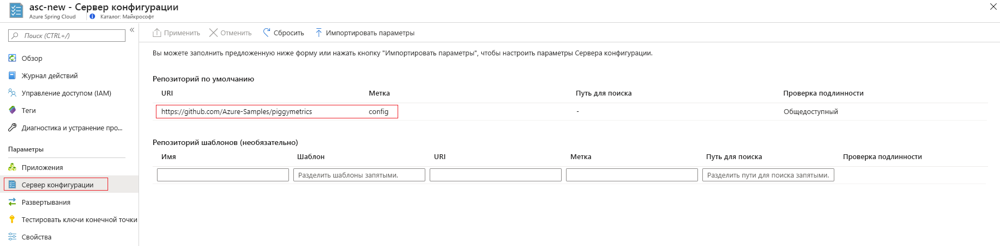

# <a name="tutorial-set-up-a-spring-cloud-config-server-for-your-service"></a>Руководство по настройке сервера конфигурации Spring Cloud для службы

В этом учебнике описано подключение сервера конфигурации Spring Cloud Config к службе Azure Spring Cloud.

Конфигурация Spring Cloud предоставляет поддержку на стороне сервера и клиента для внешней конфигурации в распределенной системе. Сервер конфигурации обеспечивает централизованное управление внешними свойствами приложений во всех средах. Дополнительные сведения см. в [справочнике по серверу конфигурации Spring Cloud](https://spring.io/projects/spring-cloud-config).

## <a name="prerequisites"></a>Предварительные требования
* Подписка Azure. Если у вас еще нет подписки Azure, [создайте бесплатную учетную запись Azure](https://azure.microsoft.com/free/?WT.mc_id=A261C142F), прежде чем начинать работу. 
* Подготовленная и запущенная служба Azure Spring Cloud.  Выполните инструкции, приведенные в [этом кратком руководстве](spring-cloud-quickstart-launch-app-cli.md), чтобы подготовить и запустить службу Azure Spring Cloud.

## <a name="restriction"></a>Ограничение

При использовании __сервера конфигурации__ с репозиторием git существуют некоторые ограничения. Для доступа к __серверу конфигурации__ и __обнаружению служб__ в среду вашего приложения будут автоматически добавлены некоторые свойства. Настроив эти свойства из файлов **сервера конфигурации**, вы можете столкнуться с конфликтами и непредвиденным поведением. Эти свойства включают в себя следующие: 

```yaml
eureka.client.service-url.defaultZone
eureka.client.tls.keystore
server.port
spring.cloud.config.tls.keystore
spring.application.name
```
> [!CAUTION]
> Настоятельно рекомендуем вам __НЕ__ помещать вышеуказанные свойства в файлы приложения __сервера конфигурации__.

## <a name="create-your-config-server-files"></a>Создание файлов сервера конфигурации

Для хранения файлов сервера конфигурации Azure Spring Cloud поддерживает Azure DevOps, GitHub, GitLab и Bitbucket. После подготовки репозитория создайте и сохраните файлы конфигурации, выполнив приведенные в этой статье инструкции.

Некоторые настраиваемые свойства доступны лишь для определенных типов репозитория. В следующих подразделах перечислены свойства для каждого типа.

### <a name="public-repository"></a>Общедоступный репозиторий

При использовании общедоступного репозитория настраиваемые свойства будут более ограниченными.

Все настраиваемые свойства, используемые для настройки общедоступного репозитория `Git`, перечислены ниже.

> [!NOTE]
> Использование дефиса ("-") для разделения слов является единственным поддерживаемым в настоящее время соглашением об именовании. Например, вы можете использовать `default-label`, но не `defaultLabel`.

| Свойство        | Обязательно | Функция                                                      |
| :-------------- | -------- | ------------------------------------------------------------ |
| `uri`           | `yes`    | Свойство `uri` репозитория `Git`, используемое в качестве внутреннего сервера конфигурации, должно начинаться следующим образом: `http://`, `https://`, `git@` или `ssh://`. |
| `default-label` | `no`     | Меткой по умолчанию для репозитория `Git` может быть `branch name`, `tag name` или `commit-id`. |
| `search-paths`  | `no`     | Массив строк, используемых для поиска в подкаталогах репозитория `Git`. |

------

### <a name="private-repository-with-ssh-authentication"></a>Частный репозиторий с проверкой подлинности SSH

Все настраиваемые свойства, используемые для настройки частного репозитория `Git` с `Ssh`, перечислены ниже.

> [!NOTE]
> Использование дефиса ("-") для разделения слов является единственным поддерживаемым в настоящее время соглашением об именовании. Например, вы можете использовать `default-label`, но не `defaultLabel`.

| Свойство                   | Обязательно | Функция                                                      |
| :------------------------- | -------- | ------------------------------------------------------------ |
| `uri`                      | `yes`    | Свойство `uri` репозитория `Git`, используемое в качестве внутреннего сервера конфигурации, должно начинаться следующим образом: `http://`, `https://`, `git@` или `ssh://`. |
| `default-label`            | `no`     | Меткой по умолчанию для репозитория `Git` может быть `branch name`, `tag name` или `commit-id`. |
| `search-paths`             | `no`     | Массив строк, используемых для поиска в подкаталогах репозитория `Git`. |
| `private-key`              | `no`     | Закрытый ключ `Ssh` для доступа к репозиторию `Git`; __требуется__, когда `uri` начинается следующим образом: `git@` или `ssh://`. |
| `host-key`                 | `no`     | Ключ узла сервера репозитория Git не должен содержать префикс алгоритма, как указано в `host-key-algorithm`. |
| `host-key-algorithm`       | `no`     | Алгоритм ключа узла должен быть `ssh-dss`, `ssh-rsa`, `ecdsa-sha2-nistp256`, `ecdsa-sha2-nistp384`, или `ecdsa-sha2-nistp521`. Требуется только при наличии `host-key`. |
| `strict-host-key-checking` | `no`     | Указывает, будет ли запуск сервера конфигурации невозможен при использовании частного `host-key`. Должно быть `true` (значение по умолчанию) или `false`. |

-----

### <a name="private-repository-with-basic-authentication"></a>Частный репозиторий с обычной проверкой подлинности

Все настраиваемые свойства, используемые для настройки частного репозитория Git с обычной проверкой подлинности, перечислены ниже.

> [!NOTE]
> Использование дефиса ("-") для разделения слов является единственным поддерживаемым в настоящее время соглашением об именовании. Например, воспользуйтесь `default-label` или нет `defaultLabel`.

| Свойство        | Обязательно | Функция                                                      |
| :-------------- | -------- | ------------------------------------------------------------ |
| `uri`           | `yes`    | Свойство `uri` репозитория `Git`, используемое в качестве внутреннего сервера конфигурации, должно начинаться следующим образом: `http://`, `https://`, `git@` или `ssh://`. |
| `default-label` | `no`     | Меткой по умолчанию для репозитория `Git` может быть `branch name`, `tag name` или `commit-id`. |
| `search-paths`  | `no`     | Массив строк, используемых для поиска в подкаталогах репозитория `Git`. |
| `username`      | `no`     | `username` используется для доступа к `Git` серверу репозитория ; когда `Git`сервер репозитория`Http Basic Authentication` __поддерживается__. |
| `password`      | `no`     | Пароль используется для доступа к `Git`серверу репозитория; когда `Git`сервер репозитория`Http Basic Authentication` __поддерживается__. |

> [!NOTE]
> Многие серверы репозитория `Git` поддерживают для `HTTP Basic Authentication` использование токенов, а не паролей. Некоторые репозитории, например GitHub, позволяют сохранять токены в течение неограниченного времени. Однако на некоторых серверах репозитория Git, включая Azure DevOps, срок действия токенов может заканчиваться через несколько часов. Репозитории, на которые истекает срока действия токенов, не должны использовать проверку подлинности на основе токенов в Azure Spring Cloud.

### <a name="git-repositories-with-pattern"></a>Репозитории Git с шаблоном

Все настраиваемые свойства, используемые для настройки репозиториев Git с шаблоном, перечислены ниже.

> [!NOTE]
> Использование дефиса ("-") для разделения слов является единственным поддерживаемым в настоящее время соглашением об именовании. Например, воспользуйтесь `default-label` или нет `defaultLabel`.

| Свойство                           | Обязательно         | Функция                                                      |
| :--------------------------------- | ---------------- | ------------------------------------------------------------ |
| `repos`                            | `no`             | Схема, состоящая из параметров репозитория `Git` с заданным именем. |
| `repos."uri"`                      | `yes` для `repos` | Свойство `uri` репозитория `Git`, используемое в качестве внутреннего сервера конфигурации, должно начинаться следующим образом: `http://`, `https://`, `git@` или `ssh://`. |
| `repos."name"`                     | `yes` для `repos` | Имя для идентификации одного репозитория `Git`; __требуется__ только при наличии `repos`. Например, сверху `team-A`, `team-B`. |
| `repos."pattern"`                  | `no`             | Массив строк, используемый для сопоставления имени приложения. Для каждого шаблона используйте формат `{application}/{profile}` с подстановочными знаками. |
| `repos."default-label"`            | `no`             | Меткой по умолчанию для репозитория `Git` может быть `branch name`, `tag name` или `commit-id`. |
| `repos."search-paths`"             | `no`             | Массив строк, используемых для поиска в подкаталогах репозитория `Git`. |
| `repos."username"`                 | `no`             | `username` используется для доступа к `Git` серверу репозитория ; когда `Git`сервер репозитория`Http Basic Authentication` __поддерживается__. |
| `repos."password"`                 | `no`             | Пароль используется для доступа к `Git`серверу репозитория; когда `Git`сервер репозитория`Http Basic Authentication` __поддерживается__. |
| `repos."private-key"`              | `no`             | Закрытый ключ `Ssh` для доступа к репозиторию `Git`; __требуется__, когда `uri` начинается следующим образом: `git@` или `ssh://`. |
| `repos."host-key"`                 | `no`             | Ключ узла сервера репозитория Git не должен содержать префикс алгоритма, как указано в `host-key-algorithm`. |
| `repos."host-key-algorithm"`       | `no`             | Алгоритм ключа узла должен быть `ssh-dss`, `ssh-rsa`, `ecdsa-sha2-nistp256`, `ecdsa-sha2-nistp384`, или `ecdsa-sha2-nistp521`. __Требуется__ только при наличии `host-key`. |
| `repos."strict-host-key-checking"` | `no`             | Указывает, будет ли запуск сервера конфигурации невозможен при использовании частного `host-key`. Должно быть `true` (значение по умолчанию) или `false`. |

## <a name="attaching-your-config-server-repository-to-azure-spring-cloud"></a>Подключение репозитория сервера конфигурации к Azure Spring Cloud

После сохранения файлов конфигурации в репозитории необходимо подключить к нему Azure Spring Cloud.

1. Войдите на [портал Azure](https://portal.azure.com).

1. Перейдите на страницу **обзора** Azure Spring Cloud.

1. Выберите службу для настройки.

1. На странице службы выберите вкладку **Config Server** (Сервер конфигурации) под заголовком **Параметры** в меню с левой стороны.



### <a name="input-repository-information-directly-to-the-azure-portal"></a>Входные данные репозитория непосредственно на портал Azure

#### <a name="default-repository"></a>Репозиторий по умолчанию

* Общедоступный репозиторий: В разделе **Репозиторий по умолчанию** вставьте URI репозитория в раздел **Uri**.  Задайте для **метки** значение `config`. Убедитесь, что параметр **Проверка подлинности** имеет значение **Общедоступный**, а затем выберите **Применить** для завершения. 

* Частный репозиторий: Azure Spring Cloud поддерживает обычную проверку подлинности на основе пароля или маркера и SSH.

    * Обычная проверка подлинности: В разделе **Репозиторий по умолчанию** вставьте URI репозитория в раздел **Uri**, а затем щелкните **Проверка подлинности**. Выберите **Базовый** в качестве **типа проверки подлинности** и введите имя пользователя и пароль, или маркер, чтобы предоставить доступ к Azure Spring Cloud. Щелкните **ОК** и **Применить**, чтобы завершить настройку сервера конфигурации.

    
    
    > [!CAUTION]
    > Некоторые серверы репозитория Git, например GitHub, используют `personal-token` или `access-token`, в качестве пароля для **Базовой проверки подлинности**. Вы можете использовать этот тип маркера в качестве пароля в Azure Spring Cloud, так как срок его действия никогда не истечет. Но для других серверов репозитория Git, таких как BitBucket и Azure DevOps, срок действия `access-token` истечет через один или два часа. Это означает, что при использовании этих серверов репозитория с Azure Spring Cloud эта опция бесполезная.]

    * SSH. В разделе **Репозиторий по умолчанию** вставьте URI репозитория в раздел **Uri**, а затем щелкните **Проверка подлинности**. Выберите **SSH** в качестве **типа проверки подлинности** и введите **закрытый ключ**. При необходимости можно указать **ключ узла** и **алгоритм ключа узла**. Не забудьте включить открытый ключ в репозиторий сервера конфигурации. Щелкните **ОК** и **Применить**, чтобы завершить настройку сервера конфигурации.

    

#### <a name="pattern-repository"></a>Репозиторий шаблонов

Если вы хотите использовать необязательный **репозиторий шаблона** для настройки службы, укажите **URI** и **проверку подлинности** аналогично **репозиторию по умолчанию**. Не забудьте включить в шаблон **имя**, а затем нажмите кнопку **Применить**, чтобы присоединить его к экземпляру. 

### <a name="enter-repository-information-into-a-yaml-file"></a>Ввод сведений о репозитории в файл YAML

Если вы создали файл YAML с параметрами репозитория, файл YAML можно импортировать непосредственно с локального компьютера в Azure Spring Cloud. Простой файл YAML для частного репозитория с обычной проверкой подлинности будет выглядеть следующим образом:

```yml
spring:
    cloud:
        config:
            server:
                git:
                    uri: https://github.com/azure-spring-cloud-samples/config-server-repository.git
                    username: <username>
                    password: <password/token>

```

Нажмите кнопку **Импорт параметров**, а затем выберите файл `.yml` из каталога проекта. Щелкните **Импорт**, после чего появится `async` операция из **Уведомлений**. Через 1-2 минуты она должна сообщить об успешном выполнении.


Вы должны увидеть сведения из файла YAML, отображаемого на портале Azure. Нажмите кнопку **Применить** для завершения. 


## <a name="delete-your-app-configuration"></a>Удаление конфигурации приложения

После сохранения файла конфигурации на вкладке **Конфигурация** отобразится кнопка **Delete app configuration** (Удалить конфигурацию приложения). При нажатии этой кнопки имеющиеся параметры будут полностью удалены. Нажмите ее, если вам нужно подключить сервер конфигурации к другому источнику, например, для перехода с GitHub на Azure DevOps.


## <a name="next-steps"></a>Дополнительная информация

В рамках этого учебника вы узнали, как включить и настроить сервер конфигурации. Чтобы узнать больше об управлении приложением, ознакомьтесь с учебником по масштабированию приложения вручную.

> [!div class="nextstepaction"]
> [Учебник по масштабированию приложения в Azure Spring Cloud](spring-cloud-tutorial-scale-manual.md).

