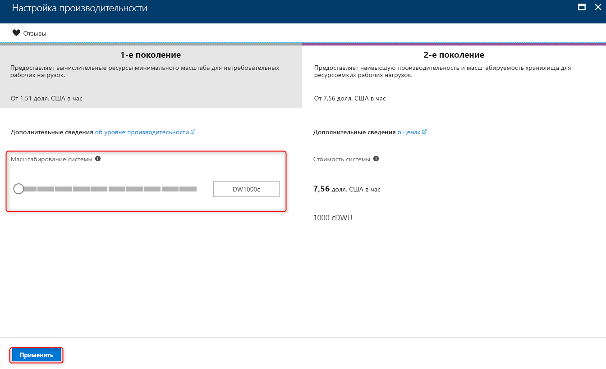
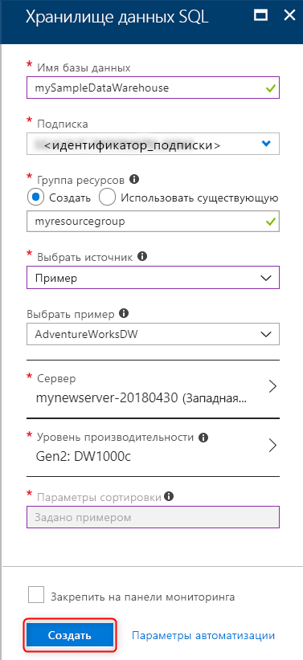
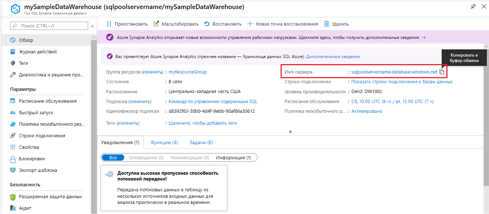
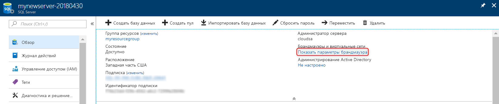
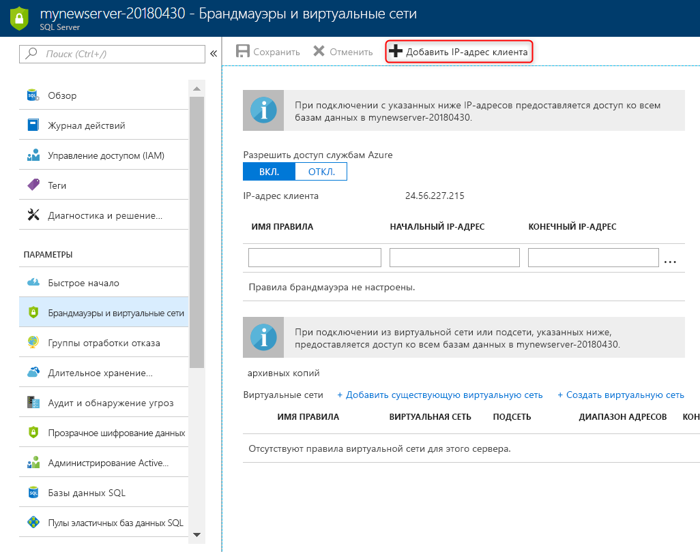

# <a name="quickstart-create-and-query-an-azure-sql-data-warehouse-in-the-azure-portal"></a>Краткое руководство. Создание Хранилища данных SQL Azure на портале Azure и выполнение запроса к нему

Можно быстро создать Хранилище данных SQL Azure на портале Azure и отправлять запросы к этому хранилищу данных.

Если у вас еще нет подписки Azure, создайте [бесплатную](https://azure.microsoft.com/free/) учетную запись Azure, прежде чем начинать работу.

> [!NOTE]
> Создание хранилища данных SQL может привести к дополнительным расходам. Дополнительные сведения см. на странице [цен на хранилище данных SQL](https://azure.microsoft.com/pricing/details/sql-data-warehouse/).

## <a name="before-you-begin"></a>Перед началом работы

Скачайте и установите последнюю версию [SQL Server Management Studio](/sql/ssms/download-sql-server-management-studio-ssms) (SSMS).

## <a name="sign-in-to-the-azure-portal"></a>Вход на портал Azure

Войдите на [портале Azure](https://portal.azure.com/).

## <a name="create-a-data-warehouse"></a>Создание хранилища данных

Хранилище данных SQL Azure создается с определенным набором [вычислительных ресурсов](memory-concurrency-limits.md). База данных создается в пределах [группы ресурсов Azure](../azure-resource-manager/resource-group-overview.md) и [логического сервера SQL Azure](../sql-database/sql-database-logical-servers.md). 

Следуйте приведенным инструкциям по созданию Хранилища данных SQL, содержащего пример данных AdventureWorksDW. 

1. Щелкните **Создать ресурс** в верхнем левом углу окна портала Azure.

2. Выберите **Базы данных** на странице **Создание**, а затем выберите **Хранилище данных SQL** в разделе **Избранные** на странице **Создание**.

    

3. Заполните форму для создания хранилища данных SQL, указав следующие сведения:

    | Параметр | Рекомендуемое значение | ОПИСАНИЕ |
    | :------ | :-------------- | :---------- |
    | **Database name** (Имя базы данных) | mySampleDataWarehouse | Допустимые имена баз данных см. в статье об [идентификаторах базы данных](/sql/relational-databases/databases/database-identifiers). Обратите внимание на то, что хранилище данных относится к типу базы данных.|
    | **подписка** | Ваша подписка | Дополнительные сведения о подписках см. [здесь](https://account.windowsazure.com/Subscriptions). |
    | **Группа ресурсов** | myResourceGroup | Допустимые имена групп ресурсов см. в статье о [правилах и ограничениях именования](/azure/architecture/best-practices/resource-naming). |
    | **Выбрать источник** | Образец | Указывает загрузку примера базы данных. Обратите внимание, что хранилище данных — это один из типов базы данных. |
    | **Выберите пример** | AdventureWorksDW | Указывает загрузку примера базы данных AdventureWorksDW. |
    ||||

    

4. Щелкните **Сервер**, чтобы создать и настроить новый сервер для новой базы данных. Заполните форму для **создания сервера**, указав следующую информацию. 

    | Параметр | Рекомендуемое значение | ОПИСАНИЕ |
    | :------ | :-------------- | :---------- |
    | **Server name** (Имя сервера) | Любое глобально уникальное имя | Допустимые имена серверов см. в статье о [правилах и ограничениях именования](/azure/architecture/best-practices/resource-naming). |
    | **Имя для входа администратора сервера** | Любое допустимое имя | Допустимые имена входа см. в статье об [идентификаторах базы данных](https://docs.microsoft.com/sql/relational-databases/databases/database-identifiers).|
    | **Пароль** | Любой допустимый пароль | Длина пароля должна составлять минимум 8 символов. Пароль должен содержать символы трех категорий из перечисленных: прописные буквы, строчные буквы, цифры и специальные символы. |
    | **Местоположение.** | Любое допустимое расположение | Дополнительные сведения о регионах Azure см. [здесь](https://azure.microsoft.com/regions/). |
    ||||

    

5. Нажмите кнопку **Выбрать**.

6. Щелкните **Уровень производительности**, чтобы указать конфигурацию производительности для хранилища данных.

7. Для работы с этим руководством выберите **Gen2**. По умолчанию ползунок установлен в положение **DW1000c**. Попробуйте переместить его вверх и вниз, чтобы увидеть, как он работает. 

    

8. Нажмите кнопку **Применить**.

9. Заполнив форму Хранилища данных SQL, нажмите кнопку **Создать**, чтобы подготовить базу данных. Подготовка занимает несколько минут.

    

10. На панели инструментов щелкните **Уведомления**, чтобы отслеживать процесс развертывания.
    
     

## <a name="create-a-server-level-firewall-rule"></a>создадим правило брандмауэра на уровне сервера;

Служба Хранилища данных SQL создает брандмауэр на уровне сервера. Этот брандмауэр предотвращает подключение внешних приложений и инструментов к серверу или базам данных на сервере. Чтобы разрешить это подключение, можно добавить правила брандмауэра, открывающие подключение для определенных IP-адресов. Выполните приведенные ниже действия, чтобы создать [правило брандмауэра уровня сервера](../sql-database/sql-database-firewall-configure.md) для IP-адреса клиента.

> [!NOTE]
> Хранилище данных SQL обменивается данными через порт 1433. Если вы пытаетесь подключиться из корпоративной сети, то исходящий трафик через порт 1433 может быть запрещен сетевым брандмауэром. В таком случае вы не сможете подключиться к серверу Базы данных SQL Azure, пока ваш ИТ-отдел не откроет порт 1433.

1. После завершения развертывания в меню слева выберите **Все службы**. Выберите **Базы данных**, затем выберите значок звездочки рядом с полем **Хранилища данных SQL**. чтобы добавить хранилища данных SQL в избранное.
1. В меню слева выберите **Хранилища данных SQL** и на странице **Хранилища данных SQL** щелкните **mySampleDataWarehouse**. После этого откроется страница обзора базы данных, где будет указано полное имя сервера (например, **mynewserver-20180430.database.windows.net**) и предоставлены параметры для дальнейшей настройки.
1. Скопируйте полное имя сервера. Оно понадобится для подключения к серверу и размещенным на нем базам данных при работе с этим и последующими краткими руководствами. Щелкните имя сервера, чтобы открыть параметры этого сервера.

   

1. Щелкните **Показать параметры брандмауэра**.

   

1. Откроется страница **параметров брандмауэра** для сервера Базы данных SQL.

   

1. На панели инструментов щелкните **Добавить IP-адрес клиента**, чтобы добавить текущий IP-адрес в новое правило брандмауэра. С использованием правила брандмауэра можно открыть порт 1433 для одного IP-адреса или диапазона IP-адресов.

1. Выберите команду **Сохранить**. Для текущего IP-адреса будет создано правило брандмауэра уровня сервера, с помощью которого можно открыть порт 1433 логического сервера.

1. Нажмите кнопку **ОК**, а затем закройте страницу **Параметры брандмауэра**.

Теперь с помощью этого IP-адреса можно подключиться к серверу SQL и его хранилищам данных. Подключение выполняется из SQL Server Management Studio или другого инструмента на ваше усмотрение. При подключении используйте созданную ранее учетную запись ServerAdmin.

> [!IMPORTANT]
> По умолчанию доступ через брандмауэр базы данных SQL включен для всех служб Azure. На этой странице щелкните **Откл.** , а затем нажмите кнопку **Сохранить**, чтобы отключить брандмауэр для всех служб Azure.

## <a name="get-the-fully-qualified-server-name"></a>Получение полного имени сервера

Получите полное имя сервера SQL на портале Azure. Позже это полное имя понадобится при подключении к серверу.

1. Войдите на [портале Azure](https://portal.azure.com/).
2. В меню слева выберите **Хранилища данных SQL** и на странице **Хранилища данных SQL** щелкните свое хранилище данных.
3. На странице портала Azure вашей базы данных в области **Основные компоненты** найдите и скопируйте **имя сервера**. В этом примере полное имя — mynewserver-20180430.database.windows.net.

    

## <a name="connect-to-the-server-as-server-admin"></a>Подключение к серверу от имени администратора сервера

В этом разделе для подключения к серверу SQL Azure используется [SQL Server Management Studio](/sql/ssms/download-sql-server-management-studio-ssms) (SSMS).

1. Откройте среду SQL Server Management Studio.

2. В диалоговом окне **Подключение к серверу** введите следующие значения.

   | Параметр | Рекомендуемое значение | ОПИСАНИЕ |
   | :------ | :-------------- | :---------- |
   | Тип сервера | Ядро СУБД | Это обязательное значение |
   | Имя сервера | Полное имя сервера | Пример: **mynewserver-20180430.database.windows.net**. |
   | Аутентификация | Проверка подлинности SQL Server | В рамках работы с этим руководством мы настроили только один тип аутентификации — аутентификацию SQL. |
   | Вход | Учетная запись администратора сервера | Это учетная запись, указанная при создании сервера. |
   | Пароль | Пароль учетной записи администратора сервера | Пароль, указанный при создании сервера. |
   ||||

    

3. Щелкните **Подключить**. Откроется окно обозревателя объектов в SSMS. 

4. В обозревателе объектов разверните папку **Базы данных**. Затем разверните папку **mySampleDatabase**, чтобы просмотреть объекты в новой базе данных.

     

## <a name="run-some-queries"></a>Выполнение запросов

Хранилище данных SQL использует язык запросов T-SQL. Чтобы открыть окно запросов и выполнить несколько запросов T-SQL, выполните следующие действия.

1. Щелкните правой кнопкой мыши **mySampleDataWarehouse** и выберите **Новый запрос**. Откроется окно нового запроса.
2. В окне запросов введите приведенную ниже команду, чтобы просмотреть список баз данных.

    ```sql
    SELECT * FROM sys.databases
    ```

3. Нажмите **Execute (Выполнить)** . Результаты запроса содержат две базы данных: **master** и **mySampleDataWarehouse**.

    

4. Чтобы просмотреть некоторые данные, используйте следующую команду. Она позволяет узнать количество клиентов с фамилией "Adams", у которых трое детей. Список результатов содержит шесть клиентов. 

    ```sql
    SELECT LastName, FirstName FROM dbo.dimCustomer
    WHERE LastName = 'Adams' AND NumberChildrenAtHome = 3;
    ```

    

## <a name="clean-up-resources"></a>Очистка ресурсов

Плата взимается за единицы хранилища данных и данные, хранимые в хранилище данных. Плата за вычислительные ресурсы и ресурсы хранилища взимается отдельно.

- Если вы хотите сохранить данные в хранилище, то можете приостановить работу вычислительных ресурсов, когда не используете хранилище данных. При приостановке вычислений плата взимается только за хранение данных. Когда вы будете готовы работать с данными, можно будет возобновить вычисления.
- Если вы хотите исключить будущие расходы, то можете удалить хранилище данных.

Выполните следующие действия, чтобы очистить ресурсы, которые больше не нужны.

1. Войдите на [портал Azure](https://portal.azure.com) и щелкните хранилище данных.

    

2. Чтобы приостановить работу вычислительных ресурсов, нажмите кнопку **Приостановить**. Если работа хранилища данных приостановлена, вы увидите кнопку **Возобновить**. Чтобы возобновить работу вычислительных ресурсов, нажмите кнопку **Возобновить**.

3. Чтобы удалить хранилище данных во избежание дальнейших платежей за вычисления или хранение данных, нажмите кнопку **Удалить**.

4. Чтобы удалить созданный вами сервер SQL, щелкните **mynewserver-20180430.database.windows.net** на предыдущем изображении, а затем нажмите кнопку **Удалить**. Будьте внимательны, так как удаление сервера приведет к удалению всех баз данных, назначенных этому серверу.

5. Чтобы удалить группу ресурсов, щелкните **myResourceGroup**, а затем нажмите кнопку **Удалить группу ресурсов**.

## <a name="next-steps"></a>Дополнительная информация

Вы создали хранилище данных, создали правило брандмауэра, подключились к этому хранилищу данных и выполнили несколько запросов. Чтобы узнать больше о хранилище данных SQL Azure, перейдите к руководству по загрузке данных.

> [!div class="nextstepaction"]
> [Загрузка данных в Хранилище данных SQL](load-data-from-azure-blob-storage-using-polybase.md)
