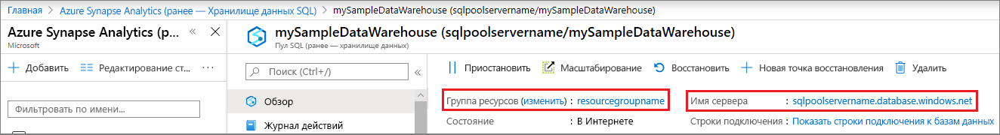

# <a name="quickstart-pause-and-resume-compute-in-azure-sql-data-warehouse-with-azure-powershell"></a>Краткое руководство. Приостановка и возобновление вычислений в Хранилище данных SQL Azure с помощью Azure PowerShell

Используйте PowerShell, чтобы приостановить вычисления в хранилище данных SQL Azure для снижения расходов. [Возобновите работу вычислительных ресурсов](sql-data-warehouse-manage-compute-overview.md), когда будете готовы к использованию хранилища данных.

Если у вас еще нет подписки Azure, создайте [бесплатную](https://azure.microsoft.com/free/) учетную запись Azure, прежде чем начинать работу.

## <a name="before-you-begin"></a>Перед началом работы

[!INCLUDE [updated-for-az](../../includes/updated-for-az.md)]

В этом кратком руководстве предполагается, что у вас уже есть Хранилище данных SQL, работу которого можно приостановить и возобновить. Если его требуется создать, используйте инструкции из раздела [Создание хранилища данных SQL Azure на портале Azure и отправка запросов к этому хранилищу данных](create-data-warehouse-portal.md) для создания хранилища данных **mySampleDataWarehouse**.

## <a name="log-in-to-azure"></a>Вход в Azure

С помощью команды [Connect-AzAccount](/powershell/module/az.accounts/connect-azaccount) войдите в подписку Azure и следуйте инструкциям на экране.

```powershell
Connect-AzAccount
```

Чтобы узнать, какие подписки вы используете, выполните [Get-AzSubscription](/powershell/module/az.accounts/get-azsubscription).

```powershell
Get-AzSubscription
```

Если необходимо использовать подписку не по умолчанию, выполните [Set-AzContext](/powershell/module/az.accounts/set-azcontext).

```powershell
Set-AzContext -SubscriptionName "MySubscription"
```

## <a name="look-up-data-warehouse-information"></a>Поиск сведений о хранилище данных

Найдите имя базы данных, имя сервера и группу ресурсов для хранилища данных, работу которого вы собираетесь приостановить и возобновить.

Выполните следующие действия, чтобы найти сведения о расположении хранилища данных.

1. Войдите на [портале Azure](https://portal.azure.com/).
2. На портале Azure на странице слева щелкните **Базы данных SQL**.
3. На странице **Базы данных SQL** выберите **mySampleDataWarehouse**. Откроется хранилище данных.

    

4. Запишите имя хранилища данных, которое является именем базы данных. Также запишите имя сервера и группу ресурсов.
6. Если вашим сервером является foo.database.windows.net, то в командлетах PowerShell в качестве -ServerName используйте только первую часть имени сервера. На предыдущем рисунке полное имя сервера — newserver-20171113.database.windows.net. Не указывая суффикс, укажите **newserver-20171113** в качестве имени сервера в командлете PowerShell.

## <a name="pause-compute"></a>Приостановка работы вычислительных ресурсов

Для сокращения затрат можно приостанавливать и возобновлять работу вычислительных ресурсов по требованию. Например, если база данных не будет использоваться ночью и по выходным, ее работу можно приостанавливать на это время и возобновлять днем. Когда база данных приостановлена, оплата за вычислительные ресурсы не взимается. Тем не менее плата за хранение по-прежнему будет взиматься.

Чтобы приостановить базу данных, используйте командлет [Suspend-AzSqlDatabase](/powershell/module/az.sql/suspend-azsqldatabase). В следующем примере приостанавливается работа хранилища данных **mySampleDataWarehouse**, размещенного на сервере **newserver-20171113**. Этот сервер находится в группе ресурсов Azure **myResourceGroup**.


```Powershell
Suspend-AzSqlDatabase –ResourceGroupName "myResourceGroup" `
–ServerName "newserver-20171113" –DatabaseName "mySampleDataWarehouse"
```

В следующем примере, являющемся вариантом предыдущего, база данных извлекается в объект $database. Затем объект передается по конвейеру в [Suspend-AzSqlDatabase](/powershell/module/az.sql/suspend-azsqldatabase). Результаты сохраняются в объекте resultDatabase. Последняя команда отображает результаты.

```Powershell
$database = Get-AzSqlDatabase –ResourceGroupName "myResourceGroup" `
–ServerName "newserver-20171113" –DatabaseName "mySampleDataWarehouse"
$resultDatabase = $database | Suspend-AzSqlDatabase
$resultDatabase
```


## <a name="resume-compute"></a>Возобновление работы вычислительных ресурсов

Чтобы запустить базу данных, используйте командлет [Resume-AzSqlDatabase](/powershell/module/az.sql/resume-azsqldatabase). В приведенном ниже примере запускается база данных mySampleDataWarehouse, размещенная на сервере newserver-20171113. Этот сервер находится в группе ресурсов Azure myResourceGroup.

```Powershell
Resume-AzSqlDatabase –ResourceGroupName "myResourceGroup" `
–ServerName "newserver-20171113" -DatabaseName "mySampleDataWarehouse"
```

В следующем примере, являющемся вариантом предыдущего, база данных извлекается в объект $database. Затем объект передается в [Resume-AzSqlDatabase](/powershell/module/az.sql/resume-azsqldatabase), и результаты сохраняются в объекте $resultDatabase. Последняя команда отображает результаты.

```Powershell
$database = Get-AzSqlDatabase –ResourceGroupName "ResourceGroup1" `
–ServerName "Server01" –DatabaseName "Database02"
$resultDatabase = $database | Resume-AzSqlDatabase
$resultDatabase
```

## <a name="check-status-of-your-data-warehouse-operation"></a>Проверка состояния операции в хранилище данных

Чтобы проверить состояние хранилища данных, используйте командлет [Get-AzSqlDatabaseActivity](https://docs.microsoft.com/powershell/module/az.sql/Get-AzSqlDatabaseActivity#description).

```
Get-AzSqlDatabaseActivity -ResourceGroupName "ResourceGroup01" -ServerName "Server01" -DatabaseName "Database02"
```

## <a name="clean-up-resources"></a>Очистка ресурсов

Плата взимается за единицы хранилища данных и данные, хранящиеся в хранилище данных. Плата за вычислительные ресурсы и ресурсы хранилища взимается отдельно.

- Если вы хотите сохранить данные в хранилище, приостановите вычисления.
- Если вы хотите исключить будущие расходы, то можете удалить хранилище данных.

Выполните следующие действия, чтобы очистить ресурсы по необходимости.

1. Войдите на [портал Azure](https://portal.azure.com) и щелкните хранилище данных.

    

2. Чтобы приостановить работу вычислительных ресурсов, нажмите кнопку **Приостановить**. Если работа хранилища данных приостановлена, вы увидите кнопку **Запуск**.  Чтобы возобновить работу вычислительных ресурсов, нажмите кнопку **Запуск**.

3. Чтобы удалить хранилище данных во избежание дальнейших платежей за вычисления или хранение, нажмите кнопку **Удалить**.

4. Чтобы удалить созданный вами сервер SQL Server, щелкните **mynewserver-20171113.database.windows.net**, а затем щелкните **Удалить**.  Будьте внимательны, так как удаление сервера приведет к удалению всех баз данных, назначенных этому серверу.

5. Чтобы удалить группу ресурсов, щелкните **myResourceGroup**, а затем нажмите кнопку **Удалить группу ресурсов**.


## <a name="next-steps"></a>Дополнительная информация

Вы приостановили и возобновили вычисления для хранилища данных. Чтобы узнать больше о хранилище данных SQL Azure, перейдите к руководству по загрузке данных.

> [!div class="nextstepaction"]
> [Загрузка данных в Хранилище данных SQL](load-data-from-azure-blob-storage-using-polybase.md)
